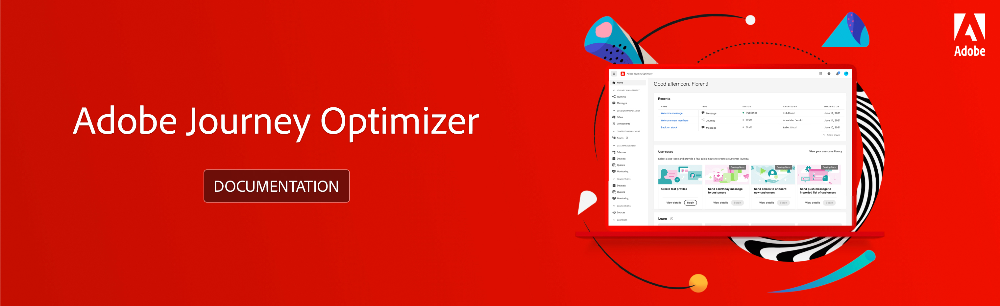

# Documentação do Adobe [!DNL Journey Optimizer] {#cjm-documentation}

<table style="table-layout:fixed">
<tr>
  <td>
    
<strong>Introdução</strong>
    

    

    <em></em>
    

    

      <a href="using/start/get-started.md">O que é [!DNL Journey Optimizer]?</a>
    

    
Descubra os principais recursos e casos de uso
    

    

      <a href="using/rn/release-notes.md">Notas de versão</a>
    

    
Novos recursos, melhorias e correções mais recentes
   

    

      <a href="using/start/quick-start.md">Guia de início rápido</a>
    

    

    Saiba como iniciar como administrador, engenheiro de dados ou profissional de jornada
    

    

    

      <a href="using/design/design-emails.md">Criar um conteúdo de email</a>
    

    

    Criar um novo email ou importar um conteúdo de HTML existente
    

    

      <a href="using/building-journeys/journeys-message.md">Envio de mensagens</a>
    

    
Saiba como adicionar mensagens por push e de email nas jornadas do seu cliente
    

    

    <a href="using/building-journeys/journeys-uc.md">Criar a primeira jornada</a>
    

    
Aprenda como construir e executar uma jornada
    

    

    <a href="using/configuration/get-started-configuration.md">Configurar [!DNL Journey Optimizer]</a>
    

    
Saiba mais sobre as principais etapas para configurar o [!DNL Journey Optimizer]
    

    

    <a href="using/administration/permissions-overview.md">Conceder acesso ao [!DNL Journey Optimizer]</a>
    

    
Definir e gerenciar as permissões atribuídas aos usuários do [!DNL Journey Optimizer]
    

    

    <a href="using/offers/get-started/starting-offer-decisioning.md">Gerenciamento de decisão</a>
    

    
Criar ofertas e fornecer a melhor oferta e experiência para os seus clientes
    

    

    
<strong>Recursos adicionais</strong>
    

    

    

    

    <li>
      <a href="https://helpx.adobe.com/br/legal/product-descriptions/adobe-campaign-managed-cloud-services.html" target="_blank">Descrição do produto Adobe Journey Optimizer</a>
    </li>
    

    

    <li>
      <a href="https://www.adobe.com/content/dam/cc/en/security/pdfs/AJO_SecurityOverview.pdf" target="_blank">Visão geral sobre a segurança do Adobe Journey Optimizer</a> (PDF)
    </li>
    

    

    <li>
      <a href="https://experienceleague.adobe.com/docs/journey-optimizer/assets/AJO-FAQ.pdf" target="_blank">Perguntas frequentes do Adobe Journey Optimizer</a> (PDF)
    </li>
    

    

    <li>
      <a href="https://experienceleague.adobe.com/docs/experience-platform/landing/home.html?lang=pt-BR" target="_blank">Documentação da Adobe Experience Platform </a>
    </li>
    

    

      <li>
      <a href="https://www.adobe.com/br/experience-platform/documentation-and-developer-resources.html" target="_blank">Recursos de desenvolvedores da Adobe Experience Platform</a>
    </li>
    

  </td>
   <td>
   
<strong>Links diretos para os principais recursos </strong>
    

    

    <em></em>
    

    
GERENCIAMENTO DA JORNADA

    <li>
      <a href="using/building-journeys/journey-gs.md">Jornadas</a>
    </li>
    <li>
      <a href="using/messages/get-started-content.md">Mensagens</a>
    </li>
    

    
GERENCIAMENTO DE DECISÕES

    <li>
      <a href="using/offers/get-started/starting-offer-decisioning.md">Ofertas</a>
    </li>
     <li>
      <a href="using/offers/offer-library/key-steps.md">Componentes</a>
    </li>
    

    
GERENCIAMENTO DE CONTEÚDO

    <li>
      <a href="using/design/assets-essentials.md">Ativos</a>
    </li>
    

    
GERENCIAMENTO DE DADOS

    <li>
      <a href="using/start/get-started-schemas.md">Esquemas</a>
    </li>
     <li>
      <a href="using/start/get-started-datasets.md">Conjuntos de dados</a>
    </li>
        <li>
      <a href="using/start/get-started-queries.md">Consultas</a>
    </li>
     <li>
      <a href="https://experienceleague.adobe.com/docs/experience-platform/ingestion/quality/monitor-data-ingestion.html?lang=pt-BR" target="_blank">Monitoramento</a>
    </li>
    

    
CONEXÕES

    <li>
      <a href="using/start/get-started-sources.md">Fontes</a>
    </li>
    

    
CLIENTE

    <li>
      <a href="using/segment/about-segments.md">Segmentos</a>
    </li>
     <li>
      <a href="using/segment/get-started-profiles.md">Perfis</a>
    </li>
    <li>
      <a href="using/segment/get-started-identity.md">Identidade</a>
    </li>
    

    
ADMINISTRAÇÃO

    <li>
      <a href="using/configuration/about-data-sources-events-actions.md">Configurações </a>
    </li>
    <li>
      <a href="using/configuration/get-started-configuration.md">Canais</a>
    </li>
     <li>
      <a href="using/administration/sandboxes.md">Sandboxes</a>
    </li>
  </td>
</tr>
</table>

 Assine o [Informativo trimestral do Adobe Journey Optimizer](https://www.adobe.com/subscription/Adobe_Journey_Optimizer_NL.html){target=&quot;_blank&quot;} hoje.

Receba as últimas atualizações de produtos, histórias interessantes, casos de uso, dicas e muito mais, diretamente em sua caixa de entrada a cada trimestre.

Em cada informativo você encontrará:
* Notícias e atualizações de produto, incluindo recursos recém-lançados
* Convites para eventos e webinários e gravações de webinários recentes
* As principais discussões na comunidade da Experience League do Adobe Journey Optimizer
* Estudos de caso e casos de uso de outros clientes do Adobe Journey Optimizer
* Dicas e truques para ajudar a fornecer experiências excepcionais para os clientes e impulsionar o sucesso do negócio