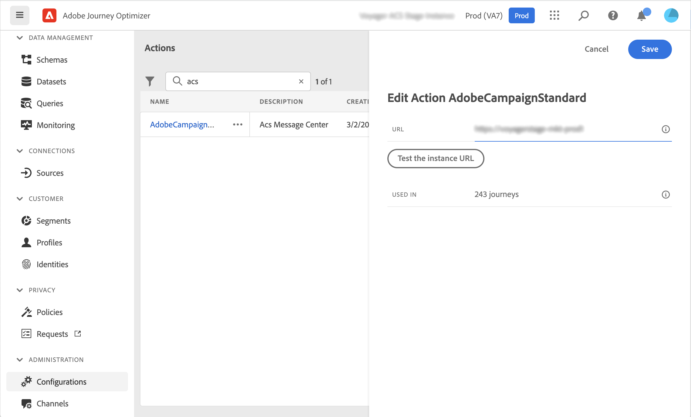

# Integrar ao Adobe Campaign Standard {#using_adobe_campaign_standard}

>[!BEGINSHADEBOX]

**Nesta página:** conecte o Journey Optimizer ao Adobe Campaign Standard para que suas jornadas possam enviar emails, notificações por push e SMS por meio de seus recursos de mensagens transacionais.

>[!ENDSHADEBOX]

Se você tiver o Adobe Campaign Standard, uma ação integrada estará disponível para permitir a conexão com o Adobe Campaign Standard. Você pode enviar emails, notificações por push e SMS usando os recursos de Mensagens transacionais do Adobe Campaign Standard.

A mensagem transacional do Campaign Standard e o evento associado devem ser publicados para serem usados no Journey Optimizer. Se o evento for publicado, mas a mensagem não for, ele não estará visível na interface do Journey Optimizer. Se a mensagem for publicada, mas o evento associado não, ela ficará visível na interface do Journey Optimizer, mas não poderá ser usada.

## Medidas de proteção e limitações {#important-notes}

* Uma regra de limitação de 4.000 chamadas a cada 5 minutos é definida automaticamente para ações do Adobe Campaign Standard. Leia mais sobre os SLAs de mensagens transacionais em [Descrição do produto Adobe Campaign Standard](https://helpx.adobe.com/br/legal/product-descriptions/campaign-standard.html){target="_blank"}.

* A integração do Adobe Campaign Standard é configurada por meio de uma ação incorporada dedicada na lista de ações. Isso deve ser configurado para cada sandbox.

* Não é possível usar uma ação do Campaign Standard com uma atividade de qualificação de Público-alvo ou Ler público.

* Uma jornada não pode usar [ações de canal integradas](../building-journeys/journey-action.md) e [ações de Campaign Standard](../building-journeys/using-adobe-campaign-standard.md).

## Configurar a ação {#configure-action}

No Journey Optimizer, você deve configurar uma ação por mensagem transacional.

Para configurar uma ação do Campaign Standard, siga estas etapas:

1. Selecione **[!UICONTROL Configurações]** na seção de menu ADMINISTRAÇÃO.

1. Na seção **[!UICONTROL Ações]**, clique em **[!UICONTROL Gerenciar]**. A lista de ações é exibida.

1. Selecione a ação **[!UICONTROL AdobeCampaignStandard]** interna. O painel de configuração de ação é aberto no lado direito da tela.

   

1. Copie a URL da instância do Adobe Campaign Standard e cole no campo **[!UICONTROL URL]**.

1. Clique em **[!UICONTROL Testar o URL da instância]** para testar a validade da instância.

   >[!NOTE]
   >
   >Este teste verifica se:
   >
   >* O host é &quot;.campaign.adobe.com&quot;, &quot;.campaign-sandbox.adobe.com&quot;, &quot;.campaign-demo.adobe.com&quot;, &quot;.ats.adobe.com&quot; ou &quot;.adls.adobe.com&quot;
   >
   >* O URL começa com https
   >
   >* A Organização associada a essa instância do Adobe Campaign Standard é a mesma Organização da Journey Optimizer

Quando esta configuração for concluída, três ações estarão disponíveis na categoria **[!UICONTROL Ação]** ao criar uma jornada: **[!UICONTROL Email]**, **[!UICONTROL Push]**, **[!UICONTROL SMS]**. [Saiba como usá-los](../building-journeys/using-adobe-campaign-standard.md).

Use um evento **Reações** para reagir aos dados de rastreamento relacionados a uma mensagem do Campaign Standard enviada na mesma jornada:

* Para notificações por push, as jornadas podem reagir a mensagens clicadas, enviadas ou com falha.

* Para mensagens SMS, o jornada pode reagir a mensagens enviadas ou com falha.

* Para emails, as jornadas podem reagir a mensagens clicadas, enviadas, abertas ou com falha. [Saiba mais sobre reações e eventos](../building-journeys/reaction-events.md).

Ao usar um sistema de terceiros para enviar mensagens, você deve adicionar e configurar uma ação personalizada. [Saiba mais sobre a configuração de ação personalizada](../action/about-custom-action-configuration.md).