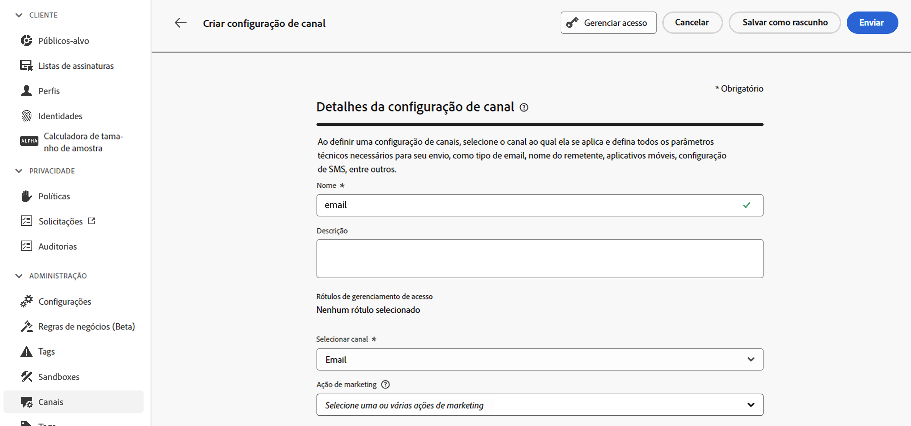
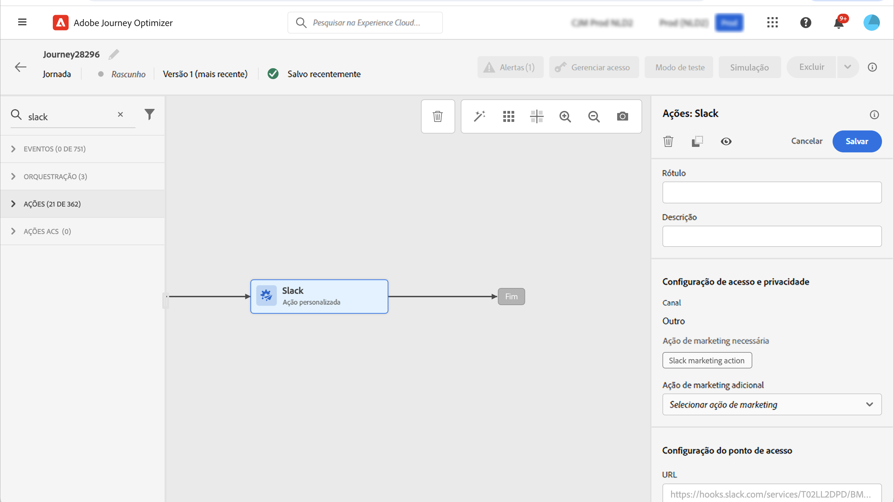

# Governança de dados {#restrict-fields}

>[!CONTEXTUALHELP]
>id="ajo_data_governance_policy_violation"
>title="Violação da política de governança de dados"
>abstract="Se o sistema identificar um campo restrito em uma jornada/campanha ou uma ação personalizada, um erro será exibido, impedindo que você o publique. Use o diagrama de linhagem de dados nesta caixa de diálogo para entender quais outras alterações de configuração precisam ser feitas antes de você poder ativar sua jornada ou campanha."

>[!AVAILABILITY]
>
>Esta página inclui informações relacionadas a melhorias que estão atualmente restritas a clientes selecionados.

## Introdução às políticas de governança de dados {#gs}

Com sua [estrutura de governança DULE (Aplicação e Rotulagem de Uso de Dados)](https://experienceleague.adobe.com/docs/experience-platform/data-governance/home.html?lang=pt-BR){_blank}, a Adobe Experience Platform permite que você gerencie e imponha políticas de governança de dados em seus canais ao **rotular seus campos** e criar **ações de marketing** para cada canal.

Depois que os rótulos e as ações de marketing forem definidos, você poderá criar **políticas de governança de dados** que vinculam esses dois elementos. Por exemplo, você pode configurar uma política que associe um rótulo &quot;ePHI&quot; a uma ação de marketing &quot;direcionamento por email&quot;, garantindo que os campos rotulados como &quot;ePHI&quot; não sejam usados para personalizar mensagens de email. [Saiba como criar políticas de governança de dados](#governance-policies)

Depois de criar as políticas de governança, é possível aplicar as ações de marketing às ações personalizadas de jornadas/campanhas e jornadas.
[Saiba como aplicar ações de marketing no Journey Optimizer](#apply-marketing-actions)

Ao criar uma jornada ou campanha, após selecionar uma configuração de canal ou adicionar uma ação personalizada, o sistema verifica se a ação de marketing na configuração do canal de mensagem ou na ação personalizada faz parte de uma política de governança de dados. Em caso positivo, o sistema verifica se algum campo do público-alvo ou da personalização de mensagem é rotulado e restrito pela política. Se tal rótulo for detectado, a publicação da jornada ou campanha será bloqueada. [Saiba como detectar uma violação da política de governança de dados](#violation)

## Criar rótulos e ações de marketing {#labels-marketing-actions}

A primeira etapa para aplicar a política de governança de dados é criar um rótulo e anexá-los a campos para os quais você deseja restringir o uso e ações de marketing para cada um de seus canais.

1. No menu esquerdo, em **Privacidade**, clique em **Políticas**.

1. Selecione a guia **Rótulos** e clique em **Criar rótulo**.

1. Defina um nome e um nome amigável para seu rótulo. Por exemplo, _ePHI1_.

1. No menu esquerdo, em **Gestão de dados**, clique em **Esquemas** e clique no botão **Aplicar rótulos de acesso e de governança de dados**. Selecione o esquema e o campo (por exemplo, &quot;tipo de sangue&quot;) e selecione o rótulo criado anteriormente, _ePHI1_ em nosso exemplo.

   

1. Volte para o menu **Políticas** selecione a guia **Ação de marketing** e clique em **Criar ação de marketing**. Recomendamos que você crie uma ação de marketing para cada canal e cada ação personalizada de terceiros usada em suas jornadas. Por exemplo, vamos criar uma _Ação de marketing Slack_ que será usada para sua ação personalizada de Slack.

   

## Criar uma política de governança de dados {#policy}

Agora que os rótulos e as ações de marketing foram criados, você pode vinculá-los em políticas de governança de dados. Para fazer isso, selecione a guia **Procurar**, clique em **Criar política** e selecione **Política de governança de dados**. Selecione seu rótulo (_ePHI1_) e a ação de marketing (_Ação de marketing Slack_).

Em uma jornada, quando você usar sua ação personalizada de Slack configurada com a variável _Ação de marketing Slack_, a política associada será utilizada.

## Aplicar ações de marketing no Journey Optimizer {#apply-marketing-actions}

Para que as políticas de governança de dados sejam aplicadas no Journey Optimizer, é necessário aplicar ações de marketing a suas jornadas, campanhas ou ações personalizadas.

### Aplicar ações de marketing a jornadas e campanhas {#journeys-campaigns}

Depois de criar políticas de governança, você deve aplicar as ações de marketing relevantes nas **configurações de canal** do Journey Optimizer. Para fazer isso, siga estes passos:

1. Acesse o menu **[!UICONTROL Canais]** > **[!UICONTROL Configurações gerais]** > **[!UICONTROL Configurações de canal]**.

1. Abra uma configuração de canal existente ou crie uma nova.

1. No campo **[!UICONTROL Ação de marketing]**, selecione as ações de marketing a serem associadas às jornadas/campanhas que usam essa configuração. Todas as políticas de consentimento e governança de dados associadas à ação de marketing são aproveitadas para respeitar as preferências dos clientes e as restrições configuradas para campos confidenciais. [Saiba mais](../action/consent.md#surface-marketing-actions)

   

1. Conclua a configuração do canal e salve-a. [Saiba como definir a configuração de canal](../configuration/channel-surfaces.md).

1. Ao criar uma mensagem na jornada ou campanha, selecione a configuração de canal relevante. Complete a configuração da jornada ou campanha e a salve.

Antes de ativar a jornada ou campanha, o sistema verifica se a ação de marketing na configuração de canal selecionada faz parte de uma política de governança de dados. Em caso positivo, o sistema verifica se algum campo do público-alvo ou da personalização de mensagem é rotulado e restrito pela política.

Se o sistema identificar um campo restrito, um erro será exibido, impedindo a publicação da jornada ou da campanha. [Saiba como detectar violação de política de governança](#violation)

{zoomable="yes"}

*Etapas de análise de violação de política para jornadas e campanhas*

### Aplicar ação de marketing a ações personalizadas {#custom-actions}

>[!NOTE]
>
>As ações do Campaign v7/v8 e do Campaign Standard jornada não são compatíveis.

Vamos ver o exemplo do campo de tipo de sangue que você precisa restringir de ser exportado para terceiros usando ações personalizadas. Para fazer isso, você precisa aplicar a ação de marketing à sua ação personalizada, criar sua jornada e adicionar sua ação personalizada nela.

1. No menu esquerdo, em **Administração**, clique em **Configurações** e selecione **Ações**.

1. Abra sua ação personalizada de Slack. Ao configurar uma ação personalizada, dois campos podem ser usados para a governança de dados.

   

   * O campo **Canal** permite selecionar o canal relacionado a esta ação personalizada. Ele preencherá previamente o campo **Ação de marketing necessária** com a ação de marketing padrão do canal selecionado. Se você selecionar **outros**, nenhuma ação de marketing será definida por padrão. No nosso exemplo, selecionamos o canal **other**.

   * A **Ação de marketing necessária** permite definir a ação de marketing relacionada à sua ação personalizada. Por exemplo, se você usar essa ação personalizada para enviar emails usando um terceiro, você pode selecionar **Direcionamento de email**. No nosso exemplo, selecionamos a variável _Ação de marketing Slack_. As políticas de governança associadas a essa ação de marketing são recuperadas e aproveitadas.

   As outras etapas para configurar uma ação personalizada estão detalhadas [nesta seção](../action/about-custom-action-configuration.md#consent-management).

1. No menu esquerdo, em **Jornada management**, clique em **Jornada**.

1. Crie sua jornada e adicione sua ação personalizada. Ao adicionar a ação personalizada em uma jornada, há várias opções que permitem gerenciar a governança de dados. Clique em **Mostrar campos somente leitura** para exibir todos os parâmetros.

   

   * O **Canal** e a **Ação de marketing necessária**, definidos ao configurar a ação personalizada, são exibidos na parte superior da tela. Não é possível modificar esses campos.

   * Você pode configurar uma **Ação de marketing adicional** para definir o tipo de ação personalizada. Isso permite definir a finalidade da ação personalizada nesta jornada. Além da ação de marketing necessária, que geralmente é específica de um canal, é possível definir uma ação de marketing adicional que será específica para a ação personalizada desta jornada. Por exemplo: um comunicado de treino, um boletim informativo, um comunicado de fitness etc. A ação de marketing necessária e a ação de marketing adicional serão aplicadas. No nosso exemplo, não usamos uma ação de marketing adicional.

Se um dos campos rotulados _ePHI1_ (o campo de tipo sanguíneo no exemplo) for detectado nos parâmetros de ação, um erro será exibido, impedindo que você publique a jornada. [Saiba como detectar violação de política de governança](#violation)

{zoomable="yes"}

*Etapas de análise de violação de política para ações personalizadas do jornada*

## Detectar violação de política {#violation}

Se o sistema identificar um campo restrito em uma jornada/campanha ou uma ação personalizada, um erro será exibido, impedindo que você o publique.

Os erros estão visíveis no botão **[!UICONTROL Alertas]**. Clique no erro para exibir informações detalhadas sobre a violação da política de governança de dados que ocorreu.

Essa caixa de diálogo indica que a configuração atual do jornada/campaign viola uma política de governança de dados existente. Use o diagrama de linhagem de dados para entender quais outras alterações de configuração precisam ser feitas antes de você poder ativar sua jornada ou campanha.

Informações detalhadas estão disponíveis na [documentação de violação da política de uso de dados](https://experienceleague.adobe.com/en/docs/experience-platform/data-governance/enforcement/auto-enforcement#data-usage-violation){_blank}.
