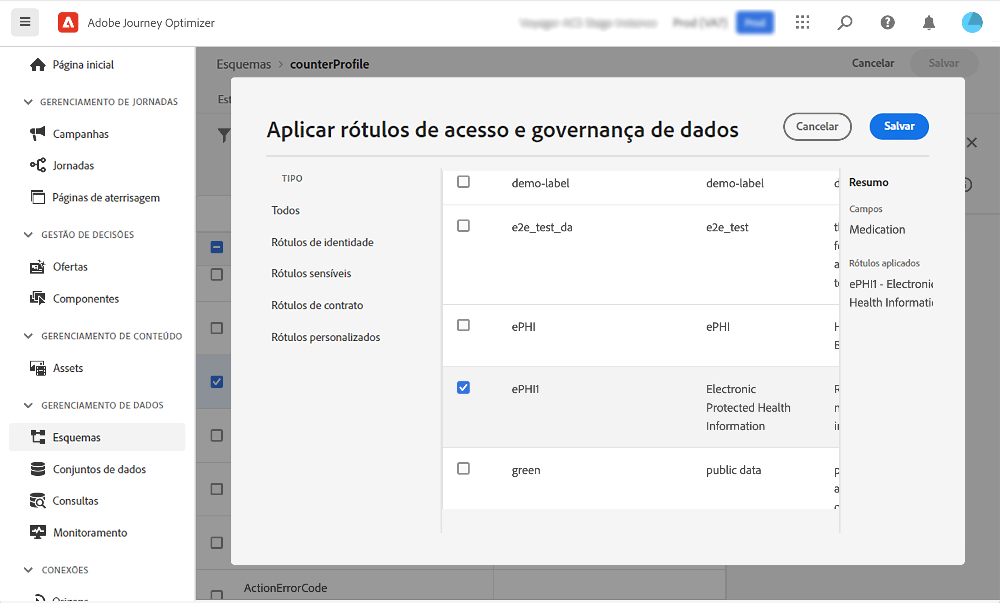

# Governança de dados {#restrict-fields}

>[!IMPORTANT]
>
>O uso de DULE está atualmente restrito a clientes selecionados e será implantado em todos os ambientes em uma versão futura.

Com sua estrutura de governança DULE (Aplicação e rotulagem de uso de dados), o Journey Optimizer agora pode aproveitar as políticas de governança da Adobe Experience Platform para impedir que campos confidenciais sejam exportados para sistemas de terceiros por meio de ações personalizadas. Se o sistema identificar um campo restrito nos parâmetros de ação personalizados, um erro será exibido, impedindo que você publique a jornada.

A Adobe Experience Platform permite rotular seus campos e criar ações de marketing para cada canal. Em seguida, você define uma política de governança vinculada a um rótulo e uma ação de marketing.

No Journey Optimizer, você pode aplicar essas políticas às ações personalizadas para impedir que campos específicos sejam exportados para sistemas de terceiros.

Para obter mais informações sobre a estrutura de governança de dados e como trabalhar com rótulos e políticas, consulte a documentação da Adobe Experience Platform:

* [Visão geral do serviço de governança de dados](https://experienceleague.adobe.com/docs/experience-platform/data-governance/home.html?lang=pt-BR)
* [Visão geral dos rótulos de uso de dados](https://experienceleague.adobe.com/docs/experience-platform/data-governance/labels/overview.html?lang=pt-BR)
* [Políticas de uso de dados](https://experienceleague.adobe.com/docs/experience-platform/data-governance/policies/overview.html?lang=pt-BR)

## Observações importantes {#important-notes}

* A governança de dados se aplica somente às ações personalizadas nas jornadas. As ações do Campaign v7/v8 e do Campaign Standard não são compatíveis.
* As políticas de governança só se aplicam quando uma ação de marketing (necessária ou adicional) é definida no nível de ação personalizada.

## Definir políticas de governança {#governance-policies}

Você pode usar rótulos, ações de marketing e políticas já existentes. Estas são as etapas principais de configuração para criar novos:

* Adicione um rótulo e aplique-o a campos específicos que você não deseja que sejam exportados para sistemas de terceiros, por exemplo, o tipo de sangue de uma pessoa.
* Defina uma ação de marketing para cada ação personalizada de terceiros usada em suas jornadas.
* Crie uma política de governança e associe-a ao rótulo e à ação de marketing.

Para obter mais informações sobre como gerenciar permissões, consulte esta [documentação](https://experienceleague.adobe.com/docs/experience-platform/data-governance/policies/user-guide.html?lang=pt-BR#consent-policy).

Vamos ver o exemplo do campo de tipo de sangue que você precisa rotular como confidencial e impedí-lo de ser exportado para terceiros. Estas são as etapas:

1. No menu esquerdo, em **Privacidade**, clique em **Políticas**.
1. Selecione a guia **Rótulos** e clique em **Criar rótulo**.
   
1. Defina um nome e um nome amigável para este rótulo. Por exemplo, _ePHI1_.
1. No menu esquerdo, em **Gestão de dados**, clique em **Esquemas** e clique no botão **Aplicar rótulos de acesso e de governança de dados**. Selecione o esquema e o campo (tipo de sangue) e selecione o rótulo criado anteriormente, _ePHI1_ no nosso exemplo.
   
1. Volte para o menu **Políticas** selecione a guia **Ação de marketing** e clique em **Criar ação de marketing**. Recomendamos que você crie uma ação de marketing para cada ação personalizada de terceiros usada em suas jornadas. Por exemplo, vamos criar uma _Ação de marketing Slack_ que será usada para sua ação personalizada de Slack.
   
1. Selecione a guia **Navegar** clique em **Criar política** e selecione **Política de governança de dados**. Selecione seu rótulo (_ePHI1_) e a ação de marketing (_Ação de marketing Slack_).
   

Em uma jornada, quando você usar sua ação personalizada de Slack configurada com a variável _Ação de marketing Slack_, a política associada será utilizada.

## Configurar a ação personalizada {#consent-custom-action}

No menu esquerdo, em **Administração**, clique em **Configurações** e selecione **Ações**. Abra sua ação personalizada de Slack. Ao configurar uma ação personalizada, dois campos podem ser usados para a governança de dados.

* O campo **Canal** permite selecionar o canal relacionado a esta ação personalizada: **Email**, **SMS** ou **Notificação por push**. Ele preencherá previamente o campo **Ação de marketing necessária** com a ação de marketing padrão do canal selecionado. Se você selecionar **outros**, nenhuma ação de marketing será definida por padrão. No nosso exemplo, selecionamos o canal **other**.

* A **Ação de marketing necessária** permite definir a ação de marketing relacionada à sua ação personalizada. Por exemplo, se você usar essa ação personalizada para enviar emails usando um terceiro, você pode selecionar **Direcionamento de email**. No nosso exemplo, selecionamos a variável _Ação de marketing Slack_. As políticas de governança associadas a essa ação de marketing são recuperadas e aproveitadas.

As outras etapas para configurar uma ação personalizada estão detalhadas [nesta seção](../action/about-custom-action-configuration.md#consent-management).

## Criar a jornada {#consent-journey}

No menu esquerdo, em **Gerenciamento de jornada**, clique em **Jornadas**. Crie a jornada e adicione a ação personalizada.  Ao adicionar a ação personalizada em uma jornada, há várias opções que permitem gerenciar a governança de dados. Clique em **Mostrar campos somente leitura** para exibir todos os parâmetros.

O **Canal** e a **Ação de marketing necessária**, definidos ao configurar a ação personalizada, são exibidos na parte superior da tela. Não é possível modificar esses campos.

Você pode configurar uma **Ação de marketing adicional** para definir o tipo de ação personalizada. Isso permite definir a finalidade da ação personalizada nesta jornada. Além da ação de marketing necessária, que geralmente é específica de um canal, é possível definir uma ação de marketing adicional que será específica para a ação personalizada desta jornada. Por exemplo: um boletim informativo, uma comunicação de treino, fitness etc. A ação de marketing necessária e a ação de marketing adicional serão aplicadas.

No nosso exemplo, não usamos uma ação de marketing adicional.

Se um dos campos rotulados como _ePHI1_ (o campo de tipo sanguíneo no exemplo) for detectado nos parâmetros de ação, um erro será exibido e a jornada não poderá ser publicada.

As outras etapas para configurar uma ação personalizada em uma jornada são detalhadas [nesta seção](../building-journeys/using-custom-actions.md).
