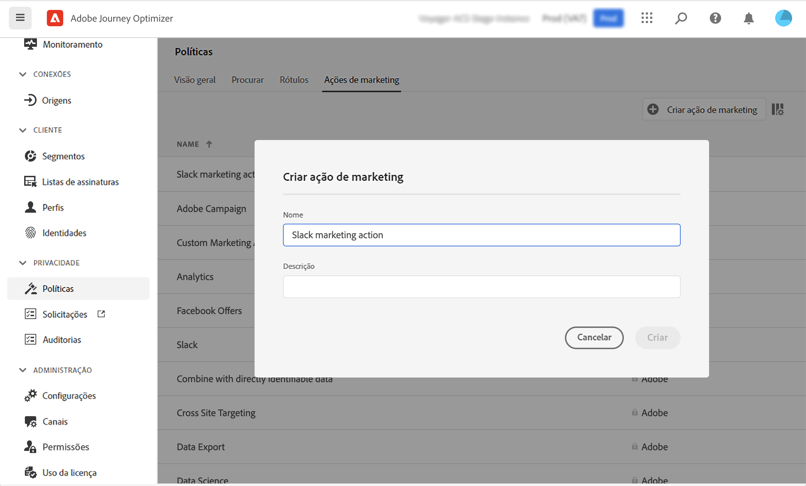

# Governança de dados {#restrict-fields}

>[!IMPORTANT]
>
>O uso de DULE está atualmente restrito a clientes selecionados e será implantado em todos os ambientes em uma versão futura.

Com sua estrutura de governança DULE (Aplicação e rotulagem de uso de dados), o Journey Optimizer agora pode aproveitar as políticas de governança da Adobe Experience Platform para impedir que campos confidenciais sejam exportados para sistemas de terceiros por meio de ações personalizadas. Se o sistema identificar um campo restrito nos parâmetros de ação personalizados, um erro será exibido, impedindo que você publique a jornada.

O Adobe Experience Platform permite rotular os campos e criar ações de marketing para cada canal. Em seguida, você define uma política de governança vinculada a um rótulo e uma ação de marketing.

No Journey Optimizer, você pode aplicar essas políticas às ações personalizadas para impedir que campos específicos sejam exportados para sistemas de terceiros.

Para obter mais informações sobre a estrutura de governança de dados e como trabalhar com rótulos e políticas, consulte a documentação da Adobe Experience Platform:

* [Visão geral do serviço de governança de dados](https://experienceleague.adobe.com/docs/experience-platform/data-governance/home.html?lang=pt-BR)
* [Visão geral dos rótulos de uso de dados](https://experienceleague.adobe.com/docs/experience-platform/data-governance/labels/overview.html?lang=pt-BR)
* [Políticas de uso de dados](https://experienceleague.adobe.com/docs/experience-platform/data-governance/policies/overview.html?lang=pt-BR)

## Observações importantes {#important-notes}

* O controle de dados se aplica somente a ações personalizadas no jornada. As ações Campaign Classic e Campaign Standard não são compatíveis.
* As políticas de governança só se aplicam quando uma ação de marketing (necessária ou adicional) é definida no nível de ação personalizada.
* Os atributos que fazem parte de um grupo de campos usando o Esquema de União predefinido não são suportados. Esses atributos ficarão ocultos na interface. É necessário criar outro grupo de campos usando um schema diferente.

## Definir políticas de governança {#governance-policies}

Você pode usar rótulos, ações e políticas de marketing existentes. Estas são as etapas principais de configuração para criar novas etapas:

* Adicione um rótulo e o aplique a campos específicos que você não deseja exportar para sistemas de terceiros, por exemplo, o tipo de sangue de uma pessoa.
* Defina uma ação de marketing para cada ação personalizada de terceiros usada em suas jornadas.
* Crie uma política de governança e associe-a à ação de rótulo e marketing.

Para obter mais informações sobre como gerenciar políticas, consulte esta seção [documentação](https://experienceleague.adobe.com/docs/experience-platform/data-governance/policies/user-guide.html?lang=en#consent-policy)

Vamos ver o exemplo do campo de tipo de sangue que você precisa rotular como confidencial e impedir de ser exportado para um terceiro. Estas são as diferentes etapas:

1. No menu esquerdo, em **Privacidade**, clique em **Políticas**.
   
1. Selecione o **Rótulos** e clique em **Criar rótulo**.
   
1. Defina um nome e um nome amigável para este rótulo. Por exemplo, _ePHI1_.
   
1. No menu esquerdo, em **Gestão de dados**, clique em **Esquemas** e clique no botão **Aplicar rótulos de acesso e governança de dados** botão. Selecione o esquema e o campo (tipo de sangue) e selecione o rótulo criado anteriormente, _ePHI1_ no nosso exemplo.
   
1. Volte para o **Políticas** selecione o **Ação de marketing** e clique em **Criar ação de marketing**. Recomendamos que você crie uma ação de marketing para cada ação personalizada de terceiros usada em suas jornadas. Por exemplo, vamos criar um _Ação de marketing Slack_ que será usada para sua ação personalizada do Slack.
   
1. Selecione o **Procurar** clique em **Criar política** e selecione **Política de gestão de dados**. Selecione seu rótulo (_ePHI1_) e ação de marketing (_Ação de marketing Slack_).
   

Quando você usará, em uma jornada, sua ação personalizada do Slack configurada com a variável _Ação de marketing Slack_, a política associada será utilizada.

## Configurar a ação personalizada {#consent-custom-action}

No menu esquerdo, em **Administração**, clique em **Configurações** e selecione **Ações**. Abra a ação personalizada do Slack. Ao configurar uma ação personalizada, dois campos podem ser usados para o controle de dados.

* O **Canal** permite selecionar o canal relacionado a esta ação personalizada: **Email**, **SMS** ou **Notificação por push**. Ele preencherá previamente o **Ação de marketing necessária** com a ação de marketing padrão do canal selecionado. Se você selecionar **other**, nenhuma ação de marketing será definida por padrão. No nosso exemplo, selecionamos o canal **other**.

* O **Ação de marketing necessária** O permite definir a ação de marketing relacionada à sua ação personalizada. Por exemplo, se você usar essa ação personalizada para enviar emails usando um terceiro, poderá selecionar **Direcionamento de email**. No nosso exemplo, selecionamos a variável _Ação de marketing Slack_. As políticas de governança associadas a essa ação de marketing são recuperadas e aproveitadas.

As outras etapas para configurar uma ação personalizada estão detalhadas em [esta seção](../action/about-custom-action-configuration.md#consent-management).

## Crie a jornada {#consent-journey}

No menu esquerdo, em **Gerenciamento de jornadas**, clique em **Jornada**. Crie a jornada e adicione a ação personalizada.  Ao adicionar a ação personalizada em uma jornada, várias opções permitem gerenciar o controle de dados. Clique no botão **Mostrar campos somente leitura** para exibir todos os parâmetros.

O **Canal** e **Ação de marketing necessária**, definidas ao configurar a ação personalizada, são exibidas na parte superior da tela. Não é possível modificar esses campos.

Você pode definir uma **Ação de marketing adicional** para definir o tipo de ação personalizada. Isso permite definir a finalidade da ação personalizada nesta jornada. Além da ação de marketing necessária, que geralmente é específica de um canal, é possível definir uma ação de marketing adicional que será específica para a ação personalizada nesta jornada específica. Por exemplo: uma comunicação de workout, um boletim informativo, uma comunicação de fitness etc. A ação de marketing necessária e a ação de marketing adicional serão aplicadas.

No nosso exemplo, não usamos uma ação de marketing adicional.

Se um dos campos estiver rotulado _ePHI1_ (o campo de tipo de sangue no nosso exemplo) são detectados nos parâmetros de ação, um erro é exibido, impedindo que você publique a jornada.

As outras etapas para configurar uma ação personalizada em uma jornada são detalhadas em [esta seção](../building-journeys/using-custom-actions.md).
