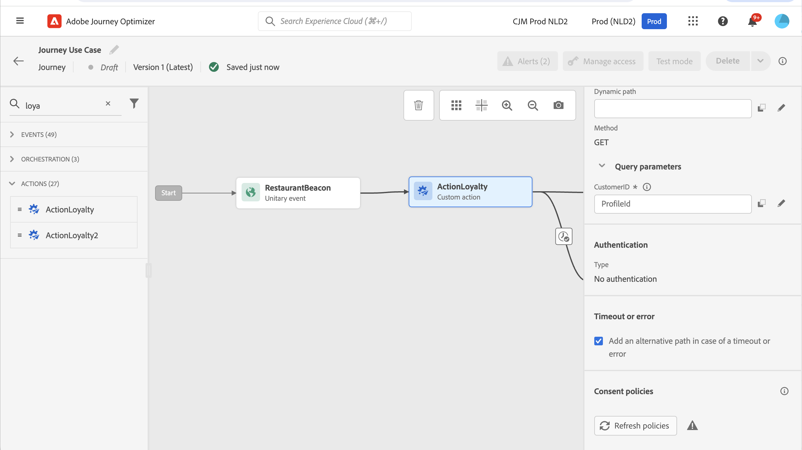

# Aprimoramentos de ação personalizada

Agora você pode aproveitar as respostas de chamada da API em ações personalizadas e orquestrar suas jornadas com base nessas respostas.

Esse recurso só estava disponível ao usar fontes de dados. Agora você pode usá-lo com ações personalizadas.

>[!AVAILABILITY]
>
>No momento, esse recurso está disponível como um beta privado.

>[!WARNING]
>
>As ações personalizadas só devem ser usadas com endpoints privados ou internos e usadas com um limite máximo ou limitação apropriado. Consulte [esta página](../configuration/external-systems.md).

## Definir a ação personalizada

Ao definir a ação personalizada, duas melhorias foram disponibilizadas: a adição do método GET e o novo campo de resposta de carga útil. As outras opções e parâmetros permanecem inalterados. Consulte [esta página](../action/about-custom-action-configuration.md).

### Configuração do endpoint

A variável **Configuração de URL** a seção foi renomeada **Configuração do endpoint**.

No **Método** , agora é possível selecionar **GET**.

{width="70%" align="left"}

### Cargas

A variável **Parâmetros de ação** a seção foi renomeada **Cargas**. Dois campos estão disponíveis:

* A variável **Solicitação** field: este campo só está disponível para os métodos de chamada POST e PUT.
* A variável **Resposta** field: este é o novo recurso. Esse campo estava disponível para todos os métodos de chamada.

>[!NOTE]
> 
>Ambos os campos são opcionais.

{width="70%" align="left"}

1. Clique dentro do **Resposta** campo.

   {width="80%" align="left"}

1. Cole um exemplo da carga útil retornada pela chamada. Verifique se os tipos de campo estão corretos (sequência, número inteiro etc.). Este é um exemplo de carga de resposta capturada durante a chamada. Nosso terminal local envia o número de pontos de fidelidade e o status de um perfil.

   ```
   {
   "customerID" : "xY12hye",    
   "status":"gold",
   "points": 1290 }
   ```

   {width="80%" align="left"}

   Cada vez que a API é chamada, o sistema recuperará todos os campos incluídos no exemplo de carga útil.

1. Também vamos adicionar a customerID como parâmetro de consulta.

   {width="80%" align="left"}

1. Clique em **Salvar**.

## Aproveitar a resposta em uma jornada

Basta adicionar a ação personalizada a uma jornada. Em seguida, você pode aproveitar os campos de carga de resposta em condições, outras ações e personalização de mensagens.

Por exemplo, você pode adicionar uma condição para verificar o número de pontos de fidelidade. Quando a pessoa entra no restaurante, o terminal local envia uma chamada com as informações de fidelidade do perfil. Você pode enviar um push se o perfil for um cliente gold. Se um erro for detectado na chamada, envie uma ação personalizada para notificar o administrador do sistema.


1. Adicione o evento e a ação personalizada Fidelidade criada anteriormente.

1. Na ação personalizada de Fidelidade, mapeie o parâmetro de consulta da ID do cliente com a ID do perfil. Marque a opção **Adicionar um caminho alternativo em caso de tempo limite ou erro**.

   

1. Na primeira ramificação, adicione uma condição e use o editor avançado para aproveitar os campos de resposta de ação, sob o **Contexto** nó.

   

1. Em seguida, adicione o push e personalize a mensagem usando os campos de resposta. No nosso exemplo, personalizamos o conteúdo usando o número de pontos de fidelidade e o status do cliente. Os campos de resposta de ação estão disponíveis em **Atributos contextuais** > **Journey Orchestration** > **Ações**.

   

   >[!NOTE]
   >
   >Cada perfil que entra na ação personalizada acionará uma chamada. Mesmo que a resposta seja sempre a mesma, o Jornada ainda executará uma chamada por perfil.

1. Na ramificação de tempo limite e erro, adicione uma condição e utilize o incorporado **jo_status_code** campo. No nosso exemplo, estamos usando a variável
   **http_400** tipo de erro. Consulte [esta seção](#error-status).

   ```
   @action{ActionLoyalty.jo_status_code} == "http_400"
   ```

   

1. Adicione uma ação personalizada que será enviada para sua organização.

   

## Status do erro{#error-status}

A variável **jo_status_code** O campo está sempre disponível mesmo quando nenhuma carga de resposta é definida.

Estes são os valores possíveis para este campo:

* código de status http: http_`<HTTP API call returned code>`, por exemplo http_200 ou http_400
* erro de tempo limite: **tempo limite**
* erro de limite: **limitado**
* erro interno: **internalError**

Uma chamada de ação é considerada com erro quando o código http retornado é maior que 2xx ou se ocorrer um erro. A jornada flui para a ramificação de tempo limite ou erro dedicada nesses casos.

>[!WARNING]
>
>Somente as ações personalizadas recém-criadas incluem a variável **jo_status_code** pronto para uso. Se quiser usá-la com uma ação personalizada existente, será necessário atualizar a ação. Por exemplo, você pode atualizar a descrição e salvar.

## Sintaxe da expressão

Esta é a sintaxe:

```json
#@action{myAction.myField} 
```

Veja alguns exemplos:

```json
 // action response field
 @action{<action name>.<path to the field>}
 @action{ActionLoyalty.status}
```

```json
 // action response field
 @action{<action name>.<path to the field>, defaultValue: <default value expression>}
 @action{ActionLoyalty.points, defaultValue: 0}
 @action{ActionLoyalty.points, defaultValue: @{myEvent.newPoints}}
```

Para obter mais informações sobre referências de campo, consulte [nesta seção](../building-journeys/expression/field-references.md).
