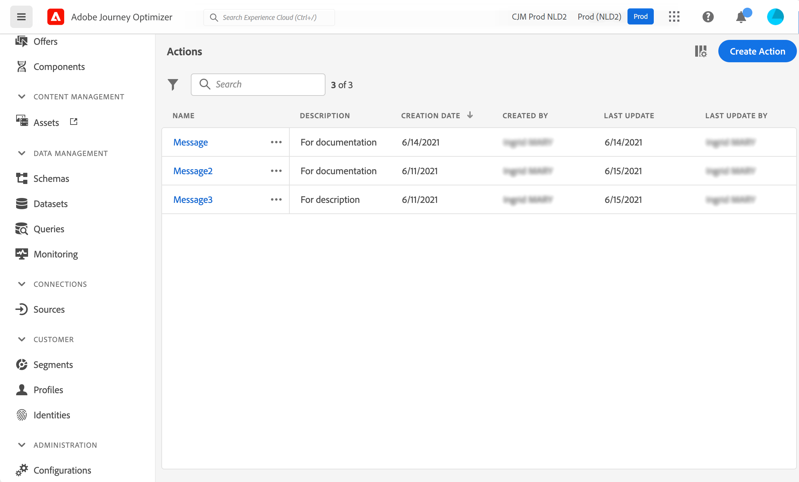

# Sobre ações {#about_actions}

>[!CONTEXTUALHELP]
>id="jo_actions"
>title="Sobre ações"
>abstract="É aqui que você define a conexão com o sistema que enviará mensagens. As ações definidas aqui estarão disponíveis na paleta esquerda da sua jornada, na categoria Ação. "

As ações são conexões através das quais você fornece experiências personalizadas em tempo real para clientes, como notificações por push, email, SMS ou qualquer outro meio de engajamento digital usado em sua empresa.

[!DNL Journey Optimizer] O vem com capacidade de mensagem integrada. Consulte [esta seção](../get-started-content.md).

Se você estiver usando um sistema de terceiros para enviar mensagens como Epsilon, Facebook, Adobe.io, Firebase, etc., é necessário adicionar e configurar uma ação personalizada. Consulte [esta página](../action/about-custom-action-configuration.md).

As ações personalizadas permitem configurar a conexão de um sistema de terceiros para enviar mensagens ou chamadas de API. Uma ação pode ser configurada com qualquer serviço de qualquer provedor que possa ser chamado por meio de uma REST API com uma carga útil formatada em JSON.

>[!CAUTION]
>
>A configuração de ações personalizadas deve ser executada por um **usuário técnico**.

As ações estão disponíveis na paleta esquerda da jornada, na categoria **[!UICONTROL Action]**. Consulte [esta página](../building-journeys/about-journey-activities.md#action-activities).

Na lista de **Ações**, você pode pressionar C para criar uma nova jornada, ação, fonte de dados ou evento. Para obter mais informações sobre atalhos, consulte [esta seção](../user-interface.md#cjm-accessibility).

Para exibir a lista de ações ou configurar uma nova ação, clique em **[!UICONTROL Admin]** / **[!UICONTROL Actions]** nos menus à esquerda. A lista de ações é exibida. Consulte [esta página](../user-interface.md) para obter mais informações sobre a interface.

