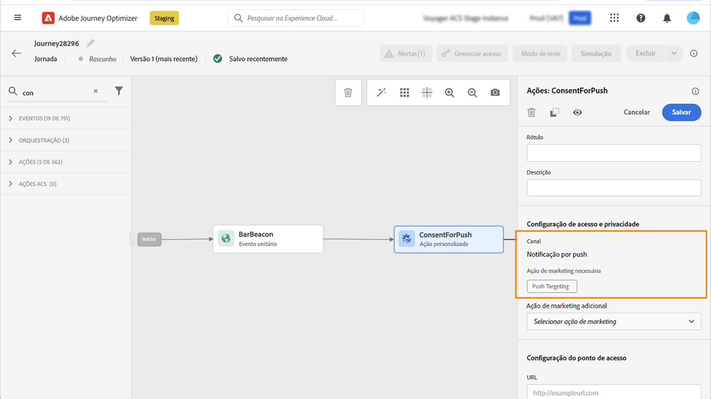
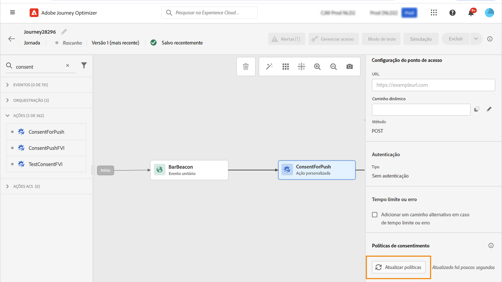

# Trabalhar com políticas de consentimento {#consent-management}

>[!AVAILABILITY]
>
>Esta página inclui informações relacionadas a melhorias que estão atualmente restritas a clientes selecionados.

Seus dados podem estar sujeitos a restrições de uso definidas por sua organização ou por regulamentos legais. Portanto, é importante garantir que as operações de dados no Journey Optimizer estejam em conformidade com as [políticas de uso de dados](https://experienceleague.adobe.com/docs/experience-platform/data-governance/policies/overview.html?lang=pt-BR){target="_blank"}. Essas políticas são regras do Adobe Experience Platform que definem quais ações de marketing você tem permissão para executar nos dados.

Por padrão, se um perfil tiver optado por não receber comunicações de você, o perfil correspondente será excluído dos deliveries subsequentes. Você pode criar uma **política de consentimento** que substitua essa lógica padrão. Por exemplo, você pode criar políticas de consentimento no Experience Platform para excluir clientes que não consentiram em receber comunicação para um determinado canal. Na ausência de uma política personalizada, a política padrão é aplicada.

>[!IMPORTANT]
>
>Atualmente, as políticas de consentimento estão disponíveis apenas para as organizações que compraram as ofertas complementares do Adobe **Healthcare Shield** ou do **Privacy and Security Shield** .

As principais etapas para aplicar políticas de consentimento são as seguintes:

1. Criar uma política de consentimento no Adobe Experience Platform com uma ação de marketing associada. [Saiba como criar uma política de consentimento](https://experienceleague.adobe.com/docs/experience-platform/data-governance/policies/user-guide.html?lang=pt-BR#consent-policy){target="_blank"}

2. Aplique políticas de consentimento no Adobe Journey Optimizer usando configurações de canal ou ações personalizadas do jornada.

   * Crie uma configuração de canal com uma ação de marketing associada. Ao criar uma comunicação usando a configuração do canal, ela herdará a ação de marketing que foi associada e aplicará as políticas de consentimento correspondentes definidas no Adobe Experience Platform. [Saiba como aproveitar as políticas de consentimento por meio das configurações de canal](#surface-marketing-actions)

   * No nível da jornada, é possível:

      * Associe um canal e uma ação de marketing a uma ação personalizada ao configurá-la. [Saiba como aproveitar as políticas de consentimento ao configurar uma ação personalizada](#consent-custom-action)
      * Defina uma ação de marketing adicional ao adicionar uma ação personalizada em uma jornada. [Saiba como aproveitar as políticas de consentimento ao adicionar uma ação personalizada em uma jornada](#consent-journey)

## Utilização de políticas de consentimento por meio de configurações de canal {#surface-marketing-actions}

No [!DNL Journey Optimizer], o consentimento é tratado pelo [Esquema de consentimento](https://experienceleague.adobe.com/docs/experience-platform/xdm/field-groups/profile/consents.html?lang=pt-BR) da Experience Platform{target="_blank"}. Por padrão, o valor do campo de consentimento fica vazio e é tratado como consentimento para receber suas comunicações. Durante a integração, é possível modificar esse valor padrão para um dos valores possíveis listados [aqui](https://experienceleague.adobe.com/docs/experience-platform/xdm/data-types/consents.html?lang=pt-BR#choice-values){target="_blank"}.

Para modificar o valor do campo de consentimento, crie uma política de consentimento personalizada e defina uma ação de marketing para ela, bem como as condições sob as quais essa ação é executada. [Saiba mais sobre ações de marketing](https://experienceleague.adobe.com/docs/experience-platform/data-governance/policies/overview.html?lang=pt-BR#marketing-actions){target="_blank"}

Por exemplo, caso queira criar uma política de consentimento para direcionar apenas perfis que aceitaram receber comunicações por email, siga as etapas abaixo.

1. Verifique se sua organização adquiriu as ofertas complementares do Adobe **Healthcare Shield** ou **Privacy and Security Shield**. [Saiba mais](https://experienceleague.adobe.com/docs/events/customer-data-management-voices-recordings/governance/healthcare-shield.html?lang=pt-BR){target="_blank"}

1. Na Adobe Experience Platform, crie uma política personalizada (no menu **[!UICONTROL Privacidade]** > **[!UICONTROL Políticas]**). [Saiba como](https://experienceleague.adobe.com/docs/experience-platform/data-governance/policies/user-guide.html?lang=pt-BR#create-policy){target="_blank"}

   <!---->

1. Escolha o tipo de **[!UICONTROL Política de consentimento]** e configure uma condição da seguinte maneira. [Saiba como configurar políticas de consentimento](https://experienceleague.adobe.com/docs/experience-platform/data-governance/policies/user-guide.html?lang=pt-BR#consent-policy){target="_blank"}

   1. Na seção **[!UICONTROL Se]**, selecione a ação de marketing padrão **[!UICONTROL Direcionamento de email]**.

      <!---->

      >[!NOTE]
      >
      >As principais ações de marketing prontas para uso fornecidas pela Adobe estão listadas [nesta tabela](https://experienceleague.adobe.com/docs/experience-platform/data-governance/policies/overview.html?lang=pt-BR#core-actions){target="_blank"}. As etapas para criar uma ação de marketing personalizada estão listadas [nesta seção](https://experienceleague.adobe.com/docs/ Experience-platform/data-governance/policies/user-guide.html?lang=pt-BR#create-marketing-action){target="_blank"}.

   1. Selecione o que acontece quando a ação de marketing é aplicada. Neste exemplo, selecione **[!UICONTROL Consentimento de marketing por email]**.

   

1. Salve e [habilite](https://experienceleague.adobe.com/docs/experience-platform/data-governance/policies/user-guide.html?lang=pt-BR#enable){target="_blank"} essa política.

1. No Journey Optimizer, crie uma superfície de email. [Saiba como](../configuration/channel-surfaces.md#create-channel-surface)

1. Nos detalhes da configuração de email, selecione a ação de marketing **[!UICONTROL Direcionamento de email]**.

   

Todas as políticas de consentimento associadas a essa ação de marketing são automaticamente utilizadas, a fim de respeitar as preferências de clientes.

Portanto, nesse exemplo, qualquer [email](../email/create-email.md) que use essa configuração em uma campanha ou jornada só é enviado aos perfis que aceitaram o recebimento de emails. Perfis que não aceitaram receber comunicações por email são excluídos.

## Aproveitar as políticas de consentimento por meio de ações personalizadas {#journey-custom-actions}

### Observações importantes {#important-notes}

No Journey Optimizer, o consentimento também pode ser aproveitado em ações personalizadas. Se quiser usá-lo com os recursos de mensagem integrados, é necessário usar uma atividade de condição para filtrar os clientes na jornada.

Com o gerenciamento de consentimento, duas atividades de jornada são analisadas:

* Público-alvo de leitura: o público-alvo recuperado é considerado.
* Ação personalizada: o gerenciamento de consentimento leva em conta os atributos usados ([parâmetros de ação](../action/about-custom-action-configuration.md#define-the-message-parameters)) e as ações de marketing definidas (a ação de marketing necessária e a adicional).
* Os atributos que fazem parte de um grupo de campos usando o esquema de união predefinido não são compatíveis. Esses atributos ficarão ocultos na interface. É necessário criar outro grupo de campos usando um schema diferente.
* As políticas de consentimento só se aplicam quando uma ação de marketing (necessária ou adicional) é definida no nível da ação personalizada.

Todas as outras atividades usadas em uma jornada não são consideradas. Se iniciar a jornada com uma Qualificação de público-alvo, o público-alvo não será considerado.

Em uma jornada, se um perfil for excluído por causa de uma política de consentimento em uma ação personalizada, a mensagem não será enviada para ele, mas ele permanecerá na jornada. O perfil não irá para o caminho de erro e de tempo limite ao usar uma condição.

Antes de atualizar as políticas em uma ação personalizada inserida em uma jornada, verifique se a jornada não tem nenhum erro.

<!--
There are two types of latency regarding the use of consent policies:

* **User latency**: the delay from the time a profile changes a consent settings to the moment it is applied in Experience Platform. This can take up to 48h. 
* **Consent policy latency**: the delay from the time a consent policy is created or updated to the moment it is applied. This can take up to 6 hours
-->

### Aproveitar políticas de consentimento ao configurar uma ação personalizada{#consent-custom-action}

Ao configurar uma ação personalizada, dois campos podem ser usados para o gerenciamento de consentimento.

O campo **Canal** permite selecionar o canal relacionado a esta ação personalizada. Ele preencherá previamente o campo **Ação de marketing necessária** com a ação de marketing padrão do canal selecionado. Se você selecionar **outra**, nenhuma ação de marketing será definida por padrão. 

A **Ação de marketing necessária** permite definir a ação de marketing relacionada à sua ação personalizada. Por exemplo, se você usar essa ação personalizada para enviar emails, será possível selecionar a opção **Direcionamento de email**. Quando usadas em uma jornada, todas as políticas de consentimento associadas à ação de marketing em questão serão recuperadas e aproveitadas. Uma ação de marketing padrão estará selecionada, mas você pode clicar na seta para baixo para selecionar qualquer ação de marketing disponível na lista.

Para certos tipos de comunicações importantes (por exemplo, uma mensagem transacional enviada para redefinir a senha de um cliente), talvez você não queira aplicar uma política de consentimento. Então você pode selecionar **Nenhum** no campo **Ação de marketing necessária**.

As outras etapas para configurar uma ação personalizada estão detalhadas [nesta seção](../action/about-custom-action-configuration.md#consent-management).

### Aproveitar as políticas de consentimento ao adicionar uma ação personalizada em uma jornada {#consent-journey}

Ao adicionar a ação personalizada em uma jornada, há várias opções que permitem gerenciar o consentimento. Clique em **Mostrar campos somente leitura** para exibir todos os parâmetros.

O **Canal** e a **Ação de marketing necessária**, definidos ao configurar a ação personalizada, são exibidos na parte superior da tela. Não é possível modificar esses campos.

Você pode configurar uma **Ação de marketing adicional** para definir o tipo de ação personalizada. Isso permite definir a finalidade da ação personalizada nesta jornada. Além da ação de marketing necessária, que geralmente é específica de um canal, é possível definir uma ação de marketing adicional, que será específica da ação personalizada da jornada em questão. Por exemplo: um comunicado de treino, um boletim informativo, um comunicado de fitness etc. A ação de marketing necessária junto com a ação de marketing adicional serão aplicadas.

Clique no botão **Atualizar políticas** na parte inferior da tela para atualizar e verificar a lista de políticas consideradas para esta ação personalizada. Isso é somente para fins informativos durante a criação de uma jornada. Em jornadas ativas, as políticas de consentimento são recuperadas e atualizadas automaticamente a cada 6 horas.

<!--
The following data is taken into account for consent:

* marketing actions and additional marketing actions defined in the custom action
* action parameters defined in the custom action, see this [section](../action/about-custom-action-configuration.md#define-the-message-parameters) 
* attributes used as criteria in a segment when the journey starts with a Read segment, see this [section](../building-journeys/read-audience.md) 

>[!NOTE]
>
>Please note that there can be a latency when updating the list of policies applied, refer to this [this section](../action/consent.md#important-notes).
-->

As outras etapas para configurar uma ação personalizada em uma jornada são detalhadas [nesta seção](../building-journeys/using-custom-actions.md).
