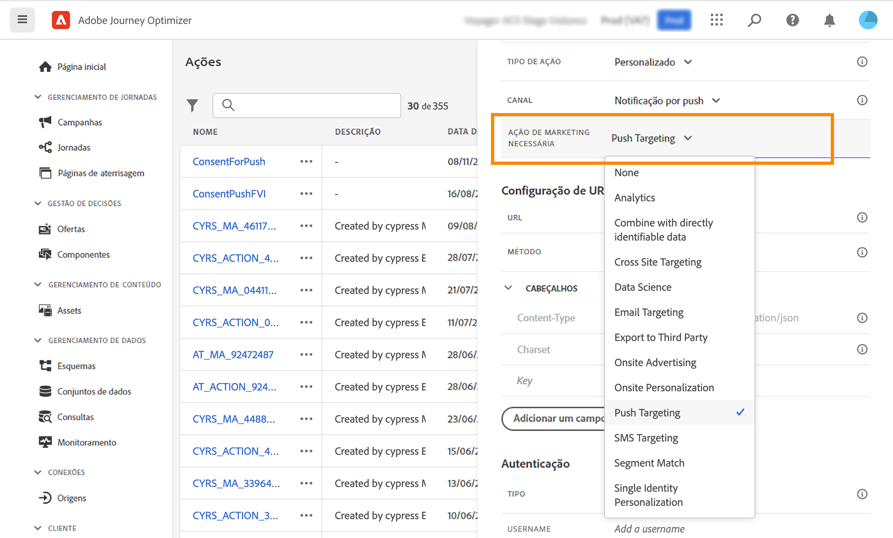

# Trabalhar com políticas de consentimento {#consent-management}

A Adobe Experience Platform permite adotar e aplicar facilmente políticas de marketing para respeitar as preferências de consentimento dos clientes. As políticas de consentimento são definidas na Adobe Experience Platform. Consulte [esta documentação](https://experienceleague.adobe.com/docs/experience-platform/data-governance/policies/user-guide.html?lang=en#consent-policy).

No Journey Optimizer, você pode aplicar essas políticas de consentimento às ações personalizadas. Por exemplo, você pode definir políticas de consentimento para excluir clientes que não consentiram em receber email, push ou comunicação por SMS.

>[!NOTE]
>
>Atualmente, as políticas de consentimento estão disponíveis apenas para organizações que compraram a oferta complementar do Healthcare Shield.

No Journey Optimizer, o consentimento é definido em vários níveis:

* when **configuração de uma ação personalizada**, é possível definir um canal e uma ação de marketing. Veja isso [seção](../action/consent.md#consent-custom-action).
* ao adicionar o **ação personalizada em uma jornada**, é possível definir uma ação de marketing adicional. Veja isso [seção](../action/consent.md#consent-journey).

## Observações importantes {#important-notes}

No Journey Optimizer, o consentimento pode ser aproveitado em ações personalizadas. Se quiser usá-lo com os recursos de mensagem integrada, é necessário usar uma atividade de condição para filtrar os clientes na jornada.

Com o gerenciamento de consentimento, duas atividades do jornada são analisadas:

* Ler segmento: o segmento recuperado é considerado.
* Ação personalizada: o gerenciamento de consentimento leva em conta os atributos usados ([parâmetros de ação](../action/about-custom-action-configuration.md#define-the-message-parameters)), bem como as ações de marketing definidas (ação de marketing necessária e ação de marketing adicional).
* Os atributos que fazem parte de um grupo de campos usando o Esquema de União predefinido não são suportados. Esses atributos ficarão ocultos na interface. É necessário criar outro grupo de campos usando um schema diferente.
* As políticas de consentimento só se aplicam quando uma ação de marketing (necessária ou adicional) é definida no nível de ação personalizada.

Todas as outras atividades usadas em uma jornada não são consideradas. Se você iniciar a jornada com uma qualificação de Segmento, o segmento não será considerado.

Em uma jornada, se um perfil for excluído por uma política de consentimento em uma ação personalizada, a mensagem não será enviada para ele, mas ele continuará a jornada. O perfil não atinge o tempo limite e o caminho de erro ao usar uma condição.

Antes de atualizar as políticas em uma ação personalizada posicionada em uma jornada, verifique se a jornada não tem erro.

<!--
There are two types of latency regarding the use of consent policies:

* **User latency**: the delay from the time a profile changes a consent settings to the moment it is applied in Experience Platform. This can take up to 48h. 
* **Consent policy latency**: the delay from the time a consent policy is created or updated to the moment it is applied. This can take up to 6 hours
-->

## Configuração da ação personalizada {#consent-custom-action}

>[!CONTEXTUALHELP]
>id="ajo_consent_required_marketing_action_admin"
>title="Definir uma ação de marketing necessária"
>abstract="A ação de marketing Obrigatório permite definir a ação de marketing relacionada à sua ação personalizada. Por exemplo, se você usar essa ação personalizada para enviar emails, poderá selecionar Direcionamento de email. Quando usadas em uma jornada, todas as políticas de consentimento associadas a essa ação de marketing serão recuperadas e aproveitadas. Isso não pode ser modificado na tela."

Ao configurar uma ação personalizada, dois campos podem ser usados para o gerenciamento de consentimento.

O **Canal** permite selecionar o canal relacionado a esta ação personalizada: **Email**, **SMS** ou **Notificação por push**. Ele preencherá previamente o **Ação de marketing necessária** com a ação de marketing padrão do canal selecionado. Se você selecionar **other**, nenhuma ação de marketing será definida por padrão.

O **Ação de marketing necessária** O permite definir a ação de marketing relacionada à sua ação personalizada. Por exemplo, se você usar essa ação personalizada para enviar emails, poderá selecionar **Direcionamento de email**. Quando usadas em uma jornada, todas as políticas de consentimento associadas a essa ação de marketing serão recuperadas e aproveitadas. Uma ação de marketing padrão é selecionada, mas você pode clicar na seta para baixo para selecionar qualquer ação de marketing disponível na lista.

Para certos tipos de comunicações importantes, por exemplo, uma mensagem transacional enviada para redefinir a senha do cliente, talvez você não queira aplicar uma política de consentimento. Em seguida, você selecionará **Nenhum** no **Ação de marketing necessária** campo.

As outras etapas para configurar uma ação personalizada estão detalhadas em [esta seção](../action/about-custom-action-configuration.md#consent-management).

### Construção da jornada {#consent-journey}

>[!CONTEXTUALHELP]
>id="ajo_consent_required_marketing_action_canvas"
>title="Ação de marketing necessária"
>abstract="Uma ação de marketing necessária é definida ao criar uma ação personalizada. Essa ação de marketing necessária não pode ser removida da ação ou modificada."

>[!CONTEXTUALHELP]
>id="ajo_consent_additional_marketing_action_canvas"
>title="Ação de marketing adicional"
>abstract="Adicione outra ação de marketing além da ação necessária. As políticas de consentimento relacionadas às duas ações de marketing serão aplicadas."

>[!CONTEXTUALHELP]
>id="ajo_consent_refresh_policies_canvas"
>title="Visualizar políticas de consentimento que serão aplicadas no tempo de execução"
>abstract="As ações de marketing trazem políticas de consentimento que combinam parâmetros de ação e valores de consentimento de perfil individuais para filtrar usuários. Obtenha a definição mais recente dessas políticas clicando no botão para atualizar."

Ao adicionar a ação personalizada em uma jornada, várias opções permitem gerenciar o consentimento. Clique no botão **Mostrar campos somente leitura** para exibir todos os parâmetros.

O **Canal** e **Ação de marketing necessária**, definidas ao configurar a ação personalizada, são exibidas na parte superior da tela. Não é possível modificar esses campos.

Você pode definir uma **Ação de marketing adicional** para definir o tipo de ação personalizada. Isso permite definir a finalidade da ação personalizada nesta jornada. Além da ação de marketing necessária, que geralmente é específica de um canal, é possível definir uma ação de marketing adicional que será específica para a ação personalizada nesta jornada específica. Por exemplo: uma comunicação de workout, um boletim informativo, uma comunicação de fitness etc. A ação de marketing necessária e a ação de marketing adicional serão aplicadas.

Clique no botão **Atualizar políticas** na parte inferior da tela, para atualizar e verificar a lista de políticas consideradas para esta ação personalizada. Isso é somente para fins de informação, enquanto cria uma jornada. Com as jornadas ativas, as políticas de consentimento são recuperadas e atualizadas automaticamente a cada 6 horas.

<!--
The following data is taken into account for consent:

* marketing actions and additional marketing actions defined in the custom action
* action parameters defined in the custom action, see this [section](../action/about-custom-action-configuration.md#define-the-message-parameters) 
* attributes used as criteria in a segment when the journey starts with a Read segment, see this [section](../building-journeys/read-segment.md) 

>[!NOTE]
>
>Please note that there can be a latency when updating the list of policies applied, refer to this [this section](../action/consent.md#important-notes).
-->

As outras etapas para configurar uma ação personalizada em uma jornada são detalhadas em [esta seção](../building-journeys/using-custom-actions.md).
