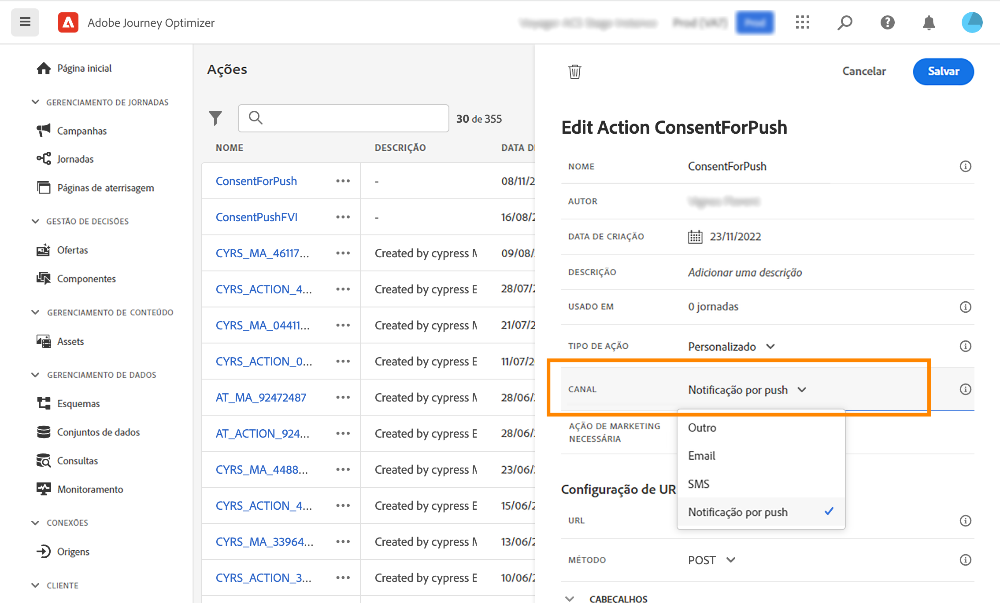

# Gerenciamento de consentimento (beta) {#consent-management}

Adobe Experience Platform allows you to easily adopt and enforce marketing policies to respect the consent preferences of your customers. As políticas de consentimento são definidas no Adobe Experience Platform. Consulte [esta documentação](https://experienceleague.adobe.com/docs/experience-platform/data-governance/policies/user-guide.html?lang=en#consent-policy).

In Journey Optimizer, you can apply these consent policies to your custom actions. Por exemplo, você pode definir políticas de consentimento para excluir clientes que não consentiram em receber email, push ou comunicação por SMS.

>[!NOTE]
>
>Esse recurso foi lançado como um beta privado. It is not available to all Journey Optimizer customers.

No Journey Optimizer, o consentimento é definido em vários níveis:

* when **configuração de uma ação personalizada**, é possível definir um canal e uma ação de marketing. Veja isso [seção](../action/consent.md#consent-custom-action).
* ao adicionar o **ação personalizada em uma jornada**, é possível definir uma ação de marketing adicional. See this [section](../action/consent.md#consent-journey).

## Observações importantes {#important-notes}

In Journey Optimizer, consent can be leveraged in custom actions. Se quiser usá-lo com os recursos de mensagem integrada, é necessário usar uma atividade de condição para filtrar os clientes na jornada.

Com o gerenciamento de consentimento, duas atividades do jornada são analisadas:

* Ler segmento: o segmento recuperado é considerado.
* Custom action: consent management takes into account the attributes used ([action parameters](../action/about-custom-action-configuration.md#define-the-message-parameters)) as well as the  marketing action(s) defined (required marketing action and additional marketing action).

Todas as outras atividades usadas em uma jornada não são consideradas. If you start your journey with a Segment qualification, the segment is not taken into account.

Em uma jornada, se um perfil for excluído por uma política de consentimento em uma ação personalizada, a mensagem não será enviada para ele, mas ele continuará a jornada. O perfil não atinge o tempo limite e o caminho de erro ao usar uma condição.

Antes de atualizar as políticas em uma ação personalizada posicionada em uma jornada, verifique se a jornada não tem erro.

<!--
There are two types of latency regarding the use of consent policies:

* **User latency**: the delay from the time a profile changes a consent settings to the moment it is applied in Experience Platform. This can take up to 48h. 
* **Consent policy latency**: the delay from the time a consent policy is created or updated to the moment it is applied. This can take up to 6 hours
-->

## Configuração da ação personalizada {#consent-custom-action}

>[!CONTEXTUALHELP]
>id="ajo_consent_required_marketing_action_admin"
>title="Definir uma ação de marketing necessária"
>abstract="A &quot;Ação de marketing necessária&quot; permite definir a ação de marketing relacionada à sua ação personalizada. Por exemplo, se você usar essa ação personalizada para enviar emails, poderá selecionar &quot;Direcionamento de email&quot;. Quando usadas em uma jornada, todas as políticas de consentimento associadas a essa ação de marketing serão recuperadas e aproveitadas. Isso não pode ser modificado na tela."

Ao configurar uma ação personalizada, dois campos podem ser usados para o gerenciamento de consentimento.

O **Canal** permite selecionar o canal relacionado a esta ação personalizada: **Email**, **SMS** ou **Notificação por push**. It will prefill the **Required marketing action** field with the default marketing action for the selected channel. Se você selecionar **other**, nenhuma ação de marketing será definida por padrão.

O **Ação de marketing necessária** O permite definir a ação de marketing relacionada à sua ação personalizada. Por exemplo, se você usar essa ação personalizada para enviar emails, poderá selecionar **Direcionamento de email**. Quando usadas em uma jornada, todas as políticas de consentimento associadas a essa ação de marketing serão recuperadas e aproveitadas. A default marketing action is selected, but you can click the down arrow to select any available marketing actions from the list.

For certain types of important communications, for example a transactional message sent to reset the client&#39;s password, you may not want to apply a consent policy. Em seguida, você selecionará **Nenhum** no **Ação de marketing necessária** campo.

The other steps for configuring a custom action are detailed in [this section](../action/about-custom-action-configuration.md#consent-management).

### Construção da jornada {#consent-journey}

>[!CONTEXTUALHELP]
>id="ajo_consent_required_marketing_action_canvas"
>title="Required marketing action"
>abstract="Uma ação de marketing necessária é definida ao criar uma ação personalizada. Essa ação de marketing necessária não pode ser removida da ação ou modificada."

>[!CONTEXTUALHELP]
>id="ajo_consent_additional_marketing_action_canvas"
>title="Ação de marketing adicional"
>abstract="Adicione outra ação de marketing além da ação necessária. As políticas de consentimento relacionadas às duas ações de marketing serão aplicadas."

>[!CONTEXTUALHELP]
>id="ajo_consent_refresh_policies_canvas"
>title="Visualize consent policies that will apply at runtime"
>abstract="As ações de marketing trazem políticas de consentimento que combinam parâmetros de ação e valores de consentimento de perfil individuais para filtrar usuários. Obtenha a definição mais recente dessas políticas clicando no botão para atualizar."

Ao adicionar a ação personalizada em uma jornada, várias opções permitem gerenciar o consentimento. Click the **Show read-only fields** to display all parameters.

The **Channel** and **Required marketing action**, defined when configuring the custom action, are displayed at the top of the screen. You cannot modify these fields.

Você pode definir uma **Ação de marketing adicional** para definir o tipo de ação personalizada. Isso permite definir a finalidade da ação personalizada nesta jornada. Além da ação de marketing necessária, que geralmente é específica de um canal, é possível definir uma ação de marketing adicional que será específica para a ação personalizada nesta jornada específica. For example: a workout communication, a newsletter, a fitness communication, etc. Both the required marketing action and the additional marketing action will apply.

Clique no botão **Atualizar políticas** na parte inferior da tela, para atualizar e verificar a lista de políticas consideradas para esta ação personalizada. Isso é somente para fins de informação, enquanto cria uma jornada. Com as jornadas ativas, as políticas de consentimento são recuperadas e atualizadas automaticamente a cada 6 horas.

<!--
The following data is taken into account for consent:

* marketing actions and additional marketing actions defined in the custom action
* action parameters defined in the custom action, see this [section](../action/about-custom-action-configuration.md#define-the-message-parameters) 
* attributes used as criteria in a segment when the journey starts with a Read segment, see this [section](../building-journeys/read-segment.md) 

>[!NOTE]
>
>Please note that there can be a latency when updating the list of policies applied, refer to this [this section](../action/consent.md#important-notes).
-->

The other steps for configuring a custom action in a journey are detailed in [this section](../building-journeys/using-custom-actions.md).
