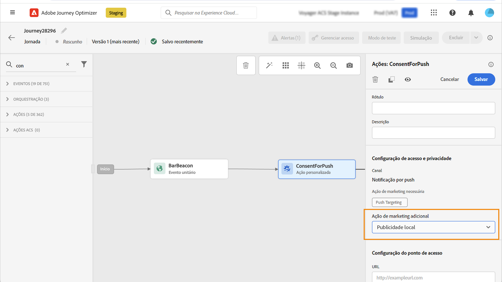

# Trabalhar com políticas de consentimento {#consent-management}

<!--Adobe Experience Platform allows you to easily adopt and enforce marketing policies to respect the consent preferences of your customers. Consent policies are defined in Adobe Experience Platform. Refer to [this documentation](https://experienceleague.adobe.com/docs/experience-platform/data-governance/policies/user-guide.html#consent-policy).

In Journey Optimizer, you can apply these consent policies to your custom actions. For example, you can define consent policies to exclude customers who have not consented to receive email, push or SMS communication.-->

Seus dados podem estar sujeitos a restrições de uso definidas por sua organização ou por regulamentos legais. Portanto, é importante garantir que suas operações de dados no Journey Optimizer estejam em conformidade com as [políticas de uso de dados](https://experienceleague.adobe.com/docs/experience-platform/data-governance/policies/overview.html?lang=pt-BR){target="_blank"}. These policies are Adobe Experience Platform rules defining which [marketing actions](https://experienceleague.adobe.com/docs/experience-platform/data-governance/policies/overview.html?lang=pt-BR#marketing-actions){target="_blank"} que você tem permissão para realizar com base nos dados.

Um tipo de política de uso de dados disponível é a **política de consentimento**. Elas permitem adotar e aplicar facilmente políticas de marketing para respeitar as preferências de consentimento dos clientes. [Saiba mais sobre a aplicação de políticas](https://experienceleague.adobe.com/docs/experience-platform/data-governance/enforcement/auto-enforcement.html?lang=pt-BR){target="_blank"}

>[!IMPORTANT]
>
>Atualmente, as políticas de consentimento estão disponíveis apenas para as organizações que compraram as ofertas complementares do Adobe **Healthcare Shield** ou do **Privacy and Security Shield** .

Por exemplo, é possível [criar políticas de consentimento](https://experienceleague.adobe.com/docs/experience-platform/data-governance/policies/user-guide.html?lang=pt-BR#consent-policy){target="_blank"} na Experience Platform para excluir clientes que não consentiram em receber comunicações por email, push ou SMS.

No Journey Optimizer, o consentimento é definido em vários níveis. Você pode aplicar as políticas de consentimento às ações personalizadas da sua jornada:

* Ao **configurar uma ação personalizada**, é possível definir um canal e uma ação de marketing. [Saiba mais](#consent-custom-action)
* Ao adicionar a **ação personalizada em uma jornada**, é possível definir uma ação de marketing adicional. [Saiba mais](#consent-journey)

## Observações importantes {#important-notes}

No Journey Optimizer, o consentimento pode ser utilizado em ações personalizadas. Se quiser usá-lo com os recursos de mensagem integrados, é necessário usar uma atividade de condição para filtrar os clientes na jornada.

Com o gerenciamento de consentimento, duas atividades de jornada são analisadas:

* Público-alvo de leitura: o público-alvo recuperado é considerado.
* Ação personalizada: o gerenciamento de consentimento leva em conta os atributos usados ([parâmetros de ação](../action/about-custom-action-configuration.md#define-the-message-parameters)) e as ações de marketing definidas (a ação de marketing necessária e a adicional).
* Os atributos que fazem parte de um grupo de campos usando o esquema de união predefinido não são compatíveis. Esses atributos ficarão ocultos na interface. É necessário criar outro grupo de campos usando um schema diferente.
* As políticas de consentimento só se aplicam quando uma ação de marketing (necessária ou adicional) é definida no nível da ação personalizada.

Todas as outras atividades usadas em uma jornada não são consideradas. Se iniciar a jornada com uma Qualificação de público-alvo, o público-alvo não será considerado.

Em uma jornada, se um perfil for excluído por causa de uma política de consentimento em uma ação personalizada, a mensagem não será enviada para ele, mas ele permanecerá na jornada. O perfil não irá para o caminho de erro e de tempo limite ao usar uma condição.

Antes de atualizar as políticas em uma ação personalizada inserida em uma jornada, verifique se a jornada não tem nenhum erro.

<!--
There are two types of latency regarding the use of consent policies:

* **User latency**: the delay from the time a profile changes a consent settings to the moment it is applied in Experience Platform. This can take up to 48h. 
* **Consent policy latency**: the delay from the time a consent policy is created or updated to the moment it is applied. This can take up to 6 hours
-->

## Configuração da ação personalizada {#consent-custom-action}

>[!CONTEXTUALHELP]
>id="ajo_consent_required_marketing_action"
>title="Definir uma ação de marketing necessária"
>abstract="A Ação de marketing necessária permite definir a ação de marketing relacionada à sua ação personalizada. Por exemplo, se você usar essa ação personalizada para enviar emails, será possível selecionar a opção Direcionamento de email. Quando usadas em uma jornada, todas as políticas de consentimento associadas a essa ação de marketing serão recuperadas e aproveitadas. Isso não pode ser modificado na tela."

Ao configurar uma ação personalizada, dois campos podem ser usados para o gerenciamento de consentimento.

O campo **Canal** permite selecionar o canal relacionado a esta ação personalizada: **Email**, **SMS** ou **Notificação por push**. Ele preencherá previamente o campo **Ação de marketing necessária** com a ação de marketing padrão do canal selecionado. Se você selecionar **outros**, nenhuma ação de marketing será definida por padrão.

A **Ação de marketing necessária** permite definir a ação de marketing relacionada à sua ação personalizada. Por exemplo, se você usar essa ação personalizada para enviar emails, será possível selecionar a opção **Direcionamento de email**. Quando usadas em uma jornada, todas as políticas de consentimento associadas a essa ação de marketing serão recuperadas e aproveitadas. Uma ação de marketing padrão estará selecionada, mas você pode clicar na seta para baixo para selecionar qualquer ação de marketing disponível na lista.

Para certos tipos de comunicações importantes (por exemplo, uma mensagem transacional enviada para redefinir a senha de um cliente), talvez você não queira aplicar uma política de consentimento. Então você pode selecionar **Nenhum** no campo **Ação de marketing necessária**.

As outras etapas para configurar uma ação personalizada estão detalhadas [nesta seção](../action/about-custom-action-configuration.md#consent-management).

### Construção da jornada {#consent-journey}

>[!CONTEXTUALHELP]
>id="ajo_consent_required_marketing_action_canvas"
>title="Ação de marketing necessária"
>abstract="Uma ação de marketing necessária é definida ao criar uma ação personalizada. Essa ação de marketing necessária não pode ser removida da ação nem ser modificada."

>[!CONTEXTUALHELP]
>id="ajo_consent_additional_marketing_action_canvas"
>title="Ação de marketing adicional"
>abstract="Adicione outra ação de marketing além da necessária. As políticas de consentimento relacionadas a ambas as ações de marketing serão aplicadas. "

>[!CONTEXTUALHELP]
>id="ajo_consent_refresh_policies_canvas"
>title="Visualize as políticas de consentimento que serão aplicadas no tempo de execução"
>abstract="As ações de marketing trazem políticas de consentimento que combinam os parâmetros de ação e valores de consentimento dos perfis individuais para filtrar os usuários. Obtenha a definição mais recente dessas políticas clicando no botão para atualizar."

Ao adicionar a ação personalizada em uma jornada, há várias opções que permitem gerenciar o consentimento. Clique em **Mostrar campos somente leitura** para exibir todos os parâmetros.

O **Canal** e a **Ação de marketing necessária**, definidos ao configurar a ação personalizada, são exibidos na parte superior da tela. Não é possível modificar esses campos.

Você pode configurar uma **Ação de marketing adicional** para definir o tipo de ação personalizada. Isso permite definir a finalidade da ação personalizada nesta jornada. Além da ação de marketing necessária, que geralmente é específica de um canal, é possível definir uma ação de marketing adicional que será específica para a ação personalizada desta jornada. Por exemplo: um boletim informativo, uma comunicação de treino, fitness etc. A ação de marketing necessária e a ação de marketing adicional serão aplicadas.

Clique no botão **Atualizar políticas** na parte inferior da tela para atualizar e verificar a lista de políticas consideradas para esta ação personalizada. Isso é somente para fins informativos durante a criação de uma jornada. Em jornadas ativas, as políticas de consentimento são recuperadas e atualizadas automaticamente a cada 6 horas.

<!--
The following data is taken into account for consent:

* marketing actions and additional marketing actions defined in the custom action
* action parameters defined in the custom action, see this [section](../action/about-custom-action-configuration.md#define-the-message-parameters) 
* attributes used as criteria in a segment when the journey starts with a Read segment, see this [section](../building-journeys/read-audience.md) 

>[!NOTE]
>
>Please note that there can be a latency when updating the list of policies applied, refer to this [this section](../action/consent.md#important-notes).
-->

As outras etapas para configurar uma ação personalizada em uma jornada são detalhadas [nesta seção](../building-journeys/using-custom-actions.md).
