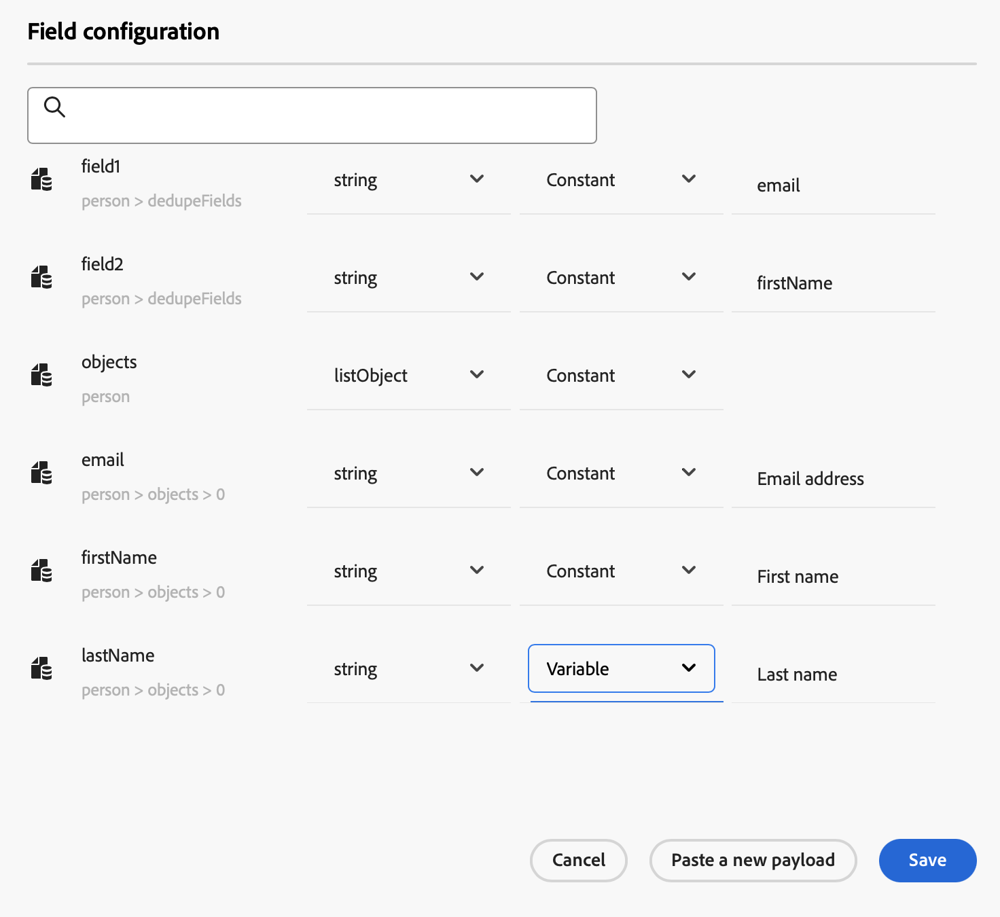
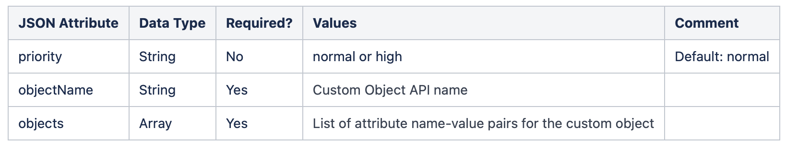

# Integrar com o Marketo Engage {#integrating-with-marketo-engage}

Embarque em uma jornada de integração perfeita de dados com o Marketo Engage. Essa ação personalizada específica no Journey Optimizer é compatível com a assimilação de dois tipos de dados principais:

* Pessoas (perfis): o Marketo transforma perfis em insights acionáveis.
* Objetos personalizados: adapte seus dados com objetos personalizados, como produtos, para obter uma abordagem de marketing personalizada.

## Pré-requisitos {#prerequisites}

* A instância do cliente do Marketo Engage deve ser habilitada para IMS.
* A instância do Marketo Engage e a instância do Adobe Experience Platform/Journey Optimizer devem estar na mesma organização.
* O cliente deve ser provisionado com **MktoSync: acesso ao Serviço de Assimilação**

## Configuração da ação {#configure-marketo-action}

* Navegue até Administração > Configurações > Ações e clique em Gerenciar
* Na lista Ações, clique em Criar ação. Leia mais sobre [Ações personalizadas](../building-journeys/using-custom-actions.md){target="_blank"}.
* Insira Nome, Descrição e selecione Adobe Marketo Engage como Tipo de ação

{width="40%" align="left"}

* Clique em Editar conteúdo para suas cargas de **Solicitação** e **Resposta**.
* Para ambos, escreva seu conteúdo e cole-o no pop-up dedicado.

{width="70%" align="left"}

* Inspect e configurar valores de conteúdo
Observação: para passar valores dinamicamente, para cada campo, altere **Constante** para **Variável**.

{width="70%" align="left"}

* Clique em **Salvar** na janela de configuração do Campo e em **Salvar** para a ação personalizada.

Agora você pode usar sua ação personalizada em sua tela dedicada.


## Sintaxe da carga útil {#payload-syntax}

### Pessoa


### CustomObject




**Exemplo de carga para a pessoa**

```json
{
   "munchkinID": "388-KKG-245",  
   "person": {
    "priority": "normal",
    "partitionName": "XYZ",
    "dedupeFields": {
      "field1": "email",
      "field2": "firstName"
    },
    "objects": [
      {
        "email": "Email address",
        "firstName": "First name",
        "lastName": "Last name"
      }
    ]
  }
}
```

**Exemplo de carga para o objeto personalizado**

```json
{
  "munchkinID": "388-KKG-245", 
  "customObject": {
    "priority": "normal",
    "objectName": "products",
    "objects": [
      {
        "email": "Email Address",
        "productName": "Product Name",
        "productQty": "Product Quantity",
        "priceTotal": "Price Total"
      }
    ]
  }
}
```


## Usar a ação {#engage-using}

* Arraste a ação personalizada para a tela de jornada.
* Na seção **Solicitar parâmetros**, clique em Editar para cada um dos parâmetros com valores dinâmicos que você configurou na carga.

{width="70%" align="left"}
