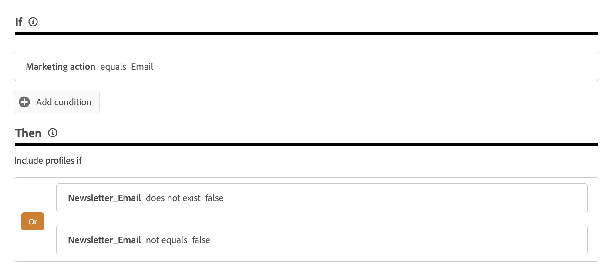

# Gerencie as preferências dos clientes {#preference-center}

>[!AVAILABILITY]
>
>No momento, esse recurso só está disponível para organizações que compraram as ofertas complementares do Adobe **Healthcare Shield** ou **Privacy and Security Shield**.

Em um ecossistema moderno de automação de marketing, as marcas se envolvem com clientes em vários pontos de contato, enfrentando o risco de comunicação irrelevante ou excessiva, resultando em desengajamento, reclamações de spam e riscos de conformidade. É por isso que eles precisam gerenciar as preferências dos clientes para obter insights em tempo real sobre o público-alvo e fornecer comunicação personalizada e respeitosa.

Com o [!DNL Adobe Journey Optimizer], usando as [políticas de consentimento](consent.md), você pode atender às preferências dos clientes<!-- in terms of **channels** and **topics**-->. Isso garante que o [!DNL Journey Optimizer] seja direcionado somente a clientes com base em suas escolhas<!-- their preferred channels and on the subscription topics-->, respeitando o consentimento.

Para gerenciar as preferências dos usuários com o [!DNL Journey Optimizer], você pode:

* Recupere o consentimento dos clientes para aceitar/recusar qualquer canal de saída nativo. Por exemplo, crie uma política de consentimento em [!DNL Experience Platform] para excluir clientes que não consentiram em receber comunicação para um determinado canal. Em seguida, aplique esta política de consentimento em [!DNL Journey Optimizer] usando uma configuração de canal de email. [Saiba como](consent.md#surface-marketing-actions)

  >[!NOTE]
  >
  >Os canais com suporte são Email, Push, SMS e InApp.<!--To check-->

* Pergunte aos clientes quais tópicos eles desejam assinar (como o tipo de comunicações que eles concordam em receber ou não). [Saiba como](#manage-preferences)

>[!IMPORTANT]
>
>O consentimento tem precedência sobre as preferências. Por exemplo, um de seus clientes indicou que seu canal preferido é o email e que eles concordaram em receber informativos<!-- they are interested in yoga-->; no entanto, se eles optaram por não receber nenhuma comunicação de você, eles não poderão ser direcionados por um email informativo que você está enviando<!-- on yoga-->.

## Preferências de registro e honra {#manage-preferences}

Com as políticas de consentimento do [!DNL Journey Optimizer], você pode gerenciar as preferências dos clientes de forma centralizada. Isso permite que você tenha certeza de direcionar somente clientes com base nos tópicos selecionados, respeitando as opções de consentimento deles. Para fazer isso, siga as etapas abaixo.

Digamos que você queira direcionar seus clientes por meio de jornadas e campanhas com base em suas preferências de comunicação em vários tópicos de assinatura (*Boletins informativos*, *Ofertas* e *Lançamentos de novos produtos*).

1. Defina atributos de preferência com o operador booleano no nível de perfil<!--how??-->. Por exemplo, você pode especificar:

   * *Newsletter_Email* - Booleano (verdadeiro/falso)
   * *Offers_Push* - Booleano (Verdadeiro/Falso)
   * *Novas Inicializações de Produto* - Booleano (Verdadeiro/Falso)

   Estes atributos são capturados no esquema de um [conjunto de dados](../data/get-started-datasets.md) habilitado para perfil e mapeado para o [perfil de cliente unificado](../audience/get-started-profiles.md).

   >[!NOTE]
   >
   >O consentimento do cliente e as preferências de contato são tópicos complexos. Para saber como as preferências de consentimento e contexto podem ser coletadas, processadas e filtradas no [!DNL Experience Platform], é recomendável ler os seguintes documentos:
   >
   >* Para saber mais sobre os grupos de campos de esquema necessários para coletar dados de consentimento, consulte [esta página](https://experienceleague.adobe.com/en/docs/experience-platform/landing/governance-privacy-security/consent/adobe/overview){target="_blank"}. Ele detalha como processar os dados de consentimento coletados dos clientes e integrá-los aos perfis de clientes armazenados.
   >* Para saber mais sobre o grupo de campos Consentimento e Preferência, consulte [esta página](https://experienceleague.adobe.com/en/docs/experience-platform/xdm/field-groups/profile/consents#ingest){target="_blank"}.
   >* Para adicionar campos de preferência personalizados ao esquema, siga as etapas em [esta seção](https://experienceleague.adobe.com/en/docs/experience-platform/landing/governance-privacy-security/consent/adobe/dataset#custom-consent){target="_blank"}.

1. Crie uma página para capturar as preferências dos clientes. Use um dos seguintes métodos:

   * Crie uma página da Web para registrar as preferências dos clientes usando o [Adobe Experience Platform Web SDK](https://experienceleague.adobe.com/en/docs/experience-platform/web-sdk/home){target="_blank"}.

   * Use uma [!DNL Journey Optimizer] [página de aterrissagem](../landing-pages/create-lp.md) que inclua formulários para capturar as preferências de seus clientes por meio de dados de perfil.  [Saiba mais sobre formulários](../landing-pages/lp-forms.md) <!--Forms not released/announced yet - TBC-->

     >[!NOTE]
     >
     >Certifique-se de que o domínio da landing page que está sendo usada pertence à marca superior e não a uma submarca. De fato, as preferências coletadas são armazenadas nos dados do perfil, que estão no nível superior da marca.

1. Nessa página, os clientes podem atualizar suas preferências, como assinaturas de tópico, marcando ou desmarcando caixas de seleção.

   Cada ação aciona um evento de consentimento que é salvo com base nos atributos de perfil correspondentes (`true` para aceitação, `false` para recusa) ao assimilar os dados no esquema do conjunto de dados habilitado para perfil<!-- that contains the corresponding preference fields-->.

   <!--Record your users' preferences through the web page or landing page that you created. The data is saved against the corresponding profile, meaning that the preference data is ingested into a Profile-enabled dataset whose schema contains consent/preference fields.-->

   Por exemplo, um usuário <!--whose email address is john.black@lumamail.com--> concordou em receber ofertas por push, mas não deseja receber informativos por email. O perfil correspondente é atualizado da seguinte maneira:

   {width=80%}

<!--The corresponding profile dataset is updated as follows:

|Attribute = Email id | Attribute = Offers_Push | Attribute = Newsletters_Email |
|---------|----------|---------|
| john.black@lumamail.com | Y | N |-->

    >[!NOTE]
    >
    >Os eventos de consentimento de entrada são alimentados no perfil do cliente, garantindo atualizações em tempo real. Cada perfil reflete suas escolhas mais recentes nas preferências de assinatura.

1. Na Adobe Experience Platform, crie uma política personalizada (no menu **[!UICONTROL Privacidade]** > **[!UICONTROL Políticas]**). [Saiba como](https://experienceleague.adobe.com/docs/experience-platform/data-governance/policies/user-guide.html?lang=pt-BR#create-policy){target="_blank"}

   >[!AVAILABILITY]
   >
   >Atualmente, as políticas de consentimento estão disponíveis apenas para organizações que compraram as ofertas complementares do **Healthcare Shield** ou do **Privacy and Security Shield** da Adobe. [Saiba mais sobre políticas de consentimento](consent.md)

   Para usar as políticas de consentimento, os atributos de preferência devem estar presentes nos dados do perfil. É por isso que você deve definir esses atributos no nível do perfil (conforme descrito na etapa 1).

1. Escolha o tipo de **[!UICONTROL Política de consentimento]** e configure uma condição da seguinte maneira. [Saiba como configurar políticas de consentimento](https://experienceleague.adobe.com/docs/experience-platform/data-governance/policies/user-guide.html?lang=pt-BR#consent-policy){target="_blank"}

<!--Consent policies are comprised of two logical components:

* **If**: The condition that will trigger the policy check, based on a certain marketing action (email, SMS, push, custom action, etc.) being performed, the presence of certain data usage labels, or a combination of the two.

* **Then**: The consent attribute must be present for a profile to be included in the action that triggered the policy. More than one field can also be selected.-->

    Por exemplo, para enviar comunicações somente para seus clientes que não optaram por receber boletins informativos por email, crie uma política personalizada e defina a seguinte condição:
    
    * Se **[!UICONTROL Ação de marketing]** for igual a **[!UICONTROL Email]**
    
    *, então **[!UICONTROL Email_Boletim_Informativo]** não existir **[!UICONTROL false]** ou **[!UICONTROL Email_Boletim_Informativo]** não for igual **[!UICONTROL false]**
    
    {width=80%}
    
    >[!TIP]
    >
    >O conjunto de dados habilitado para perfil deve incluir o atributo de perfil **[!UICONTROL Newsletter_Email]** com o valor definido como `true` (como descrito na etapa 1.)

1. Depois de criar a política de consentimento, aproveite-a no [!DNL Journey Optimizer] usando [configurações de canal](consent.md#surface-marketing-actions) ou [ações personalizadas de jornada](consent.md#journey-custom-actions).

1. Agora você pode usar essas configurações de canal ou ações personalizadas em suas jornadas e campanhas para garantir que as preferências dos clientes do <!--targeted--> sejam respeitadas.
