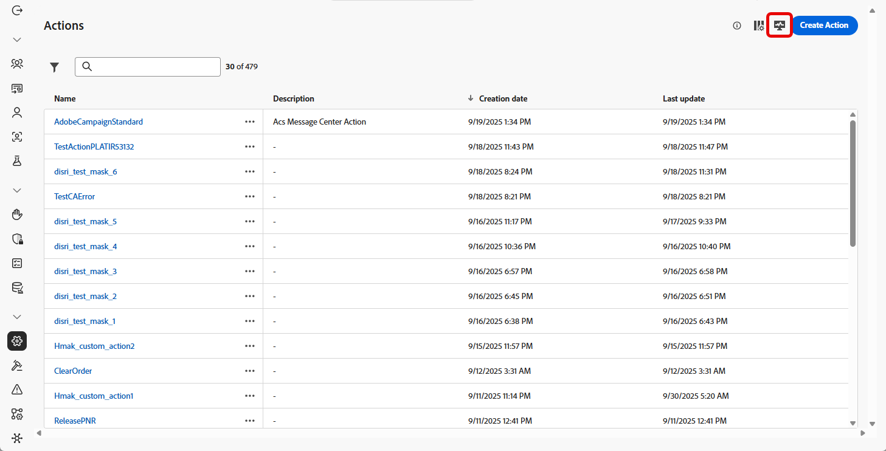

# Monitorar ações personalizadas {#reporting}

>[!CONTEXTUALHELP]
>id="ajo_campaigns_custom_actions_monitor"
>title="Monitorar ações personalizadas"
>abstract="A página de relatórios **[!UICONTROL Ação personalizada]** permite rastrear o desempenho e a confiabilidade das chamadas de API feitas pelo seu jornada para sistemas de terceiros."

A página de relatórios **[!UICONTROL Ação personalizada]** permite monitorar a confiabilidade e o desempenho das chamadas de API feitas de suas jornadas para sistemas de terceiros. Esses relatórios ajudam a identificar rapidamente problemas de integração, gargalos de latência ou limites de limitação/limitação que podem afetar a entrega.

A página Relatórios de ação personalizados funciona como outros Relatórios de tempo integral no Journey Optimizer. Para obter detalhes sobre as funcionalidades do painel, consulte [esta documentação](../reports/report-cja-manage.md).

Para acessar a página de relatórios **[!UICONTROL Ação personalizada]**, clique em  na sua página inicial **[!UICONTROL Ações]**.

➡️ [Saiba mais sobre a configuração de ações personalizadas](../action/about-custom-action-configuration.md)

Além da página de relatórios **[!UICONTROL Ação personalizada]**, você pode usar **[!DNL Adobe Experience Platform Query Service]** para criar consultas para relatar métricas de desempenho de ação personalizada. Exemplos de consulta estão disponíveis em [esta seção](../reports/query-examples.md).

## KPIs {#kpis}

Os KPIs (Indicadores-chave de desempenho) de **[!UICONTROL Ação personalizada]** atuam como um painel centralizado, fornecendo uma exibição consolidada da integridade operacional e da confiabilidade das suas chamadas de ação personalizadas. Essas métricas permitem avaliar o desempenho, identificar gargalos e garantir integrações estáveis com sistemas externos.

+++ Saiba mais sobre KPIs de ação personalizados

* **[!UICONTROL Chamadas com êxito]**: número total de chamadas HTTP que retornaram uma resposta válida sem erro.

* **[!UICONTROL 4xx/5xx errors]**: número de chamadas com falha devido a erros do lado do cliente (4xx) ou do lado do servidor (5xx), destacando problemas de configuração ou falhas de ponto de extremidade.

* **[!UICONTROL Limites de tempo]**: número de chamadas que falharam porque excederam o tempo máximo de resposta. Isso ajuda a exibir problemas de latência ou desempenho com pontos de extremidade externos.

* **[!UICONTROL Chamadas limitadas]**: Número de chamadas bloqueadas devido a limites de limitação, garantindo que os sistemas downstream não sejam sobrecarregados.

* **[!UICONTROL Média de RPS]**: número de solicitações por segundo processadas pela ação personalizada durante o intervalo de tempo selecionado.

* **[!UICONTROL Latência média]**: tempo médio de resposta de ponta a ponta (em milissegundos) para todas as chamadas HTTP, incluindo chamadas bem-sucedidas, erros e tempos limite.

* **[!UICONTROL Latência média de êxito]**: tempo médio de resposta de ponta a ponta (em milissegundos) somente para chamadas bem-sucedidas, excluindo solicitações com falha e tempos limite.

* **[!UICONTROL Tempo médio da fila]**: Tempo médio (em milissegundos) gasto com chamadas aguardando na fila de execução antes de serem enviadas. Isso se aplica somente a endpoints com limitação, nos quais o Journey Optimizer enfileira chamadas quando o limite de taxa de transferência é atingido.

+++

## Chamadas ao longo do tempo {#calls}

O gráfico **[!UICONTROL Chamadas ao longo do tempo]** mostra a tendência do KPI de chamadas HTTP ao longo do período selecionado para o relatório. A granularidade da série temporal depende do intervalo de tempo selecionado. Por exemplo:

* Para um relatório de 7 dias, cada ponto de dados mostrará os KPIs para um dia.
* Se você selecionar um intervalo de tempo de 1 dia, o gráfico mostrará os KPIs por hora.
* Se você selecionar um intervalo de tempo de 1 hora, o gráfico mostrará os KPIs por minuto.

➡️[Consulte a seção KPIs para obter uma descrição das métricas de chamada HTTP](#kpis)

## Latência ao longo do tempo {#latency-overtime}

O gráfico **[!UICONTROL Latência ao longo do tempo]** visualiza a tendência das métricas de latência ao longo do período selecionado. Essa visualização de série temporal permite rastrear padrões de desempenho, identificar períodos de latência de pico e monitorar o impacto de otimizações ou alterações do sistema ao longo do tempo.

➡️[Consulte a seção KPIs para obter uma descrição das métricas de Latência](#kpis)

## Detalhamento de chamadas {#breakdown}

A tabela **[!UICONTROL Detalhamento de chamadas]** fornece um detalhamento hierárquico das métricas de chamadas HTTP, desde as métricas gerais por ponto de extremidade no nível superior até as métricas por Ação personalizada usando cada ponto de extremidade até as jornadas que dependem delas no nível inferior.

➡️[Consulte a seção KPIs para obter uma descrição das métricas de chamada HTTP](#kpis)

## Detalhamento de latência {#latency-breakdown}

A tabela **[!UICONTROL Detalhamento de latência]** fornece um detalhamento das métricas de latência em suas ações personalizadas. Essa visualização ajuda a identificar quais endpoints ou ações específicos estão tendo problemas de desempenho, permitindo que você identifique e resolva gargalos de latência de maneira eficaz.

➡️[Consulte a seção KPIs para obter uma descrição das métricas de Latência](#kpis)

