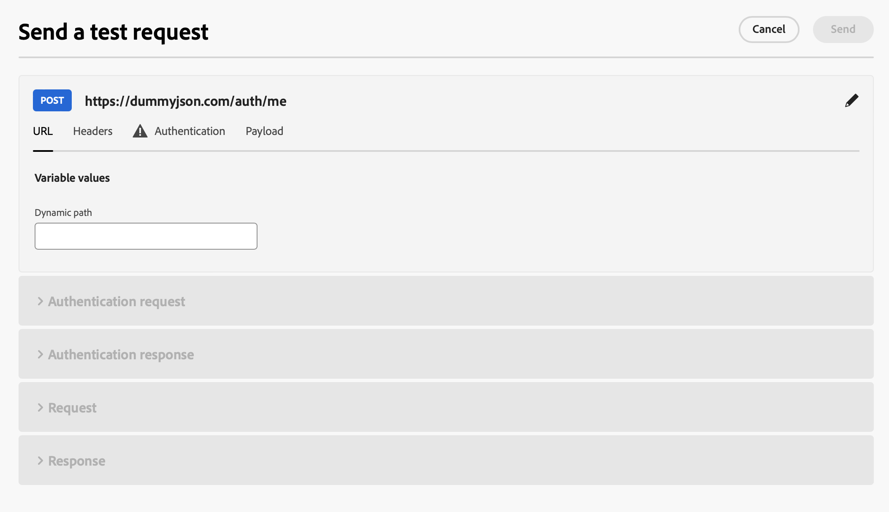
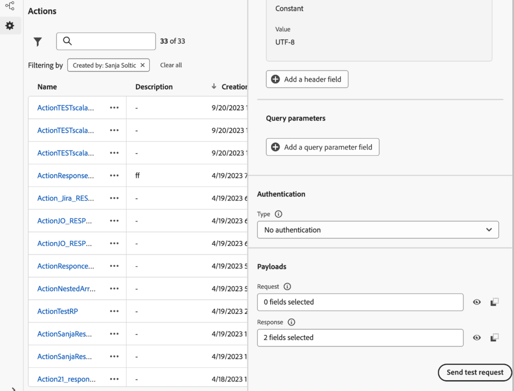

# Solucionar problemas de ações personalizadas {#troubleshoot-a-custom-action}

Você pode testar suas ações personalizadas enviando chamadas de API da seção de administração da interface do usuário do Journey Optimizer. Esse recurso ajuda você a solucionar problemas de ações personalizadas antes ou depois de usá-las em uma jornada.

Como administrador, use o recurso **[!UICONTROL Enviar solicitação de teste]** para validar as configurações de ação personalizadas fazendo chamadas de API reais diretamente do Adobe Journey Optimizer. Esse recurso garante que a estrutura de solicitação, os cabeçalhos, a autenticação e a carga sejam formatados corretamente antes de serem usados em uma jornada.

{width="70%" align="left"}

O uso desse recurso simplifica o processo de teste e validação, garantindo que as ações personalizadas funcionem corretamente nas jornadas ativas.

## Pré-requisitos {#troubleshoot-custom-action-prereq}

Para usar o recurso **[!UICONTROL Enviar solicitação de teste]**, uma **ação personalizada** deve ser pré-configurada com uma URL, cabeçalhos e configurações de autenticação.

Para que os administradores usem esse recurso, são necessárias as seguintes permissões:

* Os usuários devem ter a permissão **[!DNL Manage journeys events, data sources and actions]**.
* Esta permissão está incluída na função *Administradores do Jornada*.
* A permissão **[!DNL View journeys events]** sozinha não é suficiente.

Saiba mais sobre permissões de jornada em [esta seção](../administration/high-low-permissions.md#journey-capability).

## Como usar o recurso Enviar solicitação de teste {#troubleshoot-custom-action-use}

Para testar uma ação personalizada, siga estas etapas:

1. Navegue até a tela de configuração **Ações** e selecione uma ação personalizada.
1. Clique no botão **[!UICONTROL Enviar solicitação de teste]**, na parte inferior da tela de configuração de ação.
   {width="70%" align="left"}
1. Na janela pop-up, permitindo que você especifique parâmetros de solicitação:

   * Se o método de ação personalizada **for GET**, nenhuma carga será necessária.
   * Se o método de ação personalizado **for POST**, você deverá fornecer uma carga JSON.

     >[!NOTE]
     >
     >O Adobe Journey Optimizer levantará um erro se a estrutura desse JSON estiver incorreta, mas não o fará se houver uma incompatibilidade com um tipo de dados. Por exemplo, não haverá erro se um parâmetro inteiro for usado para o que deve ser uma string.

   * Se a autenticação estiver definida, você será solicitado a inserir detalhes de autenticação.

1. Clique em **Enviar** para executar a solicitação.
1. A resposta da API, incluindo cabeçalhos e códigos de status, será exibida na interface.

## Manuseio de autenticação {#troubleshoot-custom-action-auth}

Quando uma ação personalizada inclui autenticação, o Adobe Journey Optimizer exige que o usuário insira detalhes de autenticação para cada solicitação de teste:

* **Autenticação Básica**: o usuário deve fornecer a *senha*.
* **Autenticação da Chave de API:** o usuário deve inserir a chave de API *value*.
* **Autenticação Personalizada**: o usuário deve fornecer os parâmetros de autenticação na solicitação *bodyParam*. Duas seções foram adicionadas neste caso: **Solicitação de autenticação** e **Resposta de autenticação**.

## Principais benefícios {#troubleshoot-custom-action-benefits}

Como administrador do Journey Optimizer, você também pode usar ferramentas externas (por exemplo, Postman) para testar suas ações personalizadas. Os principais benefícios do recurso de solução de problemas no produto em comparação a um teste externo estão listados abaixo:

* A solicitação de teste é executada por **Jornada AJO**, significando:

   * A estrutura de solicitação exata (incluindo cabeçalhos específicos do Adobe Journey Optimizer) é usada.
   * O IP de origem e os cabeçalhos correspondem àqueles usados nas jornadas ativas.

* O recurso **[!UICONTROL Enviar solicitação de teste]** pode ser usado para solucionar problemas de **jornadas em tempo real**, pois a ação personalizada já foi implantada.

* Esse recurso de teste no produto elimina a necessidade de copiar manualmente os detalhes de configuração entre as ferramentas, reduzindo o risco de erros.

## Solução de problemas {#troubleshoot-custom-action-check}

Se a solicitação falhar, você pode verificar:

* As credenciais de autenticação inseridas no teste.
* O método de solicitação (GET vs. POST) e a carga útil correspondente.
* O endpoint da API e os cabeçalhos definidos na ação personalizada.
* Use os dados de resposta para identificar possíveis erros de configuração.
