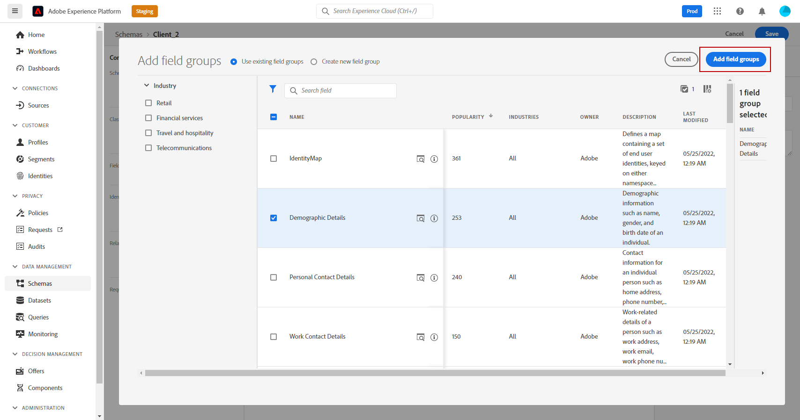

# Controle de acesso baseado em atributos {#attribute-based-access}

>[!IMPORTANT]
>
>O uso do controle de acesso baseado em atributos está atualmente restrito a usuários selecionados e será implantado em todos os ambientes em uma versão futura.

O ABAC (Attribute-based access control) permite definir autorizações para gerenciar o acesso a dados para equipes ou grupos de usuários específicos. Seu objetivo é proteger ativos digitais sensíveis de usuários não autorizados, permitindo uma maior proteção dos dados pessoais.

No Adobe Journey Optimizer, o ABAC permite proteger dados e conceder acesso específico a elementos de campo específicos, incluindo esquemas do Experience Data Model (XDM), atributos do perfil e segmentos.

Para obter uma lista mais detalhada da terminologia usada com o ABAC, consulte [Documentação do Adobe Experience Platform](https://experienceleague.adobe.com/docs/experience-platform/access-control/abac/overview.html).

Neste exemplo, queremos adicionar um rótulo à variável **Nacionalidade** campo de esquema para restringir a utilização de usuários não autorizados. Para que isso funcione, é necessário executar as seguintes etapas:

1. Crie um novo  **[!UICONTROL Função]** e atribua-a com o  **[!UICONTROL Rótulo]** para que os usuários possam acessar e usar o campo schema .

1. Atribua um  **[!UICONTROL Rótulo]** para **Nacionalidade** no Adobe Experience Platform.

1. Use o  **[!UICONTROL Campo Esquema]** no Adobe Journey Optimizer.

Observe que **[!UICONTROL Funções]**, **[!UICONTROL Políticas]** e **[!UICONTROL Produtos]** também pode ser acessada com a API de controle de acesso baseada em atributos. Para obter mais informações, consulte esta [documentação](https://experienceleague.adobe.com/docs/experience-platform/access-control/abac/abac-api/overview.html).

## Criar uma função e atribuir rótulos {#assign-role}

>[!IMPORTANT]
>
>Antes de gerenciar permissões para uma função, primeiro será necessário criar uma política. Para obter mais informações, consulte [Documentação do Adobe Experience Platform](https://experienceleague.adobe.com/docs/experience-platform/access-control/abac/permissions-ui/policies.html).

**[!UICONTROL Funções]** são um conjunto de usuários que compartilham as mesmas permissões, rótulos e sandboxes em sua organização. Cada usuário pertencente a um **[!UICONTROL Função]** tem direito aos aplicativos e serviços do Adobe contidos no produto.
Você também pode criar seu próprio **[!UICONTROL Funções]** se quiser ajustar o acesso dos usuários a determinadas funcionalidades ou objetos na interface.

Agora, queremos conceder aos usuários selecionados acesso ao **Nacionalidade** , rotulada como C2. Para isso, precisamos criar um novo **[!UICONTROL Função]** com um conjunto específico de utilizadores e conceda-lhes o rótulo C2 que lhes permita utilizar o **Nacionalidade** detalhes em uma **[!UICONTROL Jornada]**.

1. No [!DNL Permissions] produto, selecione **[!UICONTROL Função]** no menu do painel esquerdo e clique em **[!UICONTROL Criar função]**. Observe que você também pode adicionar **[!UICONTROL Rótulo]** para funções integradas.

   

1. Adicione um **[!UICONTROL Nome]** e **[!UICONTROL Descrição]** para o novo **[!UICONTROL Função]**, aqui: Função demográfica restrita.

1. No menu suspenso , selecione o **[!UICONTROL Sandbox]**.

   

1. No **[!UICONTROL Recursos]** , clique em **[!UICONTROL Adobe Experience Platform]** para abrir os diferentes recursos. Aqui, selecionamos **[!UICONTROL Jornada]**.

   

1. No menu suspenso , selecione o **[!UICONTROL Permissões]** vinculado ao recurso selecionado, como **[!UICONTROL Exibir jornadas]** ou **[!UICONTROL Publicar jornadas]**.

   

1. Depois de salvar o recém-criado **[!UICONTROL Função]**, clique em **[!UICONTROL Propriedades]** para configurar ainda mais o acesso à sua função.

   

1. No **[!UICONTROL Usuários]** clique em **[!UICONTROL Adicionar usuários]**.

   

1. No **[!UICONTROL Rótulos]** guia , selecione **[!UICONTROL Adicionar rótulo]**.

   

1. Selecione o **[!UICONTROL Rótulos]** você deseja adicionar à sua função e clicar em **[!UICONTROL Salvar]**. Neste exemplo, concedemos o rótulo C2 para que os usuários tenham acesso ao campo do schema restrito anteriormente.

   

Os usuários da **Função demográfica limitada** agora têm acesso aos objetos rotulados do C2.

## Atribuir rótulos a um objeto no Adobe Experience Platform {#assign-label}

>[!WARNING]
>
>O uso incorreto de rótulos pode interromper o acesso a pessoas e acionar violações de política.

**[!UICONTROL Rótulos]** O pode ser usado para atribuir áreas de recursos específicos usando o controle de acesso baseado em atributos.
Neste exemplo, queremos restringir o acesso à variável **Nacionalidade** campo. Esse campo só será acessível para usuários com o **[!UICONTROL Rótulo]** para  **[!UICONTROL Função]**.

Observe que você também pode adicionar  **[!UICONTROL Rótulo]** para  **[!UICONTROL Esquema]**,  **[!UICONTROL Conjuntos de dados]** e  **[!UICONTROL Segmentos]**.

1. Crie seu **[!UICONTROL Esquema]**. Para obter mais informações, consulte [esta documentação](https://experienceleague.adobe.com/docs/experience-platform/xdm/schema/composition.html?lang=pt-BR).

   

1. No **[!UICONTROL Esquema]**, primeiro adicionamos o **[!UICONTROL Detalhes demográficos]** grupo de campos que contém a variável **Nacionalidade** campo.

   

1. No **[!UICONTROL Rótulos]** verifique o nome do campo restrito, aqui **Nacionalidade**. Em seguida, no menu do painel direito, selecione **[!UICONTROL Editar rótulos de governança]**.

   

1. Selecione o **[!UICONTROL Rótulo]**, nesse caso, C2 - Os dados não podem ser exportados para um terceiro. Para obter a lista detalhada de rótulos disponíveis, consulte [esta página](https://experienceleague.adobe.com/docs/experience-platform/data-governance/labels/reference.html#contract-labels).

   

1. Se necessário, personalize ainda mais seu schema e, em seguida, habilite-o. Para obter as etapas detalhadas sobre como habilitar seu schema, consulte [página](https://experienceleague.adobe.com/docs/experience-platform/xdm/ui/resources/schemas.html#profile).

O campo do esquema agora será visível somente e agora só pode ser usado por usuários que fazem parte de um conjunto de funções com o rótulo C2.
Ao aplicar uma **[!UICONTROL Rótulo]** para **[!UICONTROL Nome do campo]**, observe que o **[!UICONTROL Rótulo]** será aplicado automaticamente ao **Nacionalidade** em cada schema criado.

## Acessar objetos rotulados no Adobe Journey Optimizer {#attribute-access-ajo}

Depois de rotular nosso **Nacionalidade** nome do campo em um novo schema e nossa nova função, agora podemos ver o impacto dessa restrição no Adobe Journey Optimizer.
No nosso exemplo, um primeiro usuário X com acesso a objetos rotulados como C2 criará uma Jornada com uma condição direcionada à variável **[!UICONTROL Nome do campo]**. Um segundo usuário Y sem acesso a objetos rotulados como C2 precisará publicar a Jornada.

1. No Adobe Journey Optimizer, primeiro é necessário configurar o **[!UICONTROL Fonte de dados]** com seu novo schema.

   

1. Adicione um novo **[!UICONTROL Grupo de campos]** de seus **[!UICONTROL Esquema]** para o **[!UICONTROL Fonte de dados]**. Você também pode criar um novo **[!UICONTROL fonte de dados]** e associadas **[!UICONTROL Grupos de campos]**.

   

1. Depois de selecionar sua **[!UICONTROL Esquema]**, clique em **[!UICONTROL Editar]** do **[!UICONTROL Campos]** categoria .

   

1. Selecione o **[!UICONTROL Nome do campo]** você deseja direcionar. Aqui, selecionamos a opção restrita **Nacionalidade** campo.

   

1. Em seguida, crie uma Jornada que enviará um email para usuários com uma nacionalidade específica. Adicione um **[!UICONTROL Evento]** depois um **[!UICONTROL Condição]**.

   

1. Selecione o **Nacionalidade** para começar a criar a expressão.

   

1. Edite as **[!UICONTROL Condição]** para direcionar uma população específica com o **Nacionalidade** campo.

   

1. Personalize sua jornada conforme necessário, aqui adicionamos um **[!UICONTROL Email]** ação.

   

Se o Usuário Y sem acesso aos objetos C2 do rótulo precisar acessar essa jornada com esse campo restrito:

* O usuário Y não poderá usar o nome de campo restrito, pois ele não estará visível.

* O usuário Y não poderá editar a Expressão com o nome de campo restrito no modo Avançado. O seguinte erro será exibido `The expression is invalid. Field is no longer available or you don't have enough permission to see it`.

* O usuário Y pode excluir a Expressão.

* O usuário Y não poderá testar a Jornada.

* O usuário Y não poderá publicar a Jornada.
