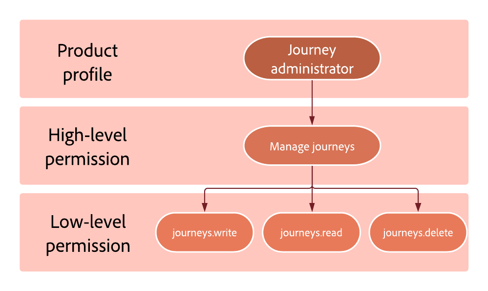

# Níveis de permissão {#high-low-permissions}

Cada perfil de produto é composto de permissões que permitem aos usuários acessar os diferentes recursos.
Eles podem ser divididos em dois tipos:

* **Permissão de alto nível**: representa as diferentes permissões que podem ser atribuídas a **[!UICONTROL Perfil de produto]** no [!DNL Admin console], como **[!DNL Publish journeys]** e **[!DNL Manage subdomains delegation]**. As permissões de alto nível abrangem permissões de baixo nível.

* **Permissão de baixo nível**: representa as diferentes permissões que vêm da permissão de alto nível.

Por exemplo, a variável **[!DNL Journey administrator]** O perfil de produto é atribuído ao **[!DNL Manage journeys]** permissão. Dessa permissão resulta as permissões de baixo nível que permitirão ao administrador do Jornada gravar, ler e excluir jornadas.

## Recurso de jornada {#journey-capability}

### [!DNL Manage journeys] permissão {#manage-journeys}

O **[!DNL Manage journeys]** a permissão de alto nível permite que os usuários criem Jornadas novas e editem/excluam existentes, bem como acesso aos objetos que são usados na tela de jornada para criar o fluxo de jornada.

Ele inclui as seguintes permissões de baixo nível:

* Específico do Journey Optimizer:

   * journeys.read
   * journeys.write
   * journeys.delete
   * messages.read

* Específico do Adobe Experience Platform:

   * segments.read
   * profiles.read
   * datasets.read
   * schemas.read

### [!DNL Publish journeys] permissão {#publish-journeys}

O **[!DNL Publish journeys]** permissão de alto nível permite que os usuários publiquem jornadas.

Ele inclui as seguintes permissões de baixo nível:

* Específico do Journey Optimizer:
   * journeys.publish
   * journeys.read

### [!DNL View journeys] permissão {#view-journeys}

O **[!DNL View journeys]** permissão de alto nível permite que os usuários naveguem e visualizem jornadas.

Ele inclui as seguintes permissões de baixo nível:

* Específico do Journey Optimizer:
   * journeys.read

* Específico do Adobe Experience Platform:
   * segments.read
   * profiles.read

### [!DNL Manage journeys events, data sources and actions] permissão {#manage-journeys-events}

O **[!DNL Manage journeys events, data sources and actions]** a permissão de alto nível permite que os usuários configurem configurações de evento e dados.

Ele inclui as seguintes permissões de baixo nível:

* Específico do Journey Optimizer:
   * jornada_events.read
   * jornada_events.write
   * jornada_events.delete
   * jornada_data_sources.read
   * jornada_data_sources.write
   * jornada_data_sources.delete
   * jornada_actions.read
   * jornada_actions.write
   * jornada_actions.delete

* Específico do Adobe Experience Platform:
   * schemas.read
   * datasets.read
   * identity_namespace.read

### [!DNL View journeys events, data sources and actions] permissão {#view-journeys-event}

O **[!DNL View journeys events, data sources and actions]** a permissão de alto nível permite que os usuários usem eventos e dados no fluxo de jornadas.

Ele inclui as seguintes permissões de baixo nível:

* Específico do Journey Optimizer:
   * jornada_events.read
   * jornada_data_sources.read
   * jornada_actions.read

* Específico do Adobe Experience Platform:
   * schemas.read
   * datasets.read
   * identity_namespace.read

### [!DNL View journeys report] permissão {#view-journeys-report}

O **[!DNL View journeys report]** permissão de alto nível permite que os usuários leiam relatórios de jornada somente leitura.

Ele inclui as seguintes permissões de baixo nível:

* Específico do Journey Optimizer:
   * jornada_report.read
   * messages_report.read

* Específico do Adobe Experience Platform:
   * datasets.read
   * queries.read
   * queries.write
   * queries.delete

## Capacidade de gestão de decisões {#decisions-permissions}

### [!DNL Manage decisions] permissão {#manage-decisioning}

O **[!DNL Manage decisions]** permissão de alto nível permite que os usuários criem novos e editem/excluam **[!DNL Activity entities]**, bem como gerenciar os objetos usados nessas atividades para tomar as decisões.

Ele inclui as seguintes permissões de baixo nível:

* Gestão específica da decisão:
   * activities.read
   * activities.write
   * activities.delete
   * offers.read
   * offers.write
   * offers.delete
   * placements.read
   * placements.write
   * placements.delete
   * ranking_strategy.read

* Específico do Adobe Experience Platform:
   * datasets.read
   * datasets.write
   * datasets.delete
   * schemas.read
   * profile.read
   * segments.read

### [!DNL View decisions] permissão {#view-decisions}

O **[!DNL View decisions]** a permissão de alto nível permite que os usuários usem uma Atividade existente e objetos comerciais relacionados para tomar as decisões.

Ele inclui as seguintes permissões de baixo nível:

* Gestão específica da decisão:
   * activities.read
   * offers.read
   * placements.read
   * ranking_strategy.read

* Específico do Adobe Experience Platform:
   * schemas.read
   * segment.read
   * datasets.read
   * datasets.write
   * datasets.delete

### [!DNL Publish offers decisioning] permissão {#publish-decisions}

O **[!DNL Publish offers decisioning]** a permissão de alto nível permite que os usuários acessem aprovar/cancelar a aprovação de atividades de Oferta .

Ele inclui as seguintes permissões de baixo nível:

* Gestão específica da decisão:
   * offers_activity.read
   * offers.read
   * offers.write
   * offers.delete
   * placements.read
   * placements.write
   * placements.delete
   * ranking_strategy.read

* Específico do Adobe Experience Platform:
   * schemas.read
   * segment.read
   * datasets.read
   * profiles.read

### [!DNL Manage ranking strategies] permissão {#manage-ranking-strategies}

O **[!DNL Manage ranking strategies]** a permissão de alto nível permite que os usuários leiam, criem, editem e excluam estratégias de classificação.

Ele inclui as seguintes permissões de baixo nível:

* Gestão específica da decisão:
   * ranking_strategy.read
   * ranking_strategy.write
   * ranking_strategy.delete
   * activities.read
   * offers.read
   * placements.read

## Capacidade de administração {#administration-permissions}

### [!DNL Manage subdomains delegation] permissão {#manage-subdomain}

O **[!DNL Manage subdomains delegation]** a permissão de alto nível permite que os usuários criem, editem e excluam delegações de subdomínio (incluindo pool de IP).

Ele inclui as seguintes permissões de baixo nível:

* subdomains_delegation.read
* subdomínios_delegation.write
* subdomains_delegation.delete

### [!DNL Manage PTR records] permissão {#manage-ptr}

O **[!DNL Manage PTR records]** a permissão de alto nível permite que os usuários leiam e editem registros PTR que foram configurados com base no subdomínio.

Ele inclui as seguintes permissões de baixo nível:

* PTR_records.read
* PTR_records.write
* subdomains_delegation.read

### [!DNL View PTR records] permissão {#view-ptr}

O **[!DNL View PTR records]** a permissão de alto nível permite que os usuários visualizem registros PTR que foram configurados com base no subdomínio.

Ele inclui as seguintes permissões de baixo nível:

* PTR_records.read
* subdomains_delegation.read

### [!DNL Manage IP pools] permissão {#manage-ip-pools}

O **[!DNL Manage IP pools]** a permissão de alto nível permite que os usuários criem, editem e excluam a definição de afinidade.

Ele inclui as seguintes permissões de baixo nível:

* IP_pools.read
* IP_pools.write
* IP_pools.delete

<!--
### [!DNL Manage messages general settings] permission {#manage-message-settings}

The **[!DNL Manage messages general settings]** high-level permission allows users to create, edit and delete global settings at the sandbox level.

It includes the following low-level permissions: 

* Journey Optimizer specific: 
  * messages_general_settings.read
  * messages_general_settings.write
  * messages_general_settings.delete
* Adobe Experience Platform specific:
  * schemas.read

### [!DNL View messages general settings] permission {#view-message-settings}

The **[!DNL View messages general settings]** high-level permission allows users to view messages general settings such as the execution address.

It includes the following low-level permissions:

* Journey Optimizer specific: 
  * messages_general_settings.read
* Adobe Experience Platform specific: 
  * schemas.read
-->

### [!DNL Manage channel surface] permissão {#manage-channel-surface}

O **[!DNL Manage channel surface]** a permissão de alto nível permite que os usuários criem, editem e excluam superfícies de canais em canais no nível da sandbox.

Ele inclui as seguintes permissões de baixo nível:

* Específico do Journey Optimizer:
   * messages_presets.read
   * messages_presets.write
   * messages_presets.delete
   * subdomains_delegation.read
   * IP_pools.read
   * mobile_setting.read (do Adobe Experience Platform Launch)

### [!DNL View channel surface] permissão {#view-channel-surface}

O **[!DNL View channel surface]** a permissão de alto nível permite que os usuários visualizem superfícies do canal para saber quais superfícies do canal usar.

Ele inclui as seguintes permissões de baixo nível:

* messages_presets.read
* subdomains_delegation.read
* IP_pools.read
* mobile_setting.read (da Coleta de dados do Adobe Experience Platform)

### [!DNL Manage suppression] permissão {#manage-suppression}

O **[!DNL Manage suppression]** a permissão de alto nível permite que os usuários definam o número de rejeições antes de um endereço de email ser adicionado à lista de supressão, bem como adicionar e excluir entradas de/para a lista de supressão.

Ele inclui as seguintes permissões de baixo nível:

* suppression_rules.read
* suppression_rules.write
* suppression_rules.delete
* suppression_list.write
* suppression_list.delete

### [!DNL View suppression list] permissão {#view-suppression-list}

O **[!DNL View suppression list]** a permissão de alto nível permite que os usuários visualizem o conteúdo e as configurações da lista de supressão.

Ele inclui as seguintes permissões de baixo nível:

* Específico do Journey Optimizer:
   * suppression_list.view

* Específico do Adobe Experience Platform:
   * profiles.read
   * datasets.read

### [!DNL Export suppression list] permissão {#export-suppression-list}

O **[!DNL Export suppression list]** a permissão de alto nível permite que os usuários baixem a lista de supressão como um arquivo CSV.

Ele inclui as seguintes permissões de baixo nível:

* Específico do Journey Optimizer:
   * suppression_list.export

* Específico do Adobe Experience Platform:
   * profiles.read
   * datasets.read

### [!DNL Manage landing page settings] permissão {#manage-landing-page-settings}

O **[!DNL Manage landing page settings]** a permissão de alto nível permite que os usuários leiam, criem e editem subdomínios e configurações predefinidas da página de aterrissagem.

Ele inclui as seguintes permissões de baixo nível:

* Específico do Journey Optimizer:
   * landing_page_subdomain.read
   * landing_page_subdomain.write
   * landing_page_subdomain.delete
   * landing_page_preset.read
   * landing_page_preset.write
   * landing_page_preset.delete

### [!DNL Manage frequency rules] permissão {#manage-frequency-rules}

O **[!DNL Manage frequency rules]** a permissão de alto nível permite que os usuários leiam, criem, editem, excluam e ativem/desativem as regras de frequência.

Ele inclui as seguintes permissões de baixo nível:

* Específico do Journey Optimizer:
   * frequency_rules.read
   * frequency_rules.write
   * frequency_rules.delete

### [!DNL View frequency rules] permissão {#view-frequency-rules}

O **[!DNL View frequency rules]** a permissão de alto nível permite que os usuários visualizem as regras de frequência.

Ele inclui as seguintes permissões de baixo nível:

* Específico do Journey Optimizer:
   * frequency_rules.read
