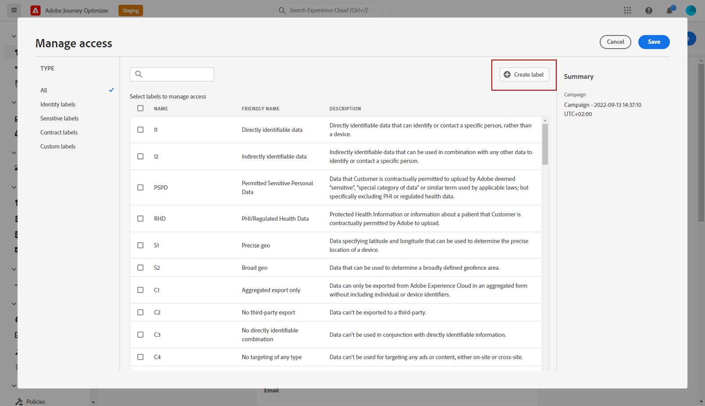

# Controle de acesso no nível do objeto {#object-level-access}

>[!BEGINSHADEBOX]

**Nesta página:** use o controle de acesso em nível de objeto para restringir objetos individuais, como jornadas, campanhas e ofertas com rótulos de acesso, para que você possa manter o conteúdo confidencial e os dados pessoais limitados aos usuários autorizados.

>[!ENDSHADEBOX]

>[!CONTEXTUALHELP]
>id="ajo_olac_manage_access"
>title="Rótulos de gerenciamento de acesso"
>abstract="É possível limitar o acesso a um objeto com base nos rótulos de acesso. Esta abordagem protege ativos digitais sensíveis de usuários não autorizados e garante uma maior proteção dos dados pessoais. **Certifique-se de selecionar apenas os rótulos para os quais tem permissão.**"

É possível limitar o acesso a um objeto com base nos rótulos de acesso. Esta abordagem protege ativos digitais sensíveis de usuários não autorizados e garante uma maior proteção dos dados pessoais.

O recurso OLAC (Object level access control) permite definir autorizações para gerenciar o acesso a dados para uma seleção de objetos:

* Jornada
* Campaign
* Modelo
* Fragmento
* Página de destino
* Oferta
* Coleção de ofertas estática
* Decisão de oferta
* Configuração de canais
* Plano de aquecimento de IP

## Pré-requisitos {#prereq-labels}

Para poder [criar rótulos](#create-labels), você deve pertencer a uma função com a permissão **[!UICONTROL Gerenciar rótulos de uso]**.

Para poder [atribuir rótulos](#assign-labels), você deve pertencer a uma função com uma permissão **Gerenciar**, ou seja, [!DNL Manage journeys], [!DNL Manage Campaigns] ou [!DNL Manage decisions]. Sem essa permissão, o botão **[!UICONTROL Gerenciar acesso]** fica esmaecido.

Saiba mais sobre permissões [nesta seção](../administration/permissions.md).

## Criar rótulos {#create-labels}

**[!UICONTROL Rótulos]** permitem categorizar conjuntos de dados e campos de acordo com as políticas de uso que se aplicam a esses dados. **[!UICONTROL Rótulos]** podem ser aplicados a qualquer momento, proporcionando flexibilidade na maneira como você controla os dados.

Use rótulos para fornecer acesso aos usuários e aplicar a governança de dados e as políticas de consentimento. Esses rótulos de governança podem afetar o consumo downstream.

Você pode criar rótulos no produto [!DNL Permissions]. Para obter mais detalhes, consulte a [documentação do Adobe Experience Platform](https://experienceleague.adobe.com/docs/experience-platform/access-control/abac/permissions-ui/labels.html){target="_blank"}.

Você também pode criar **[!UICONTROL Rótulos]** diretamente no Journey Optimizer. Para criar um rótulo, siga estas etapas:

1. Em um objeto do Adobe Journey Optimizer, como uma **[!UICONTROL Campanha]** recém-criada, clique no botão **[!UICONTROL Gerenciar acesso]**.

   

1. Na janela **[!UICONTROL Gerenciar acesso]**, clique em **[!UICONTROL Criar rótulo]**.

   

1. Configure seu rótulo. Você deve especificar:

   * **[!UICONTROL Nome]**
   * **[!UICONTROL Nome amigável]**
   * **[!UICONTROL Descrição]**

   

1. Clique em **[!UICONTROL Criar]** para salvar seu **[!UICONTROL Rótulo]**.

Seu **[!UICONTROL Rótulo]** recém-criado está disponível na lista. Se necessário, você pode modificá-lo no produto [!DNL Permissions].

## Atribuir rótulos {#assign-labels}

Para atribuir rótulos de uso de dados personalizados ou principais aos objetos do Journey Optimizer:

1. Em um objeto do Adobe Journey Optimizer, como uma **[!UICONTROL Campanha]** recém-criada, clique no botão **[!UICONTROL Gerenciar acesso]**.

   

1. Na janela **[!UICONTROL Gerenciar acesso]**, selecione o(s) rótulo(s) personalizado(s) ou de uso dos dados principais para gerenciar o acesso a este objeto.

   Para obter mais informações sobre rótulos de uso de dados principais, consulte [esta página](https://experienceleague.adobe.com/docs/experience-platform/data-governance/labels/reference.html?lang=pt-BR){target="_blank"}.

   

1. Clique em **[!UICONTROL Salvar]** para aplicar essa restrição de rótulo.

Para acessar este objeto, os usuários devem ter o **[!UICONTROL Rótulo]** específico incluído em suas **[!UICONTROL Funções]**. Por exemplo, um usuário com o rótulo C1 terá acesso somente a objetos com ou sem rótulo C1.

Para obter mais detalhes sobre como atribuir um **[!UICONTROL Rótulo]** a uma **[!UICONTROL Função]**, consulte [esta página](https://experienceleague.adobe.com/docs/experience-platform/access-control/abac/permissions-ui/permissions.html#manage-labels-for-a-role){target="_blank"}.

+++ Referência de conhecimento de IA

Esta seção contém conhecimento estruturado destinado a oferecer suporte à interpretação, recuperação e resposta a perguntas relacionadas a este tópico.

Para uma compreensão completa, essas informações devem ser combinadas com a documentação desta página. Nenhuma das origens deve ser independente; a página descreve o recurso, enquanto esta seção fornece um contexto adicional que ajuda a desfazer a ambiguidade da terminologia, intenção, aplicabilidade e restrições.

* O **TL;DR:** Controle de acesso em nível de objeto (OLAC) permite aplicar rótulos de acesso a objetos específicos do Journey Optimizer — como jornadas, campanhas e ofertas — para que somente os usuários cuja função inclua o rótulo correspondente possam exibir ou interagir com esses objetos.

**Intenções:**

* Crie um rótulo de acesso personalizado diretamente no Journey Optimizer ou por meio do produto Permissões
* Atribuir rótulos de acesso aos objetos do Journey Optimizer (jornadas, campanhas, ofertas etc.)
* Restringir conteúdo confidencial somente a usuários autorizados
* Entenda quais permissões são necessárias para criar e atribuir rótulos

**Glossário:**

* **OLAC (Controle de acesso em nível de objeto)**: um recurso para definir autorizações para gerenciar o acesso a dados de uma seleção de objetos específicos do Journey Optimizer *(específico do produto)*
* **Rótulo**: uma marca aplicada a um objeto para categorizá-lo pela política de uso e restringir o acesso com base na associação de função *(específico do produto)*
* **Gerenciar acesso**: o botão ou a interface disponível nos objetos do Journey Optimizer com suporte para criar e atribuir rótulos de acesso *(específico do produto)*
* **Rótulos de uso de dados principais**: rótulos predefinidos fornecidos pela Adobe Experience Platform em vez de rótulos personalizados criados pela organização *(específico do produto)*

**Medidas de Proteção:**

* A criação de rótulos requer a permissão **Gerenciar rótulos de uso** (pré-requisito)
* A atribuição de rótulos requer uma permissão **Gerenciar** para o tipo de objeto (por exemplo, Gerenciar jornadas, Gerenciar Campanhas ou Gerenciar decisões). Sem ela, o botão **Gerenciar acesso** fica esmaecido (pré-requisito)
* Objetos compatíveis com rótulos OLAC: Jornada, Campanha, Modelo, Fragmento, Página de aterrissagem, Oferta, Coleção de ofertas estáticas, Decisão de oferta, Configuração de canal, Plano de aquecimento de IP

**Terminologia:**

* Nome canônico: Controle de acesso em nível de objeto — Acrônimo: OLAC — variantes: controle de acesso baseado em objeto, gerenciamento de acesso baseado em objeto
* Não confunda: OLAC (restringe o acesso a objetos específicos do AJO, como jornadas e campanhas usando rótulos) ≠ ABAC (baseado em atributos, aplica políticas de rótulo a campos de esquema, conjuntos de dados e públicos-alvo no nível da plataforma)
* Não confunda: &quot;rótulos de uso de dados principais&quot; (rótulos pré-construídos da Adobe Experience Platform) ≠ &quot;rótulos personalizados&quot; (rótulos criados pela organização)

**Perguntas frequentes:**

* **P: Posso criar um rótulo diretamente no Journey Optimizer sem acessar o produto Permissões?** — Sim; use a janela Gerenciar acesso em qualquer objeto compatível e clique em Criar rótulo.
* **P: Quais tipos de objeto oferecem suporte a rótulos OLAC?** — Jornada, Campanha, Modelo, Fragmento, Página de aterrissagem, Oferta, Coleção de ofertas estáticas, Offer decision, Configuração do canal e plano de aquecimento de IP.
* **P: Qual permissão é necessária para atribuir um rótulo a uma jornada?** — A permissão Gerenciar jornada; sem uma permissão Gerenciar, o botão Gerenciar acesso fica esmaecido.
* **P: Se um usuário tiver somente o rótulo C1 em sua função, quais objetos ele pode acessar?** — Apenas objetos com ou sem rótulo C1.

+++
<!-- ai-accordion-version: 1 | source-hash: 4e9b2577 -->
