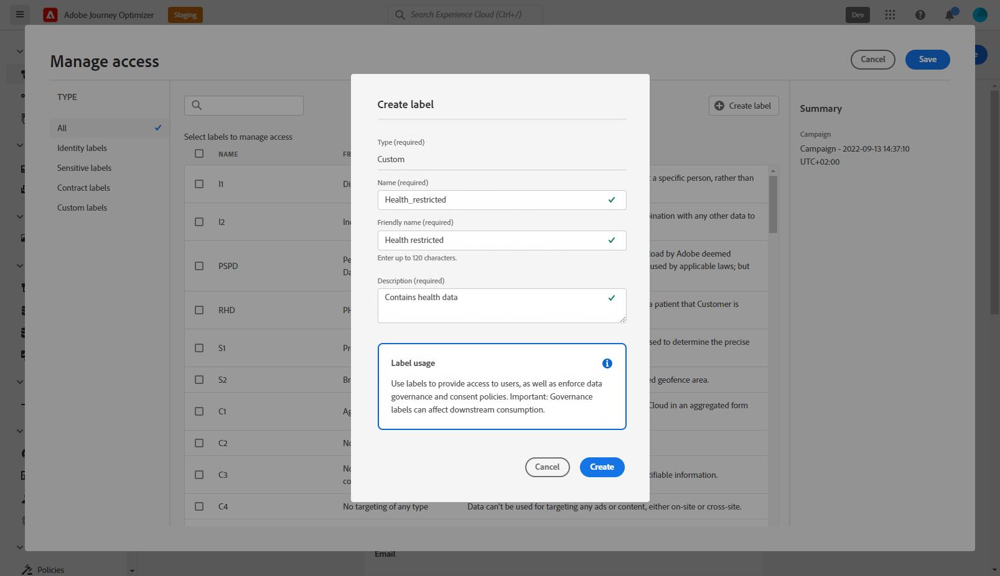

# Controle de acesso no nível do objeto {#object-level-access}

>[!CONTEXTUALHELP]
>id="ajo_olac_manage_access"
>title="Controle de acesso no nível do objeto"
>abstract="Se você aplicar qualquer rótulo ao qual não tenha acesso, seu acesso a esse objeto será revogado."

>[!IMPORTANT]
>
>O uso do controle de acesso do nível de objeto está atualmente restrito a clientes selecionados e será implantado em todos os ambientes em uma versão futura.

O OLAC (Object Level Access Control, controle de acesso a nível de objeto) permite definir autorizações para gerenciar o acesso a dados de uma seleção de objetos:

* Jornada
* Campanha
* Página de aterrissagem
* Ofertas
* Coleção de ofertas
* Offer Decisioning

Seu objetivo é proteger ativos digitais sensíveis de usuários não autorizados, permitindo uma maior proteção dos dados pessoais.

No Adobe Journey Otimizer, o OLAC permite proteger dados e conceder acesso específico a objetos específicos.

## Criar rótulos {#create-assign-labels}

>[!IMPORTANT]
>
>Para criar rótulos, você deve fazer parte de uma função com o **[!UICONTROL Manage usage labels]** permissão.

**[!UICONTROL Labels]** permitem categorizar os conjuntos de dados e campos de acordo com as políticas de uso que se aplicam a esses dados. **[!UICONTROL Labels]** pode ser aplicada a qualquer momento, fornecendo flexibilidade na maneira como você escolhe administrar os dados.

Você pode criar rótulos na variável [!DNL Permissions] produto. Para obter mais informações, consulte [esta página](https://experienceleague.adobe.com/docs/experience-platform/access-control/abac/permissions-ui/labels.html).

**[!UICONTROL Labels]** também pode ser criado diretamente no Journey Otimizer:

1. A partir de um objeto do Adobe Journey Otimizer, aqui um objeto recém-criado **[!UICONTROL Campaign]**, clique no botão **[!UICONTROL Manage access]** botão.

   

1. No **[!UICONTROL Manage access]** , clique em **[!UICONTROL Create label]**.

   

1. Configure seu rótulo, você deve especificar:
   * **[!UICONTROL Name]**
   * **[!UICONTROL Friendly name]**
   * **[!UICONTROL Description]**

   

1. Clique em **[!UICONTROL Create]** para salvar **[!UICONTROL Label]**.

Seu recém-criado **[!UICONTROL Label]** agora está disponível na lista. Se necessário, você pode modificá-lo na função [!DNL Permissions] produto.

## Atribuir rótulos {#assign-labels}

>[!IMPORTANT]
>
>Para atribuir rótulos, você deve fazer parte de uma função com uma permissão Gerenciar , ou seja, [!DNL Manage journeys], [!DNL Manage Campaigns] ou [!DNL Manage decisions]. Sem essa permissão, o **[!UICONTROL Manage access]** será esmaecido.

Para atribuir rótulos de uso de dados personalizados ou principais aos objetos do Journey Otimizer:

1. A partir de um objeto do Adobe Journey Otimizer, aqui um objeto recém-criado **[!UICONTROL Campaign]**, clique no botão **[!UICONTROL Manage access]** botão.

   

1. No **[!UICONTROL Manage access]** selecione os rótulos de uso de dados personalizados ou principais para gerenciar o acesso a esse objeto.

   Para obter mais informações sobre rótulos de uso de dados principais, consulte [esta página](https://experienceleague.adobe.com/docs/experience-platform/data-governance/labels/reference.html).

   

1. Clique em **[!UICONTROL Save]** para aplicar essa restrição de rótulo.

Para ter acesso a esse objeto, os usuários precisarão ter o **[!UICONTROL Label]** , incluindo **[!UICONTROL Roles]**.
Por exemplo, um usuário com o rótulo C1 terá acesso apenas a objetos rotulados ou não como C1.

Para obter mais informações sobre como atribuir **[!UICONTROL Label]** para **[!UICONTROL Role]**, consulte [esta página](https://experienceleague.adobe.com/docs/experience-platform/access-control/abac/permissions-ui/permissions.html?lang=en#manage-labels-for-a-role).
