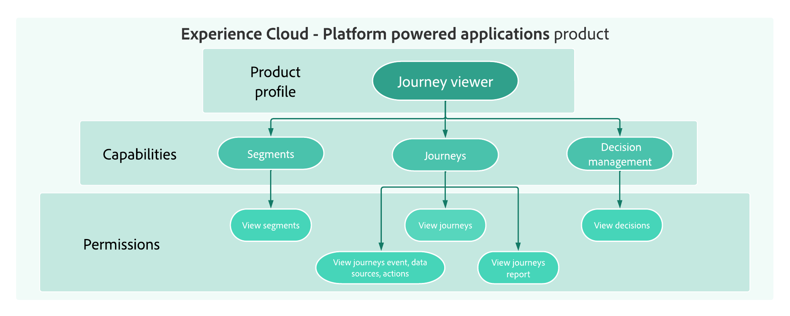

# Introdução ao controle de acesso {#permissions-overview}

>[!BEGINSHADEBOX]

**Nesta página:** familiarize-se com os conceitos principais de controle de acesso do Journey Optimizer, incluindo funções, permissões, sandboxes e controle de acesso baseado em objetos e atributos, para que possa planejar como conceder aos usuários o acesso certo.

>[!ENDSHADEBOX]

[!DNL Journey Optimizer] permite definir e gerenciar as permissões atribuídas a usuários diferentes. As permissões são um conjunto de direitos e restrições que autorizam ou negam acesso aos recursos e funcionalidades do produto.

O controle de acesso de [!DNL Journey Optimizer] é fornecido por meio de **Permissões** em [!DNL Adobe CX Enterprise]. Essa funcionalidade aproveita funções e políticas, que vinculam usuários com permissões e sandboxes.

Para configurar o controle de acesso para o Journey Optimizer, você deve ter privilégios de administrador do sistema ou do produto para sua organização. A função mínima que pode conceder ou retirar permissões é um administrador de produto. Outras funções de administrador que podem gerenciar permissões são administradores do sistema (sem restrições). Consulte o [artigo da Central de ajuda da Adobe](https://helpx.adobe.com/br/enterprise/using/admin-roles.html){target="_blank"} sobre funções administrativas para obter mais informações.

<!--
 A high-level workflow for gaining and assigning access permissions can be summarized as follows:

* After licensing [!DNL Journey Optimizer], an email is sent to the administrator specified during licensing.
* The administrator logs in to Adobe Admin Console and selects [!DNL Journey Optimizer] from the list of products on the overview page.
* To grant access to [!DNL Journey Optimizer], it is recommended that the administrator add users to the default product profile
* In Experience Platform Permissions, the administrator can create new roles or edit the permissions and users for any existing roles.
* When creating or editing a role, the administrator adds users to the role using the users tab, and grants permissions to these users (such as "Read Datasets" or "Manage Schemas") by editing the role's permissions. Similarly, the administrator can assign access to sandboxes using the same editing option.
* When users log in to the Journey Optimizer user interface, their access to capabilities is driven by the permissions that have been granted to them from the previous step. For example, if a user does not have the View Datasets permission, the Datasets tab in the side menu will not be visible to that user.
-->

O gerenciamento de usuários no [!DNL Journey Optimizer] é baseado nestes conceitos-chave:

* **[!UICONTROL Funções]**: as funções se referem a uma coleção de usuários que compartilham as mesmas permissões e sandboxes. Essas funções permitem gerenciar facilmente o acesso e as permissões para diferentes grupos de usuários em sua organização. Uma função do vem com um conjunto de direitos unitários (permissões) que permitem que os usuários acessem determinadas funcionalidades ou objetos na interface.
Com [!DNL Journey Optimizer], você pode escolher entre várias **[!UICONTROL Funções]** preexistentes, cada uma com níveis variados de permissões, para atribuir aos seus usuários. Saiba mais sobre as **Funções internas** disponíveis em [esta página](ootb-product-profiles.md).

* **[!UICONTROL Permissões]**: as permissões são direitos unitários que permitem definir as autorizações atribuídas a **[!UICONTROL Funções]**. Cada permissão é coletada em recursos, por exemplo, Jornada ou Ofertas, que representam as diferentes funcionalidades ou objetos em [!DNL Journey Optimizer]. Saiba mais na seção [Níveis de permissão](high-low-permissions.md).

  

* **[!UICONTROL Sandboxes]**: instâncias de partição de sandboxes virtuais em ambientes virtuais separados e isolados. As sandboxes são atribuídas por meio de funções em Permissões. Saiba mais sobre [como usar sandboxes](sandboxes.md).

* **Controle de acesso baseado em objeto**: rótulos para limitar o acesso a um objeto. Esta abordagem protege ativos digitais sensíveis de usuários não autorizados e garante uma maior proteção dos dados pessoais. Saiba mais sobre o [Gerenciamento de acesso baseado em objetos](object-based-access.md).

* **Controle de acesso baseado em atributos**: autorizações para gerenciar o acesso a dados de equipes ou grupos de usuários específicos. O controle de acesso baseado em atributos permite aos administradores controlar o acesso a objetos e/ou recursos específicos com base em atributos. Os atributos podem ser metadados adicionados a um objeto, como um rótulo adicionado a um campo ou segmento de esquema. Um administrador define políticas de acesso que incluem atributos para gerenciar permissões de acesso do usuário. Saiba mais sobre o [Gerenciamento de acesso baseado em atributos](attribute-based-access.md).

## Vamos nos aprofundar um pouco mais

Agora que você entende os conceitos de controle de acesso no **[!DNL Journey Optimizer]**, é hora de se aprofundar nessas seções de documentação para começar a configurar permissões.

<table style="table-layout:fixed"><tr style="border: 0;">
<td>

<a href="permissions.md"><strong>Conceder acesso</strong></a>

</td>
<td>

<a href="ootb-permissions.md"><strong>Permissões internas</strong></a>

</td>
<td>

<a href="sandboxes.md"><strong>Gerenciar sandboxes</strong></a>

</td>
<td>

<a href="attribute-based-access.md"><strong>Controle de acesso baseado em atributos</strong></a>

</td>
</tr></table>

+++ Referência de conhecimento de IA

Esta seção contém conhecimento estruturado destinado a oferecer suporte à interpretação, recuperação e resposta a perguntas relacionadas a este tópico.

Para uma compreensão completa, essas informações devem ser combinadas com a documentação desta página. Nenhuma das origens deve ser independente; a página descreve o recurso, enquanto esta seção fornece um contexto adicional que ajuda a desfazer a ambiguidade da terminologia, intenção, aplicabilidade e restrições.

* **TL;DR:** O controle de acesso no Journey Optimizer é construído em funções, permissões e sandboxes gerenciadas por meio das Permissões empresariais do Adobe CX, com camadas adicionais de OLAC (controle de acesso baseado em objeto) e ABAC (controle de acesso baseado em atributo) para proteção de dados refinada.

**Intenções:**

* Entenda os cinco conceitos principais de controle de acesso: funções, permissões, sandboxes, controle de acesso baseado em objeto e controle de acesso baseado em atributo
* Saber quem pode configurar o controle de acesso (administrador do sistema ou do produto)
* Navegue até a seção de documentação correta para cada tópico de controle de acesso
* Planejar uma estratégia de controle de acesso para a organização

**Glossário:**

* **Funções**: coleções de usuários que compartilham as mesmas permissões e sandboxes; funções internas pré-existentes estão disponíveis e funções personalizadas podem ser criadas *(específico do produto)*
* **Permissões**: direitos unitários que definem as autorizações atribuídas a Funções, agrupadas em recursos como Jornada ou Ofertas *(específico do produto)*
* **Sandboxes**: ambientes virtuais que particionam a instância do Journey Optimizer em espaços de trabalho virtuais separados e isolados; atribuídos por meio de funções em Permissões *(específico do produto)*
* **Controle de acesso baseado em objetos**: rótulos aplicados a objetos específicos do Journey Optimizer (jornadas, campanhas, ofertas) para restringir o acesso a usuários autorizados *(específico do produto)*
* **Controle de acesso baseado em atributos**: políticas que controlam o acesso a objetos ou recursos com base em atributos como rótulos adicionados a campos de esquema ou segmentos *(específico do produto)*

**Medidas de Proteção:**

* A configuração do controle de acesso requer privilégios de administrador do sistema ou do produto (pré-requisito)
* A função mínima que pode conceder ou retirar permissões é um administrador de produto (conforme declarado na página)

**Terminologia:**

* Nome canônico: Controle de acesso baseado em atributo — Acrônimo: ABAC — variantes: gerenciamento de acesso baseado em atributo
* Nome canônico: Controle de acesso baseado em objeto — Acrônimo: OLAC — variantes: controle de acesso em nível de objeto, gerenciamento de acesso baseado em objeto
* Não confunda: &quot;Controle de acesso baseado em objetos&quot; (restringe o acesso a objetos específicos do AJO, como jornadas, campanhas e ofertas usando rótulos) ≠ &quot;Controle de acesso baseado em atributos&quot; (restringe o acesso a atributos de dados, como campos de esquema e segmentos com base em políticas de rótulo)
* Não confunda: &quot;Funções&quot; (uma coleção de usuários com permissões compartilhadas e sandboxes) ≠ &quot;Permissões&quot; (os direitos unitários agrupados em recursos que são atribuídos a funções)

**Perguntas frequentes:**

* **P: Quem pode configurar o controle de acesso no Journey Optimizer?** — Usuários com privilégios de administrador do sistema ou de administrador do produto.
* **P: Qual é o nível mínimo de administrador necessário para conceder ou retirar permissões?** — Administrador do produto.
* **P: As sandboxes são gerenciadas independentemente das funções?** — Não; as sandboxes são atribuídas por meio de funções no produto de Permissões.
* **P: Onde o controle de acesso para o Journey Optimizer é gerenciado?** — por meio de Permissões no Adobe CX Enterprise, que vincula os usuários com permissões e sandboxes por meio de funções e políticas.

+++
<!-- ai-accordion-version: 1 | source-hash: 14be1dc6 -->