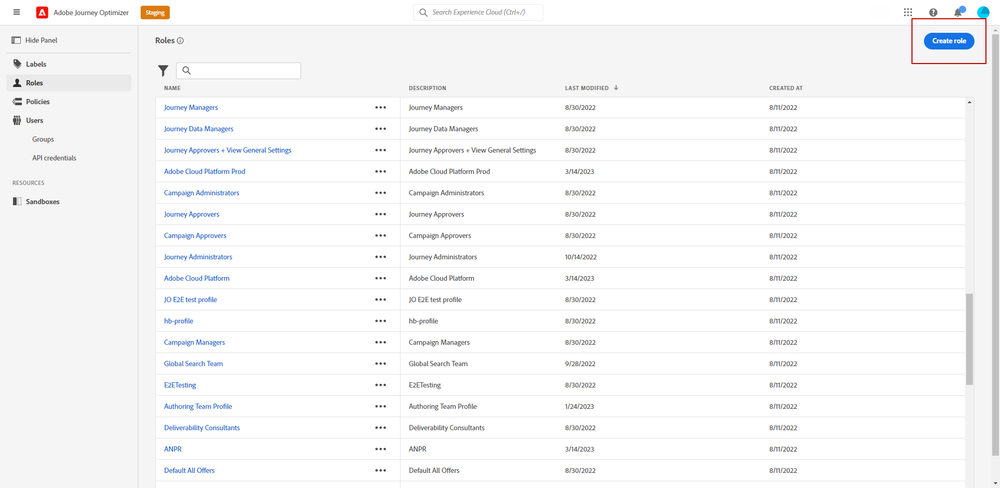

# Gerenciar usuários e perfis de produtos {#manage-permissions}

>[!IMPORTANT]
>
> Cada um dos procedimentos detalhados abaixo só pode ser realizado por uma **[!UICONTROL Product]** ou **[!UICONTROL System]** administrador. Para obter mais informações sobre isso, consulte o [Documentação do Admin Console](https://helpx.adobe.com/enterprise/admin-guide.html/enterprise/using/admin-roles.ug.html).

**[!UICONTROL Product profiles]** são conjuntos de usuários que compartilham as mesmas permissões e sandboxes em sua organização.

O [!DNL Journey Optimizer] permite selecionar entre diferentes **[!UICONTROL Product profiles]** com diferentes níveis de permissões para atribuir aos usuários. Para obter mais informações sobre **[!UICONTROL Product profiles]** consulte esta seção [página](ootb-product-profiles.md).

Cada usuário pertencente a um **[!UICONTROL Product profiles]** tem direito aos aplicativos e serviços do Adobe contidos no produto.

Você também pode criar seu próprio **[!UICONTROL Product profiles]** se quiser ajustar o acesso dos usuários a determinadas funcionalidades ou objetos na interface.

## Atribuição de um perfil de produto {#assigning-product-profile}

Você pode optar por atribuir uma função predefinida ou personalizada **[!UICONTROL Product profile]** aos seus usuários.

A lista de cada perfil de produto pronto para uso com permissões atribuídas pode ser encontrada no [Perfis de produto incorporados](ootb-product-profiles.md) seção.

Para atribuir uma **[!UICONTROL Product profile]**:

1. No [!DNL Admin Console]do **[!UICONTROL Products]** selecione a guia **[!UICONTROL Experience Cloud - Platform powered applications]** produto.

1. Selecione um **[!UICONTROL Product profile]**.

   

1. Na guia **[!UICONTROL Users]**, clique em **[!UICONTROL Add user]**.

   

1. Digite o nome do usuário ou endereço de email e selecione o usuário.

   Se o usuário não tiver sido criado anteriormente no [!DNL Admin Console], consulte o [Adicionar documentação de usuários](https://helpx.adobe.com/enterprise/admin-guide.html/enterprise/using/manage-users-individually.ug.html#add-users).

   

1. Siga as mesmas etapas descritas acima para adicionar outros usuários ao seu **[!UICONTROL Product profile]**. Em seguida, clique em **[!UICONTROL Save]**.

O usuário deve receber um email de redirecionamento para sua instância.

Para obter mais informações sobre o gerenciamento de usuários, consulte [Documentação do Admin Console](https://helpx.adobe.com/enterprise/admin-guide.html/enterprise/using/manage-users-individually.ug.html).

Ao acessar a instância, o usuário verá uma exibição específica dependendo das permissões atribuídas no **[!UICONTROL Product profile]**. Se o usuário não tiver o acesso correto a um recurso, a seguinte mensagem será exibida:

`You don't have permission to access this feature. Permission needed: XX.`

## Edição de um perfil de produto existente {#edit-product-profile}

Para pronta utilização ou personalizada **[!UICONTROL Product profiles]**, você pode decidir a qualquer momento adicionar ou excluir permissões.

Neste exemplo, queremos adicionar **[!UICONTROL Permissions]** relacionadas com a **[!UICONTROL Journeys]** recurso para usuários atribuídos ao visualizador do Jornada **[!UICONTROL Product profile]**. Os usuários poderão publicar jornadas.

Observe que se você modificar uma configuração predefinida ou personalizada **[!UICONTROL Product profile]**, afetará todos os usuários atribuídos a isso **[!UICONTROL Product profile]**.

1. No [!DNL Admin Console]do **[!UICONTROL Products]** selecione a guia **[!UICONTROL Experience Cloud - Platform powered applications]** produto.

1. Selecionar o visualizador de Jornadas **[!UICONTROL Product profile]**.

1. Selecione a guia **[!UICONTROL Permissions]**.

   O **[!UICONTROL Permissions]** exibe a lista de recursos que se aplicam à guia **[!UICONTROL Experience Cloud - Platform powered applications]** produto.

   

1. Selecione o **[!UICONTROL Journeys]** capacidade.

   

1. No **[!UICONTROL Available Permission Items]** selecione as permissões que serão atribuídas à sua **[!UICONTROL Product profile]** clicando no ícone de adição (+).

   Aqui, adicionamos a variável **[!UICONTROL Publish Journeys]** permissão.

1. Se necessário, no **[!UICONTROL Included Permission Items]**, clique no ícone X ao lado de remover permissões do perfil do produto.

1. Quando terminar, clique em **[!UICONTROL Save]**.

Se necessário, também é possível criar um novo perfil de produto com permissões específicas. Para obter mais informações, consulte [Criação de um perfil de produto](#create-product-profile).

## Criação de um perfil de produto {#create-product-profile}

[!DNL Journey Optimizer] permite criar seu próprio **[!UICONTROL Product profiles]** e atribua um conjunto de permissões e sandboxes aos usuários. Com **[!UICONTROL Product profiles]**, é possível autorizar ou negar acesso a determinadas funcionalidades ou objetos na interface.

Para obter mais informações sobre como criar e gerenciar sandboxes, consulte [Documentação do Adobe Experience Platform](https://experienceleague.adobe.com/docs/experience-platform/sandbox/ui/user-guide.html?lang=pt-BR){target=&quot;_blank&quot;}.

Neste exemplo, criaremos um perfil de produto chamado **Somente leitura do Jornada** , onde concederemos direitos somente leitura ao recurso Jornada. Os usuários só poderão acessar e visualizar jornadas e não poderão acessar outros recursos, como **[!DNL  Decision management]** em [!DNL Journey Optimizer].

Para criar **Somente leitura do Jornada** **[!UICONTROL product profiles]**:

1. Acesse o [!DNL Admin Console].

1. No **[!UICONTROL Products]** selecione a guia **[!UICONTROL Experience Cloud - Platform powered applications]** produto.

1. Clique em **[!UICONTROL New Profile]**.

   

1. Adicione um **[!UICONTROL Product Profile Name]**, **[!UICONTROL Display Name]** e **[!UICONTROL Description]** para o novo **[!UICONTROL product profiles]**.

   

1. Na categoria **[!UICONTROL Notifications]**, escolha se os usuários serão notificados por email quando forem adicionados ou removidos do perfil de produto.

1. Quando terminar, clique em **[!UICONTROL Save]** e selecione seu **[!UICONTROL product profiles]**.

1. Para adicionar permissões para que usuários acessem diferentes recursos, selecione o **[!UICONTROL Permissions]** guia .

1. Selecione entre os diferentes recursos, como **[!DNL Journeys]**, **[!DNL Segments]** ou **[!DNL Decision management]** disponível em [!DNL Journey Optimizer] listado no menu à esquerda.

   Aqui selecionamos a variável **[!UICONTROL Journeys]** capacidade.

   

1. No **[!UICONTROL Available Permission Items]** selecione as permissões que serão atribuídas à sua **[!UICONTROL Product profile]** clicando no ícone de adição (+).

   Aqui selecionamos **[!DNL View journeys]** e **[!DNL View journeys event, data sources, actions]**.

   

1. Selecione o **[!UICONTROL Sandbox access]** capacidade de escolher quais sandbox serão atribuídas à sua **[!UICONTROL Product profile]**.

   

1. Em **[!UICONTROL Available Permissions Items]**, clique no ícone de adição (+) para atribuir sandboxes ao perfil. [Saiba mais sobre sandboxes](sandboxes.md).

1. Quando terminar, clique em **[!UICONTROL Save]**.

Seu **[!UICONTROL Product profile]** agora é criada e configurada. Agora é necessário atribuí-lo aos usuários.

Para obter mais informações sobre a criação e o gerenciamento de perfis de produtos, consulte [Documentação do Admin Console](https://helpx.adobe.com/enterprise/admin-guide.html/enterprise/using/manage-product-profiles.ug.html).
