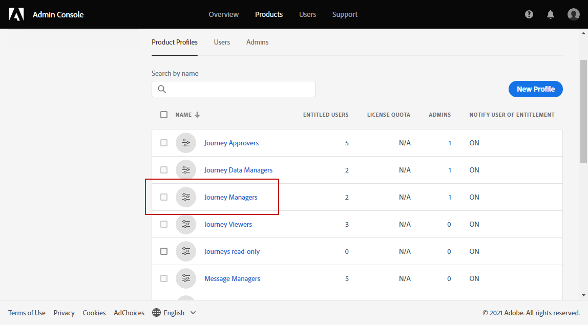

# Gerenciamento de sandboxes {#sandboxes}

## Usar sandboxes {#using-sandbox}

O [!DNL Journey Optimizer] permite particionar sua instância em ambientes virtuais separados chamados de sandboxes.
As sandboxes são atribuídas por meio de perfis de produto no Admin Console. [Saiba como atribuir sandboxes](permissions.md#create-product-profile).

O [!DNL Journey Optimizer] reflete as sandboxes da Adobe Experience Platform que foram criadas para uma determinada organização. As sandboxes da Adobe Experience Platform podem ser criadas ou redefinidas pela instância da Adobe Experience Platform. [Saiba mais no guia de usuário de sandbox](https://experienceleague.adobe.com/docs/experience-platform/sandbox/ui/user-guide.html?lang=pt-BR){target=&quot;_blank&quot;}.

Você pode encontrar o controle do alternador de sandbox na parte superior direita da tela, ao lado do nome da organização. Para alternar a sandbox, clique na sandbox atualmente ativa no alternador e selecione outra sandbox na lista suspensa.

➡️ [Descubra este recurso no vídeo](#video)

## Atribuir sandboxes {#assign-sandboxes}

>[!IMPORTANT]
>
> O gerenciamento de sandboxes só pode ser realizado por um **[!UICONTROL Product]** ou **[!UICONTROL System]** administrador. Para obter mais informações sobre isso, consulte o [Documentação do Admin Console](https://helpx.adobe.com/enterprise/admin-guide.html/enterprise/using/admin-roles.ug.html){target=&quot;_blank&quot;}.

Você pode optar por atribuir sandboxes diferentes para predefinidas ou personalizadas **[!UICONTROL Product profiles]**.

Para atribuir sandboxes:

1. No [!DNL Admin Console]do **[!UICONTROL Products]** selecione a guia **[!UICONTROL Adobe Experience Platform Apps]** produto.

1. Selecione um **[!UICONTROL Product profile]**.

   

1. Selecione a guia **[!UICONTROL Permissions]**.

1. Selecione o **[!UICONTROL Sandboxes]** capacidade.

   

1. Em **[!UICONTROL Available Permissions Items]**, clique no ícone de adição (+) para atribuir sandboxes ao perfil. [Saiba mais sobre sandboxes](https://experienceleague.adobe.com/docs/experience-platform/sandbox/home.html?lang=pt-BR){target=&quot;_blank&quot;}.

   

1. Se necessário, em **[!UICONTROL Included Permission Items]**, clique no ícone X ao lado de remover sandboxes acesso ao **[!UICONTROL Product profile]**.

   

1. Clique em **[!UICONTROL Save]**.

## Acesso ao conteúdo {#content-access}

Para configurar a acessibilidade do conteúdo, é necessário atribuir uma pasta compartilhada de conteúdo a cada uma das sandboxes. Você pode criar e configurar a pasta compartilhada na guia **[!UICONTROL Storage]** exibida no [!DNL Admin Console] para administradores. Se você tiver acesso ao [!DNL Admin Console] como administrador do sistema, poderá criar pastas compartilhadas e adicionar delegados com nível de acesso diferente às suas pastas compartilhadas.

Observe que para que o conteúdo seja sincronizado com a sandbox correta, é necessário seguir a mesma sintaxe da sandbox. Por exemplo, se a sandbox for chamada de desenvolvimento, a pasta compartilhada deverá ter o mesmo nome.

[Saiba como gerenciar pastas compartilhadas](https://helpx.adobe.com/enterprise/admin-guide.html/enterprise/using/manage-adobe-storage.ug.html){target=&quot;_blank&quot;}.

## Vídeo tutorial{#video}

Entenda o que são sandboxes e como distinguir sandboxes de desenvolvimento e produção. Saiba como criar, redefinir e excluir sandboxes.

>[!VIDEO](https://video.tv.adobe.com/v/334355?quality=12)
