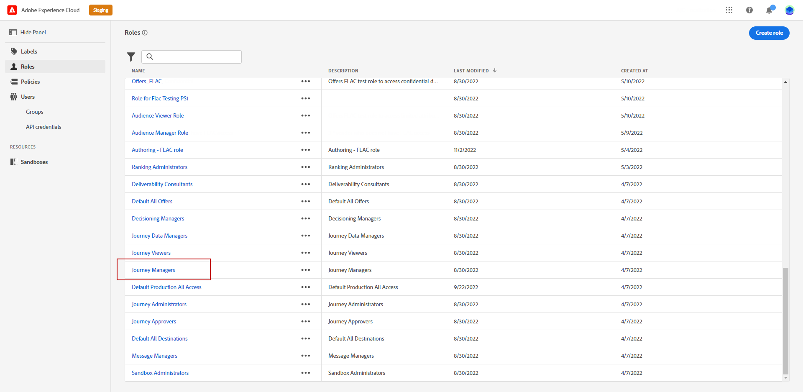

# Usar e atribuir sandboxes {#sandboxes}

**Sandboxes** são ambientes virtuais que particionam sua instância do Adobe Journey Optimizer em espaços de trabalho separados e isolados, para desenvolvimento, teste ou produção. Você encontrará o gerenciamento de sandbox em **Administração** > **Canais** > **Conecte seus sistemas e ambientes** (ou pelo alternador de sandbox na parte superior direita da interface). As sandboxes ajudam você a experimentar com segurança, atribuir diferentes acessos por função e manter o conteúdo organizado. Esta página aborda como usar e atribuir sandboxes, configurar o acesso ao conteúdo e, no artigo [Exportar objetos para outra sandbox](../configuration/copy-objects-to-sandbox.md), como copiar jornadas e modelos entre sandboxes.

## Usar sandboxes {#using-sandbox}

O [!DNL Journey Optimizer] permite particionar sua instância em ambientes virtuais separados chamados de sandboxes. As sandboxes são atribuídas por meio de funções em Permissões. [Saiba como atribuir sandboxes](permissions.md#create-product-profile).

[!DNL Journey Optimizer] reflete as sandboxes da Adobe Experience Platform criadas para uma determinada organização. As sandboxes da Adobe Experience Platform podem ser criadas ou redefinidas pela instância da Adobe Experience Platform. [Saiba mais no guia do usuário de sandbox](https://experienceleague.adobe.com/docs/experience-platform/sandbox/ui/user-guide.html?lang=pt-BR){target="_blank"}.

Você pode encontrar o controle do alternador de sandbox na parte superior direita da tela, ao lado do nome da sua organização. Para alternar a sandbox, clique na sandbox atualmente ativa no alternador e selecione outra sandbox na lista suspensa.

➡️ [Saiba mais sobre sandboxes neste vídeo](#video)

## Atribuir sandboxes {#assign-sandboxes}

>[!IMPORTANT]
>
> O gerenciamento de sandbox só pode ser executado por um administrador de **[!UICONTROL Produto]** ou **[!UICONTROL Sistema]**.

Você pode optar por atribuir diferentes sandboxes para **[!UICONTROL Funções]** predefinidas ou personalizadas.

Para atribuir sandboxes:

1. Em [!DNL Permissions], na guia **[!UICONTROL Funções]**, selecione uma **[!UICONTROL Função]**.

   

1. Clique em **[!UICONTROL Edit]**.

1. No menu suspenso de recursos **[!UICONTROL Sandboxes]**, selecione a sandbox que será atribuída à sua função.

   

1. Se necessário, clique no ícone X ao lado dele para remover o acesso à sandbox da sua **[!UICONTROL Função]**.

   

1. Clique em **[!UICONTROL Salvar]**.

## Acesso ao conteúdo {#content-access}

Para configurar a acessibilidade do conteúdo, atribua uma pasta compartilhada de conteúdo a cada uma das sandboxes. Você pode criar e configurar pastas compartilhadas na guia **[!UICONTROL Armazenamento]** exibida no [!DNL Admin Console] para administradores. Se você tiver acesso ao [!DNL Admin Console] como administrador do sistema, poderá criar pastas compartilhadas e adicionar delegados com diferentes níveis de acesso às suas pastas compartilhadas.

Observe que para que o conteúdo seja sincronizado com a sandbox correta, você deve seguir a mesma sintaxe da sandbox. Por exemplo, se sua sandbox for chamada de &quot;desenvolvimento&quot;, sua pasta compartilhada deverá ter o mesmo nome.

[Saiba como gerenciar pastas compartilhadas](https://helpx.adobe.com/br/enterprise/admin-guide.html/enterprise/using/manage-adobe-storage.ug.html){target="_blank"}.

## Vídeo tutorial{#video}

Entenda o que são sandboxes e como distinguir sandboxes de desenvolvimento e produção. Saiba como criar, redefinir e excluir sandboxes.

>[!VIDEO](https://video.tv.adobe.com/v/334355?quality=12)