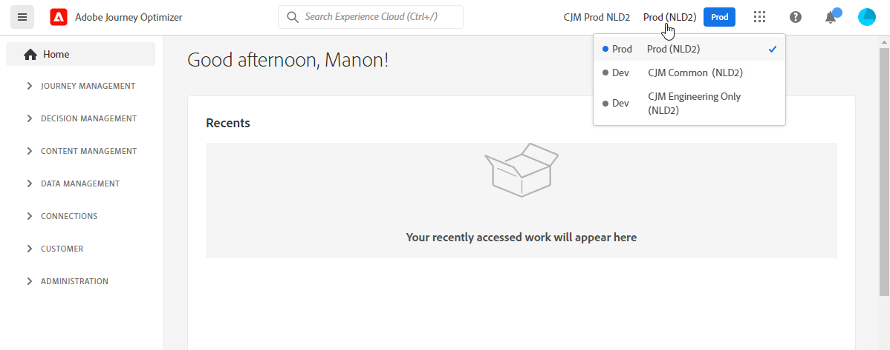

# Usar e atribuir sandboxes {#sandboxes}

>[!BEGINSHADEBOX]

**Nesta página:** use e atribua sandboxes para particionar sua instância do Adobe Journey Optimizer em ambientes isolados, para que você possa desenvolver, testar e executar na produção sem afetar outros trabalhos.

>[!ENDSHADEBOX]

**Sandboxes** são ambientes virtuais que particionam sua instância do Adobe Journey Optimizer em espaços de trabalho separados e isolados, para desenvolvimento, teste ou produção. Você encontrará o gerenciamento de sandbox em **Administração** > **Canais** > **Conecte seus sistemas e ambientes** (ou pelo alternador de sandbox na parte superior direita da interface). As sandboxes ajudam você a experimentar com segurança, atribuir diferentes acessos por função e manter o conteúdo organizado. Esta página aborda como usar e atribuir sandboxes, configurar o acesso ao conteúdo e, no artigo [Exportar objetos para outra sandbox](../configuration/copy-objects-to-sandbox.md), como copiar jornadas e modelos entre sandboxes.

## Usar sandboxes {#using-sandbox}

O [!DNL Journey Optimizer] permite particionar sua instância em ambientes virtuais separados chamados de sandboxes. As sandboxes são atribuídas por meio de funções em Permissões. [Saiba como atribuir sandboxes](permissions.md#create-product-profile).

[!DNL Journey Optimizer] reflete as sandboxes da Adobe Experience Platform criadas para uma determinada organização. As sandboxes da Adobe Experience Platform podem ser criadas ou redefinidas pela instância da Adobe Experience Platform. [Saiba mais no guia do usuário de sandbox](https://experienceleague.adobe.com/docs/experience-platform/sandbox/ui/user-guide.html?lang=pt-BR){target="_blank"}.

Você pode encontrar o controle do alternador de sandbox na parte superior direita da tela, ao lado do nome da sua organização. Para alternar a sandbox, clique na sandbox atualmente ativa no alternador e selecione outra sandbox na lista suspensa.

➡️ [Saiba mais sobre sandboxes neste vídeo](#video)

## Atribuir sandboxes {#assign-sandboxes}

>[!IMPORTANT]
>
> O gerenciamento de sandbox só pode ser executado por um administrador de **[!UICONTROL Produto]** ou **[!UICONTROL Sistema]**.

Você pode optar por atribuir diferentes sandboxes para **[!UICONTROL Funções]** predefinidas ou personalizadas.

Para atribuir sandboxes:

1. Em [!DNL Permissions], na guia **[!UICONTROL Funções]**, selecione uma **[!UICONTROL Função]**.

   

1. Clique em **[!UICONTROL Edit]**.

1. No menu suspenso de recursos **[!UICONTROL Sandboxes]**, selecione a sandbox que será atribuída à sua função.

   

1. Se necessário, clique no ícone X ao lado dele para remover o acesso à sandbox da sua **[!UICONTROL Função]**.

   

1. Clique em **[!UICONTROL Salvar]**.

## Acesso ao conteúdo {#content-access}

Para configurar a acessibilidade do conteúdo, atribua uma pasta compartilhada de conteúdo a cada uma das sandboxes. Você pode criar e configurar pastas compartilhadas na guia **[!UICONTROL Armazenamento]** exibida no [!DNL Admin Console] para administradores. Se você tiver acesso ao [!DNL Admin Console] como administrador do sistema, poderá criar pastas compartilhadas e adicionar delegados com diferentes níveis de acesso às suas pastas compartilhadas.

Observe que para que o conteúdo seja sincronizado com a sandbox correta, você deve seguir a mesma sintaxe da sandbox. Por exemplo, se sua sandbox for chamada de &quot;desenvolvimento&quot;, sua pasta compartilhada deverá ter o mesmo nome.

[Saiba como gerenciar pastas compartilhadas](https://helpx.adobe.com/br/enterprise/admin-guide.html/enterprise/using/manage-adobe-storage.ug.html){target="_blank"}.

## Vídeo tutorial{#video}

Entenda o que são sandboxes e como distinguir sandboxes de desenvolvimento e produção. Saiba como criar, redefinir e excluir sandboxes.

>[!VIDEO](https://video.tv.adobe.com/v/334355?quality=12)

+++ Referência de conhecimento de IA

Esta seção contém conhecimento estruturado destinado a oferecer suporte à interpretação, recuperação e resposta a perguntas relacionadas a este tópico.

Para uma compreensão completa, essas informações devem ser combinadas com a documentação desta página. Nenhuma das origens deve ser independente; a página descreve o recurso, enquanto esta seção fornece um contexto adicional que ajuda a desfazer a ambiguidade da terminologia, intenção, aplicabilidade e restrições.

- **TL;DR:** As sandboxes particionam sua instância do Journey Optimizer em espaços de trabalho virtuais isolados para desenvolvimento, teste e produção; elas são atribuídas aos usuários por meio de funções no produto Permissões e o acesso ao conteúdo é configurado por meio de pastas compartilhadas no Admin Console.

**Intenções:**

- Alternar entre sandboxes na interface do Journey Optimizer usando o alternador de sandbox
- Atribuir uma ou mais sandboxes a uma função no produto de Permissões
- Remover acesso à sandbox de uma função
- Configurar o acesso ao conteúdo (pastas compartilhadas) para uma sandbox
- Entender como as sandboxes estão relacionadas a funções e permissões

**Glossário:**

- **Sandbox**: um ambiente virtual particionando a instância do Journey Optimizer em espaços de trabalho separados e isolados para desenvolvimento, teste ou produção use *(específico do produto)*
- **Alternador de sandbox**: o controle na parte superior direita da interface do Journey Optimizer, ao lado do nome da organização, usado para alternar entre sandboxes *(específico do produto)*
- **Pasta compartilhada**: uma pasta de armazenamento configurada no Admin Console para uma sandbox que habilita o acesso ao conteúdo; seu nome deve corresponder ao nome da sandbox para que o conteúdo seja sincronizado corretamente *(específico do produto)*

**Medidas de Proteção:**

- O gerenciamento de sandbox só pode ser realizado por um administrador do produto ou do sistema (pré-requisito permanente, conforme declarado na nota importante na página)
- Os nomes das pastas compartilhadas devem seguir a mesma sintaxe do nome da sandbox para que o conteúdo seja sincronizado com a sandbox correta (conforme declarado na página)

**Terminologia:**

- Não confunda: &quot;Usar uma sandbox&quot; (alternar para ela na interface do usuário usando o alternador de sandbox) ≠ &quot;Atribuir uma sandbox&quot; (adicionar uma sandbox a uma função no produto Permissões) ≠ &quot;Criar uma sandbox&quot; (feito no Adobe Experience Platform, não no Journey Optimizer)
- Sinônimos: &quot;sandbox&quot; = &quot;ambiente virtual&quot; no contexto desta página
- Não confunda: &quot;Atribuir sandboxes&quot; (adicionar sandboxes a uma função nas Permissões) ≠ &quot;Gerenciar sandboxes&quot; (criar, redefinir ou excluir sandboxes — feito no Adobe Experience Platform)

**Perguntas frequentes:**

- **P: Como alterno entre sandboxes no Journey Optimizer?** — Use o alternador de sandbox na parte superior direita da tela, ao lado do nome da sua organização; clique na sandbox ativa e selecione outra na lista suspensa.
- **P: Quem pode atribuir sandboxes a funções?** — Somente administradores de produto ou sistema.
- **P: Como as sandboxes são disponibilizadas para os usuários?** — As sandboxes são atribuídas por meio de funções no produto de permissões.
- **P: Qual convenção de nomenclatura deve seguir as pastas compartilhadas?** — A pasta compartilhada deve ter o mesmo nome que a sandbox à qual está associada (por exemplo, se a sandbox for chamada de &quot;desenvolvimento&quot;, a pasta compartilhada também deverá ser chamada de &quot;desenvolvimento&quot;).

+++
<!-- ai-accordion-version: 1 | source-hash: 0a5ada9b -->