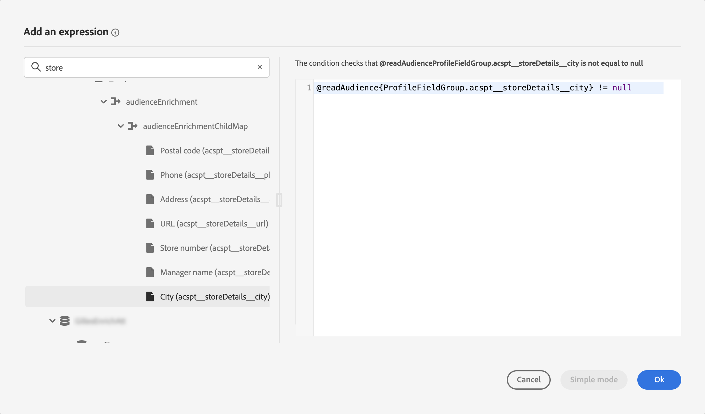

# Introdução aos públicos-alvo da Adobe Experience Platform {#about-segments}

>[!CONTEXTUALHELP]
>id="ajo_campaigns_content_experiment_segment"
>title="Público-alvo"
>abstract="Ao aproveitar os dados do perfil do cliente em tempo real, a Adobe Experience Platform permite criar facilmente definições de segmento para criar públicos-alvo que capturam as preferências e os comportamentos exclusivos dos clientes."

>[!CONTEXTUALHELP]
>id="ajo_campaigns_audience"
>title="Selecione o público-alvo da campanha"
>abstract="Esta lista exibe todos os públicos-alvo disponíveis na Adobe Experience Platform. Selecione o público-alvo a ser direcionado pela campanha. A mensagem configurada na campanha será enviada a todas as pessoas pertencentes ao público-alvo selecionado. [Saiba mais sobre públicos-alvo](../audience/about-audiences.md)"

Um público-alvo é um conjunto de pessoas que compartilham comportamentos e/ou características semelhantes. Saiba mais sobre públicos-alvo na [Documentação do Serviço de segmentação da Adobe Experience Platform](https://experienceleague.adobe.com/docs/experience-platform/segmentation/home.html?lang=pt-BR){target="_blank"}.

[!DNL Journey Optimizer] O permite criar públicos-alvo da Adobe Experience Platform diretamente da **[!UICONTROL Públicos-alvo]** e aproveite-as em suas jornadas ou campanhas.

Os públicos-alvo podem ser gerados usando métodos diferentes:

* **Definições de segmento**: crie uma nova definição de público-alvo usando o Serviço de segmentação da Adobe Experience Platform. [Saiba como criar definições de segmento](creating-a-segment-definition.md)
* **Upload personalizado**: importe um público usando um arquivo CSV. Saiba como importar públicos no Adobe Experience Platform [Documentação do Serviço de segmentação](https://experienceleague.adobe.com/docs/experience-platform/segmentation/ui/overview.html#import-audience){target="_blank"}.
* **Composição de público**: crie um fluxo de trabalho de composição para combinar públicos-alvo existentes do Adobe Experience Platform em uma tela visual e aproveitar várias atividades (dividir, excluir...) para criar novos públicos-alvo. [Introdução à composição de público-alvo](get-started-audience-orchestration.md)

## Públicos-alvo no [!DNL Journey Optimizer] {#segments-in-journey-optimizer}

Você pode selecionar em campanhas e jornadas qualquer público gerado usando definições de segmento, upload personalizado ou workflows de composição.

>[!AVAILABILITY]
>
>O uso de públicos-alvo e atributos da composição de público-alvo e do upload personalizado (arquivo CSV) de públicos-alvo está indisponível para uso com o Healthcare Shield ou o Privacy and Security Shield. [Saiba como usar atributos de enriquecimento de públicos-alvo no Journey Optimizer](../audience/about-audiences.md#enrichment)

É possível aproveitar os públicos-alvo no **[!DNL Journey Optimizer]** de maneiras diferentes:

* Escolha um público para uma **campanha**, na qual a mensagem é enviada a todos os indivíduos que pertencem ao público-alvo selecionado. [Saiba como definir o público-alvo de uma campanha](../campaigns/create-campaign.md#define-the-audience-audience).

* Use um **Ler público** atividade de orquestração em uma jornada para fazer com que todos os indivíduos no público-alvo entrem na jornada e recebam as mensagens incluídas na jornada. Digamos que você tenha um público-alvo de “cliente prata”. Com essa atividade, você pode fazer com que todos os clientes prata entrem em uma jornada e enviar-lhes uma série de mensagens personalizadas. [Saiba como configurar uma atividade Ler público-alvo](../building-journeys/read-audience.md#configuring-segment-trigger-activity).

* Use a atividade **Condição** em uma jornada para criar condições com base na associação de público-alvo. [Saiba como usar públicos-alvo em condições](../building-journeys/condition-activity.md#using-a-segment).

* Use o **Qualificação de público** atividade de evento em uma jornada para fazer com que os indivíduos entrem ou avancem na jornada com base nas entradas e saídas do público-alvo do Adobe Experience Platform. Por exemplo, é possível fazer com que todos os novos clientes prata entrem em uma jornada e enviar-lhes mensagens. Para obter mais informações sobre como usar essa atividade, consulte [Saiba como configurar uma atividade de qualificação de público-alvo](../building-journeys/audience-qualification-events.md).

  >[!NOTE]
  >
  >Devido à natureza em lote de públicos-alvo criados usando fluxos de trabalho de composição e upload personalizado, não é possível direcionar esses públicos-alvo em uma atividade de &quot;Qualificação de público-alvo&quot;. Somente públicos-alvo criados usando definições de segmento podem ser aproveitados nessa atividade.

## Usar atributos de enriquecimento de públicos-alvo {#enrichment}

Ao direcionar um público-alvo gerado usando workflows de composição, você pode aproveitar os atributos de enriquecimento desses públicos-alvo para criar sua jornada e personalizar suas mensagens.

Para usar atributos de enriquecimento em uma Jornada, verifique se eles foram adicionados a um Grupo de campos na Fonte de dados da &quot;Experience Platform&quot;.

+++ Saiba como adicionar atributos de enriquecimento a um Grupo de campos

1. Navegue até &quot;Administração&quot; > &quot;Configuração&quot; > &quot;Fontes de dados&quot;.
1. Selecione &quot;Experience Platform&quot; e crie ou edite um Grupo de campos.
1. Abra o seletor de campos, localize os atributos de enriquecimento que deseja adicionar e marque a caixa de seleção ao lado deles.
1. Salve as alterações.

Informações detalhadas sobre fontes de dados estão disponíveis nestas seções:

* [Trabalhar com a fonte de dados do Adobe Experience Platform](../datasource/adobe-experience-platform-data-source.md)
* [Configurar uma fonte de dados](../datasource/configure-data-sources.md)

+++

Depois que os atributos de enriquecimento forem adicionados a um Grupo de campos, você poderá aproveitá-los em locais diferentes no Journey Optimizer:

* **Criar vários caminhos em uma jornada** com base em regras que aproveitam os atributos de enriquecimento do público-alvo. Para fazer isso, direcione o público usando um [Ler público](../building-journeys/read-audience.md) atividade e, em seguida, criar regras em uma [Condição](../building-journeys/condition-activity.md) atividade com base nos atributos de enriquecimento do público-alvo.

  {width="70%" zoomable="yes"}

* **Personalizar suas mensagens** em jornadas ou campanhas adicionando atributos de enriquecimento do público-alvo direcionado no editor de expressão. [Saiba como trabalhar com o editor de expressão](../personalization/personalization-build-expressions.md)

  {width="70%" zoomable="yes"}

>[!AVAILABILITY]
>
>Atributos de enriquecimento de upload personalizados ainda não estão disponíveis para uso no Journey Optimizer.

## Métodos de avaliação de público-alvo {#evaluation-method-in-journey-optimizer}

No Adobe Journey Optimizer, os públicos-alvo são gerados a partir das definições de segmento usando um dos três métodos de avaliação abaixo.

+++ Segmentação de transmissão

A lista de perfis do público-alvo é mantida atualizada em tempo real à medida que novos dados fluem para o sistema.

A segmentação por transmissão é um processo contínuo de seleção de dados que atualiza os públicos-alvo em resposta à atividade do usuário. Depois que uma definição de segmento é criada e o público-alvo resultante é salvo, a definição de segmento é aplicada aos dados recebidos no Journey Optimizer. Isso significa que as pessoas físicas são adicionadas ou removidas do público-alvo à medida que os dados do perfil são alterados, garantindo que o público-alvo seja sempre relevante. [Saiba mais](https://experienceleague.adobe.com/docs/experience-platform/segmentation/ui/streaming-segmentation.html){target="_blank"}

>[!NOTE]
>
>Use os eventos corretos como critérios de segmentação de transmissão. [Saiba mais](#streaming-segmentation-events-guardrails)

+++

+++ Segmentação em lote

A lista de perfis do público-alvo é avaliada a cada 24 horas.

A segmentação em lote é uma alternativa à segmentação por transmissão que processa todos os dados de perfil de uma só vez através das definições de segmento. Isso cria um instantâneo do público-alvo que pode ser salvo e exportado para uso. No entanto, diferentemente da segmentação por transmissão, a segmentação em lote não atualiza continuamente a lista de públicos-alvo em tempo real, e os novos dados que chegam após o processo em lote não serão refletidos no público-alvo até o próximo processo em lote. [Saiba mais](https://experienceleague.adobe.com/docs/experience-platform/segmentation/home.html#batch){target="_blank"}

+++

+++ Segmentação de borda

A segmentação de borda é a capacidade de avaliar segmentos no Adobe Experience Platform instantaneamente [na borda](https://experienceleague.adobe.com/docs/experience-platform/edge/home.html?lang=pt-BR){target="_blank"}, enabling same-page and next-page personalization use cases. Currently only select query types can be evaluated with edge segmentation. [Learn more](https://experienceleague.adobe.com/docs/experience-platform/segmentation/ui/edge-segmentation.html#query-types){target="_blank"}

+++

Se você souber qual método de avaliação deseja usar, selecione-o usando a lista suspensa. Você também pode clicar no ícone de navegação ícone da pasta com uma lupa para ver uma lista dos métodos de avaliação de definição de segmento disponíveis. [Saiba mais](https://experienceleague.adobe.com/docs/experience-platform/segmentation/ui/segment-builder.html#segment-properties){target="_blank"}

<!--The determination between batch segmentation and streaming segmentation is made by the system for each audience, based on the complexity and the cost of evaluating the segment definition rule. You can view the evaluation method for each audience in the **[!UICONTROL Evaluation method]** column of the audience list.
    

>[!NOTE]
>
>If the **[!UICONTROL Evaluation method]** column does not display, you  need to add it using configuration button on the top right of the list.-->

Depois de definir um público-alvo pela primeira vez, perfis serão adicionados ele quando se qualificarem.

O preenchimento retroativo de dados anteriores no público-alvo pode levar até 24 horas. Depois que o público-alvo é preenchido retroativamente, ele será mantido atualizado continuamente e está sempre pronto para o direcionamento.

### Uso do evento com segmentação por transmissão {#streaming-segmentation-events-guardrails}

A segmentação por transmissão é útil para personalização em tempo real com casos de uso de alto valor. No entanto, é importante [events](https://experienceleague.adobe.com/docs/experience-platform/segmentation/ui/segment-builder.html#events){target="_blank"} para usar como critérios de segmentação.

Consequentemente, para um desempenho ideal de segmentação por transmissão, evite usar os seguintes eventos:

* **Mensagem aberta** Evento de Tipo de Interação

  Ao criar seu público-alvo, o uso de **Mensagem aberta** os eventos de interação se tornaram não confiáveis, pois não são indicadores reais da atividade do usuário e podem afetar negativamente o desempenho da segmentação. Saiba mais sobre o motivo disso [Publicação no blog do Adobe](https://blog.adobe.com/en/publish/2021/06/24/what-apples-mail-privacy-protection-means-for-email-marketers){target="_blank"}. Portanto, o Adobe recomenda não usar **Mensagem aberta** eventos de interação com segmentação por transmissão. Em vez disso, use sinais reais de atividade do usuário, como cliques, compras ou dados de beacon.

* **Mensagem enviada** Evento de Status de Feedback

  A variável **Mensagem enviada** o evento de feedback é usado com frequência para a verificação de frequência ou supressão antes do envio de um email. A Adobe recomenda evitá-lo, pois pressiona o desempenho e pode causar degradação do sistema. Portanto, para frequência ou lógica de supressão, use regras de negócios em vez de **Mensagem enviada** eventos de feedback. Observe que, em breve, limites de frequência diária para perfis individuais estarão disponíveis, complementando a cadência mensal existente para regras de negócios.

>[!NOTE]
>
>Você pode usar **Mensagem aberta** e **Mensagem enviada** eventos na segmentação em lote sem preocupações com o desempenho.

## Perguntas frequentes sobre composição de público-alvo e upload personalizado {#faq}

A seção a seguir lista as perguntas frequentes sobre o uso no Journey Optimizer de públicos-alvo criados com fluxos de trabalho de composição e upload personalizado (arquivos CSV).

+++ Onde posso usar públicos-alvo da composição de públicos-alvo e do upload personalizado no Journey Optimizer?

Os públicos-alvo da composição de público-alvo e do upload personalizado podem ser direcionados a partir de campanhas e jornadas. [Saiba como direcionar públicos-alvo no [!DNL Journey Optimizer]](#segments-in-journey-optimizer)

* Entrada **Campanhas**, esses públicos-alvo aparecem no seletor de público-alvo depois de clicar no botão &quot;Selecionar público-alvo&quot;.

* Entrada **Jornadas**, você pode usar esses públicos-alvo em uma atividade &quot;Ler público-alvo&quot; durante a seleção de públicos-alvo e em uma atividade &quot;Condição&quot; para verificações de associação de públicos-alvo. No entanto, devido à sua natureza em lote, esses públicos-alvo não aparecem na atividade &quot;Qualificação de público-alvo&quot;.

  >[!NOTE]
  >
  >Para públicos-alvo de upload personalizados, se a &quot;Leitura incremental&quot; estiver ativada em uma jornada recorrente, os perfis serão recuperados somente na primeira recorrência, pois esses públicos-alvo são corrigidos.

Além disso, esses públicos-alvo estão disponíveis para uso no Editor de expressão para personalizar suas mensagens em jornadas e campanhas. [Saiba como trabalhar com o editor de expressão](../personalization/personalization-build-expressions.md)

+++

+++ O que são atributos de enriquecimento?

Os atributos de enriquecimento são atributos adicionais que são contextuais e específicos a um público-alvo. Eles não estão associados ao perfil e são normalmente usados para fins de personalização.

Os atributos de enriquecimento são vinculados a um público-alvo por meio de um [Enriquecer](composition-canvas.md#enrich) atividade na composição do público ou por meio do processo de upload personalizado.

+++

+++ Onde posso usar atributos de enriquecimento no Journey Optimizer?

Os atributos de enriquecimento da composição de público-alvo podem ser aproveitados nas seguintes áreas. [Saiba como usar atributos de enriquecimento de públicos-alvo](#enrichment)

* Atividade de condição (Jornada)
* Atributos de ação personalizados (Jornada)
* Personalização de mensagem (Jornadas e campanhas)

>[!AVAILABILITY]
>
>Atributos de enriquecimento de upload personalizados ainda não estão disponíveis para uso no Journey Optimizer.

+++

+++ Como ativar atributos de enriquecimento no Jornada?

Para usar atributos de enriquecimento em uma Jornada, verifique se eles foram adicionados a um Grupo de campos na Fonte de dados da &quot;Experience Platform&quot;. Informações sobre como adicionar atributos de enriquecimento a um Grupo de campos estão disponíveis em [nesta seção](#enrichment)

+++

+++ Após publicar um público-alvo da composição de público-alvo ou do upload personalizado, quanto tempo posso usá-lo no Journey Optimizer?

* Públicos-alvo de **composição de público** são executados diariamente, portanto, talvez seja necessário aguardar até 24 horas para usá-los no Journey Optimizer.
* Públicos-alvo de **upload personalizado** ficam disponíveis no Journey Optimizer aproximadamente 2 horas após a publicação.

+++

+++ Os valores do atributo de enriquecimento são atualizados após o início de uma jornada?

Atualmente não. Mesmo depois dos nós de espera ou evento, os valores do atributo de enriquecimento permanecem os mesmos de quando a jornada foi iniciada.

+++

+++ Como os públicos-alvo de upload personalizados se associam com perfis?

Durante o processo de upload personalizado, especifique o atributo CSV a ser usado como a identidade e a identidade do perfil para o qual ele é mapeado. Isso estabelece um link entre os dados do público-alvo e o perfil. Se o arquivo CSV contiver um valor de identidade não encontrado no perfil, um novo perfil será criado com esse valor de identidade.

Informações detalhadas sobre o processo de upload personalizado estão disponíveis no Adobe Experience Platform [Documentação do Serviço de segmentação](https://experienceleague.adobe.com/docs/experience-platform/segmentation/ui/overview.html#import-audience){target="_blank"}.

+++

+++ Meus dados no Journey Optimizer são atualizados?

Os dados em públicos-alvo da composição do público-alvo e do upload personalizado são preenchidos pelo Serviço de exportação de público-alvo (AES). O AES lê os atributos do perfil e a associação do público-alvo, que ele disponibiliza para esses públicos-alvo com as seguintes linhas do tempo:

* **Composição de público**: exportação diária (~24 horas)
* **Upload personalizado**: trabalho de exportação dedicado (~2 horas)

Qualquer jornada que utilize um público-alvo da composição de público-alvo ou do upload personalizado na atividade &quot;Ler público-alvo&quot; terá atributos de perfil tão novos quanto a última avaliação em lote. Isso inclui consentimento/supressões na jornada.

Além disso, os atributos enriquecidos nos públicos-alvo de composição do público-alvo estão tão atualizados quanto a última execução de composição, que pode durar até 24 horas no passado.

+++

