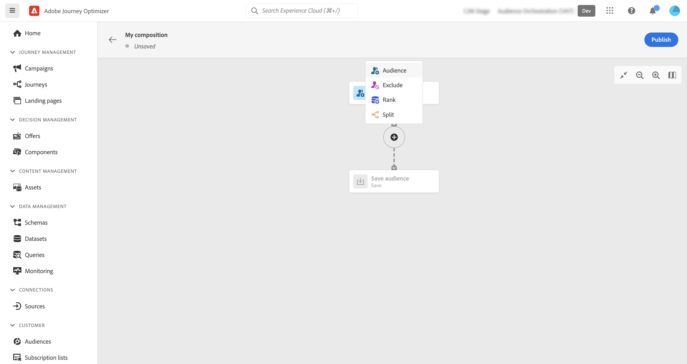
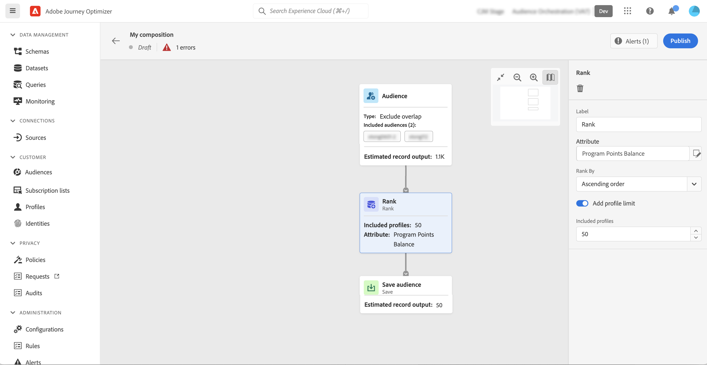
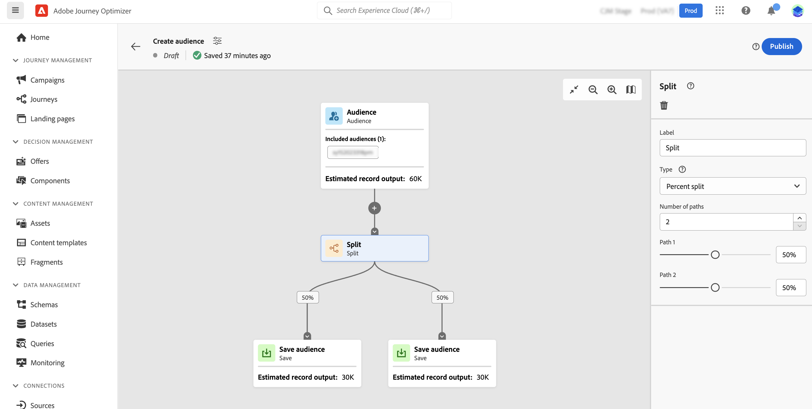

# Trabalhar com a tela de composição {#composition-canvas}

>[!BEGINSHADEBOX]

Estas documentações fornecem informações detalhadas sobre como trabalhar com a composição de público-alvo no Adobe Journey Optimizer. Se você não estiver usando o Adobe Journey Optimizer, [clique aqui](https://experienceleague.adobe.com/docs/experience-platform/segmentation/ui/audience-composition.html)

>[!ENDSHADEBOX]

A composição de público-alvo fornece uma tela visual que permite criar públicos-alvo e usar várias atividades (dividir, enriquecer etc.).

As etapas para compor um público-alvo na tela são as seguintes:

1. [Definir os públicos-alvo iniciais](#starting-audience)
1. [Adicionar uma ou várias atividades](#action-activities)
1. [Salvar os resultados em um novo público](#save)

## Selecionar o público inicial {#starting-audience}

A primeira etapa para criar uma composição é selecionar um ou vários públicos-alvo existentes como base para a composição.

1. Selecione o **[!UICONTROL Público]** atividade e forneça um rótulo para a atividade.

1. Escolha o público-alvo a ser direcionado:

   * Clique em **[!UICONTROL Adicionar público-alvo]** botão para selecionar um ou vários públicos-alvo existentes,
   * Clique em **[!UICONTROL Criar regra]** botão para criar uma nova definição de público-alvo usando o [Serviço de segmentação](https://experienceleague.adobe.com/docs/experience-platform/segmentation/ui/overview.html).

   

1. Se vários públicos forem selecionados, especifique como os perfis desses públicos devem ser mesclados:

* **[!UICONTROL União]**: inclua todos os perfis dos públicos-alvo selecionados,
* **[!UICONTROL Interseção]**: incluem perfis comuns a todos os públicos selecionados,
* **[!UICONTROL Excluir sobreposição]**: inclua perfis que pertençam apenas a um dos públicos-alvo. Perfis pertencentes a mais de um público não serão incluídos.

Neste exemplo, queremos direcionar todos os perfis pertencentes aos públicos-alvo ouro e prata.

Depois que os públicos-alvo são selecionados, o número estimado de perfis é exibido na parte inferior da atividade.

## Adicionar atividades {#action-activities}

Adicione atividades após selecionar o público inicial para refinar a seleção.

Para fazer isso, clique no botão + no caminho da composição e selecione a atividade desejada. O painel direito é aberto, permitindo configurar a atividade recém-adicionada.

As atividades disponíveis são:

* [Público](#audience): incluir perfis adicionais pertencentes a um ou vários públicos-alvo existentes,
* [Excluir](#exclude): excluir perfis que pertencem a um público-alvo ou excluir perfis com base em atributos específicos,
* [Enriquecer](#enrich): enriqueça seu público-alvo com atributos adicionais provenientes de conjuntos de dados do Adobe Experience Platform,
* [Classificação](#rank): classifique os perfis com base em um atributo específico, especifique o número de perfis que serão mantidos e inclua-os em sua composição,
* [Split](#split): divida sua composição em vários caminhos com base em porcentagens aleatórias ou em atributos.

Você pode adicionar quantos **[!UICONTROL Público]** e **[!UICONTROL Excluir]** conforme necessário em sua composição. No entanto, nenhuma atividade adicional pode ser adicionada após **[!UICONTROL Classificação]** e **[!UICONTROL Split]** atividades.

Você pode remover uma atividade da tela a qualquer momento clicando no botão Excluir no painel direito.  Se a atividade que você deseja excluir for principal de outras atividades na composição, uma mensagem será exibida, permitindo especificar se você deseja excluir apenas a atividade selecionada ou todas as suas atividades secundárias.

### Atividade de público {#audience}

>[!CONTEXTUALHELP]
>id="ajo_ao_audience"
>title="Atividade de público"
>abstract="A atividade de público permite incluir em sua composição perfis adicionais pertencentes a um público existente."

>[!CONTEXTUALHELP]
>id="ajo_ao_merge_types"
>title="Tipos de mesclagem"
>abstract="Especifique como os perfis dos públicos selecionados devem ser mesclados."

A variável **[!UICONTROL Público]** A atividade permite incluir em sua composição perfis adicionais pertencentes a um público-alvo existente.

A configuração dessa atividade é idêntica ao início [Atividade de público](#starting-audience).

### Atividade Excluir {#exclude}

>[!CONTEXTUALHELP]
>id="ajo_ao_exclude_type"
>title="Excluir tipo"
>abstract="Use o tipo Excluir público para excluir perfis pertencentes a um público existente. O tipo Excluir usando atributo permite excluir perfis com base em um atributo específico."

>[!CONTEXTUALHELP]
>id="ajo_ao_exclude"
>title="Atividade Excluir"
>abstract="A atividade Excluir permite excluir perfis de sua composição ao selecionar um público existente ou usar uma regra."

A variável **[!UICONTROL Excluir]** A atividade permite excluir perfis da sua composição. Dois tipos de exclusão estão disponíveis:

* **[!UICONTROL Excluir público-alvo]**: exclua os perfis que pertencem a um público-alvo existente.

  Clique em **[!UICONTROL Adicionar público-alvo]** e selecione o público-alvo a ser excluído.

  

* **[!UICONTROL Excluir usando atributo]**: exclua perfis com base em um atributo específico.

  Selecione o atributo a ser pesquisado e especifique o valor a ser excluído. Neste exemplo, estamos excluindo dos perfis de composição cujo endereço residencial está no Japão.

  

### Enriquecer {#enrich}

>[!CONTEXTUALHELP]
>id="ajo_ao_enrich"
>title="Atividade Enriquecer"
>abstract="Use a atividade Enriquecimento para enriquecer seu público-alvo com atributos adicionais provenientes de conjuntos de dados da Adobe Experience Platform. Por exemplo, é possível adicionar informações relacionadas ao produto comprado, como nome, preço ou ID do fabricante e aproveitar essas informações para personalizar as entregas enviadas ao público-alvo."

>[!CONTEXTUALHELP]
>id="ajo_ao_enrich_dataset"
>title="Conjunto de dados de enriquecimento"
>abstract="Selecione o conjunto de dados de enriquecimento que contém os dados que você deseja associar ao público."

>[!CONTEXTUALHELP]
>id="ajo_ao_enrich_criteria"
>title="Critérios de enriquecimento"
>abstract="Selecione os campos a serem usados como chave de reconciliação entre o conjunto de dados de origem, ou seja, o público, e o conjunto de dados de enriquecimento."

>[!CONTEXTUALHELP]
>id="ajo_ao_enrich_attributes"
>title="Atributos de enriquecimento"
>abstract="Selecione um ou vários atributos do conjunto de dados de enriquecimento para associar ao público. Depois que a composição é publicada, esses atributos são associados ao público-alvo e podem ser aproveitados em campanhas do Journey Optimizer para personalizar os deliveries."

A variável **[!UICONTROL Enriquecer]** A atividade permite enriquecer seu público-alvo com atributos adicionais provenientes de conjuntos de dados da Adobe Experience Platform. Por exemplo, é possível adicionar informações relacionadas ao produto comprado, como nome, preço ou ID do fabricante e aproveitar essas informações para personalizar as entregas enviadas ao público-alvo.

Observe as seguintes limitações ao trabalhar com o **[!UICONTROL Enriquecer]** atividade:

* **Conjuntos de dados** para enriquecimento deve ser do tipo de registro (em vez do tipo de evento), e não podem ser um conjunto de dados do sistema, nem podem ser marcados para perfil. Eles devem ter menos de 1 GB.
* **O enriquecimento suporta uma associação 1:1**. Isso significa que se as chaves de junção tiverem mais de uma correspondência no conjunto de dados de enriquecimento, o sistema selecionará uma das correspondências e a usará para a associação 1:1.
* **Os públicos-alvo podem ser ativados em destinos RTCDP**, mas seus atributos de enriquecimento, se houver, não poderão.

Para configurar a atividade, siga estas etapas:

1. Selecione o **[!UICONTROL Conjunto de dados de enriquecimento]** que contém os dados que você deseja associar ao público-alvo.

1. No **[!UICONTROL Critérios de enriquecimento]** selecione os campos a serem usados como chave de reconciliação entre o conjunto de dados de origem, ou seja, o público-alvo e o conjunto de dados de enriquecimento. Neste exemplo, estamos usando a ID do produto comprado como chave de reconciliação.

1. Clique em **[!UICONTROL Adicionar atributos]** e selecione um ou vários atributos do conjunto de dados de enriquecimento para associar ao público-alvo.

   

Depois que a composição é publicada, os atributos selecionados são associados ao público e podem ser aproveitados em campanhas para personalizar os deliveries.

### Atividade de classificação {#rank}

>[!CONTEXTUALHELP]
>id="ajo_ao_ranking"
>title="Atividade de classificação"
>abstract="A atividade Classificação permite classificar perfis com base em um atributo específico e incluí-los na composição. Por exemplo, inclua os 50 perfis com a maior quantidade de pontos de fidelidade."

>[!CONTEXTUALHELP]
>id="ajo_ao_rank_profilelimit_text"
>title="Adicionar limite de perfil"
>abstract="Ative essa opção para especificar um número máximo de perfis para incluir na composição."

A variável **[!UICONTROL Classificação]** A atividade de permite classificar perfis com base em um atributo específico e incluí-los na composição. Você pode, por exemplo, incluir os 50 perfis com a maior quantidade de pontos de fidelidade.

1. Selecione o atributo que deseja pesquisar e especifique uma ordem de classificação (crescente ou decrescente).

   >[!NOTE]
   >
   >Você pode selecionar atributos com os seguintes tipos de dados: inteiro, números, curto <!--(other?)-->

1. Alterne a **[!UICONTROL Adicionar limite de perfil]** e especifique um número máximo de perfis a serem incluídos na composição.

   

### Atividade de divisão {#split}

<!-- [!CONTEXTUALHELP]
>id="ajo_ao_control_group_text"
>title="Control Group"
>abstract="Use control groups to isolate a portion of the profiles. This allows you to measure the impact of a marketing activity and make a comparison with the behavior of the rest of the population."-->

>[!CONTEXTUALHELP]
>id="ajo_ao_split"
>title="Atividade de divisão"
>abstract="A atividade de divisão permite dividir a composição em vários caminhos. Ao publicar a composição, um público será salvo na Adobe Experience Platform para cada caminho."

>[!CONTEXTUALHELP]
>id="ajo_ao_split_type"
>title="Tipo de divisão"
>abstract="Use o tipo de divisão de porcentagem para dividir perfis aleatoriamente em vários caminhos. O tipo de divisão de atributo permite dividir perfis com base em um atributo específico."

>[!CONTEXTUALHELP]
>id="ajo_ao_split_otherprofiles_text"
>title="Outros perfis"
>abstract="Ative essa opção para criar um caminho adicional com os perfis restantes que não correspondem a nenhuma das condições especificadas nos outros caminhos."

A variável **[!UICONTROL Split]** A atividade permite dividir a composição em vários caminhos.

Esta operação adiciona automaticamente um **[!UICONTROL Salvar]** atividade no final de cada caminho. Ao publicar a composição, um público será salvo na Adobe Experience Platform para cada caminho.

Dois tipos de operações de split estão disponíveis:

* **[!UICONTROL Divisão percentual]**: divida perfis aleatoriamente em dois ou mais caminhos. Por exemplo, você pode dividir os perfis em 2 caminhos distintos de 50% cada. <!--and add an additional path for control group.-->

  

* **[!UICONTROL Divisão de atributo]**: divide perfis com base em um atributo específico. Neste exemplo, estamos dividindo perfis com base nas preferências de tipo de quarto.

  

  >[!NOTE]
  >
  >A variável **[!UICONTROL Outros perfis]** permite criar um caminho adicional com os perfis restantes que não correspondem a nenhuma das condições especificadas nos outros caminhos.

## Salve os públicos {#save}

Configure os públicos resultantes que serão salvos na Adobe Experience Platform.

Para fazer isso, selecione a variável **[!UICONTROL Salvar público-alvo]** no final de cada caminho, especifique o nome do novo público-alvo que será criado.

Quando a composição estiver pronta, você poderá publicá-la. [Saiba como criar composições](create-compositions.md)
