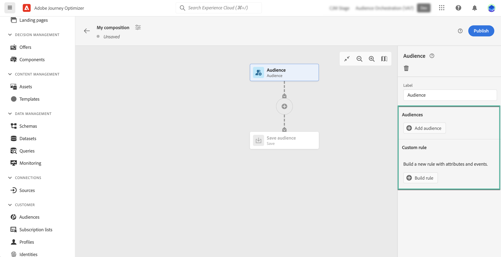
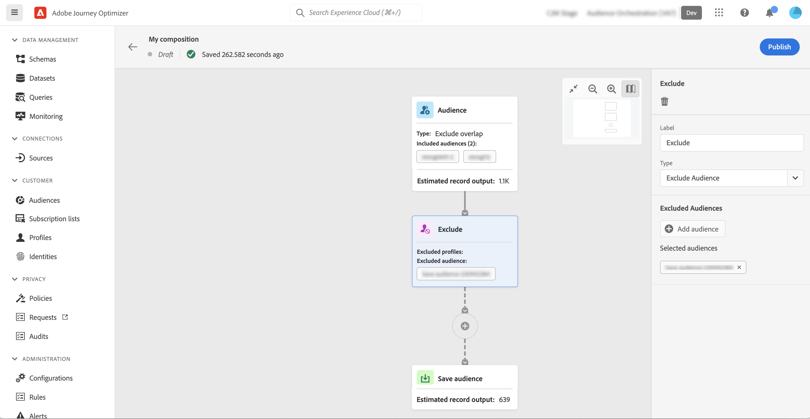
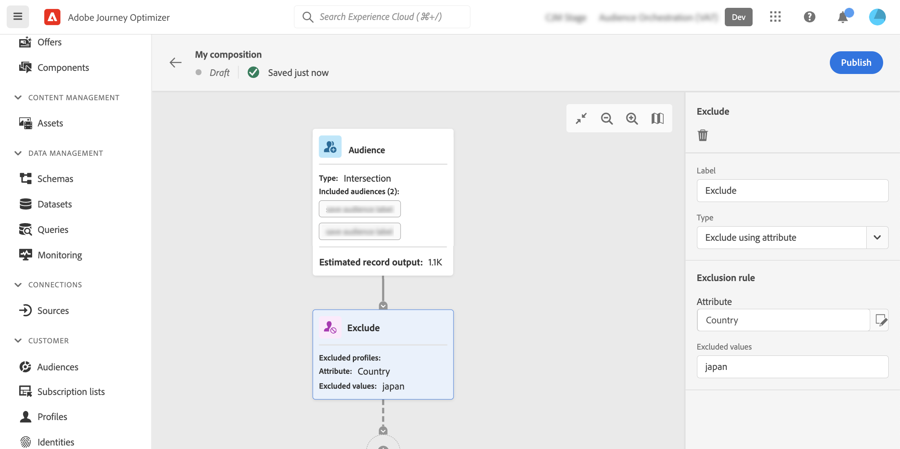

# Trabalhar com a tela de composição {#composition-canvas}

>[!BEGINSHADEBOX]

Estas documentações fornecem informações detalhadas sobre como trabalhar com a composição de público-alvo no Adobe Journey Optimizer. Se você não estiver usando o Adobe Journey Optimizer, [clique aqui](https://experienceleague.adobe.com/docs/experience-platform/segmentation/ui/audience-composition.html?lang=pt-BR){target="_blank"}.

>[!ENDSHADEBOX]

A composição do público-alvo fornece uma tela visual que permite criar públicos-alvo e usar várias atividades (dividir, enriquecer etc.).

As etapas para compor um público-alvo na tela são as seguintes:

1. [Definir os públicos-alvo iniciais](#starting-audience)
1. [Adicionar uma ou várias atividades](#action-activities)
1. [Salvar os resultados em um novo público-alvo](#save)

## Selecionar o público inicial {#starting-audience}

A primeira etapa para criar uma composição é selecionar um ou vários públicos-alvo existentes como base para a composição.

1. Selecione a atividade **[!UICONTROL Audience]** e forneça um rótulo para a atividade.

1. Escolha o público-alvo a ser direcionado:

   * Clique no botão **[!UICONTROL Adicionar público-alvo]** para selecionar um ou vários públicos existentes,
   * Clique no botão **[!UICONTROL Criar regra]** para criar uma nova definição de público-alvo usando o [Serviço de Segmentação](https://experienceleague.adobe.com/docs/experience-platform/segmentation/ui/overview.html?lang=pt-BR).

   

1. Se vários públicos forem selecionados, especifique como os perfis desses públicos devem ser mesclados:

* **[!UICONTROL União]**: incluir todos os perfis dos públicos selecionados,
* **[!UICONTROL Interseção]**: incluir perfis comuns a todos os públicos selecionados,
* **[!UICONTROL Excluir sobreposição]**: incluir perfis que pertencem apenas a um dos públicos-alvo. Perfis pertencentes a mais de um público não serão incluídos.

Neste exemplo, queremos direcionar todos os perfis pertencentes aos públicos-alvo ouro e prata.

Depois que os públicos-alvo são selecionados, o número estimado de perfis é exibido na parte inferior da atividade.

## Adicionar atividades {#action-activities}

Adicione atividades após selecionar o público inicial para refinar a seleção.

Para fazer isso, clique no botão + no caminho da composição e selecione a atividade desejada. O painel direito é aberto, permitindo configurar a atividade recém-adicionada.

As atividades disponíveis são:

* [Público](#audience): incluir perfis adicionais pertencentes a um ou vários públicos existentes,
* [Excluir](#exclude): excluir perfis pertencentes a um público-alvo existente ou excluir perfis com base em atributos específicos,
* [Enriquecer](#enrich): enriqueça seu público-alvo com atributos adicionais provenientes de conjuntos de dados do Adobe Experience Platform,
* [Classificação](#rank): classificar perfis com base em um atributo específico, especificar o número de perfis a serem mantidos e incluí-los na composição,
* [Split](#split): divida sua composição em vários caminhos com base em porcentagens aleatórias ou em atributos.

Você pode adicionar quantas atividades de **[!UICONTROL Público-alvo]** e **[!UICONTROL Excluir]** forem necessárias em sua composição. No entanto, nenhuma atividade adicional pode ser adicionada após as atividades **[!UICONTROL Rank]** e **[!UICONTROL Split]**.

Você pode remover uma atividade da tela a qualquer momento clicando no botão Excluir no painel direito.  Se a atividade que você deseja excluir for principal de outras atividades na composição, uma mensagem será exibida, permitindo especificar se você deseja excluir apenas a atividade selecionada ou todas as suas atividades secundárias.

### Atividade de público-alvo {#audience}

>[!CONTEXTUALHELP]
>id="ajo_ao_audience"
>title="Atividade de público-alvo"
>abstract="A atividade de público permite incluir em sua composição perfis adicionais pertencentes a um público existente."

>[!CONTEXTUALHELP]
>id="ajo_ao_merge_types"
>title="Tipos de mesclagem"
>abstract="Especifique como os perfis dos públicos selecionados devem ser mesclados."

A atividade **[!UICONTROL Audience]** permite incluir em sua composição perfis adicionais pertencentes a um público-alvo existente.

A configuração desta atividade é idêntica à [Atividade de público](#starting-audience) inicial.

### Atividade Excluir {#exclude}

>[!CONTEXTUALHELP]
>id="ajo_ao_exclude_type"
>title="Excluir tipo"
>abstract="Use o tipo Excluir público para excluir perfis pertencentes a um público existente. O tipo Excluir usando atributo permite excluir perfis com base em um atributo específico."

>[!CONTEXTUALHELP]
>id="ajo_ao_exclude"
>title="Atividade Excluir"
>abstract="A atividade Excluir permite excluir perfis de sua composição ao selecionar um público existente ou usar uma regra."

A atividade **[!UICONTROL Excluir]** permite excluir perfis da sua composição. Dois tipos de exclusão estão disponíveis:

* **[!UICONTROL Excluir público-alvo]**: excluir perfis que pertencem a um público-alvo existente.

  Clique no botão **[!UICONTROL Adicionar público-alvo]** e selecione o público-alvo a ser excluído.

  

* **[!UICONTROL Excluir usando atributo]**: exclua perfis com base em um atributo específico.

  Selecione o atributo a ser pesquisado e especifique o valor a ser excluído. Neste exemplo, estamos excluindo dos perfis de composição cujo endereço residencial está no Japão.

  >[!NOTE]
  >
  >Somente um valor de exclusão pode ser especificado.

  

### Atividade Enriquecer {#enrich}

>[!CONTEXTUALHELP]
>id="ajo_ao_enrich"
>title="Atividade Enriquecer"
>abstract="Use a atividade Enriquecimento para enriquecer seu público-alvo com atributos adicionais provenientes de conjuntos de dados da Adobe Experience Platform. Por exemplo, é possível adicionar informações relacionadas ao produto comprado, como nome, preço ou ID do fabricante e aproveitar essas informações para personalizar as entregas enviadas ao público-alvo."

>[!CONTEXTUALHELP]
>id="ajo_ao_enrich_dataset"
>title="Conjunto de dados de enriquecimento"
>abstract="Selecione o conjunto de dados de enriquecimento que contém os dados que você deseja associar ao público."

>[!CONTEXTUALHELP]
>id="ajo_ao_enrich_criteria"
>title="Critérios de enriquecimento"
>abstract="Selecione os campos a serem usados como chave de reconciliação entre o conjunto de dados de origem, ou seja, o público, e o conjunto de dados de enriquecimento."

>[!CONTEXTUALHELP]
>id="ajo_ao_enrich_attributes"
>title="Atributos de enriquecimento"
>abstract="Selecione um ou vários atributos do conjunto de dados de enriquecimento para associar ao público. Após a publicação da composição, esses atributos são associados ao público-alvo e podem ser aproveitados em campanhas do Journey Optimizer para personalizar entregas."

A atividade **[!UICONTROL Enrich]** permite enriquecer seu público-alvo com atributos adicionais provenientes de conjuntos de dados da Adobe Experience Platform. Por exemplo, é possível adicionar informações relacionadas ao produto comprado, como nome, preço ou ID do fabricante e aproveitar essas informações para personalizar as entregas enviadas ao público-alvo.

Observe as seguintes limitações ao trabalhar com a atividade **[!UICONTROL Enriquecer]**:

* Os **Conjuntos de dados** para enriquecimento devem ser do tipo de registro (em vez do tipo de evento) e não podem ser um conjunto de dados do sistema, nem ser marcados para perfil. Eles devem ter menos de 1 GB.
* **O enriquecimento dá suporte a uma junção 1:1**. Isso significa que se as chaves de junção tiverem mais de uma correspondência no conjunto de dados de enriquecimento, o sistema selecionará uma das correspondências e a usará para a associação 1:1.
* **Os públicos-alvo podem ser ativados nos Destinos RTCDP**, mas seus atributos de enriquecimento, se houver, não poderão.
* Os atributos de enriquecimento ainda não estão integrados ao serviço de aplicação de políticas. Portanto, quaisquer rótulos de uso de dados que você aplicar aos atributos de enriquecimento não serão aplicados em campanhas ou jornadas do Journey Optimizer.

Para configurar a atividade, siga estas etapas:

1. Selecione o **[!UICONTROL Conjunto de dados de enriquecimento]** que contém os dados que você deseja associar ao público-alvo.

1. Na seção **[!UICONTROL Critérios de enriquecimento]**, selecione os campos a serem usados como chave de reconciliação entre o conjunto de dados de origem, ou seja, o público-alvo e o conjunto de dados de enriquecimento. Neste exemplo, estamos usando a ID do produto comprado como chave de reconciliação.

1. Clique no botão **[!UICONTROL Adicionar atributos]** e selecione um ou vários atributos do conjunto de dados de enriquecimento para associar ao público.

   

Depois que a composição é publicada, os atributos selecionados são associados ao público e podem ser aproveitados em campanhas para personalizar os deliveries.

### Atividade de classificação {#rank}

>[!CONTEXTUALHELP]
>id="ajo_ao_ranking"
>title="Atividade de classificação"
>abstract="A atividade Classificação permite classificar perfis com base em um atributo específico e incluí-los na composição. Por exemplo, inclua os 50 perfis com a maior quantidade de pontos de fidelidade."

>[!CONTEXTUALHELP]
>id="ajo_ao_rank_profilelimit_text"
>title="Adicionar limite de perfil"
>abstract="Ative essa opção para especificar um número máximo de perfis para incluir na composição."

A atividade **[!UICONTROL Rank]** permite classificar perfis com base em um atributo específico e incluí-los na composição. Você pode, por exemplo, incluir os 50 perfis com a maior quantidade de pontos de fidelidade.

1. Selecione o atributo que deseja pesquisar e especifique uma ordem de classificação (crescente ou decrescente).

   >[!NOTE]
   >
   >Você pode selecionar atributos com os seguintes tipos de dados: inteiro, números, <!--(other?)--> curto

1. Ative a opção **[!UICONTROL Adicionar limite de perfil]** e especifique um número máximo de perfis a serem incluídos na composição.

   

### Atividade Divisão {#split}

<!-- [!CONTEXTUALHELP]
>id="ajo_ao_control_group_text"
>title="Control Group"
>abstract="Use control groups to isolate a portion of the profiles. This allows you to measure the impact of a marketing activity and make a comparison with the behavior of the rest of the population."-->

>[!CONTEXTUALHELP]
>id="ajo_ao_split"
>title="Atividade Divisão"
>abstract="A atividade de divisão permite dividir a composição em vários caminhos. Ao publicar a composição, um público será salvo na Adobe Experience Platform para cada caminho."

>[!CONTEXTUALHELP]
>id="ajo_ao_split_type"
>title="Tipo de divisão"
>abstract="Use o tipo de divisão de porcentagem para dividir perfis aleatoriamente em vários caminhos. O tipo de divisão de atributo permite dividir perfis com base em um atributo específico."

>[!CONTEXTUALHELP]
>id="ajo_ao_split_otherprofiles_text"
>title="Outros perfis"
>abstract="Ative essa opção para criar um caminho adicional com os perfis restantes que não correspondem a nenhuma das condições especificadas nos outros caminhos."

A atividade **[!UICONTROL Split]** permite dividir a composição em vários caminhos.

Esta operação adiciona automaticamente uma atividade **[!UICONTROL Salvar]** ao final de cada caminho. Ao publicar a composição, um público será salvo na Adobe Experience Platform para cada caminho.

Dois tipos de operações de split estão disponíveis:

* **[!UICONTROL Divisão de porcentagem]**: dividir aleatoriamente os perfis em dois ou mais caminhos. Por exemplo, você pode dividir os perfis em 2 caminhos distintos de 50% cada. <!--and add an additional path for control group.-->

  

* **[!UICONTROL Divisão de atributo]**: dividir perfis com base em um atributo específico. Neste exemplo, estamos dividindo perfis com base nas preferências de tipo de quarto.

  

  Para configurar uma atividade de divisão baseada em atributos, siga estas etapas:

   1. Clique no botão localizado ao lado do campo **[!UICONTROL Atributo]** para selecionar o atributo a ser usado como seu critério de divisão.
   1. Adicione quantos caminhos forem necessários. Para cada caminho, forneça um rótulo e especifique o valor que será usado para determinar quais perfis devem ser incluídos nesse caminho específico.

      >[!NOTE]
      >
      >Somente um valor pode ser especificado para cada caminho.

   1. Ative a opção **[!UICONTROL Outros perfis]** para criar um caminho adicional com os perfis restantes que não correspondem a nenhuma das condições especificadas nos outros caminhos.

## Salve os públicos {#save}

Configure os públicos resultantes que serão salvos na Adobe Experience Platform.

Para fazer isso, selecione a atividade **[!UICONTROL Save audience]** no final de cada caminho e especifique o nome do novo público a ser criado.

Quando a composição estiver pronta, você poderá publicá-la. [Saiba como criar composições](create-compositions.md)
