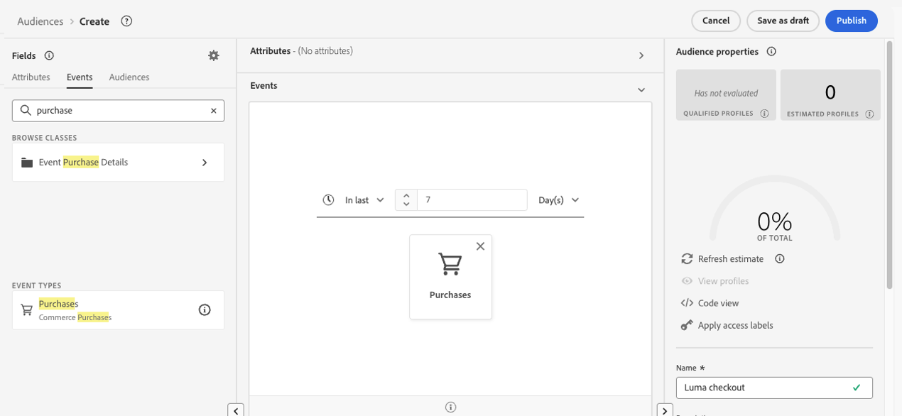
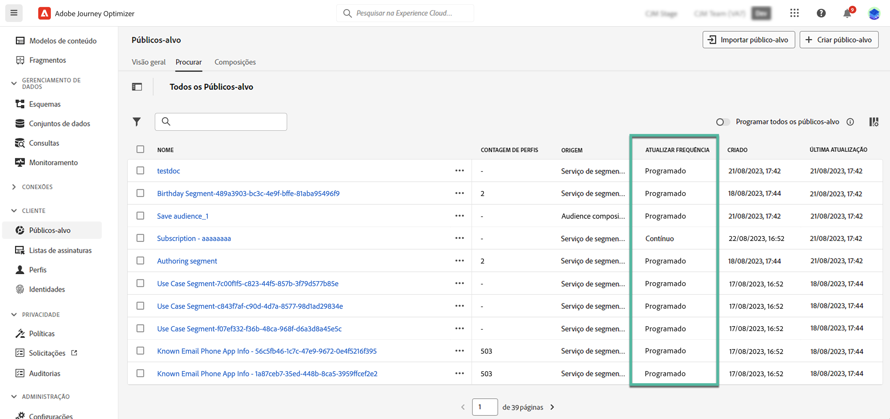

# Criar definições de segmento {#build-segments}

>[!CONTEXTUALHELP]
>id="ajo_ao_create_rule"
>title="Criar uma regra"
>abstract="O método de criação Criar regra permite criar uma nova definição de público-alvo usando o Serviço de segmentação da Adobe Experience Platform."

## Criar uma definição de segmento {#create}

Neste exemplo, criaremos um público-alvo para direcionar todos os clientes que moram em Atlanta, São Francisco ou Seattle e nasceram após 1980. Todos esses clientes devem ter feito uma compra nos últimos sete dias.

➡️ [Saiba como criar públicos neste vídeo](#video-segment)

1. No menu **[!UICONTROL Públicos-alvo]**, clique no botão **[!UICONTROL Criar público-alvo]** e selecione **[!UICONTROL Criar regra]**.

   

   A tela de definição de segmento permite configurar todos os campos necessários para definir seu público-alvo. Saiba como configurar públicos na [documentação do Serviço de segmentação](https://experienceleague.adobe.com/docs/experience-platform/segmentation/ui/overview.html?lang=pt-BR){target="_blank"}.

   

1. No painel **[!UICONTROL Propriedades de público-alvo]**, forneça um nome e uma descrição (opcional) para o público-alvo.

   

1. Arraste e solte os campos desejados do painel esquerdo no espaço de trabalho central e configure-os de acordo com suas necessidades.

   Os blocos de construção básicos das definições de segmento são **atributos** e **eventos**. Além disso, os atributos e eventos contidos nos públicos-alvo existentes podem ser usados como componentes para novas definições. [Saiba mais na documentação do serviço de segmentação](https://experienceleague.adobe.com/pt-br/docs/experience-platform/segmentation/ui/segment-builder#building-blocks){target="_blank"}

   >[!NOTE]
   >
   >Observe que os campos disponíveis no painel esquerdo variam dependendo de como os esquemas do **Perfil individual XDM** e **XDM ExperienceEvent** foram configurados para sua organização.  Saiba mais na [documentação do Experience Data Model (XDM)](https://experienceleague.adobe.com/docs/experience-platform/xdm/home.html?lang=pt-BR){target="_blank"}.

   

   Neste exemplo, precisamos confiar nos campos **Atributos** e **Eventos** para criar o público-alvo:

   * **Atributos**: perfis que vivem em Atlanta, São Francisco ou Seattle nascidos após 1980.

     

   * **Eventos**: perfis que fizeram uma compra nos últimos 7 dias.

     

1. À medida que você adiciona e configura novos campos no espaço de trabalho, o painel **[!UICONTROL Propriedades de Público-alvo]** é atualizado automaticamente com informações sobre os perfis estimados pertencentes ao público-alvo.

   

1. Quando o público estiver pronto, clique em **[!UICONTROL Salvar]**. Ele é exibido na lista de públicos da Adobe Experience Platform. Observe que uma barra de pesquisa está disponível para ajudá-lo a pesquisar um público específico na lista.

O público-alvo agora pode ser usado em suas jornadas. Para obter mais informações, consulte [esta seção](../audience/about-audiences.md).

## Métodos de avaliação de público-alvo {#evaluation-method-in-journey-optimizer}

No Adobe Journey Optimizer, os públicos-alvo são gerados a partir das definições de segmento usando um dos três métodos de avaliação abaixo.

+++ Segmentação de transmissão

A lista de perfis do público-alvo é mantida atualizada em tempo real à medida que novos dados fluem para o sistema.

A segmentação por transmissão é um processo contínuo de seleção de dados que atualiza os públicos-alvo em resposta à atividade do usuário. Depois que uma definição de segmento é criada e o público-alvo resultante é salvo, a definição de segmento é aplicada aos dados recebidos no Journey Optimizer. Isso significa que as pessoas físicas são adicionadas ou removidas do público-alvo à medida que os dados do perfil são alterados, garantindo que o público-alvo seja sempre relevante. [Saiba mais no Adobe Expe](https://experienceleague.adobe.com/docs/experience-platform/segmentation/ui/streaming-segmentation.html?lang=pt-BR){target="_blank"}

>[!IMPORTANT]
>
>A partir de 1º de novembro de 2024, a segmentação por transmissão não oferecerá mais suporte ao uso de eventos de **envio** e **abertura** dos conjuntos de dados de rastreamento e feedback do Journey Optimizer.
>
>* Essa alteração se aplica a todas as sandboxes e organizações do cliente.
>* Somente eventos de envio e abertos são afetados: os cliques e outros eventos de rastreamento permanecem disponíveis para segmentação de transmissão.
>* Essa alteração se aplica somente à segmentação por transmissão. Eventos de envio e abertura ainda podem ser usados em segmentos em lote, mas se incluídos em um segmento de transmissão, eles serão avaliados em lote. Além disso, os eventos de exclusão e os eventos de rejeição/atraso resultantes de eventos de envio também são afetados por essa alteração.
>* A coleta de dados de rastreamento não é afetada. Os eventos de envio e abertura continuarão a ser coletados como de costume.
>* Os eventos de reação nas jornadas não são afetados por essa alteração.

+++

+++ Segmentação em lote

A lista de perfis do público-alvo é avaliada a cada 24 horas.

A segmentação em lote é uma alternativa à segmentação por transmissão que processa todos os dados de perfil de uma só vez através das definições de segmento. Isso cria um instantâneo do público-alvo que pode ser salvo e exportado para uso. No entanto, diferentemente da segmentação por transmissão, a segmentação em lote não atualiza continuamente a lista de públicos-alvo em tempo real, e os novos dados que chegam após o processo em lote não serão refletidos no público-alvo até o próximo processo em lote. Uma tentativa de forçar uma atualização imediata não substituirá o ciclo diário. Para atualizações incrementais imediatas, considere usar opções de transmissão ou segmentação sob demanda.

Para obter mais detalhes, consulte a [documentação do Serviço de Segmentação do Adobe Experience Platform](https://experienceleague.adobe.com/docs/experience-platform/segmentation/home.html?lang=pt-BR#batch){target="_blank"}

+++

+++ Segmentação de borda

A segmentação do Edge é a capacidade de avaliar segmentos no Adobe Experience Platform instantaneamente [na borda](https://experienceleague.adobe.com/docs/experience-platform/edge/home.html?lang=pt-BR){target="_blank"}, habilitando casos de uso de personalização de mesma página e próxima página. Atualmente, somente os tipos de consulta selecionados podem ser avaliados com a segmentação de borda. Para obter mais detalhes, consulte a [documentação do Serviço de Segmentação do Adobe Experience Platform](https://experienceleague.adobe.com/docs/experience-platform/segmentation/ui/edge-segmentation.html?lang=pt-BR#query-types){target="_blank"}

+++

Se você souber qual método de avaliação deseja usar, selecione-o usando a lista suspensa. Você também pode clicar no ícone de navegação ícone da pasta com uma lupa para ver uma lista dos métodos de avaliação de definição de segmento disponíveis. Para obter mais detalhes, consulte a [documentação do Serviço de Segmentação do Adobe Experience Platform](https://experienceleague.adobe.com/docs/experience-platform/segmentation/ui/segment-builder.html?lang=pt-BR#segment-properties){target="_blank"}

<!--The determination between batch segmentation and streaming segmentation is made by the system for each audience, based on the complexity and the cost of evaluating the segment definition rule. You can view the evaluation method for each audience in the **[!UICONTROL Evaluation method]** column of the audience list.
    

>[!NOTE]
>
>If the **[!UICONTROL Evaluation method]** column does not display, you  need to add it using configuration button on the top right of the list.-->

Depois de definir um público-alvo pela primeira vez, os perfis são adicionados ao público-alvo quando se qualificam. O preenchimento retroativo de dados anteriores no público-alvo pode levar até 24 horas. Depois que o público-alvo é preenchido retroativamente, ele será mantido atualizado continuamente e está sempre pronto para o direcionamento.

## Avaliação flexível do público {#flexible}

O Adobe Experience Platform Audience Portal permite executar um trabalho de segmentação sob demanda para públicos selecionados, garantindo que você sempre tenha os dados do público mais atualizados antes de direcioná-los para jornadas e campanhas do Journey Optimizer.

Com a avaliação flexível do público-alvo, você pode:

1. Crie um novo segmento com base nos dados mais recentes.
1. Avalie o público-alvo em tempo real para garantir a precisão. Para fazer isso, escolha os públicos que deseja avaliar e selecione &quot;Avaliar públicos&quot;, desde que atendam a critérios específicos (por exemplo, com base em pessoas, origem do Serviço de segmentação).
1. Use o público avaliado em campanhas ou jornadas do Adobe Journey Optimizer para direcionamento preciso.

Você pode avaliar até 20 públicos-alvo de cada vez, e públicos-alvo não qualificados serão excluídos automaticamente. Para obter mais detalhes, consulte a [documentação do Serviço de segmentação do Adobe Experience Platform](https://experienceleague.adobe.com/pt-br/docs/experience-platform/segmentation/ui/audience-portal#flexible-audience-evaluation).

## Vídeo tutorial{#video-segment}

Entenda como o Journey Optimizer usa regras para gerar públicos-alvo e saiba como usar atributos, eventos e públicos-alvo já existentes para criar um público-alvo.

>[!VIDEO](https://video.tv.adobe.com/v/3425020?quality=12)
