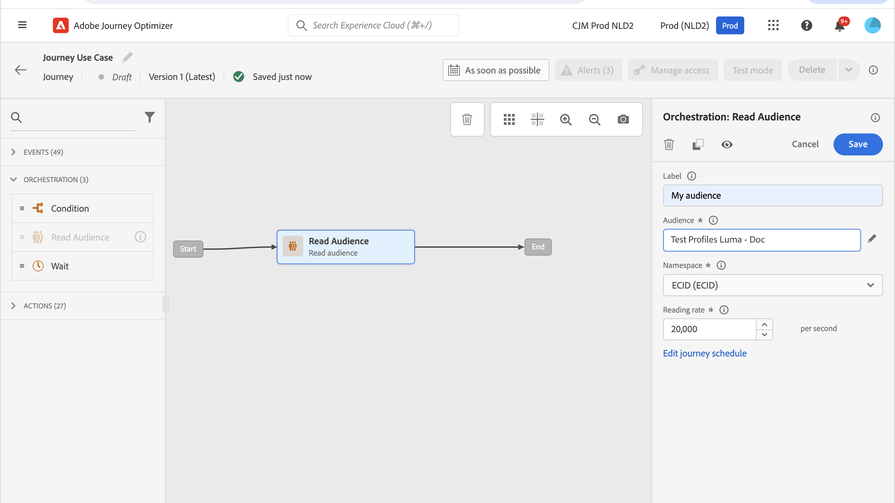
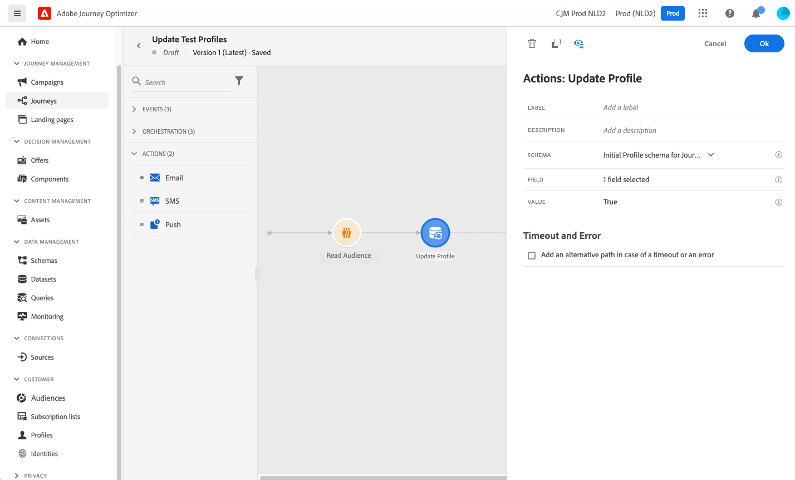
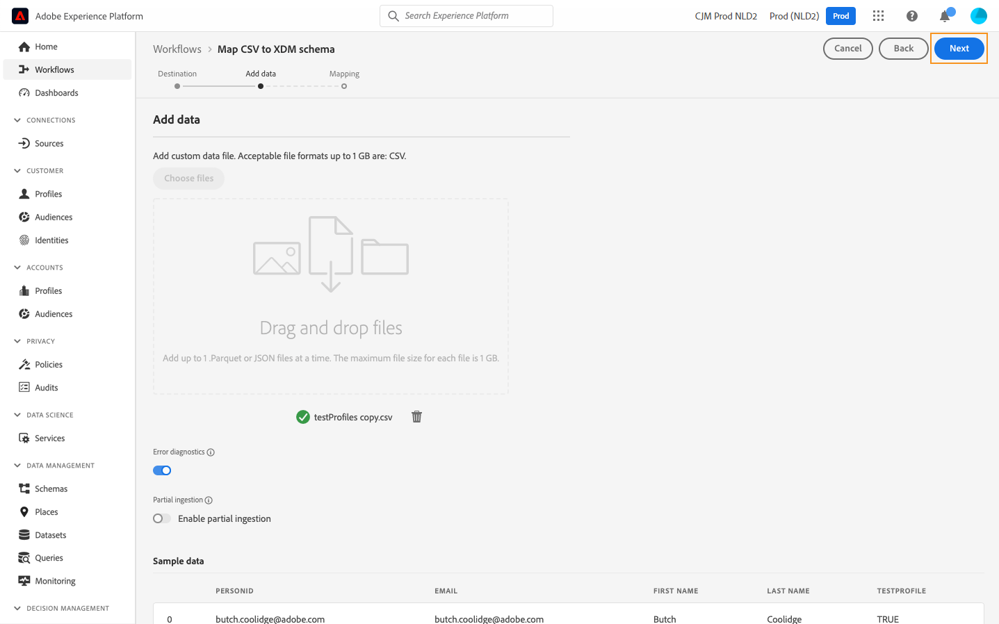

# Criar perfis de teste {#create-test-profiles}

Perfis de teste são necessários ao usar o [modo de teste](../building-journeys/testing-the-journey.md) em uma jornada e para [visualizar e testar seu conteúdo](../content-management/preview-test.md).


>[!NOTE]
>
>O [!DNL Journey optimizer] também permite que você teste diferentes variantes do seu conteúdo visualizando-o e enviando provas usando dados de entrada de exemplo carregados de um arquivo CSV/JSON ou adicionados manualmente. [Saiba como simular variações de conteúdo](../test-approve/simulate-sample-input.md)

Há várias maneiras de criar perfis de teste. Você pode encontrar nesta página detalhes para:

* Transformar um [perfil existente](#turning-profile-into-test) em um perfil de teste

* Crie perfis de teste carregando um [arquivo csv](#create-test-profiles-csv) ou usando [chamadas de API](#create-test-profiles-api).

  Além desses dois métodos, o Adobe Journey Optimizer vem com um [caso de uso no produto](#use-case-1) específico para facilitar a criação do perfil de teste.

Você também pode fazer upload de um arquivo json em um conjunto de dados existente. Para obter mais informações, consulte a [documentação de Assimilação de dados](https://experienceleague.adobe.com/docs/experience-platform/ingestion/tutorials/ingest-batch-data.html#add-data-to-dataset){target="_blank"}.

Observe que a criação de um perfil de teste é semelhante à criação de perfis comuns no Adobe Experience Platform. Para obter mais informações, consulte a [documentação de Perfil do cliente em tempo real](https://experienceleague.adobe.com/docs/experience-platform/profile/home.html?lang=pt-BR){target="_blank"}.

➡️ [Saiba como criar perfis de teste neste vídeo](#video)

## Pré-requisitos {#test-profile-prerequisites}

Para criar perfis, primeiro é necessário criar um esquema e um conjunto de dados no Adobe [!DNL Journey Optimizer].

Para **criar um esquema**, siga estas etapas:

1. Na seção de menu DATA MANAGEMENT, clique em **[!UICONTROL Esquemas]**.
   
1. Clique em **[!UICONTROL Criar esquema]**, na parte superior direita, selecione um tipo de esquema, por exemplo **Perfil Individual**, e clique em **Avançar**.
   
1. Insira um nome para o esquema e clique em **Concluir**.
   
1. Na seção **Grupos de campos**, à esquerda, clique em **Adicionar** e selecione os grupos de campos apropriados. Adicione o grupo de campos **Detalhes do teste de perfil**.
   
Depois de concluído, clique em **[!UICONTROL Adicionar grupos de campos]**: a lista de grupos de campos é exibida na tela de visão geral do esquema.
   

   >[!NOTE]
   >
   >Clique no nome do schema para atualizar suas propriedades.

1. Na lista de campos, clique no campo que você deseja definir como a identidade principal.
   
1. No painel direito **[!UICONTROL Propriedades do campo]**, verifique as opções **[!UICONTROL Identidade]** e **[!UICONTROL Identidade primária]** e selecione um namespace. Se você quiser que a identidade principal seja um endereço de email, escolha o namespace **[!UICONTROL Email]**. Clique em **[!UICONTROL Aplicar]**.
   
1. Selecione o esquema e habilite a opção **[!UICONTROL Perfil]** no painel **[!UICONTROL Propriedades do esquema]**.
   
1. Clique em **Salvar**.

>[!NOTE]
>
>Para obter mais informações sobre a criação de esquemas, consulte a [documentação XDM](https://experienceleague.adobe.com/docs/experience-platform/xdm/ui/resources/schemas.html#prerequisites){target="_blank"}.

Em seguida, é necessário **criar o conjunto de dados** no qual os perfis serão importados. Siga estas etapas:

1. Navegue até **[!UICONTROL Conjuntos de Dados]** e clique em **[!UICONTROL Criar conjunto de dados]**.
   
1. Escolha **[!UICONTROL Criar conjunto de dados do esquema]**.
   
1. Selecione o esquema criado anteriormente e clique em **[!UICONTROL Avançar]**.
   
1. Escolha um nome e clique em **[!UICONTROL Concluir]**.
   
1. Habilite a opção **[!UICONTROL Perfil]**.
   

>[!NOTE]
>
> Para obter mais informações sobre a criação do conjunto de dados, consulte a [documentação do Serviço de Catálogo](https://experienceleague.adobe.com/docs/experience-platform/catalog/datasets/user-guide.html#getting-started){target="_blank"}.

## Caso de uso no produto{#use-case-1}

Na página inicial do Adobe Journey Optimizer, você pode aproveitar o caso de uso de perfis de teste no produto. Esse caso de uso facilita a criação de perfis de teste usados para jornadas de teste antes da publicação.


Clique no botão **[!UICONTROL Começar]** para iniciar o caso de uso.

As seguintes informações são obrigatórias:

1. **Namespace de identidade**: o [namespace de identidade](../audience/get-started-identity.md) usado para identificar exclusivamente os perfis de teste. Por exemplo, se o email for usado para identificar os perfis de teste, o namespace de identidade **Email** deverá ser selecionado. Se o identificador exclusivo for o número de telefone, o namespace de identidade **Telefone** deverá ser selecionado.

2. **Arquivo CSV**: um arquivo separado por vírgulas contendo a lista de perfis de teste a serem criados. O caso de uso espera um formato predefinido para o arquivo CSV que contém a lista de perfis de teste a serem criados. Cada linha no arquivo deve incluir os seguintes campos na ordem correta, como a seguir:

   1. **Id de pessoa**: identificador exclusivo do perfil de teste. Os valores desse campo devem refletir o namespace de identidade que foi selecionado. (Por exemplo, se **Telefone** for selecionado para o namespace de identidade, os valores desse campo deverão ser números de telefone. Da mesma forma, se **Email** for selecionado, os valores deste campo deverão ser emails)
   1. **Endereço de email**: testar endereço de email do perfil. (O campo **Id da Pessoa** e o campo **Endereço de Email** poderão conter os mesmos valores se **Email** for selecionado como namespace de identidade)
   1. **Nome**: nome do perfil de teste.
   1. **Sobrenome**: testar sobrenome do perfil.
   1. **Cidade**: cidade de residência do perfil de teste
   1. **País**: país de residência do perfil de teste
   1. **Gênero**: gênero do perfil de teste. Os valores disponíveis são **masculino**, **feminino** e **não_especificado**

Depois de selecionar o namespace de identidade e fornecer o arquivo CSV com base no formato acima, clique no botão **[!UICONTROL Executar]** no canto superior direito. O caso de uso pode levar alguns minutos para ser concluído. Quando o caso de uso concluir o processamento e a criação dos perfis de teste, uma notificação será enviada ao usuário.

>[!NOTE]
>
>Os perfis de teste podem substituir os perfis existentes. Antes de executar o caso de uso, verifique se o CSV contém apenas perfis de teste e se ele é executado na sandbox correta.

## Transformar um perfil em um perfil de teste{#turning-profile-into-test}

É possível transformar um perfil existente em um perfil de teste: você pode atualizar atributos de perfil da mesma forma que ao criar um perfil.

Uma maneira simples de fazer isso é usando uma atividade de ação **[!UICONTROL Atualizar Perfil]** em uma jornada e alterar o campo booleano **testProfile** de falso para verdadeiro.

Sua jornada será composta de uma atividade **[!UICONTROL Ler público-alvo]** e **[!UICONTROL Atualizar perfil]**. Primeiro, é necessário criar um público-alvo direcionado aos perfis que você deseja transformar em perfis de teste.

>[!NOTE]
>
> Como você atualizará o campo **testProfile**, os perfis escolhidos devem incluir esse campo. O esquema relacionado deve ter o grupo de campos **Detalhes do teste de perfil**. Consulte [esta seção](../audience/creating-test-profiles.md#test-profiles-prerequisites).

1. Navegue até **Públicos-alvo** e, em seguida, **Criar público-alvo**, no canto superior direito.
   
1. Defina um nome para o público-alvo e crie o público-alvo: escolha os campos e os valores para direcionar os perfis desejados.
   
1. Clique em **Salvar** e verifique se os perfis foram direcionados corretamente pelo público-alvo.
   

   >[!NOTE]
   >
   > O cálculo do público pode levar algum tempo. Saiba mais sobre públicos-alvo [nesta seção](../audience/about-audiences.md).

1. Agora crie uma nova jornada e comece com uma atividade de orquestração de **[!UICONTROL Ler público]**.
1. Escolha o público-alvo criado anteriormente e o namespace que seus perfis usam.
   
1. Adicione uma atividade de ação **[!UICONTROL Atualizar Perfil]**.
1. Selecione o esquema, o campo **testProfiles**, o conjunto de dados e defina o valor como **True**. Para fazer isso, no campo **[!UICONTROL VALUE]**, clique no ícone **Caneta** à direita, selecione **[!UICONTROL Modo avançado]** e digite **true**.
   
1. Clique em **[!UICONTROL Publicar]**.
1. Na seção **[!UICONTROL Públicos-alvo]**, verifique se os perfis foram atualizados corretamente.
   

   >[!NOTE]
   >
   > Para obter mais informações sobre a atividade **[!UICONTROL Atualizar Perfil]**, consulte [esta seção](../building-journeys/update-profiles.md).

## Criar um perfil de teste usando um arquivo csv{#create-test-profiles-csv}

No Adobe Experience Platform, é possível criar perfis carregando um arquivo csv contendo os diferentes campos de perfil no conjunto de dados. Esse é o método mais fácil.

1. Crie um arquivo csv simples usando um software de planilha.
1. Adicione uma coluna para cada campo necessário. Adicione o campo de identidade principal (&quot;personID&quot; no exemplo acima) e o campo &quot;testProfile&quot; definido como &quot;true&quot;.
   
1. Adicione uma linha por perfil e preencha os valores para cada campo.
   
1. Salve a planilha como um arquivo csv. Verifique se as vírgulas são usadas como separadores.
1. Navegue até Adobe Experience Platform **Workflows**.
   
1. Escolha **Mapear CSV para esquema XDM** e clique em **Iniciar**.
   
1. Selecione o conjunto de dados para o qual você deseja importar os perfis. Clique em **Next**.
   
1. Clique em **Escolher arquivos** e selecione seu arquivo csv. Quando o arquivo for carregado, clique em **Avançar**.
   
1. Mapeie os campos csv de origem para os campos de esquema e clique em **Concluir**.
   
1. A importação de dados é iniciada. O status será movido de **Processando** para **Sucesso**. Clique em **Visualizar conjunto de dados**, na parte superior direita.
   
1. Verifique se os perfis de teste foram adicionados corretamente.
   

Seus perfis de teste são adicionados e agora podem ser usados ao testar uma jornada. Consulte [esta seção](../building-journeys/testing-the-journey.md).


>[!NOTE]
>
>Para obter mais informações sobre importações csv, consulte a [documentação de Assimilação de dados](https://experienceleague.adobe.com/docs/experience-platform/ingestion/tutorials/map-a-csv-file.html#tutorials){target="_blank"}.
>


## Criar perfis de teste usando chamadas de API{#create-test-profiles-api}

Você também pode criar perfis de teste por meio de chamadas de API. Saiba mais na [Documentação da Adobe Experience Platform](https://experienceleague.adobe.com/docs/experience-platform/profile/home.html?lang=pt-BR){target="_blank"}.

Você deve usar um esquema de Perfil que contenha o grupo de campos &quot;Detalhes do teste de perfil&quot;. O sinalizador testProfile faz parte deste grupo de campos.
Ao criar um perfil, passe o valor: testProfile = true.

Observe que você também pode atualizar um perfil existente para alterar seu sinalizador testProfile para &quot;true&quot;.

Este é um exemplo de uma chamada de API para criar um perfil de teste:

```
curl -X POST \
'https://dcs.adobedc.net/collection/xxxxxxxxxxxxxx' \
-H 'Cache-Control: no-cache' \
-H 'Content-Type: application/json' \
-H 'Postman-Token: xxxxx' \
-H 'cache-control: no-cache' \
-H 'x-api-key: xxxxx' \
-H 'x-gw-ims-org-id: xxxxx' \
-d '{
"header": {
"msgType": "xdmEntityCreate",
"msgId": "xxxxx",
"msgVersion": "xxxxx",
"xactionid":"xxxxx",
"datasetId": "xxxxx",
"imsOrgId": "xxxxx",
"source": {
"name": "Postman"
},
"schemaRef": {
"id": "https://example.adobe.com/mobile/schemas/xxxxx",
"contentType": "application/vnd.adobe.xed-full+json;version=1"
}
},
"body": {
"xdmMeta": {
"schemaRef": {
"contentType": "application/vnd.adobe.xed-full+json;version=1"
}
},
"xdmEntity": {
"_id": "xxxxx",
"_mobile":{
"ECID": "xxxxx"
},
"testProfile":true
}
}
}'
```

## Vídeo tutorial {#video}

Saiba como criar perfis de teste.

>[!VIDEO](https://video.tv.adobe.com/v/334236?quality=12)
