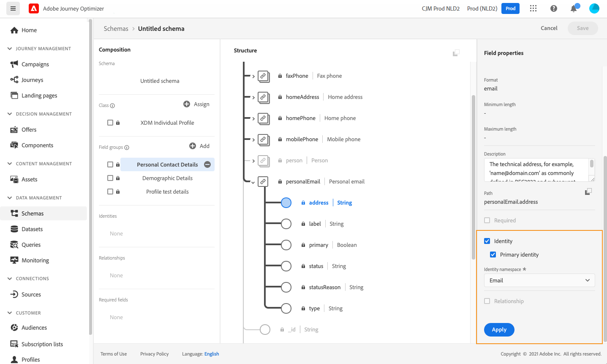
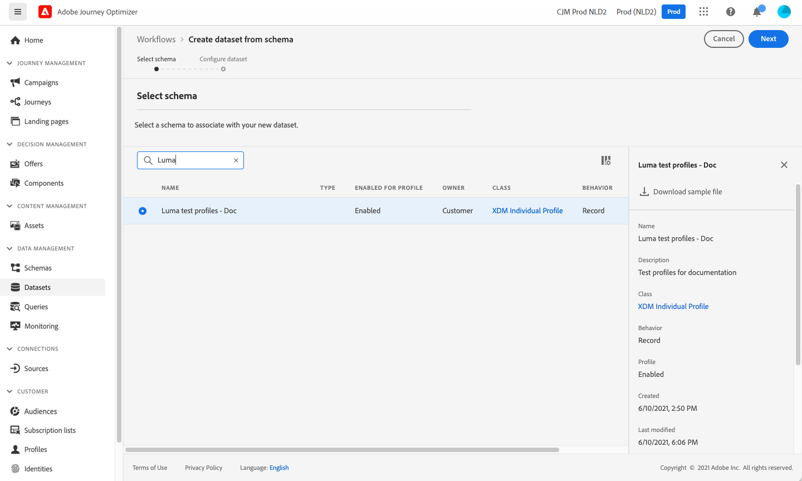
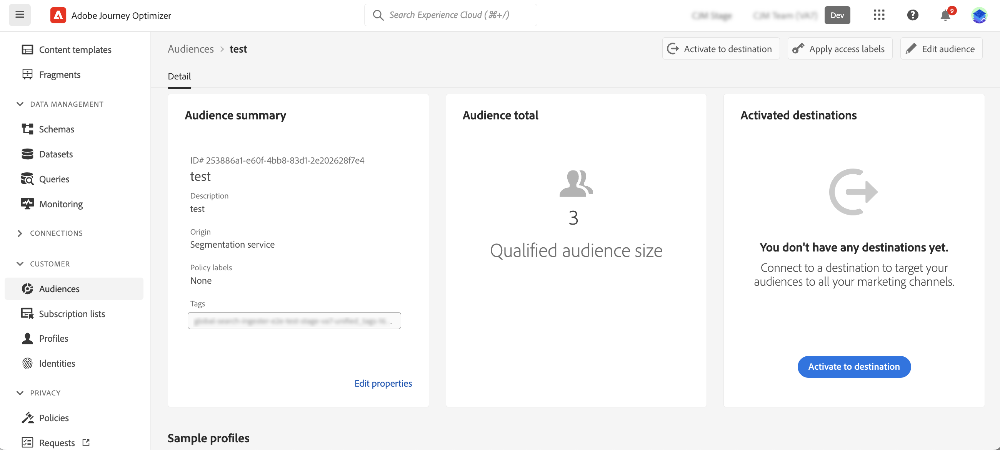

# Criar perfis de teste {#create-test-profiles}

Perfis de teste são necessários ao usar o [modo de teste](../building-journeys/testing-the-journey.md) em uma jornada e para [visualizar e testar seu conteúdo](../content-management/preview-test.md).

>[!NOTE]
>
>O [!DNL Journey Optimizer] permite testar diferentes variantes do seu conteúdo, visualizando-o e enviando provas com dados de entrada de exemplo carregados de um arquivo CSV ou JSON, ou adicionados manualmente. [Saiba como testar seu conteúdo usando dados de entrada de exemplo](../test-approve/simulate-sample-input.md)

Você pode criar perfis de teste [carregando um arquivo CSV](#create-test-profiles-csv) ou usando [chamadas de API](#create-test-profiles-api). [!DNL Adobe Journey Optimizer] também fornece um [caso de uso no produto](#use-case-1) específico para facilitar a criação do perfil de teste.

Você pode fazer upload de um arquivo JSON em um conjunto de dados existente. Para obter mais informações, consulte a [documentação de Assimilação de dados](https://experienceleague.adobe.com/docs/experience-platform/ingestion/tutorials/ingest-batch-data.html?lang=pt-BR#add-data-to-dataset){target="_blank"}.

Observe que a criação de um perfil de teste é semelhante à criação de perfis comuns no [!DNL Adobe Experience Platform]. Para obter mais informações, consulte a [documentação de Perfil do cliente em tempo real](https://experienceleague.adobe.com/docs/experience-platform/profile/home.html?lang=pt-BR){target="_blank"}.

➡️ [Saiba como criar perfis de teste neste vídeo](#video)

## Pré-requisitos {#test-profile-prerequisites}

Para criar perfis, primeiro crie um esquema e um conjunto de dados no Adobe [!DNL Journey Optimizer].

### Criar um esquema

Para **criar um esquema**, siga estas etapas:

1. Na seção de menu DATA MANAGEMENT, clique em **[!UICONTROL Esquemas]** e selecione o botão **[!UICONTROL Criar esquema]**.

   

1. Selecione **[!UICONTROL Padrão]** como a opção de criação do esquema.
1. Selecione um tipo de esquema, por exemplo **Perfil Individual**, e clique em **Próximo**.
   
1. Insira um nome para o esquema e clique em **Concluir**.
   
1. Na seção **Grupos de campos**, à esquerda, clique em **Adicionar** e selecione os grupos de campos apropriados. Adicione o grupo de campos **Detalhes do teste de perfil**.
   
Depois de concluído, clique em **[!UICONTROL Adicionar grupos de campos]**: a lista de grupos de campos é exibida na tela de visão geral do esquema.
   

   >[!NOTE]
   >
   >Clique no nome do schema para atualizar suas propriedades.

1. Na lista de campos, clique no campo que você deseja definir como a identidade principal.
   
1. No painel direito **[!UICONTROL Propriedades do campo]**, verifique as opções **[!UICONTROL Identidade]** e **[!UICONTROL Identidade primária]** e selecione um namespace. Se você quiser que a identidade principal seja um endereço de email, escolha o namespace **[!UICONTROL Email]**. Clique em **[!UICONTROL Aplicar]**.
   
1. Selecione o esquema e habilite a opção **[!UICONTROL Perfil]** no painel **[!UICONTROL Propriedades do esquema]**.
   
1. Clique em **Salvar**.

>[!NOTE]
>
>Para obter mais informações sobre a criação de esquemas, consulte a [documentação XDM](https://experienceleague.adobe.com/docs/experience-platform/xdm/ui/resources/schemas.html?lang=pt-BR#prerequisites){target="_blank"}.

### Criar um conjunto de dados

Em seguida, é necessário **criar o conjunto de dados** no qual os perfis serão importados. Siga estas etapas:

1. Navegue até **[!UICONTROL Conjuntos de Dados]** e clique em **[!UICONTROL Criar conjunto de dados]**.
   
1. Escolha **[!UICONTROL Criar conjunto de dados do esquema]**.
   
1. Selecione o esquema criado anteriormente e clique em **[!UICONTROL Avançar]**.
   
1. Escolha um nome e clique em **[!UICONTROL Concluir]**.
   
1. Habilite a opção **[!UICONTROL Perfil]**.
   

>[!NOTE]
>
> Para obter mais informações sobre a criação do conjunto de dados, consulte a [documentação do Serviço de Catálogo](https://experienceleague.adobe.com/docs/experience-platform/catalog/datasets/user-guide.html?lang=pt-BR#getting-started){target="_blank"}.

## Caso de uso no produto{#use-case-1}

Na página inicial do [!DNL Adobe Journey Optimizer], você pode aproveitar o caso de uso de perfis de teste no produto. Esse caso de uso facilita a criação de perfis de teste usados para jornadas de teste antes da publicação.


Clique no botão **[!UICONTROL Começar]** para iniciar o caso de uso.

As seguintes informações são obrigatórias:

1. **Namespace de identidade**: o [namespace de identidade](../audience/get-started-identity.md) usado para identificar exclusivamente os perfis de teste. Por exemplo, se o email for usado para identificar os perfis de teste, o namespace de identidade **Email** deverá ser selecionado. Se o identificador exclusivo for o número de telefone, o namespace de identidade **Telefone** deverá ser selecionado.

2. **Arquivo CSV**: um arquivo separado por vírgulas contendo a lista de perfis de teste a serem criados. O caso de uso espera um formato predefinido para o arquivo CSV que contém a lista de perfis de teste a serem criados. Cada linha no arquivo deve incluir os seguintes campos na ordem correta, como a seguir:

   1. **Id de pessoa**: identificador exclusivo do perfil de teste. Os valores desse campo devem refletir o namespace de identidade que foi selecionado. (Por exemplo, se **Telefone** for selecionado para o namespace de identidade, os valores desse campo deverão ser números de telefone. Da mesma forma, se **Email** for selecionado, os valores deste campo deverão ser emails)
   1. **Endereço de email**: testar endereço de email do perfil. (O campo **Id da Pessoa** e o campo **Endereço de Email** poderão conter os mesmos valores se **Email** for selecionado como namespace de identidade)
   1. **Nome**: nome do perfil de teste.
   1. **Sobrenome**: testar sobrenome do perfil.
   1. **Cidade**: cidade de residência do perfil de teste
   1. **País**: país de residência do perfil de teste
   1. **Gênero**: gênero do perfil de teste. Os valores disponíveis são **masculino**, **feminino** e **não_especificado**

Depois de selecionar o namespace de identidade e fornecer o arquivo CSV com base no formato acima, selecione o botão **[!UICONTROL Executar]** no canto superior direito. O caso de uso pode levar alguns minutos para ser concluído. Quando o caso de uso concluir o processamento e a criação dos perfis de teste, uma notificação será enviada ao usuário.
>[!NOTE]
>
>Os perfis de teste podem substituir os perfis existentes. Antes de executar o caso de uso, verifique se o CSV contém apenas perfis de teste e se ele é executado na sandbox correta.

<!-- Removed as asked in DOCAC-13605 AJO Test Profiles Using a Journey should be removed
## Turn a profile into a test profile{#turning-profile-into-test}

You can turn an existing profile into a test profile: you can update profiles attributes in the same way as when you create a profile. 

A simple way to do this is by using an **[!UICONTROL Update Profile]** action activity in a journey and change the **testProfile** boolean field from false to true.

Your journey will be composed of a **[!UICONTROL Read Audience]** and an **[!UICONTROL Update Profile]** activity. You first need to create an audience targeting the profiles you want to turn into test profiles. 

>[!NOTE]
>
> Since you will be updating the **testProfile** field, the chosen profiles must include this field. The related schema must have the **Profile test details** field group. See [this section](../audience/creating-test-profiles.md#create-test-profiles).

1. Browse to **Audiences**, then **Create audience**, in the top right.
     
1. Define a name for your audience and build the audience: choose the field(s) and value(s) to target the profiles you want.
     
1. Click **Save** and check that the profiles are correctly targeted by the audience.
     

    >[!NOTE]
    >
    > Audience calculation can take some time. Learn more about audiences in [this section](../audience/about-audiences.md).

1. Now create a new journey and start with a **[!UICONTROL Read Audience]** orchestration activity.
1. Choose the previously created audience and the namespace that your profiles use.
    
1. Add an **[!UICONTROL Update Profile]** action activity. 
1. Select the schema, the **testProfiles** field, the dataset and set the value to **True**. To perform this, in the **[!UICONTROL VALUE]** field, click the **Pen** icon on the right, select **[!UICONTROL Advanced mode]** and enter **true**.
    
1. Click **[!UICONTROL Publish]**.
1. In the **[!UICONTROL Audiences]** section, check that the profiles have been correctly updated.
    

    >[!NOTE]
    >
    > For more information on the **[!UICONTROL Update Profile]** activity, refer to [this section](../building-journeys/update-profiles.md).
-->

## Criar um perfil de teste usando um arquivo csv{#create-test-profiles-csv}

No [!DNL Adobe Experience Platform], é possível criar perfis carregando um arquivo csv contendo os diferentes campos de perfil no conjunto de dados. Esse é o método mais fácil.

1. Crie um arquivo csv simples usando um software de planilha.
1. Adicione uma coluna para cada campo obrigatório. Adicione o campo de identidade principal (&quot;personID&quot; no exemplo acima) e o campo &quot;testProfile&quot; definido como &quot;true&quot;.
   
1. Adicione uma linha por perfil e preencha os valores para cada campo.
   
1. Salve a planilha como um arquivo csv. Verifique se as vírgulas são usadas como separadores.
1. Navegue até [!DNL Adobe Experience Platform] **Workflows**.
   
1. Escolha **Mapear CSV para esquema XDM** e clique em **Iniciar**.
   
1. Selecione o conjunto de dados para o qual você deseja importar os perfis. Clique em **Next**.
   
1. Clique em **Escolher arquivos** e selecione seu arquivo csv. Quando o arquivo for carregado, clique em **Avançar**.
   
1. Mapeie os campos csv de origem para os campos de esquema e clique em **Concluir**.
   
1. A importação de dados é iniciada. O status será movido de **Processando** para **Sucesso**. Clique em **Visualizar conjunto de dados**, na parte superior direita.
   
1. Verifique se os perfis de teste foram adicionados corretamente.
   

Seus perfis de teste são adicionados e agora podem ser usados ao testar uma jornada. Consulte [esta seção](../building-journeys/testing-the-journey.md).

>[!NOTE]
>
>Para obter mais informações sobre importações csv, consulte a [documentação de Assimilação de dados](https://experienceleague.adobe.com/docs/experience-platform/ingestion/tutorials/map-a-csv-file.html?lang=pt-BR#tutorials){target="_blank"}.

## Criar perfis de teste usando chamadas de API{#create-test-profiles-api}

Você também pode criar perfis de teste por meio de chamadas de API. Saiba mais em [[!DNL Adobe Experience Platform] documentação](https://experienceleague.adobe.com/docs/experience-platform/profile/home.html?lang=pt-BR){target="_blank"}.

Você deve usar um esquema de Perfil que contenha o grupo de campos &quot;Detalhes do teste de perfil&quot;. O sinalizador testProfile faz parte deste grupo de campos.
Ao criar um perfil, passe o valor: testProfile = true.

Observe que você também pode atualizar um perfil existente para alterar seu sinalizador testProfile para &quot;true&quot;.

Este é um exemplo de uma chamada de API para criar um perfil de teste:

```bash
curl -X POST \
'https://dcs.adobedc.net/collection/xxxxxxxxxxxxxx' \
-H 'Cache-Control: no-cache' \
-H 'Content-Type: application/json' \
-H 'Postman-Token: xxxxx' \
-H 'cache-control: no-cache' \
-H 'x-api-key: xxxxx' \
-H 'x-gw-ims-org-id: xxxxx' \
-d '{
"header": {
"msgType": "xdmEntityCreate",
"msgId": "xxxxx",
"msgVersion": "xxxxx",
"xactionid":"xxxxx",
"datasetId": "xxxxx",
"imsOrgId": "xxxxx",
"source": {
"name": "Postman"
},
"schemaRef": {
"id": "https://example.adobe.com/mobile/schemas/xxxxx",
"contentType": "application/vnd.adobe.xed-full+json;version=1"
}
},
"body": {
"xdmMeta": {
"schemaRef": {
"contentType": "application/vnd.adobe.xed-full+json;version=1"
}
},
"xdmEntity": {
"_id": "xxxxx",
"_mobile":{
"ECID": "xxxxx"
},
"testProfile":true
}
}
}'
```

## Vídeo tutorial {#video}

Saiba como criar perfis de teste.

>[!VIDEO](https://video.tv.adobe.com/v/334236?quality=12)
