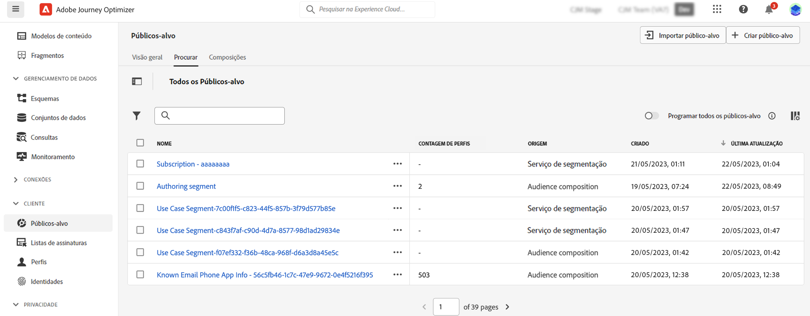

# Introdução à composição de público {#get-start-audience-composition}

>[!CONTEXTUALHELP]
>id="ajo_ao_create_composition"
>title="Criar uma composição"
>abstract="Crie um fluxo de trabalho de composição para combinar públicos existentes da Adobe Experience Platform em uma tela visual e aproveitar várias atividades (divisão, exclusão..) para criar novos públicos."

>[!BEGINSHADEBOX]

Estas documentações fornecem informações detalhadas sobre como trabalhar com a composição de público-alvo no Adobe Journey Optimizer. Se você for um cliente somente do Perfil do cliente em tempo real e não estiver usando o Adobe Journey Optimizer, [clique aqui](https://experienceleague.adobe.com/docs/experience-platform/segmentation/ui/audience-composition.html?lang=pt-BR){target="_blank"}.

>[!ENDSHADEBOX]

A composição do público permite criar **workflows de composição**, em que é possível combinar públicos existentes da Adobe Experience Platform em uma tela visual e aproveitar várias atividades (divisão, exclusão..) para criar novos públicos.

Depois de concluído, os **públicos resultantes** são salvos na Adobe Experience Platform junto com os públicos existentes e podem ser **aproveitados em campanhas** para direcionar clientes. [Saiba como trabalhar com campanhas](../campaigns/get-started-with-campaigns.md)

>[!IMPORTANT]
>
>Por enquanto, o uso de públicos-alvo resultantes de fluxos de trabalho de composição em jornadas está disponível como um beta privado. Para obter mais informações, entre em contato com o seu representante da Adobe.
>
>As campanhas no Adobe Journey Optimizer ainda não estão integradas ao serviço de aplicação de políticas. Portanto, os rótulos de uso de dados que você aplicar aos atributos de público-alvo não serão aplicados às campanhas do Journey Optimizer.

A composição de público-alvo é acessível no menu **[!UICONTROL Públicos-alvo]** do Adobe Journey Optimizer:

* A guia **[!UICONTROL Visão geral]** fornece um painel dedicado com métricas principais relacionadas aos dados de público-alvo da sua organização. Para saber mais, consulte [Guia de painéis da Adobe Experience Platform](https://experienceleague.adobe.com/docs/experience-platform/dashboards/guides/segments.html?lang=pt-BR).

* A guia **[!UICONTROL Procurar]** lista todos os públicos existentes armazenados na Adobe Experience Platform.

* A guia **[!UICONTROL Composições]** permite criar workflows de composição em que é possível combinar e organizar públicos para criar novos.

Clique em cada cartão para saber como trabalhar com a composição de público:

<table style="table-layout:fixed"><tr style="border: 0;">
<td>

<a href="create-compositions.md"><strong>Criar seu primeiro workflow de composição</strong></a>
</td>
<td>

<a href="composition-canvas.md"><strong>Trabalhar com a tela de composição</strong></a>
</td>
<td>

<a href="access-audiences.md"><strong>Acessar e gerenciar públicos-alvo</strong></a>
</td>
</tr></table>
