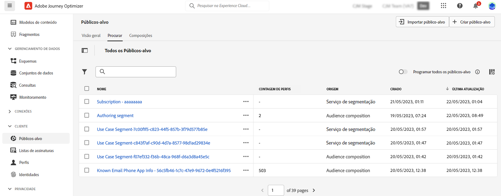
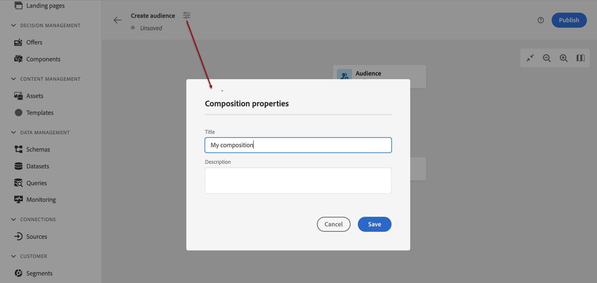
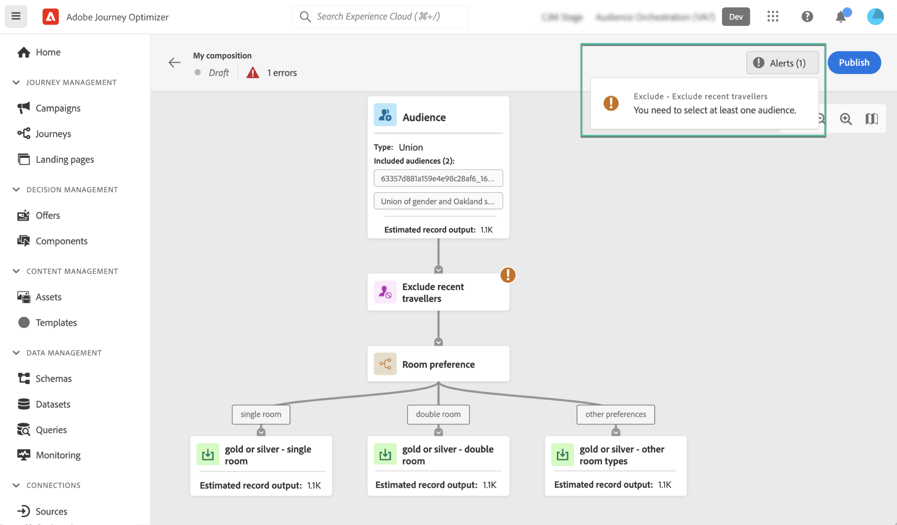
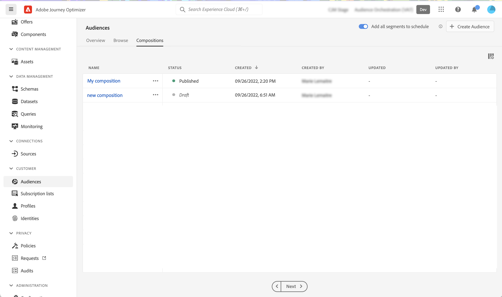

# Introdução à composição de público-alvo {#get-start-audience-composition}

>[!CONTEXTUALHELP]
>id="ajo_ao_create_composition"
>title="Criar uma composição"
>abstract="Crie um fluxo de trabalho de composição para combinar públicos-alvo existentes do Adobe Experience Platform em uma tela visual e aproveitar várias atividades (dividir, excluir...) para criar novos públicos-alvo."

>[!CONTEXTUALHELP]
>id="ajo_ao_publish"
>title="Publicar seu público"
>abstract="Publique sua composição para salvar o(s) público(s) resultante(s) no Adobe Experience Platform."

>[!CONTEXTUALHELP]
>id="ajo_ao_audience"
>title="Atividade de público"
>abstract="A atividade de Público-alvo permite incluir em sua composição perfis adicionais pertencentes a um público-alvo existente."

>[!CONTEXTUALHELP]
>id="ajo_ao_merge_types"
>title="Mesclar tipos"
>abstract="Especifique como os perfis dos públicos selecionados devem ser mesclados."

>[!CONTEXTUALHELP]
>id="ajo_ao_exclude_type"
>title="Excluir tipo"
>abstract="Use o tipo Excluir público-alvo para excluir perfis que pertencem a um público-alvo existente. Excluir usando o tipo de atributo permite excluir perfis com base em um atributo específico."

>[!CONTEXTUALHELP]
>id="ajo_ao_exclude"
>title="Excluir atividade"
>abstract="A atividade Excluir permite excluir perfis de sua composição selecionando um público-alvo existente ou usando uma regra."

>[!CONTEXTUALHELP]
>id="ajo_ao_enrich"
>title="Enriquecer atividade"
>abstract="Use a atividade Enrich para enriquecer seu público-alvo com atributos adicionais provenientes de conjuntos de dados da Adobe Experience Platform. Por exemplo, você pode adicionar informações relacionadas ao produto comprado como nome, preço ou ID do fabricante e aproveitar essas informações para personalizar os deliveries enviados ao público."

>[!CONTEXTUALHELP]
>id="ajo_ao_enrich_dataset"
>title="Conjunto de dados de enriquecimento"
>abstract="Selecione o conjunto de dados de enriquecimento que contém os dados que você deseja associar ao público."

>[!CONTEXTUALHELP]
>id="ajo_ao_enrich_criteria"
>title="Critérios de enriquecimento"
>abstract="Selecione os campos a serem usados como chave de reconciliação entre o conjunto de dados de origem, ou seja, o público-alvo e o conjunto de dados de enriquecimento."

>[!CONTEXTUALHELP]
>id="ajo_ao_enrich_attributes"
>title="Atributos de enriquecimento"
>abstract="Selecione um ou vários atributos do conjunto de dados de enriquecimento para associar ao público. Depois que a composição é publicada, esses atributos são associados ao público-alvo e podem ser aproveitados em campanhas do Journey Optimizer para personalizar os deliveries."

>[!CONTEXTUALHELP]
>id="ajo_ao_ranking"
>title="Atividade de classificação"
>abstract="A atividade Rank permite classificar perfis com base em um atributo específico e incluí-los na composição. Por exemplo, inclua os 50 perfis com a maior quantidade de pontos de fidelidade."

>[!CONTEXTUALHELP]
>id="ajo_ao_rank_profilelimit_text"
>title="Adicionar limite de perfil"
>abstract="Ative essa opção para especificar um número máximo de perfis a serem incluídos na composição."

<!--
 [!CONTEXTUALHELP]
>id="ajo_ao_control_group_text"
>title="Control Group"
>abstract="Use control groups to isolate a portion of the profiles. This allows you to measure the impact of a marketing activity and make a comparison with the behavior of the rest of the population."
-->

>[!CONTEXTUALHELP]
>id="ajo_ao_split"
>title="Dividir atividade"
>abstract="A atividade Split permite dividir a composição em vários caminhos. Ao publicar a composição, um público-alvo será salvo no Adobe Experience Platform para cada caminho."

>[!CONTEXTUALHELP]
>id="ajo_ao_split_type"
>title="Tipo de divisão"
>abstract="Use o tipo de divisão Porcentagem para dividir perfis aleatoriamente em vários caminhos. O tipo de divisão Atributo permite dividir perfis com base em um atributo específico."

>[!CONTEXTUALHELP]
>id="ajo_ao_split_otherprofiles_text"
>title="Outros perfis"
>abstract="Ative esta opção para criar um caminho adicional com os perfis restantes que não correspondem a nenhuma das condições especificadas nos outros caminhos."

>[!BEGINSHADEBOX]

Esta documentação fornece informações detalhadas sobre como trabalhar com a composição de público no Adobe Journey Optimizer. Se você for apenas um cliente do Perfil do cliente em tempo real e não estiver usando o Adobe Journey Optimizer, [clique aqui](https://experienceleague.adobe.com/docs/experience-platform/segmentation/ui/audience-composition.html){target="_blank"}.

>[!ENDSHADEBOX]

A composição de público-alvo permite criar **fluxos de trabalho de composição**, nos quais você pode combinar públicos-alvo existentes do Adobe Experience Platform em uma tela visual e aproveitar várias atividades (dividir, excluir...) para criar novos públicos-alvo.

Depois de concluído, os **públicos-alvo resultantes** são salvos novamente na Adobe Experience Platform, juntamente com os públicos-alvo existentes, e podem ser aproveitados em campanhas e jornadas do Journey Optimizer para clientes-alvo. Saiba como direcionar públicos-alvo no Journey Optimizer

>[!IMPORTANT]
>
>* O uso de públicos-alvo e atributos da composição de público-alvo está indisponível para uso com o Healthcare Shield ou o Privacy and Security Shield.
>
>* Os atributos de enriquecimento ainda não estão integrados ao serviço de aplicação de políticas. Portanto, quaisquer rótulos de uso de dados que você aplicar aos atributos de enriquecimento não serão aplicados em campanhas ou jornadas do Journey Optimizer.

A composição de público-alvo pode ser acessada no menu **[!UICONTROL Públicos-alvo]** do Adobe Journey Optimizer:

* A guia **[!UICONTROL Visão geral]** fornece um painel dedicado com métricas principais relacionadas aos dados de público-alvo de sua organização. Para saber mais, consulte o [guia de Painéis do Adobe Experience Platform](https://experienceleague.adobe.com/docs/experience-platform/dashboards/guides/segments.html).

* A guia **[!UICONTROL Procurar]** lista todos os públicos existentes armazenados no Adobe Experience Platform.

* A guia **[!UICONTROL Composições]** permite criar fluxos de trabalho de composição em que você pode combinar e organizar públicos para criar novos.

## Criar um fluxo de trabalho de composição {#create}

Para criar um fluxo de trabalho de composição, siga estas etapas:

1. Acesse o menu **[!UICONTROL Públicos-alvo]** e selecione **[!UICONTROL Criar público-alvo]**.

1. Selecione **[!UICONTROL Compor Público]**.

   

1. A tela de composição é exibida com duas atividades padrão:

   * **[!UICONTROL Público-alvo]**: o ponto inicial da sua composição. Essa atividade permite selecionar um ou vários públicos-alvo como base para o fluxo de trabalho,

   * **[!UICONTROL Salvar]**: a última etapa da sua composição. Essa atividade permite salvar o resultado do fluxo de trabalho em um novo público-alvo.

1. Abra as propriedades de composição para especificar um título e uma descrição.

   Se nenhum título for definido nas propriedades, o rótulo da composição é definido como &quot;Composição&quot;, seguido pela data e hora de criação.

   

1. Configure sua composição adicionando quantas atividades forem necessárias entre as atividades de **[!UICONTROL Público]** e **[!UICONTROL Salvar]**. Para obter mais informações sobre como criar uma composição, consulte a [Documentação de composição de público-alvo](https://experienceleague.adobe.com/en/docs/experience-platform/segmentation/ui/audience-composition).

   

1. Quando a composição estiver pronta, clique no botão **[!UICONTROL Publicar]** para publicar a composição e salvar os públicos resultantes no Adobe Experience Platform.

   >[!IMPORTANT]
   >
   >Você pode publicar até 10 composições em uma determinada sandbox. Se tiver atingido esse limite, será necessário excluir uma composição para liberar espaço e publicar uma nova.

   Se ocorrer algum erro durante a publicação, os alertas serão exibidos com informações sobre como resolver o problema.

   

1. A composição é publicada. Os públicos-alvo resultantes são salvos no Adobe Experience Platform e estão prontos para serem direcionados no Journey Optimizer. [Saiba como direcionar públicos no Journey Optimizer](../audience/about-audiences.md#about-segments)

>[!NOTE]
>
>Os públicos-alvo de **composição de público-alvo** são executados diariamente, portanto, talvez seja necessário aguardar até 24 horas para usá-los no Journey Optimizer. Os atributos enriquecidos nos públicos-alvo de composição do público-alvo estão tão atualizados quanto a última execução de composição, que pode durar até 24 horas no passado.

## Acessar composições {#access}

Todas as composições criadas podem ser acessadas na guia **[!UICONTROL Composições]**. É possível duplicar ou excluir uma composição existente a qualquer momento usando o botão de reticências na lista.

As composições podem ter vários status:

* **[!UICONTROL Rascunho]**: a composição está em andamento e não foi publicada.
* **[!UICONTROL Publicado]**: a composição foi publicada, os públicos resultantes foram salvos e estão disponíveis para uso.

>[!NOTE]
>
>No momento, a composição de público-alvo não está integrada ao recurso de redefinição da sandbox. Antes de iniciar uma redefinição de sandbox, é necessário excluir as composições manualmente para garantir que os dados do público-alvo associado sejam limpos corretamente. Informações detalhadas estão disponíveis na [Documentação de sandbox](https://experienceleague.adobe.com/docs/experience-platform/sandbox/ui/user-guide.html#delete-audience-compositions) do Adobe Experience Platform
