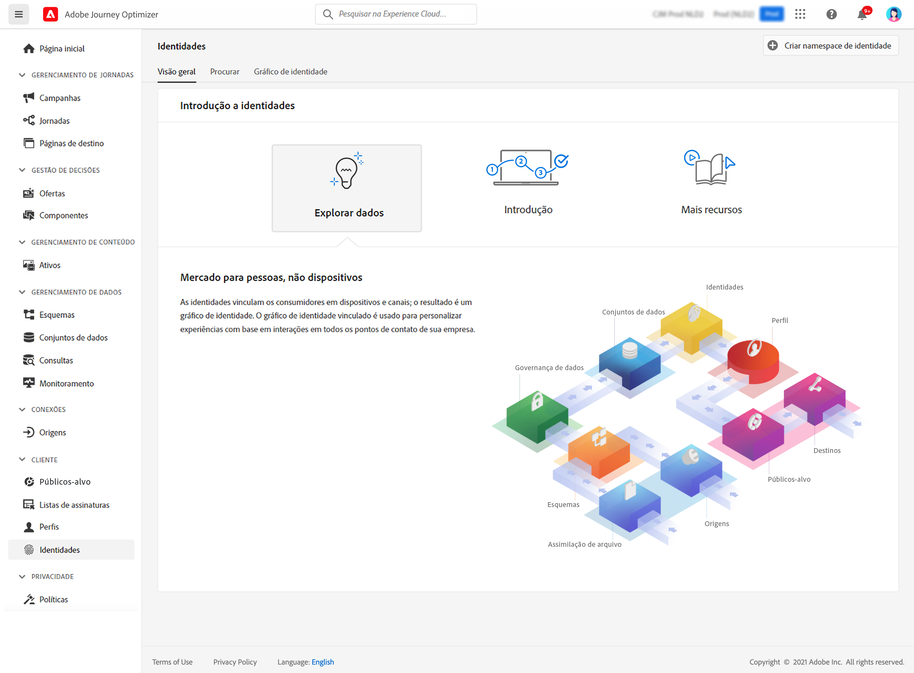

# Introdução a identidades {#identities-gs}

Uma identidade são dados exclusivos de uma entidade, geralmente um objeto do mundo real, como uma pessoa individual, um dispositivo de hardware ou um navegador da Web. Uma identidade totalmente qualificada consiste em dois elementos:

* O **namespace de identidade** serve como um indicador do contexto ao qual uma identidade está relacionada.
* O **valor de identidade** é uma cadeia de caracteres que representa uma entidade.

Vamos pegar o telefone 555-555-1234. Neste exemplo, a sequência &quot;555-555-1234&quot; é um **valor de identidade**, que pode ser categorizado como um **namespace de identidade** de &quot;Telefone&quot;.

O menu **Identidades** no [!DNL Adobe Journey Optimizer] permite navegar com eficiência pelos vários identificadores que compõem os clientes do banco de dados.

Ele fornece um **Gráfico de identidade**, que é um mapa das relações entre diferentes identidades para um cliente específico, fornecendo uma representação visual de como o cliente interage com a sua marca em diferentes canais. Todos os gráficos de identidade do cliente são gerenciados e atualizados coletivamente pelo Adobe Experience Platform Identity Service, em resposta à atividade do cliente.

Informações detalhadas sobre como trabalhar com identidades estão disponíveis na [documentação do Serviço de Identidade](https://experienceleague.adobe.com/docs/experience-platform/identity/home.html?lang=pt-BR){target="_blank"}.
