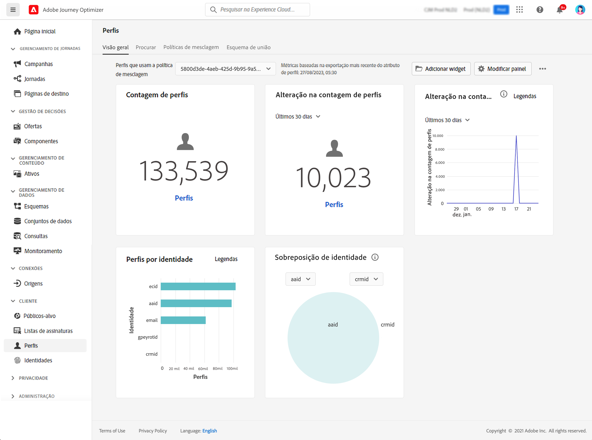

# Introdução a perfis {#profiles-gs}

Aproveite o Perfil do cliente em tempo real no [!DNL Adobe Journey Optimizer] para ter uma visão holística de cada cliente individual ao combinar dados de vários canais, incluindo online, offline, CRM e de terceiros. **Perfis** permitem consolidar os dados do cliente em uma visualização unificada, oferecendo uma conta acionável com carimbo de data e hora de cada interação com o cliente.

>[!NOTE]
>
>Se sua organização for nova no [!DNL Adobe Journey Optimizer] e ainda não tem conjuntos de dados de Perfil ativos ou políticas de mesclagem criadas, o painel **Perfis** não está visível. Em vez disso, a guia **Visão geral** exibe links para a documentação da Adobe Experience Platform para ajudar você a começar a usar o Perfil do cliente em tempo real.

Para saber como acessar e trabalhar com o **Painel de Perfil** e informações detalhadas sobre as métricas exibidas no painel, consulte [esta seção](https://experienceleague.adobe.com/docs/experience-platform/profile/ui/user-guide.html?lang=pt-BR){target="_blank"}.

É possível unir fragmentos de dados de várias fontes e combiná-los para ter uma visualização completa de cada um de seus clientes individuais. Ao reunir esses dados, as políticas de mesclagem são as regras usadas para determinar como os dados serão priorizados e quais dados serão combinados para criar a visualização unificada.

Saiba mais sobre **políticas de Mesclagem** nesta [documentação](https://experienceleague.adobe.com/docs/experience-platform/profile/merge-policies/ui-guide.html?lang=pt-BR){target="_blank"}.

**Consulte também**

* [Documentação de Perfil do cliente em tempo real](https://experienceleague.adobe.com/docs/experience-platform/query/home.html?lang=pt-BR){target="_blank"}
* [Vídeo de visão geral do Perfil do cliente em tempo real](https://experienceleague.adobe.com/docs/experience-platform/profile/home.html?lang=pt-BR){target="_blank"}
