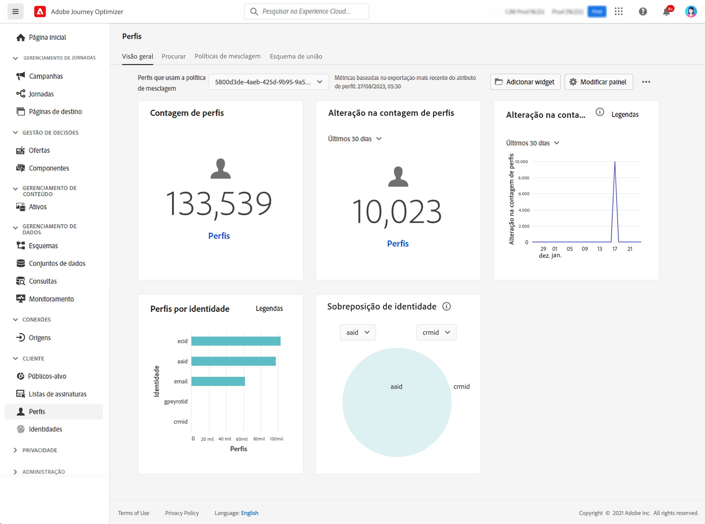

# Introdução a perfis {#profiles-gs}

>[!BEGINSHADEBOX]

**Nesta página:** saiba como o Perfil de Cliente em Tempo Real no Adobe Journey Optimizer unifica os dados do cliente de fontes online, offline e de terceiros em uma única exibição e como acessar o painel de perfis.

>[!ENDSHADEBOX]

## Sobre perfis

Aproveite o Perfil do cliente em tempo real no [!DNL Adobe Journey Optimizer] para ter uma visão holística de cada cliente individual ao combinar dados de vários canais, incluindo online, offline, CRM e de terceiros. **Perfis** permitem consolidar os dados do cliente em uma visualização unificada, oferecendo uma conta acionável com carimbo de data e hora de cada interação com o cliente.

➡️ [Conheça este recurso no vídeo](#video)

**Perfil do Cliente em Tempo Real&#x200B;** - Integre atributos do cliente e eventos de fontes online, offline e de pseudônimos em um único perfil unificado. &#x200B;Use o perfil para envolver os clientes com experiências personalizadas em tempo real em vários pontos de contato. &#x200B;

**Assimilação de dados** - Conecte-se a várias fontes de dados para assimilar dados comportamentais, transacionais, financeiros e operacionais. Assimile dados em tempo real ou por meio de uploads em lote para manter os perfis atualizados constantemente. Os perfis não são criados diretamente na interface [!DNL Journey Optimizer] — eles são criados ou atualizados automaticamente no Adobe Experience Platform quando os dados são assimilados.

>[!NOTE]
>
>Ao assimilar dados, os emails fazem distinção entre maiúsculas e minúsculas. Isso significa que perfis duplicados podem ser criados (por exemplo, um perfil para John.Greene@luma.com, outro perfil para john.greene@luma.com) e usados ao direcionar o destinatário correspondente em suas jornadas e campanhas do [!DNL Journey Optimizer].

**Gráfico de identidade** - Combine dados de diferentes fontes usando identidades de clientes, como IDs de fidelidade ou IDs de sistema de CRM. &#x200B;Crie uma visualização abrangente do cliente, mapeando os relacionamentos entre diferentes identidades nos conjuntos de dados de uma marca. &#x200B;

**Envolvimento do cliente** - Use o perfil do cliente em tempo real para fornecer experiências contextuais e personalizadas, como ofertas e mensagens direcionadas. &#x200B;Envolva os clientes em vários canais, incluindo campanhas de marketing, suporte ao cliente e atualizações transacionais. &#x200B;

**Compartilhamento de dados** - Compartilhe perfis de clientes com os principais provedores de armazenamento na nuvem, como Amazon Web Services, Microsoft Azure e Google Cloud. Use perfis compartilhados para emissão de relatórios, arquivamento de dados ou análise mais profunda com ferramentas de business intelligence.

>[!MORELIKETHIS]
>
>* [Introdução à gestão de dados no Journey Optimizer](../data/gs-data.md)
>* [Documentação de Perfil do cliente em tempo real](https://experienceleague.adobe.com/docs/experience-platform/query/home.html?lang=pt-BR){target="_blank"}
>* [Medidas de proteção padrão para dados e segmentação do Perfil do cliente em tempo real](https://experienceleague.adobe.com/pt-br/docs/experience-platform/profile/guardrails){target="_blank"}
>* &#x200B;[Documentação de assimilação de dados](https://experienceleague.adobe.com/pt-br/docs/experience-platform/ingestion/home){target="_blank"}

## Painel de perfis

Para acessar perfis, navegue até o menu **[!UICONTROL Cliente]** / **[!UICONTROL Perfis]** no painel de navegação esquerdo.

>[!NOTE]
>
>Se sua organização for nova no [!DNL Adobe Journey Optimizer] e ainda não tem conjuntos de dados de Perfil ativos ou políticas de mesclagem criadas, o painel **Perfis** não está visível. Em vez disso, a guia **Visão geral** exibe links para a documentação da Adobe Experience Platform para ajudar você a começar a usar o Perfil do cliente em tempo real. Para saber como trabalhar com o **painel de Perfil** e obter informações detalhadas sobre as métricas exibidas no painel, consulte [esta seção](https://experienceleague.adobe.com/docs/experience-platform/profile/ui/user-guide.html?lang=pt-BR){target="_blank"}.

É possível reunir fragmentos de dados de várias fontes e combiná-los para obter uma visualização completa de cada cliente individual. Ao reunir esses dados, as políticas de mesclagem são as regras usadas para determinar como os dados são priorizados e quais dados são combinados para criar a exibição unificada. Saiba mais sobre **Políticas de mesclagem** nesta [documentação](https://experienceleague.adobe.com/docs/experience-platform/profile/merge-policies/ui-guide.html?lang=pt-BR){target="_blank"}.

## Vídeo tutorial {#video}

Saiba como a Adobe Experience Platform monta e atualiza Perfis de clientes em tempo real e como você pode acessar e usar esses perfis.

>[!VIDEO](https://video.tv.adobe.com/v/27251?quality=12)
