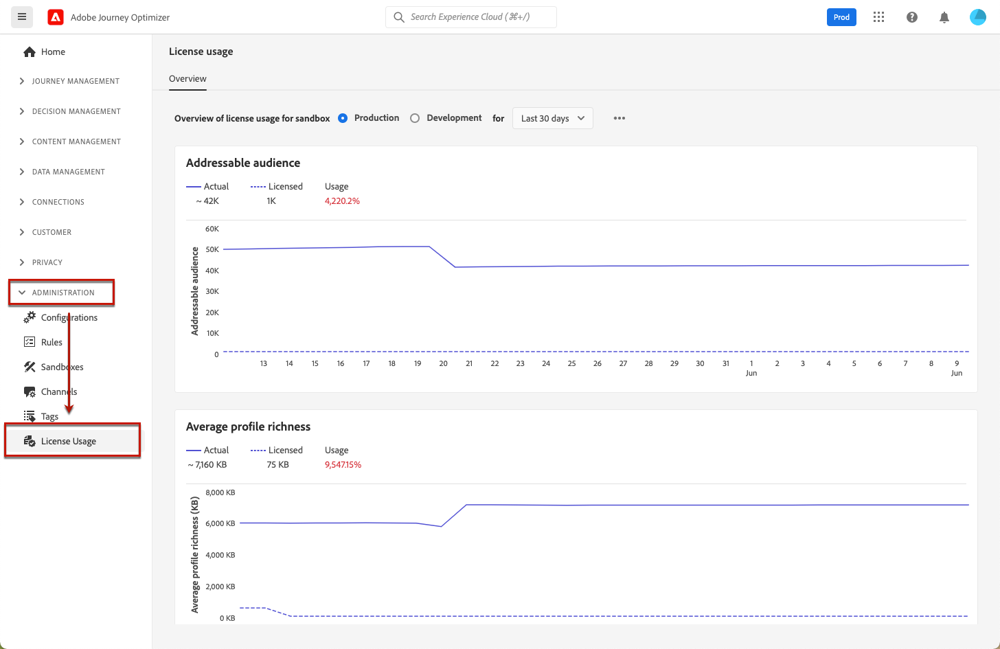

# Painel de uso da licença {#license-usage}

>[!BEGINSHADEBOX]

**Nesta página:** saiba como navegar no painel de uso de licenças da Adobe Journey Optimizer e solucionar problemas de aumentos inesperados na sua contagem de Perfis Engajáveis.

>[!ENDSHADEBOX]

A [!DNL Adobe Journey Optimizer] [interface de usuário](../start/user-interface.md) fornece um painel que exibe informações importantes sobre o uso de licença da sua organização, conforme capturadas durante um instantâneo diário.

Para acessar este painel, vá para **[!UICONTROL Administração]** > **[!UICONTROL Uso da Licença]**. Isso abrirá a guia **[!UICONTROL Visão geral]**, que exibe o painel.

>[!NOTE]
>
>* Para exibir o painel, você deve ter a permissão [Exibir Painel de Uso da Licença](https://experienceleague.adobe.com/docs/experience-platform/dashboards/permissions.html?lang=pt-BR#available-permissions){target="_blank"}.
>
>* Determinadas métricas (por exemplo, horas de computação, emails) não são exibidas para sandboxes de desenvolvimento, conforme indicado por `N/A` na coluna de cota. Somente valores não nulos são exibidos no painel: quando as métricas são zero ou próximas a zero, elas não são preenchidas.

Para [!DNL Adobe Journey Optimizer], o painel permite verificar o número de **Perfis envolventes** — perfis exclusivos envolvidos por meio de jornadas, campanhas ou decisões em uma janela contínua de 12 meses. Para obter uma explicação completa de como os Perfis envolventes são definidos e calculados, consulte [Perfis envolventes e uso de licença](get-started-profiles.md#engageable-profiles).

>[!NOTE]
>
>Se você observar um pico repentino na contagem de Perfis Acionáveis, consulte a [seção Solução de Problemas](#troubleshooting-engageable-profiles) abaixo para obter orientação detalhada sobre como entender e resolver o problema.

## Solução de problemas: aumento significativo na contagem de perfis ativáveis {#troubleshooting-engageable-profiles}

Se você observar um pico repentino na contagem de Perfis ativáveis (por exemplo, perfis que aumentam de centenas de milhares para milhões em um dia), esta seção fornecerá orientação para entender e resolver o problema.

### Compreender o aumento

A métrica Perfis acionáveis reflete o número de perfis únicos acionados por jornadas ou campanhas nos últimos 12 meses. Um aumento súbito pode resultar de:

* Grandes públicos-alvo sendo direcionados por novas jornadas ou campanhas
* Alterações nos conjuntos de dados habilitados para o Serviço de perfil
* Processamento em lote de públicos-alvo que não foram envolvidos recentemente

### Etapas de resolução

Para resolver esse problema, siga estas etapas:

1. **Entenda a lógica de contagem de perfis:**

   * Os perfis ativáveis são calculados com base em perfis exclusivos envolvidos por jornadas ou campanhas nos últimos 12 meses.
   * Se um perfil entrar em várias jornadas, ele será contado como um Perfil acionável para essa sandbox.
   * A métrica não pode diminuir a menos que não haja engajamento com determinados perfis por mais de 12 meses ou se perfis com pseudônimos forem compilados em perfis conhecidos.
   * Os perfis ativáveis são calculados usando o público-alvo endereçável do cliente.
   * O público-alvo envolvido nos últimos 12 meses usando qualquer um dos recursos do Journey Optimizer, do total de Públicos-alvo endereçáveis, determina a contagem de Perfis acionáveis.

2. **Investigue jornadas, campanhas e decisões direcionadas a públicos-alvo grandes:**

   * Revise jornadas e campanhas recentes direcionadas a um grande número de perfis usando [consultas de Perfis envolventes](../reports/query-examples.md#engageable-profiles-queries) ou [Serviço de consulta](https://experienceleague.adobe.com/pt-br/docs/experience-platform/query/home){target="_blank"}.
   * Identifique versões específicas do jornada que contribuíram para o pico nas contagens de perfis.
   * Jornadas, campanhas e decisões que envolvem novos perfis provavelmente levarão a um aumento nas contagens de eventos nos conjuntos de dados do Jornada, contribuindo para o aumento na contagem de Perfis acionáveis.

3. **Filtrar públicos-alvo no nível de jornada e campanhas:**

   * Aplique filtros no nível do público-alvo antes de iniciar jornadas ou campanhas para evitar aumentos desnecessários em Perfis envolventes.
   * Garanta que somente os públicos-alvo relevantes sejam direcionados durante os engajamentos.

4. **Reduzir tamanho do público endereçável:**

   * Exclua perfis pseudônimos, se necessário. Observe que essa ação afeta o Journey Optimizer e o Real-Time Customer Data Platform.
   * Saiba mais sobre [Expiração de dados de perfil pseudônimo](https://experienceleague.adobe.com/pt-br/docs/experience-platform/profile/pseudonymous-profiles){target="_blank"} no Guia de Perfil do Cliente em Tempo Real.
   * **Observação:** a expiração de dados do Perfil pseudônimo não pode ser configurada por meio da interface do usuário da plataforma ou de APIs. Você deve entrar em contato com o suporte para ativar esse recurso.

5. **Monitorar alterações no conjunto de dados:**

   * Verifique se os conjuntos de dados estão ativados para criação de perfil e certifique-se de que eles não contenham ECIDs em excesso (Experience Cloud IDs).
   * Se necessário, exclua conjuntos de dados com altas contagens de ECID e recrie-os com registros reduzidos.

6. **Desenvolver uma estratégia de redução de longo prazo:**

   * A contagem de Perfis acionáveis naturalmente diminuirá se determinados perfis permanecerem desativados por mais de 12 meses.

**Consulte também:**

* [Exemplos de consulta de Perfis Engajáveis](../reports/query-examples.md#engageable-profiles-queries) - Exemplos de consulta para monitorar e analisar seus Perfis Engajáveis
* [Visão geral do serviço de consulta do Adobe Experience Platform](https://experienceleague.adobe.com/pt-br/docs/experience-platform/query/home){target="_blank"}

## Documentação relacionada {#related-documentation}

Saiba mais na documentação do Adobe Experience Platform:

* [Visão geral do painel de uso da licença](https://experienceleague.adobe.com/docs/experience-platform/dashboards/guides/license-usage.html?lang=pt-BR){target="_blank"}
* [Explorar o painel de uso de licença](https://experienceleague.adobe.com/docs/experience-platform/dashboards/guides/license-usage.html?lang=pt-BR#exploring-the-license-usage-dashboard){target="_blank"}
* [Métricas disponíveis](https://experienceleague.adobe.com/docs/experience-platform/dashboards/guides/license-usage.html?lang=pt-BR#available-metrics){target="_blank"}
* [Expiração de dados do perfil pseudônimo](https://experienceleague.adobe.com/docs/experience-platform/profile/pseudonymous-profiles.html?lang=pt-BR){target="_blank"}
