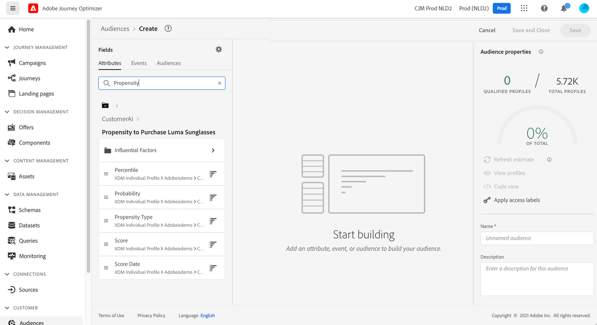

# Integrar a serviços inteligentes {#ai-overview}

A integração com **[!DNL Adobe Intelligent Services]** O permite aproveitar o potencial da inteligência artificial e do aprendizado de máquina em casos de uso da experiência do cliente. Isso permite que os analistas de marketing configurem previsões específicas para as necessidades de uma empresa usando configurações de nível empresarial sem a necessidade de experiência em ciência de dados.

[!DNL Intelligent Services]O , desenvolvido no Adobe Experience Platform, fornece aos profissionais de marketing responsáveis pelo acesso à experiência do cliente para IA-as-service, facilitando a previsão do comportamento do cliente, a medição do impacto de uma campanha ou a garantia de melhor retorno em cada investimento. Para obter mais informações sobre [!DNL Adobe Intelligent Services], consulte o [Documentação do Adobe Experience Platform](https://experienceleague.adobe.com/docs/experience-platform/intelligent-services/home.html){target=&quot;_blank&quot;}.

Integração entre [!DNL Journey Optimizer] e [!DNL Intelligent Services] permite aproveitar as previsões do cliente.

A API do cliente faz parte de [!DNL Adobe Intelligent Services]. Ele ajuda a prever o que um cliente provavelmente fará. Consulte a [Documentação do Adobe Experience Platform](https://experienceleague.adobe.com/docs/experience-platform/intelligent-services/customer-ai/overview.html){target=&quot;_blank&quot;}.

O Customer AI permite que as marcas criem pontuações baseadas em aprendizado de máquina de conversão ou de rotatividade que estarão disponíveis como atributos de perfil nos perfis do Adobe Experience Platform (Perfil do cliente em tempo real).

Como resultado, eles podem ser usados como quaisquer outros atributos de perfil nas condições do Journey Optimizer (para tomar as melhores decisões), ações ou criação de segmentos.

