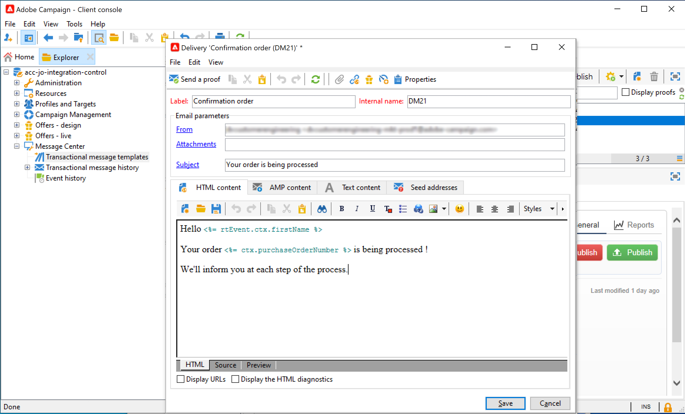
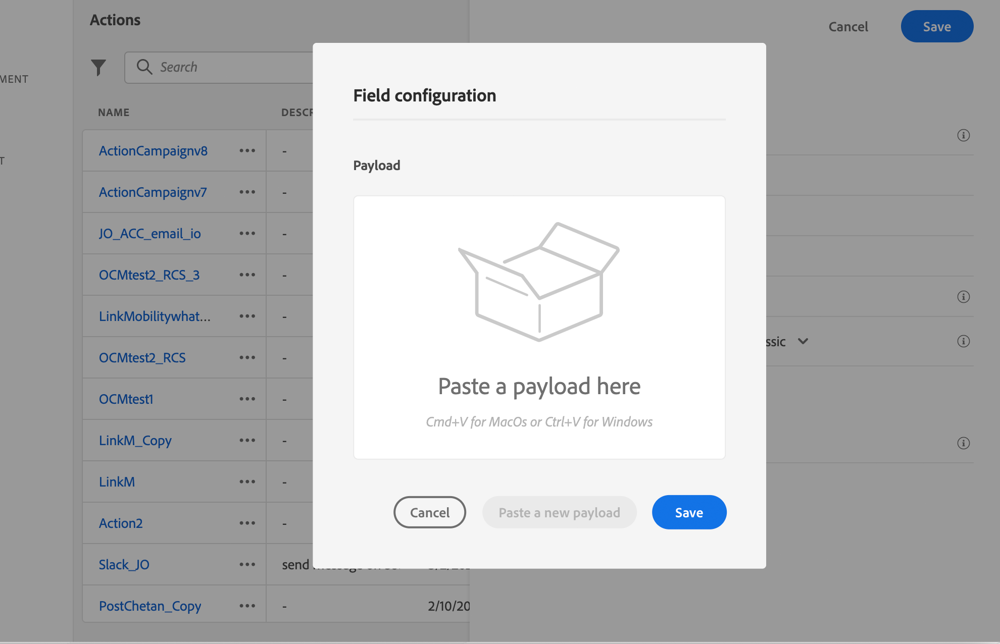

# Enviar uma mensagem com o Campaign v7/v8 {#campaign-v7-v8-use-case}

Este caso de uso explica todas as etapas necessárias para enviar um email usando a integração com o [!DNL Adobe Campaign] v7 e o [!DNL Adobe Campaign] v8.

>[!NOTE]
>
>Para usar essa integração, você deve ter o Campaign v7/v8 build 9125 ou superior.

Primeiro, crie um template de email transacional no Campaign. Em seguida, no Journey Optimizer, crie o evento, a ação e crie a jornada.

Para saber mais sobre a integração do Campaign, consulte estas páginas:

* [Criar uma ação de campanha](../action/acc-action.md)
* [Usando a ação em uma jornada](../building-journeys/using-adobe-campaign-v7-v8.md).

**[!DNL Adobe Campaign]**

A instância do Campaign deve ser provisionada para essa integração. O recurso de mensagens transacionais deve ser configurado.

1. Faça logon na instância de controle do Campaign.

1. Em **Administração** > **Plataforma** > **Enumerações**, selecione a enumeração **Tipo de evento** (eventType). Crie um novo tipo de evento (&quot;jornada-evento&quot;, em nosso exemplo). Use o nome interno do tipo de evento ao gravar o arquivo JSON posteriormente.

   ![Configurar um evento em [!DNL Adobe Journey Optimizer] com seleção de esquema e campo](assets/accintegration-uc-1.png)

1. Desconecte e reconecte à instância para que a criação entre em vigor.

1. Em **Centro de Mensagens** > **Modelos de mensagens transacionais**, crie um novo modelo de email com base no tipo de evento criado anteriormente.

   

1. Projete seu modelo. Neste exemplo, a personalização é aplicada ao nome do perfil e ao número do pedido. O nome está na fonte de dados [!DNL Adobe Experience Platform] e o número do pedido é um campo do evento Journey Optimizer. Use os nomes de campo corretos no Campaign.

   

1. Publique seu template transacional.

   

1. Escreva a carga JSON correspondente ao modelo.

```
{
     "channel": "email",
     "eventType": "journey-event",
     "email": "Email address",
     "ctx": {
          "firstName": "First name", "purchaseOrderNumber": "Purchase order number"
     }
}
```

* Para o canal, é necessário digitar &quot;email&quot;.
* Para eventType, use o nome interno do tipo de evento criado anteriormente.
* O endereço de email será uma variável, para que você possa digitar qualquer rótulo.
* No ctx, os campos de personalização também são variáveis.

**Journey Optimizer**

1. Criar um evento. Inclua o campo &quot;purchaseOrderNumber&quot;.

   ![Tela de configuração de ação personalizada para a integração Clássica [!DNL Adobe Campaign]](assets/accintegration-uc-5.png)

1. Crie uma ação no Journey Optimizer correspondente ao seu template de Campanha. No menu suspenso **Tipo de ação**, selecione **[!DNL Adobe Campaign]Clássico**.

   ![Seleção de tipo de ação mostrando a opção [!DNL Adobe Campaign] Clássica](assets/accintegration-uc-6.png)

1. Clique no **campo de carga** e cole o JSON criado anteriormente.

   

1. Para o endereço de email e os dois campos de personalização, altere **Constante** para **Variável**.

   

1. Agora crie uma nova jornada e comece com o evento criado anteriormente.

   

1. Adicione a ação e mapeie cada campo para o campo correto no Journey Optimizer.

   

1. Teste a jornada.

   

1. Agora você pode publicar sua jornada.
