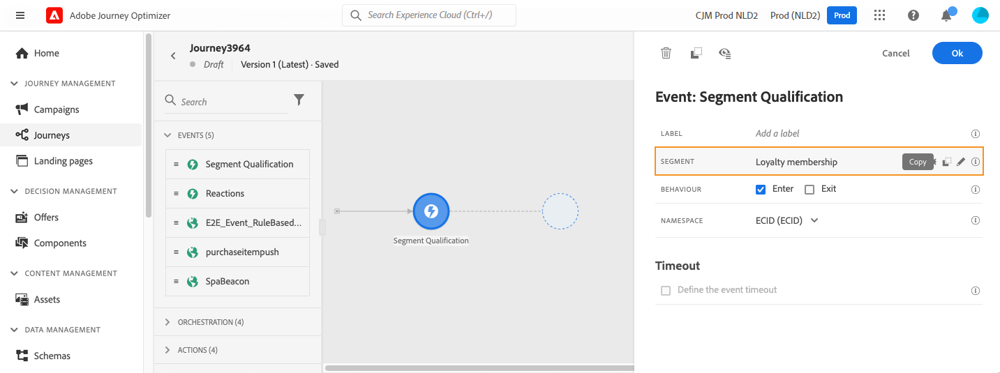

# Eventos de qualificação de público-alvo {#segment-qualification}

## Sobre eventos de qualificação de público-alvo{#about-segment-qualification}

>[!CONTEXTUALHELP]
>id="ajo_journey_event_segment_qualification"
>title="Eventos de qualificação de público-alvo"
>abstract="Essa atividade permite que sua jornada acompanhe as entradas e saídas de perfis nos públicos-alvo da Adobe Experience Platform para fazer com que as pessoas entrem ou avancem em uma jornada."

Essa atividade permite que sua jornada acompanhe as entradas e saídas dos perfis nos públicos da Adobe Experience Platform para que os indivíduos entrem ou avancem em uma jornada. Para obter mais informações sobre criação de público, consulte esta [seção](../audience/about-audiences.md).

Digamos que você tenha um público-alvo de “cliente prata”. Com essa atividade, você pode fazer com que todos os novos clientes Silver insiram uma jornada e enviem a eles uma série de mensagens personalizadas.

Esse tipo de evento pode ser posicionado como a primeira etapa ou posteriormente na jornada.

➡️ [Descubra este recurso no vídeo](#video)

### Observações importantes{#important-notes-segment-qualification}

* Lembre-se de que os públicos-alvo da Adobe Experience Platform são calculados uma vez por dia (**batch** públicos-alvo) ou em tempo real (para **públicos-alvo transmitidos**, usando a opção Públicos-alvo de alta frequência do Adobe Experience Platform).

   * Se o público-alvo selecionado for transmitido, os indivíduos que pertencem a esse público-alvo potencialmente entrarão na jornada em tempo real.
   * Se o público-alvo for em lote, as pessoas recém-qualificadas para esse público-alvo potencialmente inserirão a jornada quando o cálculo do público-alvo for executado no Adobe Experience Platform.

  Como prática recomendada, recomendamos usar somente públicos de streaming em uma atividade **de Qualificação de público**. Para casos de uso em lote, use uma atividade **[Ler público](read-audience.md)**.

  >[!NOTE]
  >
  >Devido à natureza em lote de públicos-alvo criados usando fluxos de trabalho de composição e upload personalizado, não é possível direcionar esses públicos-alvo em uma atividade de &quot;Qualificação de público-alvo&quot;. Somente públicos-alvo criados usando definições de segmento podem ser aproveitados nessa atividade.

* Grupos de campos de evento de experiência não podem ser usados em jornadas que começam com uma atividade Ler público, uma qualificação de Público ou um evento comercial.

* Ao usar uma qualificação de público-alvo em uma jornada, essa atividade de qualificação de público-alvo pode levar até 10 minutos para ficar ativa e ouvir os perfis que entram ou saem do público-alvo.

### Configurar a atividade {#configure-segment-qualification}

Para configurar a atividade **[!UICONTROL Qualificação de público-alvo]**, siga estas etapas:

1. Expanda a categoria **[!UICONTROL Eventos]** e solte uma atividade **[!UICONTROL Qualificação de público-alvo]** na tela.

   

1. Adicione um **[!UICONTROL Rótulo]** à atividade. Esta etapa é opcional.

1. Clique no campo **[!UICONTROL Público-alvo]** e selecione os públicos-alvo que deseja aproveitar.

   >[!NOTE]
   >
   >Observe que é possível personalizar as colunas exibidas na lista e classificá-las.

   

   Depois que o público-alvo é adicionado, o botão **[!UICONTROL Copiar]** permite copiar seu nome e ID:

   `{"name":"Loyalty membership","id":"8597c5dc-70e3-4b05-8fb9-7e938f5c07a3"}`

   

1. No campo **[!UICONTROL Comportamento]**, escolha se você deseja escutar entradas de público-alvo, saídas ou ambas.

   >[!NOTE]
   >
   >Observe que **[!UICONTROL Enter]** e **[!UICONTROL Exit]** correspondem aos status de participação de público-alvo **Realized** e **Exited** da Adobe Experience Platform. Para obter mais informações sobre como avaliar um público, consulte a [documentação do Serviço de segmentação](https://experienceleague.adobe.com/docs/experience-platform/segmentation/tutorials/evaluate-a-segment.html#interpret-segment-results){target="_blank"}.

1. Selecione um namespace. Isso só será necessário se o evento for posicionado como a primeira etapa da jornada. Por padrão, o campo é pré-preenchido com o último namespace usado.

   >[!NOTE]
   >
   >Você só pode selecionar um namespace de identidade com base em pessoas. Se você tiver definido um namespace para uma tabela de pesquisa (por exemplo: namespace ProductID para uma pesquisa de Produto), ele não estará disponível na lista suspensa **Namespace**.

   

A carga contém as seguintes informações de contexto, que podem ser usadas em condições e ações:

* o comportamento (entrada, saída)
* o carimbo de data e hora da qualificação
* a id do público-alvo

Ao usar o editor de expressão em uma condição ou ação que segue uma atividade de **[!UICONTROL Qualificação de público-alvo]**, você tem acesso ao nó **[!UICONTROL Qualificação de público-alvo]**. Você pode escolher entre o **[!UICONTROL Último horário de qualificação]** e o **[!UICONTROL status]** (entre ou saia).

Consulte [Atividade de condição](../building-journeys/condition-activity.md#about_condition).

Uma nova jornada que inclui um evento de qualificação de público-alvo está operacional dez minutos após a sua publicação. Esse intervalo corresponde ao intervalo de atualização do cache do serviço dedicado. Portanto, é necessário aguardar dez minutos antes de usar essa jornada.

## Práticas recomendadas {#best-practices-segments}

A atividade **[!UICONTROL Qualificação de público-alvo]** permite a entrada imediata em jornadas de indivíduos que estão sendo qualificados ou desqualificados de um público do Adobe Experience Platform.

A velocidade de recepção dessas informações é alta. As medições efetuadas mostram uma velocidade de 10 000 eventos recebidos por segundos. Como resultado, você deve entender como os picos de entrada podem acontecer, como evitá-los e como preparar sua jornada para eles.

### Públicos em lote{#batch-speed-segment-qualification}

Ao usar a qualificação de público-alvo para um público-alvo em lote, observe que um pico de entrada ocorrerá no momento do cálculo diário. O tamanho do pico dependerá do número de indivíduos entrando (ou saindo) do público diariamente.

Além disso, se o público-alvo do lote for recém-criado e usado imediatamente em uma jornada, o primeiro lote de cálculo pode fazer com que um número muito grande de indivíduos entre na jornada.

### Públicos transmitidos{#streamed-speed-segment-qualification}

Ao usar a qualificação de público para públicos transmitidos, há menos risco de obter grandes picos de entradas/saídas devido à avaliação contínua do público. Ainda assim, se a definição de público-alvo levar a fazer com que um grande volume de clientes se qualifiquem ao mesmo tempo, também poderá haver um pico.

Evite usar eventos abertos e enviados com segmentação por transmissão. Em vez disso, use sinais reais de atividade do usuário, como cliques, compras ou dados de beacon. Para frequência ou lógica de supressão, use regras de negócios em vez de enviar eventos. [Saiba mais](../audience/about-audiences.md#open-and-send-event-guardrails)

Para obter mais informações sobre a segmentação por transmissão, consulte a [documentação do Adobe Experience Platform](https://experienceleague.adobe.com/docs/experience-platform/segmentation/api/streaming-segmentation.html#api).

### Como evitar sobrecargas{#overloads-speed-segment-qualification}

Estas são algumas das práticas recomendadas que ajudarão a evitar sobrecarga dos sistemas aproveitados no jornada (fontes de dados, ações personalizadas, atividades de ação de canal).

Não use, em uma atividade **[!UICONTROL Qualificação de público-alvo]**, um público-alvo em lote imediatamente após a sua criação. Evitará o primeiro pico de cálculo. Observe que haverá um aviso amarelo na tela de jornada se você estiver prestes a usar um público que nunca foi calculado.

Coloque uma regra de limitação para fontes de dados e ações usadas em jornadas para evitar sobrecarga. Saiba mais em [documentação do Journey Orchestration](https://experienceleague.adobe.com/docs/journeys/using/working-with-apis/capping.html){target="_blank"}. Observe que a regra de limitação não tem repetição. Se você precisar tentar novamente, deverá usar um caminho alternativo na jornada marcando a caixa **[!UICONTROL Adicionar um caminho alternativo em caso de tempo limite ou erro]** em condições ou ações.

Antes de usar o público em uma jornada de produção, sempre avalie primeiro o volume de indivíduos qualificados para esse público todos os dias. Para fazer isso, verifique o menu **[!UICONTROL Público-alvo]**, abra o público-alvo e examine o gráfico **[!UICONTROL Perfis ao longo do tempo]**.

## Vídeo tutorial {#video}

Entenda os casos de uso aplicáveis para jornadas de qualificação de público-alvo. Saiba como criar uma jornada com qualificação de público-alvo e quais práticas recomendadas devem ser aplicadas.

>[!VIDEO](https://video.tv.adobe.com/v/3425028?quality=12)
