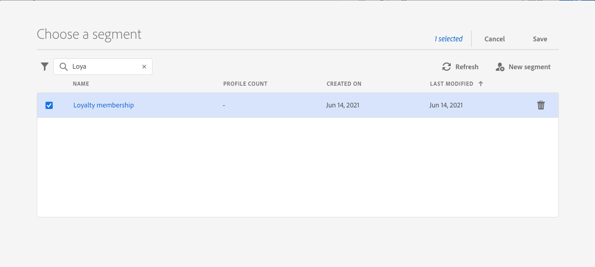
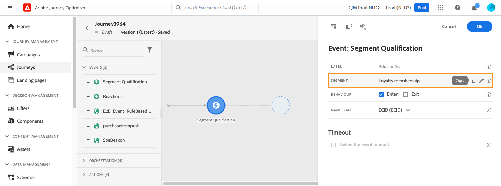

# Eventos de qualificação de público-alvo {#segment-qualification}

>[!BEGINSHADEBOX]

**Nesta página:** saiba como usar e configurar eventos de Qualificação de público-alvo para acionar a entrada ou a progressão da jornada quando os perfis se qualificarem para um público-alvo do Adobe Experience Platform ou saírem dele.

>[!ENDSHADEBOX]

>[!CONTEXTUALHELP]
>id="ajo_journey_event_segment_qualification"
>title="Qualificação de público-alvo"
>abstract="Aciona a entrada ou a continuação da jornada quando um perfil se qualifica para um público-alvo de [!DNL Adobe Experience Platform] ou sai dele. Recomendado para públicos-alvo de transmissão. É possível usar a atividade Ler público-alvo para cenários em lote."

## Sobre eventos de qualificação de público-alvo{#about-segment-qualification}

Esta atividade escuta as entradas e saídas dos perfis em [!DNL Adobe Experience Platform] públicos-alvo. Ele pode fazer com que indivíduos entrem em uma jornada ou avancem. Para saber mais sobre a criação de públicos-alvo, consulte esta [seção](../audience/about-audiences.md).

Digamos que você tenha um público-alvo de “cliente prata”. Com essa atividade, você pode fazer com que todos os novos clientes Silver insiram uma jornada e enviem a eles uma série de mensagens personalizadas.

Esse tipo de evento pode ser posicionado como a primeira etapa ou posteriormente na jornada.

➡️ [Conheça este recurso no vídeo](#video)

>[!CAUTION]
>
>Antes de começar a configurar uma qualificação de Público-alvo, [leia as Medidas de Proteção e as Limitações](#audience-qualification-guardrails).

## Configure a atividade {#configure-segment-qualification}

Para configurar a atividade **[!UICONTROL Qualificação de público-alvo]**, siga estas etapas:

>[!CONTEXTUALHELP]
>id="ajo_journey_event_segment_qualification_label"
>title="Rótulo"
>abstract="Um rótulo opcional para identificar esta atividade em relatórios e logs do modo de teste."

>[!CONTEXTUALHELP]
>id="ajo_journey_event_segment_qualification_audience"
>title="Público-alvo"
>abstract="O público-alvo [!DNL Adobe Experience Platform] que a jornada monitora. Os perfis entram ou avançam à medida que se qualificam para o público-alvo ou saem dele. Os públicos-alvo de transmissão são recomendados para avaliar a qualificação em tempo real."

>[!CONTEXTUALHELP]
>id="ajo_journey_event_segment_qualification_behavior"
>title="Comportamento"
>abstract="Define a quais alterações de assinatura do público-alvo a jornada reage: quando os perfis se qualificam para o público-alvo (entrada), quando deixam o público-alvo (saída) ou ambos. Escutar ambos abrange todo o ciclo de vida da assinatura, enquanto uma única opção restringe a jornada a uma direção."

>[!CONTEXTUALHELP]
>id="ajo_journey_event_segment_qualification_identity"
>title="Tipo de identidade"
>abstract="O namespace de identidade usado para reconhecer indivíduos à medida que se qualificam para o público-alvo. Somente namespaces de identidade com base em pessoas estão disponíveis, e perfis sem essa identidade não podem entrar na jornada."

>[!CONTEXTUALHELP]
>id="ajo_journey_event_segment_qualification_merge_policy"
>title="Política de mesclagem"
>abstract="A política de mesclagem é recuperada automaticamente do público-alvo selecionado e aplicada em toda a jornada."
>additional-url="https://experienceleague.adobe.com/pt-br/docs/journey-optimizer/using/orchestrate-journeys/create-journey/journey-properties#merge-policies" text="Saiba mais sobre políticas de mesclagem"

1. Expanda a categoria **[!UICONTROL Eventos]** e solte uma atividade **[!UICONTROL Qualificação de público-alvo]** na tela.

   

1. Adicione um **[!UICONTROL Rótulo]** à atividade. Esta etapa é opcional.

1. Clique no campo **[!UICONTROL Público-alvo]** e selecione os públicos-alvo que deseja aproveitar.

   >[!NOTE]
   >
   >Você pode personalizar as colunas exibidas na lista e classificá-las.

   

   Depois que o público-alvo é adicionado, o botão **[!UICONTROL Copiar]** permite copiar seu nome e ID:

   `{"name":"Loyalty membership","id":"8597c5dc-70e3-4b05-8fb9-7e938f5c07a3"}`

   

   >[!TIP]
   >
   >Para identificar o método de avaliação de um público antes de usá-lo, abra o menu **[!UICONTROL Públicos-alvo]**, selecione o público-alvo e verifique o campo **[!UICONTROL Método de avaliação]** — **Streaming**, **Batch** ou **Edge**. Você também pode adicionar a coluna **[!UICONTROL Método de avaliação]** à lista de públicos-alvo nesta atividade. O método de avaliação afeta o tempo de entrada e quais práticas recomendadas se aplicam — consulte [Públicos-alvo em lote](#batch-speed-segment-qualification) e [Públicos-alvo transmitidos](#streamed-speed-segment-qualification).

1. No campo **[!UICONTROL Comportamento]**, escolha se você deseja escutar entradas de público-alvo, saídas ou ambas.

   >[!NOTE]
   >
   >**[!UICONTROL Enter]** e **[!UICONTROL Exit]** correspondem aos status de participação de público **Realized** e **Exited** de [!DNL Adobe Experience Platform].
   >Consulte a [documentação do Serviço de segmentação](https://experienceleague.adobe.com/docs/experience-platform/segmentation/tutorials/evaluate-a-segment.html#interpret-segment-results){target="_blank"}.

1. Selecione um namespace. Isso só será necessário se o evento for posicionado como a primeira etapa da jornada. Por padrão, o campo é pré-preenchido com o último namespace usado.

   >[!NOTE]
   >
   >Você só pode selecionar um namespace de identidade com base em pessoas.
   >Os namespaces da tabela de pesquisa (por exemplo, ProductID para uma pesquisa de Produto) não estão disponíveis na lista suspensa **Namespace**.

   

A carga contém as seguintes informações de contexto, que podem ser usadas em condições e ações:

* o comportamento (entrada, saída)
* o carimbo de data e hora da qualificação
* a id do público-alvo

Ao usar o editor de expressão em uma condição ou ação que segue uma atividade de **[!UICONTROL Qualificação de público-alvo]**, você tem acesso ao nó **[!UICONTROL Qualificação de público-alvo]**. Você pode escolher entre o **[!UICONTROL Último horário de qualificação]** e o **[!UICONTROL status]** (entre ou saia).

Consulte [Condições](../building-journeys/conditions.md#about_condition).

Uma nova jornada que inclui um evento de **Qualificação de público-alvo** se torna operacional dez minutos após a sua publicação. Este intervalo corresponde ao intervalo de atualização do cache do serviço dedicado. Aguarde dez minutos antes de usar esta jornada.

## Práticas recomendadas {#best-practices-segments}

A atividade **[!UICONTROL Qualificação de público-alvo]** permite a entrada imediata em jornadas para indivíduos qualificados ou desqualificados de um público-alvo [!DNL Adobe Experience Platform].

A velocidade de recepção dessas informações é alta. As medidas mostram 10.000 eventos recebidos por segundo. Planeje picos de entrada, evite-os quando possível e prepare sua jornada para lidar com eles. Saiba mais sobre taxas de processamento e limites de taxa de transferência da jornada [nesta seção](entry-management.md#journey-processing-rate).

### Públicos em lote {#batch-speed-segment-qualification}

>[!CAUTION]
>
>**Aviso de descontinuação - agosto de 2026**: a partir de **agosto de 2026**, a Journey Optimizer bloqueará a publicação de qualquer jornada que use um público em lotes em um nó **Qualificação de público-alvo**. As jornadas ativas existentes não são afetadas. As jornadas novas, de rascunho e duplicadas com essa configuração devem ser atualizadas antes de agosto de 2026. [Saiba como migrar suas jornadas](aq-batch-audiences-migration.md)

Ao usar a Qualificação de público-alvo para um público-alvo em lote, observe que um pico de entrada ocorre no momento do cálculo diário. O tamanho do pico depende de quantos indivíduos entram ou saem do público a cada dia.

Além disso, se o público-alvo do lote for recém-criado e usado imediatamente em uma jornada, o primeiro lote de cálculo poderá gerar muitas entradas. Planeje para este pico.

### Tempo das atualizações de associação do segmento {#timing-segment-membership}

Ao usar instantâneos em lote em uma jornada, qualquer nova associação de segmento pode ser refletida somente em instantâneos subsequentes. Se adições de segmento imediatas ou no mesmo dia forem essenciais, considere a segmentação por transmissão ou verifique se as atualizações de segmento são capturadas pelo próximo instantâneo.

### Públicos transmitidos {#streamed-speed-segment-qualification}

Ao usar a Qualificação de público-alvo para públicos-alvo transmitidos, há menos risco de grandes picos de entrada e saída, pois a avaliação é contínua. Se a definição de público-alvo qualificar muitos clientes de uma só vez, ainda poderá ocorrer um pico.

Evite usar eventos abertos e enviados com segmentação por transmissão. Em vez disso, use sinais reais de atividade do usuário, como cliques, compras ou dados de beacon. Para lógica de frequência ou supressão, use regras de negócios em vez de enviar eventos. [Saiba mais](../audience/about-audiences.md)

Consulte a [[!DNL Adobe Experience Platform] documentação de segmentação por transmissão](https://experienceleague.adobe.com/en/docs/experience-platform/segmentation/methods/streaming-segmentation){target="_blank"}.

>[!NOTE]
>
>Quando um perfil é qualificado para um segmento de transmissão na Edge, essa associação é projetada do Edge para o Hub antes que a jornada possa agir nela. Esta propagação de Edge para Hub geralmente leva de **15 a 30 minutos**. Se os perfis não estiverem entrando em uma jornada de Qualificação de público-alvo conforme esperado, aguarde essa janela de propagação (adicionando uma atividade de espera, se apropriado) antes de investigar mais detalhadamente. Para casos de uso que exigem entrada em tempo real, considere um acionador de evento unitário.

#### Por que nem todos os perfis qualificados podem entrar na jornada {#streaming-entry-caveats}

Ao usar públicos-alvo de transmissão com a atividade **Qualificação do público-alvo**, nem todos os perfis que se qualificam para o público-alvo necessariamente entrarão na jornada. Esse comportamento pode ocorrer pelos seguintes motivos:

* **Perfis que já estão no público-alvo**: somente os perfis que se qualificaram recentemente para o público-alvo após a publicação da jornada acionarão a entrada. Os perfis que já estão no público-alvo antes da publicação não serão inseridos. Da mesma forma, quando um segmento de transmissão usa uma **condição baseada em tempo** (por exemplo, &quot;evento nas próximas 8 horas&quot;), os perfis que já atenderam a essa condição antes da criação do segmento **não são avaliados retroativamente** — somente os perfis cujos dados são alterados após a ativação do segmento são avaliados em relação à condição.

* **Tempo de ativação de Jornada**: quando você publica uma jornada, a atividade **Qualificação de Público** leva até **10 minutos** para se tornar ativa e começar a escutar entradas e saídas de perfil. [Saiba mais sobre a ativação de jornada](#configure-segment-qualification).

* **Saídas rápidas do público-alvo**: se um perfil se qualificar para o público-alvo, mas sair antes que a entrada de jornada seja acionada, esse perfil não poderá entrar na jornada.

* **Tempo entre qualificação e processamento de jornada**: devido à natureza distribuída de [!DNL Adobe Experience Platform], pode haver lacunas de tempo. Um perfil pode ser qualificado antes que a jornada processe o evento de qualificação.

**Recomendações:**

* Depois de publicar uma jornada, aguarde pelo menos 10 minutos antes de enviar eventos ou dados que acionarão a qualificação do perfil. Isso garante que a jornada esteja totalmente ativada e pronta para processar as entradas.

* Para casos de uso críticos nos quais você precisa garantir que todos os perfis qualificados sejam inseridos, considere usar uma atividade [Ler público-alvo](read-audience.md). Ele processa todos os perfis em um público-alvo em um momento específico.

* Monitore a [taxa de entrada e a taxa de transferência](entry-management.md#profile-entrance-rate) da sua jornada para entender os padrões de fluxo do perfil.

* Se os perfis não estiverem entrando como esperado, consulte o [guia de solução de problemas](troubleshooting-execution.md#checking-if-people-enter-the-journey) para obter etapas de diagnóstico adicionais.

### Como evitar sobrecargas {#overloads-speed-segment-qualification}

Estas são algumas das práticas recomendadas para evitar sobrecarga de sistemas aproveitados no jornada (fontes de dados, ações personalizadas, atividades de ação de canal):

* Não use um público em lote imediatamente após sua criação em uma atividade **[!UICONTROL Qualificação de público-alvo]**. Isso evita o primeiro pico de cálculo. Um aviso amarelo será exibido na tela de jornada se você estiver prestes a usar um público que nunca foi calculado.

  ![Mensagem de erro quando o público não for encontrado em [!DNL Adobe Experience Platform]](assets/segment-error.png)

* Coloque uma regra de limitação para fontes de dados e ações usadas em jornadas para evitar sobrecarga. Saiba mais em [documentação do Journey Orchestration](https://experienceleague.adobe.com/docs/journeys/using/working-with-apis/capping.html){target="_blank"}. Observe que a regra de limitação não tem repetição. Se você precisar tentar novamente, use um caminho alternativo na jornada marcando a caixa **[!UICONTROL Adicionar um caminho alternativo em caso de tempo limite ou erro]** em condições ou ações.

* Antes de usar o público em uma jornada de produção, avalie o volume de indivíduos qualificados para esse público diariamente. Para fazer isso, verifique o menu **[!UICONTROL Público-alvo]**, abra o público-alvo e examine o gráfico **[!UICONTROL Perfis ao longo do tempo]**.

  

Saiba mais sobre limites de taxa de entrada e taxa de transferência em [esta seção](entry-management.md#profile-entrance-rate).

## Medidas de proteção e limitações {#audience-qualification-guardrails}

Siga as medidas de proteção e recomendações abaixo para criar jornadas de qualificação de público-alvo. Consulte também [Práticas recomendadas de qualificação de público-alvo](#best-practices-segments).

* As jornadas de qualificação de público-alvo são projetadas principalmente para funcionar com públicos de transmissão. Essa combinação garante uma melhor experiência em tempo real. É altamente recomendável usar **streaming audiences** na atividade de qualificação de público-alvo.

  No entanto, se você quiser usar atributos baseados em assimilação em lote no público-alvo de transmissão ou um público em lote para uma jornada de qualificação de público-alvo, considere o período para avaliação/ativação de público-alvo. Um público-alvo ou público-alvo de transmissão em lote que usa atributos assimilados em lote fica pronto para uso na atividade **Qualificação de público-alvo** aproximadamente **2 horas** após a conclusão do trabalho de segmentação. Esse trabalho é executado uma vez por dia, no horário definido pelo administrador da organização da Adobe.

* [!DNL Adobe Experience Platform] públicos-alvo são calculados uma vez por dia (**batch** públicos-alvo) ou em tempo real (para **públicos-alvo transmitidos**, usando a opção Públicos-alvo de Alta Frequência de [!DNL Adobe Experience Platform]).

   * Se o público-alvo selecionado for transmitido, os indivíduos que pertencem a esse público-alvo potencialmente entram na jornada em tempo real.
   * Se o público-alvo for em lote, as pessoas recém-qualificadas para esse público-alvo potencialmente entrarão na jornada quando o cálculo do público for executado em [!DNL Adobe Experience Platform].

  Como prática recomendada, use a transmissão de públicos-alvo em uma atividade **Qualificação de público-alvo**. Para casos de uso em lote, use uma atividade **[Ler público](read-audience.md)**.

  >[!NOTE]
  >
  >Devido à natureza em lote de públicos-alvo criados usando fluxos de trabalho de composição e uploads personalizados, esses públicos-alvo não podem ser direcionados em uma atividade de &quot;Qualificação de público-alvo&quot;. Somente públicos-alvo criados usando definições de segmento podem ser aproveitados nessa atividade.

* Grupos de campos de evento de experiência não podem ser usados em jornadas que comecem com uma atividade **Ler público**, **Qualificação de público** ou **Evento comercial**.

* Ao usar uma atividade **Qualificação de público-alvo** em uma jornada, essa atividade pode levar até 10 minutos para ficar ativa e ouvir os perfis que entram ou saem do público-alvo.

>[!CAUTION]
>
>As [Medidas de proteção para dados e segmentação de Perfil do cliente em tempo real](https://experienceleague.adobe.com/docs/experience-platform/profile/guardrails.html?lang=pt-BR){target="_blank"} também se aplicam a [!DNL Adobe Journey Optimizer].

## Vídeo tutorial {#video}

Entenda os casos de uso aplicáveis às jornadas de qualificação de público-alvo neste vídeo. Saiba como criar uma jornada com Qualificação de público-alvo e quais práticas recomendadas devem ser aplicadas.

>[!VIDEO](https://video.tv.adobe.com/v/3425028?quality=12)

+++ Referência de conhecimento de IA

Esta seção contém conhecimento estruturado destinado a oferecer suporte à interpretação, recuperação e resposta a perguntas relacionadas a este tópico.

Para uma compreensão completa, essas informações devem ser combinadas com a documentação desta página. Nenhuma das origens deve ser independente; a página descreve o recurso, enquanto esta seção fornece um contexto adicional que ajuda a desfazer a ambiguidade da terminologia, intenção, aplicabilidade e restrições.

* **TL;DR:** esta página explica como configurar e usar a atividade de evento de Qualificação de público-alvo no Journey Optimizer para acionar ou avançar perfis em uma jornada quando eles entram ou saem de um público-alvo do Adobe Experience Platform.

**Intenções:**
* Configure uma atividade de evento Qualificação de público-alvo para acionar a entrada da jornada nas alterações de associação do público-alvo
* Selecione o comportamento correto (entrada, saída ou ambos) para uma atividade de Qualificação de público-alvo
* Aplicar práticas recomendadas para evitar sobrecarga dos sistemas ao usar públicos em lote ou streaming
* Entenda por que alguns perfis qualificados podem não entrar na jornada e como atenuar isso
* Usar a carga do nó AudienceQualification em condições e ações downstream

**Glossário:**
* **Evento de qualificação de público-alvo**: uma atividade de evento de jornada que escuta as entradas do perfil ou as saídas de um público-alvo do Adobe Experience Platform e aciona a progressão da jornada *(específico do produto)*
* **Comportamento (Entrar/Sair)**: a configuração que controla se a jornada reage a perfis que ingressam (&quot;Realizado&quot;), saem (&quot;Sair&quot;) ou a ambos os estados de um público-alvo *(específico do produto)*
* **Público-alvo de streaming**: um público avaliado continuamente em tempo real usando a opção Públicos-alvo de alta frequência; recomendado para atividades de Qualificação de público-alvo *(específico do produto)*
* **Público-alvo em lote**: um público-alvo recalculado uma vez por dia; introduz um pico diário de entradas de perfil e requer uma janela de preparação de 2 horas após a conclusão do trabalho de segmentação *(específico do produto)*
* **Nó AudienceQualification**: o nó de contexto disponível no editor de expressão após uma atividade Audience Qualification, expondo o horário e o status da última qualificação *(específico do produto)*
* **Propagação de Edge para Hub**: o processo pelo qual uma associação de segmento de transmissão avaliada na Edge é sincronizada com o Hub antes que a jornada possa agir nela; geralmente leva de 15 a 30 minutos *(específico do produto)*

**Medidas de Proteção:**
* Uma nova jornada de qualificação de público-alvo leva até 10 minutos para se tornar ativa após a publicação
* Os públicos-alvo de lote ou transmissão que usam atributos assimilados em lote ficam prontos aproximadamente 2 horas após a conclusão do trabalho de segmentação
* Somente públicos-alvo criados usando definições de segmento podem ser usados; o fluxo de trabalho de composição ou públicos-alvo de upload personalizados não são compatíveis
* Grupos de campos de evento de experiência não podem ser usados em jornadas que comecem com Qualificação de público-alvo
* Somente namespaces de identidade com base em pessoas estão disponíveis para o campo de namespace; namespaces de tabelas de pesquisa não são compatíveis
* Os perfis que já estão no público-alvo antes da publicação do jornada não entrarão retroativamente na jornada
* A propagação de Edge para Hub para segmentos de transmissão normalmente leva de 15 a 30 minutos

**Terminologia:**
* Nome canônico: Evento de qualificação de público-alvo — Acrônimo: none — variantes: qualificação de segmento, atividade de qualificação de público-alvo
* Sinônimos: &quot;Enter&quot; = &quot;Realizado&quot; ; &quot;Saída&quot; = &quot;Encerrado&quot;
* Não confunda: &quot;Qualificação do público-alvo&quot; ≠ &quot;Ler público-alvo&quot; (A qualificação do público-alvo reage a alterações de associação em tempo real; o Read Audience processa todos os membros em um horário programado)

**Perguntas frequentes:**
* **P: Quando uma jornada de qualificação de público-alvo recém-publicada começa a processar entradas?** — Leva até 10 minutos após a publicação para a atividade se tornar ativa e começar a escutar entradas e saídas do perfil.
* **P: Por que os perfis não estão inserindo minha jornada de qualificação de público-alvo?** — As causas comuns incluem: perfis que já estavam no público-alvo antes da publicação, a janela de ativação de 10 minutos não decorreu ou a propagação de Edge para Hub (15-30 min) para segmentos de transmissão ainda não foi concluída.
* **P: Posso usar um público em lotes em uma atividade de Qualificação de público-alvo?** - Sim, mas não é recomendado. Os públicos-alvo em lote geram um pico de entrada diário e não são adequados para casos de uso em tempo real; use uma atividade Ler público-alvo em vez de para cenários em lote.
* **P: Quais dados estão disponíveis na carga do AudienceQualification?** — O conteúdo inclui o comportamento (entrada ou saída), o carimbo de data e hora da qualificação e a ID do público-alvo.
* **P: Posso usar públicos-alvo criados de fluxos de trabalho de composição em uma atividade de Qualificação de Público-alvo?** — Não, somente os públicos-alvo criados usando definições de segmento são compatíveis com essa atividade.

+++
