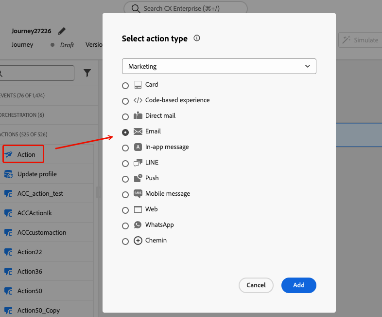
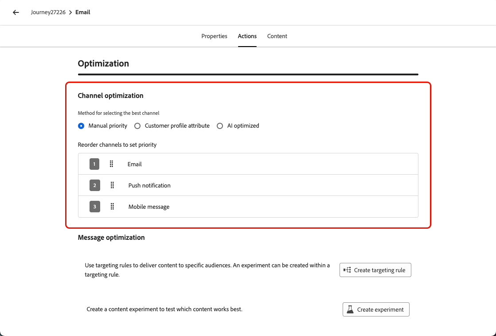
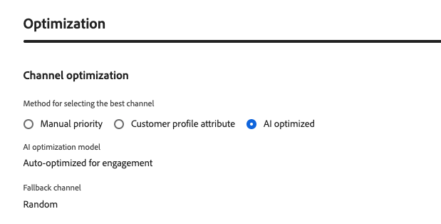

# Otimização de canal {#channel-optimization}

>[!BEGINSHADEBOX]

**Nesta página:** saiba como configurar uma jornada ou ação de campanha para entregar mensagens pelo melhor canal de saída para cada cliente, usando classificação manual, preferências de perfil ou pontuações de propensão alimentadas por IA.

>[!ENDSHADEBOX]

>[!AVAILABILITY]
>
>A otimização de canal está disponível atualmente para um conjunto limitado de organizações (disponibilidade limitada). Para obter acesso, entre em contato com um representante da Adobe.

A otimização de canal permite adicionar vários canais de saída (email, push, mensagem móvel) a uma única jornada ou ação de campanha e fazer com que o Journey Optimizer selecione automaticamente o melhor para cada cliente no momento do envio.

Em vez de escolher um canal inicial ou clientes de mensagens em todos os canais ao mesmo tempo, o sistema escolhe o canal com a classificação mais alta em que cada cliente opta e retorna normalmente quando esse canal não está disponível.

➡️ [Saiba mais sobre a otimização de canal neste vídeo](#video)

## Medidas de proteção e limitações {#limitations}

* **Canais com suporte**: somente canais nativos de email, push e mensagens móveis têm suporte. Outros canais de saída, como o WhatsApp, não são compatíveis. A otimização de canais requer o uso dos recursos nativos de email, push e mensagens móveis do Journey Optimizer; a execução por meio de ações personalizadas não é suportada.

* **Métrica de otimização de IA**: o modelo de IA é otimizado somente para envolvimento (cliques). Ela não otimiza para pedidos, receita ou outras métricas comerciais. Se a otimização de pedidos ou receita for necessária, um modelo personalizado pode ser treinado offline por sua equipe de ciência de dados e aplicado por meio do recurso de atributo de perfil do cliente.

* **Rastreamento de cliques necessário para a classificação de IA**: ao usar a classificação baseada em modelo de IA, o rastreamento de cliques deve ser habilitado para todos os canais configurados. O modelo depende de dados de cliques para calcular as pontuações de propensão; se o rastreamento estiver desativado, o modo de classificação de IA não poderá funcionar corretamente. [Saiba como habilitar o rastreamento de cliques no email](../email/message-tracking.md)

* **Horas de silêncio**: quando vários canais são combinados em uma única ação, as horas de silêncio são aplicadas com base na prioridade do canal: As mensagens móveis têm prioridade, seguidas por Push e Email. Para usar diferentes configurações de horários silenciosos por canal, crie ações de jornada separadas em vez de combinar canais em uma única ação.

  >[!NOTE]
  >
  >O suporte para configurações de horas de silêncio por canal está planejado para a versão de Disponibilidade geral.

* **Incompatibilidade de Otimização de Tempo de Envio**: Atualmente, a [Otimização de Tempo de Envio](send-time-optimization.md) e a otimização de canal não podem ser usadas juntas. Escolha uma das opções. A interface impede a ativação simultânea de ambos os recursos na mesma ação.

* **Eventos de reação**: os eventos de reação na tela de jornada atualmente fazem referência somente ao primeiro canal em uma ação multicanal.

  >[!NOTE]
  >
  >O suporte para selecionar qualquer evento de reação válido quando vários canais estiverem presentes será planejado para a versão de Disponibilidade geral.

## Usar a otimização de canal em uma jornada ou campanha {#configure}

Para adicionar vários canais de saída com otimização de canal a uma jornada ou campanha, siga as etapas abaixo.

>[!BEGINTABS]

>[!TAB Em uma jornada]

1. Inicie sua jornada com uma atividade [Evento](general-events.md) ou [Ler público](read-audience.md).

1. Na seção **[!UICONTROL Ações]** da paleta, arraste e solte uma atividade **[!UICONTROL Ação]** na tela.

1. Selecione um canal de saída (email, push ou mensagem móvel) e clique em **[!UICONTROL Adicionar]**.

   {width="60%"}

1. Insira um rótulo para a ação e clique em **[!UICONTROL Configurar ação]**.

>[!TAB Em uma campanha]

1. [Crie uma campanha de Ação](../campaigns/create-campaign.md) e navegue até a guia **[!UICONTROL Ações]**.

1. Clique no botão **[!UICONTROL Adicionar ação]** e selecione um canal de saída (email, push ou mensagem móvel).

>[!ENDTABS]

Depois que uma ação de saída for selecionada na guia **[!UICONTROL Actions]**, continue com as etapas a seguir.

1. Selecione uma configuração de canal e clique em **[!UICONTROL Adicionar ação]** para selecionar outro canal de saída.

   {width="1000%"}

   >[!NOTE]
   >
   >Somente uma ação por tipo de canal é aceita em uma única ação de vários canais. Por exemplo, não é possível adicionar duas ações de email separadas com configurações diferentes.

   Você pode adicionar até três canais de saída (**[!UICONTROL Email]**, **[!UICONTROL Push]**, **[!UICONTROL Mensagem móvel]**) a uma única ação ou campanha do jornada.

1. Na seção **[!UICONTROL Otimização de canal]**, defina o método para determinar como o sistema seleciona o melhor canal para cada cliente. [Saiba mais](#optimization-modes)

   {width="100%"}

1. Defina a ordem do canal de fallback (para métodos de classificação manual e preferência do cliente) arrastando e soltando os canais na ordem desejada. [Saiba mais](#fallback)

   {width="90%"}

1. [Salve e publique](publish-journey.md) sua jornada ou [revise e ative](../campaigns/review-activate-campaign.md) sua campanha.

## Definir o método de otimização de canal {#optimization-modes}

>[!CONTEXTUALHELP]
>id="ajo_channel_optimization_method"
>title="Definir como funciona a seleção de canal"
>abstract="Escolha como a Journey Optimizer seleciona o melhor canal para cada cliente: **Prioridade manual** — os canais são testados na ordem definida; a disponibilidade é determinada pela aplicação de preferências de assinatura e regras de consentimento de marketing associadas às configurações de canal selecionadas, e todas as regras de negócios (por exemplo, limite de frequência de canal) associadas à campanha ou à jornada. **Atributo de perfil do cliente** — o canal que corresponde à preferência declarada do cliente em seu perfil é selecionado primeiro. Se nenhuma preferência for encontrada, a prioridade manual será aplicada. **IA otimizada** — um modelo de aprendizado de máquina classifica cada canal com base no envolvimento histórico do cliente e o canal disponível com a pontuação mais alta é selecionado."

<!--
Previous content for contextual help: "The customer's first available channel, based on the selected prioritization method, is used for this action. Availability is determined by the customer's subscription preferences and marketing consent rules for the selected channel configurations, as well as any business rules — such as frequency capping — configured for the campaign or journey." TBC which to keep.

Additional content for contextual help: For **Manual priority** and **Customer profile attribute** modes, Journey Optimizer falls back through your configured channel order when the top-ranked channel cannot be used. For **AI optimized**, it falls back to a random available channel."
-->

A otimização de canal suporta três modos, cada um usando um método diferente para selecionar o melhor canal para cada cliente no momento do envio.

### Classificação manual {#manual-ranking}

**[!UICONTROL Prioridade manual]** é o modo padrão. Você define a ordem do canal preferido diretamente na ação. A Journey Optimizer fornece, por meio do primeiro canal da sua lista, que o cliente está aceito e não tem limite de frequência. Em seguida, [retorna](#fallback) para o próximo canal, se necessário.

{width="90%"}

Use esse modo quando tiver uma preferência de canal clara e consistente e não precisar de personalização por perfil.

### Preferência do cliente {#customer-preference}

Com o **[!UICONTROL atributo de perfil do cliente]** selecionado, o Journey Optimizer lê o canal de preferência declarado do cliente em seu perfil, usando o atributo `preferred` no [grupo de campos XDM de Consentimentos e Preferências](https://experienceleague.adobe.com/pt-br/docs/experience-platform/xdm/field-groups/profile/consents). Os valores com suporte são `email`, `push` e `sms`.

{width="90%"}

Se o canal preferencial estiver indisponível (não configurado, não aceito ou com limite de frequência), o Journey Optimizer voltará para o próximo canal na lista [fallback](#fallback) configurada.

Use esse modo quando os clientes tiverem declarado explicitamente seu canal de comunicação preferido.

### Classificação baseada em modelo de IA {#ai-ranking}

Se você selecionar **[!UICONTROL IA otimizada]**, a Journey Optimizer usará um modelo de aprendizado de máquina que calcula uma pontuação de propensão por canal para cada cliente com base em seu envolvimento histórico (aberturas, cliques). As pontuações são armazenadas no perfil do cliente e o canal com a maior propensão prevista é selecionado no momento do envio.

{width="70%"}

Quando um cliente tem histórico de engajamento insuficiente, o sistema retorna a um canal aleatoriamente disponível.

Use esse modo para permitir que a IA informe o canal mais eficiente para cada cliente sem qualquer configuração manual.

## Comportamento de fallback {#fallback}

Independentemente do modo de otimização, o Journey Optimizer retorna ao próximo canal disponível quando o canal mais bem classificado não pode ser usado. Um canal é considerado indisponível quando qualquer uma das seguintes condições se aplica:

* O cliente não é aceito no canal.
* O canal não está configurado na ação.
* O canal atingiu seu limite de frequência.
* A preferência de perfil do cliente ou a pontuação do modelo de IA para esse canal não foi preenchida.

Nos modos **[!UICONTROL Prioridade manual]** e **[!UICONTROL Atributo de perfil do cliente]**, o fallback segue a lista de prioridade de canal configurada pelo profissional de marketing. Em **[!UICONTROL IA otimizada]**, o fallback seleciona um canal disponível aleatório.

## Vídeo tutorial {#video}

Saiba como o recurso de otimização de canal do Adobe Journey Optimizer ajuda você a alcançar clientes no canal mais eficiente usando prioridade manual, atributos de perfil ou o modelo de IA da Adobe.

>[!VIDEO](https://video.tv.adobe.com/v/3492132?quality=12)

<!--
**Related topics**

* [Use the Action activity](journey-action.md)
* [Send-Time optimization](send-time-optimization.md)
* [Content optimization](../content-management/gs-message-optimization.md)
-->

