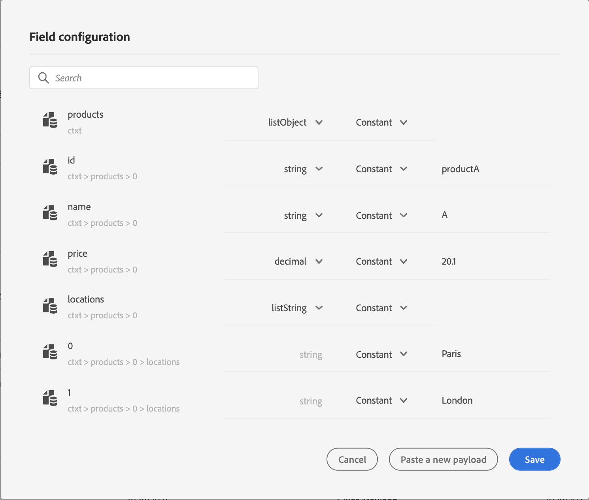
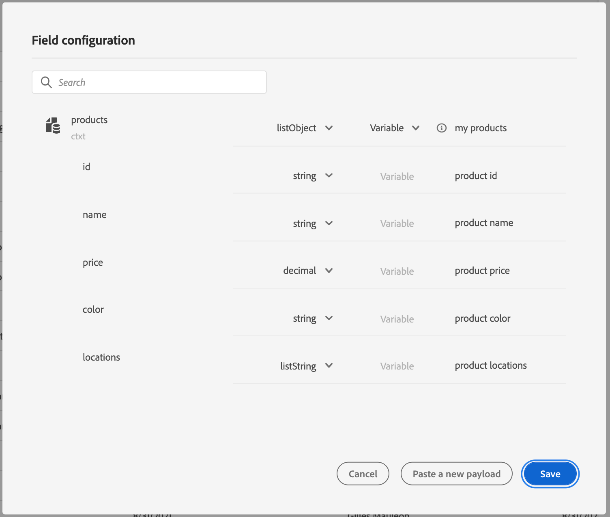
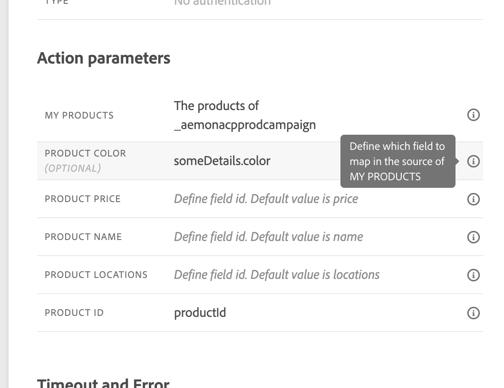

# Passar coleções para parâmetros de ação personalizada {#passing-collection}

>[!BEGINSHADEBOX]

**Nesta página:** Saiba como transmitir coleções simples e de objetos para parâmetros de ação personalizados para que elas sejam populadas dinamicamente em tempo de execução.

>[!ENDSHADEBOX]

Você pode passar uma coleção nos parâmetros de ação personalizados que é preenchida dinamicamente no tempo de execução.

Há suporte para dois tipos de coleções:

* **Coleções simples**

  Use coleções simples para listas de valores básicos, como sequências, números ou boolianos. Elas são úteis quando você só precisa passar uma lista de itens sem propriedades adicionais.

  Por exemplo, uma lista de tipos de dispositivos:

  ```json
  {
   "deviceTypes": [
       "android",
       "ios"
   ]
  }
  ```

* **Coleções de objetos**

  Use coleções de objetos quando cada item incluir vários campos ou propriedades. Normalmente, eles são usados para transmitir dados estruturados, como detalhes do produto, registros de evento ou atributos de item.

  Por exemplo:

  ```json
  {
  "products":[
     {
        "id":"productA",
        "name":"A",
        "price":20.1
     },
     {
        "id":"productB",
        "name":"B",
        "price":10.0
     },
     {
        "id":"productC",
        "name":"C",
        "price":5.99
     }
   ]
  }
  ```

>[!NOTE]
>
>As matrizes aninhadas em coleções só têm suporte parcial em cargas de solicitação de ação personalizada. Para obter detalhes, consulte [Limitações](#limitations).

## Procedimento geral {#general-procedure}

Nesta seção, usamos o exemplo de carga JSON a seguir. Esta é uma matriz de objetos com um campo que é uma coleção simples.

```json
{
  "ctxt": {
    "products": [
      {
        "id": "productA",
        "name": "A",
        "price": 20.1,
        "color":"blue",
        "locations": [
          "Paris",
          "London"
        ]
      },
      {
        "id": "productB",
        "name": "B",
        "price": 10.99
      }
    ]
  }
}
```

Você pode ver que `products` é uma matriz de dois objetos. Você precisa ter pelo menos um objeto.

1. Crie sua ação personalizada. Saiba mais [nesta página](../action/about-custom-action-configuration.md).

1. Na seção **[!UICONTROL Parâmetros de ação]**, cole o exemplo de JSON. A estrutura exibida é estática: ao colar a carga, todos os campos são definidos como constantes.

   

1. Se necessário, ajuste os tipos de campo. Os seguintes tipos de campo são compatíveis com coleções: listString, listInteger, listDecimal, listBoolean, listDateTime, listDateTimeOnly, listDateOnly, listObject

   >[!NOTE]
   >
   >O tipo de campo é inferido automaticamente de acordo com o exemplo de carga útil.

1. Se você quiser passar objetos dinamicamente, precisará defini-los como variáveis. Neste exemplo, definimos `products` como variável. Todos os campos de objeto incluídos no objeto são definidos como variáveis automaticamente.

   >[!NOTE]
   >
   >O primeiro objeto do exemplo de carga útil é usado para definir os campos.

1. Para cada campo, defina o rótulo que será exibido na tela de jornada.

   {width="70%"}

1. Crie sua jornada e adicione a ação personalizada que você criou. Saiba mais [nesta página](../building-journeys/using-custom-actions.md).

1. Na seção **[!UICONTROL Parâmetros de ação]**, defina o parâmetro de matriz (`products` em nosso exemplo) usando o editor de expressão avançado.

   

1. Para cada um dos campos de objeto a seguir, digite o nome do campo correspondente do esquema XDM de origem. Se os nomes forem idênticos, isso não será necessário. Em nosso exemplo, precisamos apenas definir `product id` e &quot;cor&quot;.

   {width="50%"}

Para o campo de matriz, também é possível usar o editor de expressão avançado para executar a manipulação de dados. No exemplo a seguir, usamos as funções [filtro](functions/list-functions.md#filter) e [interseção](functions/list-functions.md#intersect):


## Limitações {#limitations}

Embora as coleções em ações personalizadas forneçam flexibilidade para transmitir dados dinâmicos, há certas restrições estruturais a serem observadas:

* **Suporte para Matrizes Aninhadas em Ações Personalizadas**

  [!DNL Adobe Journey Optimizer] dá suporte a matrizes aninhadas de objetos em **cargas de resposta** de ação personalizada, mas esse suporte é limitado em **cargas de solicitação**.

  Nas cargas de solicitação, matrizes aninhadas só são suportadas quando contêm um número fixo de itens, conforme definido na configuração de ação personalizada. Por exemplo, se uma matriz aninhada sempre incluir exatamente três itens, ela poderá ser configurada como uma constante. Quando o número de itens precisa ser dinâmico, somente as matrizes não aninhadas (matrizes no nível inferior) podem ser definidas como variáveis.

  Exemplo:

   1. O exemplo a seguir ilustra um **caso de uso não suportado**.

      Neste exemplo, a matriz products inclui uma matriz aninhada (`locations`) com um número dinâmico de itens, para o qual não há suporte em cargas de solicitação.

      ```json
      {
      "products": [
         {
            "id": "productA",
            "name": "A",
            "price": 20,
            "locations": [
            { "name": "Paris" },
            { "name": "London" }
            ]
         }
      ]
      }
      ```

   2. Exemplo compatível, com itens fixos definidos como constantes.

      Nesse caso, os locais aninhados são substituídos por campos fixos (`location1`, `location2`), permitindo que a carga permaneça válida dentro da configuração com suporte.

      ```json
      {
      "products": [
         {
            "id": "productA",
            "name": "A",
            "price": 20,
            "location1": { "name": "Paris" },
            "location2": { "name": "London" }
         }
      ]
      }
      ```


* **Testando coleções**: para testar coleções usando o modo de teste, você deve usar o modo de exibição de código. Observe que o modo de exibição de código não é compatível com eventos comerciais, portanto, nesse caso, você só pode enviar uma coleção contendo um único elemento.


## Casos específicos{#examples}

Para tipos heterogêneos e arrays de arrays, o array é definido com o tipo listAny. Você só pode mapear itens individuais, mas não pode alterar a matriz para a variável.

{width="70%"}

Exemplo de tipo heterogêneo:

```json
{
    "data_mixed-types": [
        "test",
        "test2",
        null,
        0
    ]
}
```

Exemplo de matriz de matrizes:

```json
{
    "data_multiple-arrays": [
        [
            "test",
            "test1",
            "test2"
        ]
    ]
}
```

## Recursos adicionais

Navegue pelas seções abaixo para saber mais sobre como configurar, usar e solucionar problemas de ações personalizadas:

* [Introdução a ações personalizadas](../action/action.md) - Saiba o que é uma ação personalizada e como ela ajuda você a se conectar a sistemas de terceiros
* [Configurar ações personalizadas](../action/about-custom-action-configuration.md) - Saiba como criar e configurar uma ação personalizada
* [Usar ações personalizadas](../building-journeys/using-custom-actions.md) - Saiba como usar ações personalizadas em suas jornadas
* [Solução de problemas de ação personalizada](../action/troubleshoot-custom-action.md) - Saiba como solucionar problemas de uma ação personalizada
* [Iterar em dados contextuais](../personalization/iterate-contextual-data.md#arrays-in-journeys) - Saiba como trabalhar com matrizes em expressões de Jornada e iterar em respostas de ação personalizadas, dados de eventos e pesquisas de conjunto de dados na personalização de mensagens

+++ Referência de conhecimento de IA

Esta seção contém conhecimento estruturado destinado a oferecer suporte à interpretação, recuperação e resposta a perguntas relacionadas a este tópico.

Para uma compreensão completa, essas informações devem ser combinadas com a documentação desta página. Nenhuma das origens deve ser independente; a página descreve o recurso, enquanto esta seção fornece um contexto adicional que ajuda a desfazer a ambiguidade da terminologia, intenção, aplicabilidade e restrições.

* **TL;DR:** Esta página explica como transmitir coleções simples e de objetos dinamicamente para parâmetros de ação personalizados no Journey Optimizer, incluindo tipos de campos compatíveis, o procedimento de configuração e limitações conhecidas em matrizes aninhadas.

**Intenções:**
* Configurar uma ação personalizada para aceitar uma coleção (simples ou objeto) como um parâmetro dinâmico
* Definir parâmetros de matriz como variáveis no editor de expressão avançado ao criar uma jornada
* Aplicar funções de filtro e interseção para manipular dados de matriz no editor de expressão
* Entenda e trabalhe dentro das limitações de matriz aninhada para cargas de solicitação de ação personalizada
* Testar parâmetros de coleção usando o modo de visualização de código no modo de teste de jornada

**Glossário:**
* **Coleção simples**: uma lista de valores escalares básicos (cadeias de caracteres, números, booleanos) passados como um parâmetro de ação personalizado *(específico do produto)*
* **Coleção de objetos**: uma lista de objetos estruturados, cada um com vários campos, passados como um parâmetro de ação personalizado *(específico do produto)*
* **listObject**: o tipo de campo usado na configuração de ação personalizada para representar uma matriz de objetos *(específico do produto)*
* **listAny**: o tipo de campo usado para matrizes heterogêneas ou matrizes de matrizes em que os itens têm tipos mistos *(específico do produto)*
* **Variável (vs. Constante)**: na configuração do parâmetro action, um campo definido como &quot;variável&quot; é preenchido dinamicamente no tempo de execução a partir do contexto de jornada, enquanto uma &quot;constante&quot; é um valor fixo definido no tempo de configuração *(específico do produto)*

**Medidas de Proteção:**
* Matrizes aninhadas em cargas de solicitação só têm suporte quando contêm um número fixo de itens (definidos como constantes); matrizes aninhadas dinâmicas não têm suporte
* O modo de exibição de código é necessário para testar coleções no modo de teste; a exibição de código não é compatível com eventos comerciais, portanto, somente coleções de elemento único podem ser enviadas nesse caso
* Pelo menos um objeto deve estar presente no exemplo de carga útil usado para definir campos de coleção
* O primeiro objeto do exemplo de carga define os campos para toda a coleção

**Terminologia:**
* Nome canônico: Coleção — Acrônimo: none — variantes: matriz, lista, coleção dinâmica
* Sinônimos: &quot;coleção simples&quot; = &quot;lista de valores escalares&quot; ; &quot;coleção de objetos&quot; = &quot;matriz de objetos&quot;
* Não confunda: &quot;listAny&quot; ≠ &quot;listObject&quot; (listAny manipula arrays heterogêneas ou aninhadas; listObject manipula arrays uniformes de objetos estruturados)

**Perguntas frequentes:**
* **P: Qual é a diferença entre uma coleção simples e uma coleção de objetos?** — Uma coleção simples contém valores escalares básicos (sequências, números, booleanos), enquanto uma coleção de objetos contém objetos estruturados, cada um com vários campos nomeados.
* **P: Como faço para tornar um parâmetro de coleção dinâmico em tempo de execução?** — Na seção Parâmetros de ação da ação personalizada, defina o campo de matriz como &quot;variável&quot;; todos os campos de objeto dentro dele são automaticamente definidos como variáveis.
* **P: há suporte para matrizes aninhadas em cargas de solicitação de ação personalizada?** — Apenas parcialmente. Matrizes aninhadas com um número fixo e conhecido de itens podem ser definidas como constantes. Matrizes aninhadas com um número dinâmico de itens não são compatíveis com cargas de solicitação.
* **P: Como faço para testar uma coleção no modo de teste de jornada?** — Utilizar o modo de visualização do código na interface de ensaio. Observe que os eventos comerciais não são compatíveis com a visualização de código, portanto, somente coleções de elemento único podem ser testadas nesse contexto.
* **P: Que tipos de campo são aceitos para coleções?** — listString, listInteger, listDecimal, listBoolean, listDateTime, listDateTimeOnly, listDateOnly e listObject são suportados.

+++
