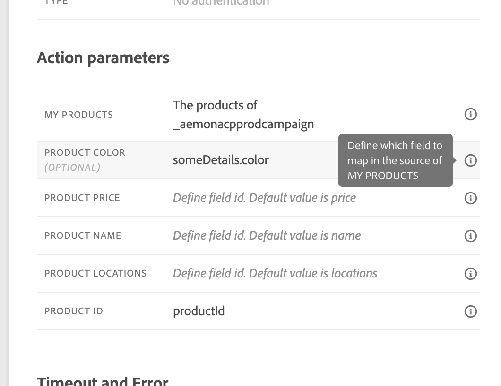

# Envio de coleções em parâmetros de ação personalizados {#passing-collection}

Você pode passar uma coleção nos parâmetros de ação personalizados que é preenchida dinamicamente no tempo de execução.

Há suporte para dois tipos de coleções:

* **Coleções simples**

  Use coleções simples para listas de valores básicos, como sequências, números ou boolianos. Elas são úteis quando você só precisa passar uma lista de itens sem propriedades adicionais.

  Por exemplo, uma lista de tipos de dispositivos:

  ```json
  {
   "deviceTypes": [
       "android",
       "ios"
   ]
  }
  ```

* **Coleções de objetos**

  Use coleções de objetos quando cada item incluir vários campos ou propriedades. Normalmente, eles são usados para transmitir dados estruturados, como detalhes do produto, registros de evento ou atributos de item.

  Por exemplo:

  ```json
  {
  "products":[
     {
        "id":"productA",
        "name":"A",
        "price":20.1
     },
     {
        "id":"productB",
        "name":"B",
        "price":10.0
     },
     {
        "id":"productC",
        "name":"C",
        "price":5.99
     }
   ]
  }
  ```

>[!NOTE]
>
>As matrizes aninhadas em coleções só têm suporte parcial em cargas de solicitação de ação personalizada. Para obter detalhes, consulte [Limitações](#limitations).

## Procedimento geral {#general-procedure}

Nesta seção, usamos o exemplo de carga JSON a seguir. Esta é uma matriz de objetos com um campo que é uma coleção simples.

```json
{
  "ctxt": {
    "products": [
      {
        "id": "productA",
        "name": "A",
        "price": 20.1,
        "color":"blue",
        "locations": [
          "Paris",
          "London"
        ]
      },
      {
        "id": "productB",
        "name": "B",
        "price": 10.99
      }
    ]
  }
}
```

Você pode ver que `products` é uma matriz de dois objetos. Você precisa ter pelo menos um objeto.

1. Crie sua ação personalizada. Saiba mais [nesta página](../action/about-custom-action-configuration.md).

1. Na seção **[!UICONTROL Parâmetros de ação]**, cole o exemplo de JSON. A estrutura exibida é estática: ao colar a carga, todos os campos são definidos como constantes.

   

1. Se necessário, ajuste os tipos de campo. Os seguintes tipos de campo são compatíveis com coleções: listString, listInteger, listDecimal, listBoolean, listDateTime, listDateTimeOnly, listDateOnly, listObject

   >[!NOTE]
   >
   >O tipo de campo é inferido automaticamente de acordo com o exemplo de carga útil.

1. Se você quiser passar objetos dinamicamente, precisará defini-los como variáveis. Neste exemplo, definimos `products` como variável. Todos os campos de objeto incluídos no objeto são definidos como variáveis automaticamente.

   >[!NOTE]
   >
   >O primeiro objeto do exemplo de carga útil é usado para definir os campos.

1. Para cada campo, defina o rótulo que será exibido na tela de jornada.

   {width="70%" align="left"}

1. Crie sua jornada e adicione a ação personalizada que você criou. Saiba mais [nesta página](../building-journeys/using-custom-actions.md).

1. Na seção **[!UICONTROL Parâmetros de ação]**, defina o parâmetro de matriz (`products` em nosso exemplo) usando o editor de expressão avançado.

   

1. Para cada um dos campos de objeto a seguir, digite o nome do campo correspondente do esquema XDM de origem. Se os nomes forem idênticos, isso não será necessário. Em nosso exemplo, precisamos apenas definir `product id` e &quot;cor&quot;.

   {width="50%" align="left"}

Para o campo de matriz, também é possível usar o editor de expressão avançado para executar a manipulação de dados. No exemplo a seguir, usamos as funções [filtro](functions/functionfilter.md) e [interseção](functions/functionintersect.md):


## Limitações {#limitations}

Embora as coleções em ações personalizadas forneçam flexibilidade para transmitir dados dinâmicos, há certas restrições estruturais a serem observadas:

* **Suporte para Matrizes Aninhadas em Ações Personalizadas**

  O Adobe Journey Optimizer oferece suporte a matrizes aninhadas de objetos em **cargas de resposta** de ação personalizada, mas esse suporte é limitado em **cargas de solicitação**.

  Nas cargas de solicitação, matrizes aninhadas só são suportadas quando contêm um número fixo de itens, conforme definido na configuração de ação personalizada. Por exemplo, se uma matriz aninhada sempre incluir exatamente três itens, ela poderá ser configurada como uma constante. Quando o número de itens precisa ser dinâmico, somente as matrizes não aninhadas (matrizes no nível inferior) podem ser definidas como variáveis.

  Exemplo:

   1. O exemplo a seguir ilustra um **caso de uso não suportado**.

      Neste exemplo, a matriz products inclui uma matriz aninhada (`locations`) com um número dinâmico de itens, para o qual não há suporte em cargas de solicitação.

      ```json
      {
      "products": [
         {
            "id": "productA",
            "name": "A",
            "price": 20,
            "locations": [
            { "name": "Paris" },
            { "name": "London" }
            ]
         }
      ]
      }
      ```

   2. Exemplo compatível, com itens fixos definidos como constantes.

      Nesse caso, os locais aninhados são substituídos por campos fixos (`location1`, `location2`), permitindo que a carga permaneça válida dentro da configuração com suporte.

      ```json
      {
      "products": [
         {
            "id": "productA",
            "name": "A",
            "price": 20,
            "location1": { "name": "Paris" },
            "location2": { "name": "London" }
         }
      ]
      }
      ```


* **Testando coleções**: para testar coleções usando o modo de teste, você deve usar o modo de exibição de código. Observe que o modo de exibição de código não é compatível com eventos comerciais, portanto, nesse caso, você só pode enviar uma coleção contendo um único elemento.


## Casos específicos{#examples}

Para tipos heterogêneos e arrays de arrays, o array é definido com o tipo listAny. Você só pode mapear itens individuais, mas não pode alterar a matriz para a variável.

{width="70%" align="left"}

Exemplo de tipo heterogêneo:

```json
{
    "data_mixed-types": [
        "test",
        "test2",
        null,
        0
    ]
}
```

Exemplo de matriz de matrizes:

```json
{
    "data_multiple-arrays": [
        [
            "test",
            "test1",
            "test2"
        ]
    ]
}
```

## Recursos adicionais

Navegue pelas seções abaixo para saber mais sobre como configurar, usar e solucionar problemas de ações personalizadas:

* [Introdução a ações personalizadas](../action/action.md) - Saiba o que é uma ação personalizada e como ela ajuda você a se conectar a sistemas de terceiros
* [Configurar ações personalizadas](../action/about-custom-action-configuration.md) - Saiba como criar e configurar uma ação personalizada
* [Usar ações personalizadas](../building-journeys/using-custom-actions.md) - Saiba como usar ações personalizadas em suas jornadas
* [Solução de problemas de ação personalizada](../action/troubleshoot-custom-action.md) - Saiba como solucionar problemas de uma ação personalizada

