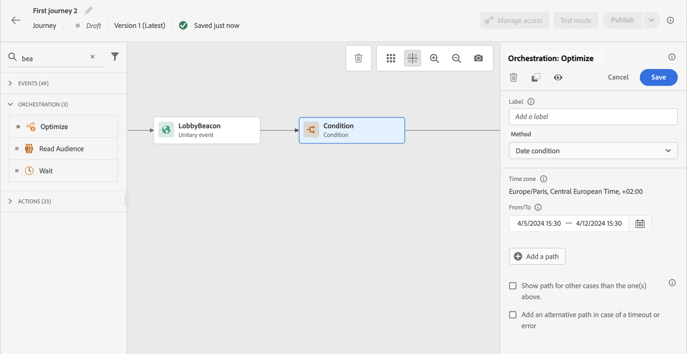

# Atividade de condição{#condition-activity}

>[!CONTEXTUALHELP]
>id="ajo_journey_condition"
>title="Atividade de condição"
>abstract="Essa atividade permite definir como o indivíduo fluirá na jornada. Vários caminhos serão criados com base em vários critérios. Você também pode criar um caminho alternativo no caso de um tempo limite ou um erro."

Esses tipos de condições estão disponíveis:

* [Condição da fonte de dados](#data_source_condition)
* [Condição de tempo](#time_condition)
* [Divisão de porcentagem](#percentage_split)
* [Condição de data](#date_condition)
* [Tampa do perfil](#profile_cap)

## Sobre a atividade Condição {#about_condition}

>[!CONTEXTUALHELP]
>id="ajo_journey_expression_simple"
>title="Sobre o editor de expressões simples"
>abstract="O modo editor de expressão simples permite executar consultas simples com base em uma combinação de campos. Todos os campos disponíveis são exibidos no lado esquerdo da tela. Arraste e solte campos na zona principal. Para combinar os diferentes elementos, faça o interbloqueio entre eles para criar grupos e/ou níveis de grupo diferentes. Você pode selecionar um operador lógico para combinar elementos no mesmo nível."

Ao usar várias condições em uma jornada, você pode definir rótulos para cada uma delas para identificá-las mais facilmente.

Clique em **[!UICONTROL Add a path]** se desejar definir várias condições. Para cada condição, um novo caminho é adicionado na tela após a atividade .

Observe que o design das jornadas tem impactos funcionais. Quando vários caminhos são definidos após uma condição, somente o primeiro caminho elegível é executado. Isso significa que você pode variar a priorização de caminhos, colocando-os acima ou abaixo uns dos outros.

Por exemplo, vamos considerar o exemplo de uma condição de primeiro caminho &quot;A pessoa é um VIP&quot; e uma condição de segundo caminho &quot;A pessoa é um homem&quot;. Se uma pessoa que cumpre ambas as condições (um homem que é um VIP) passar por esta etapa, o primeiro caminho será escolhido mesmo que essa pessoa também seja elegível para a segunda, porque o primeiro caminho está &quot;acima&quot;. Para alterar essa prioridade, mova suas atividades para outra ordem vertical.

Você pode criar outro caminho para públicos-alvo que não estejam qualificados para as condições definidas ao verificar **[!UICONTROL Show path for other cases than the one(s) above]**. Observe que essa opção não está disponível em condições de divisão. Consulte [Divisão de porcentagem](#percentage_split).

O modo simples permite executar consultas simples com base em uma combinação de campos. Todos os campos disponíveis são exibidos no lado esquerdo da tela. Arraste e solte campos na zona principal. Para combinar os diferentes elementos, faça o interbloqueio entre eles para criar grupos e/ou níveis de grupo diferentes. Você pode selecionar um operador lógico para combinar elementos no mesmo nível:

* E: uma interseção de dois critérios. Somente os elementos que correspondem a todos os critérios são considerados.
* OU: uma união de dois critérios. Os elementos correspondentes a pelo menos um dos critérios são considerados.

Se estiver usando o [Serviço de segmentação do Adobe Experience Platform](https://experienceleague.adobe.com/docs/experience-platform/segmentation/home.html){target=&quot;_blank&quot;} para criar seus segmentos, você pode aproveitá-los em suas condições de jornada. Consulte [Uso de segmentos em condições](../building-journeys/condition-activity.md#using-a-segment).

>[!NOTE]
>
>Não é possível executar consultas em séries de tempo (por exemplo, uma lista de compras, cliques anteriores em mensagens) com o editor simples. Para isso, será necessário usar o editor avançado. Consulte [esta página](expression/expressionadvanced.md).

A jornada de uma pessoa para quando ocorre um erro em uma ação ou condição. O único modo de fazê-la continuar é marcando a caixa **[!UICONTROL Add an alternative path in case of a timeout or an error]**. Consulte [esta seção](../building-journeys/using-the-journey-designer.md#paths).

No editor simples, você também encontrará a categoria Propriedades da Jornada, abaixo das categorias de evento e fonte de dados. Esta categoria contém campos técnicos relacionados à jornada de um determinado perfil. Essas são as informações recuperadas pelo sistema a partir das jornadas ativas, como a ID da jornada ou os erros específicos encontrados. [Saiba mais](expression/journey-properties.md)

## Condição da fonte de dados {#data_source_condition}

Isso permite definir uma condição com base nos campos das fontes de dados ou nos eventos posicionados anteriormente na jornada. Saiba como usar o editor de expressão no [esta seção](expression/expressionadvanced.md).

Usando o editor de expressão avançado, você pode configurar condições mais avançadas manipulando coleções ou usando fontes de dados que exigem a passagem de parâmetros. [Saiba mais](../datasource/external-data-sources.md).

## Condição de tempo{#time_condition}

Isso permite executar ações diferentes de acordo com a hora do dia e/ou o dia da semana. Por exemplo, você pode decidir enviar notificações por push durante o dia e emails à noite durante os dias da semana.

>[!NOTE]
>
>O fuso horário não é mais específico de uma condição e agora é definido no nível da jornada nas propriedades da jornada. Consulte [esta página](../building-journeys/timezone-management.md).

## Divisão de porcentagem {#percentage_split}

Essa opção permite dividir aleatoriamente o público-alvo para definir uma ação diferente para cada grupo. Defina o número de divisões e a repartição para cada caminho. O cálculo de divisão é estatístico, pois o sistema não pode prever quantas pessoas fluirão nessa atividade da jornada. Como resultado, a divisão tem uma margem de erro muito baixa. Essa função é baseada em um mecanismo aleatório Java (consulte esta seção [página](https://docs.oracle.com/javase/7/docs/api/java/util/Random.html)).

No modo de teste, ao alcançar uma divisão, a ramificação superior é sempre escolhida. Você pode reorganizar a posição das ramificações divididas se quiser que o teste escolha um caminho diferente. Consulte [esta página](../building-journeys/testing-the-journey.md)

>[!NOTE]
>
>Observe que não há um botão para adicionar um caminho na condição de divisão de porcentagem. O número de caminhos dependerá do número de divisões. Em condições divididas, não é possível adicionar um caminho para outros casos, pois ele não pode ocorrer. As pessoas sempre vão para um dos caminhos divididos.

## Condição de data {#date_condition}

Isso permite definir um fluxo diferente com base na data. Por exemplo, se a pessoa entrar na etapa durante o período de &quot;vendas&quot;, você enviará uma mensagem específica para ela. No resto do ano, você enviará outra mensagem.

>[!NOTE]
>
>O fuso horário não é mais específico de uma condição e agora é definido no nível da jornada nas propriedades da jornada. Consulte [esta página](../building-journeys/timezone-management.md).

## Tampa do perfil {#profile_cap}

Use esse tipo de condição para definir um número máximo de perfis para um caminho de jornada. Quando esse limite é atingido, os perfis que entram pegam um caminho alternativo. Isso garante que suas jornadas nunca excedam o limite definido.

>[!NOTE]
>
>Recomendamos que você defina um limite de perfil de alto valor. A precisão e probabilidade de uma população atingir o número exato de tampa só aumenta à medida que a tampa aumenta. Para números pequenos (por exemplo, um limite de 50), os números nem sempre corresponderão, pois o limite pode não ser atingido antes que os perfis escolham um caminho alternativo.

Você pode usar esse tipo de condição para aumentar o volume de seus deliveries. Veja isso [caso de uso](ramp-up-deliveries-uc.md).

O limite padrão é 1000.

O contador se aplica somente à versão do jornada selecionada. O contador é redefinido para zero após um mês. Após uma redefinição, os perfis de entrada seguem o caminho nominal novamente até que o limite do contador seja atingido.

O caminho nominal sempre tem prioridade sobre o caminho alternativo, mesmo se você mover o caminho alternativo acima do caminho nominal na tela de jornada.

Para jornadas ao vivo, aqui estão os limites a serem considerados para garantir que o limite seja atingido:

* Para uma tampa superior a 10000, o número de perfis distintos a injetar deve ser, pelo menos, 1,3 vezes a tampa.
* Para uma tampa inferior a 10000, o número de perfis distintos a injetar deve ser 1000 mais a tampa.

O limite de perfil não é considerado no modo de teste.

## Uso de segmentos em condições {#using-a-segment}

Esta seção explica como usar um segmento em uma condição de jornada. Para obter mais informações sobre segmentos e como criá-los, consulte [esta seção](../segment/about-segments.md).

Para usar um segmento em uma condição de jornada, siga estas etapas:

1. Abra uma jornada, solte uma **[!UICONTROL Condition]** e escolha a **Condição da fonte de dados**.
   

1. Clique em **[!UICONTROL Add a path]** para cada caminho extra necessário. Para cada caminho, clique no botão **[!UICONTROL Expression]** campo.

   

1. No lado esquerdo, expanda-se **[!UICONTROL Segments]** nó . Arraste e solte o segmento que deseja usar para sua condição. Por padrão, a condição no segmento é verdadeira.

   

   >[!NOTE]
   >
   >Observe que somente os indivíduos com a variável **Realizado** e **Existente** os status de participação do segmento serão considerados membros do segmento. Para obter mais informações sobre como avaliar um segmento, consulte [Documentação do Serviço de segmentação](https://experienceleague.adobe.com/docs/experience-platform/segmentation/tutorials/evaluate-a-segment.html#interpret-segment-results){target=&quot;_blank&quot;}.
