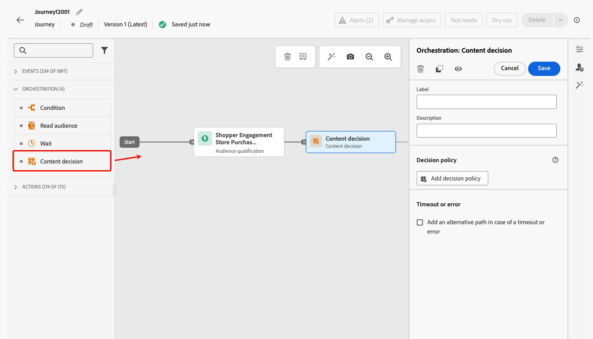
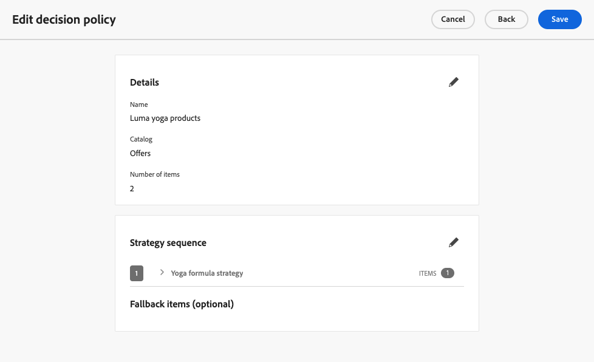

# Atividade de decisão de conteúdo {#content-decision}

>[!AVAILABILITY]
>
>Esse recurso só está disponível para um conjunto de organizações (disponibilidade limitada) e será implantado globalmente em uma versão futura.

O [!DNL Journey Optimizer] permite incluir ofertas em suas jornadas por meio da atividade dedicada **decisão de conteúdo** na tela de jornada. Em seguida, você pode adicionar outras atividades (como [ações personalizadas](../action/about-custom-action-configuration.md)) às suas jornadas para direcionar seus públicos com essas ofertas personalizadas.

>[!NOTE]
>
>A saída de uma atividade de decisão de conteúdo não pode ser usada em atividades de canal nativas.

Para aproveitar esse recurso, crie uma jornada em que você adicione uma [atividade de decisão de conteúdo](#add-content-decision-activity) para definir as ofertas que deseja apresentar aos perfis qualificados.

Em seguida, você pode usar a saída da atividade de decisão de conteúdo em:

* uma [atividade de condição](#add-condition-activity), para mover perfis para caminhos específicos com base nas ofertas recuperadas;

* uma [ação personalizada](#add-custom-action), onde você pode enviar essas ofertas para sistemas externos.

## Configurar uma atividade de decisão de conteúdo {#add-content-decision-activity}

Usando a atividade de decisão de conteúdo, você pode definir uma política de decisão que permita escolher os melhores itens da Decisão [!DNL Journey Optimizer] e entregá-los ao público certo.

<!--Their goal is to select the best offers for each profile, while the campaign/journey authoring allows you to indicate how the selected decision items should be presented, including which item attributes to be included in the message.-->

Para configurar a atividade **[!UICONTROL Decisão de conteúdo]**, siga as etapas abaixo.

1. Expanda a categoria **[!UICONTROL Orquestração]** e solte uma atividade **[!UICONTROL Decisão de conteúdo]** na tela.

   {width=100%}

1. Opcionalmente, adicione um rótulo e uma descrição à atividade.

1. Clique em **[!UICONTROL Adicionar política de decisão]**. [Saiba mais sobre políticas de decisão](../experience-decisioning/create-decision.md)

   >[!NOTE]
   >
   >As permissões de decisão são necessárias para criar uma política de decisão. [Saiba mais](../experience-decisioning/gs-experience-decisioning.md#steps)

1. Selecione o número de itens que você deseja retornar. Por exemplo, se você selecionar 2, as 2 melhores ofertas qualificadas serão apresentadas. Clique em **[!UICONTROL Next]**.

1. Na seção **[!UICONTROL Sequência de estratégia]**, selecione os itens de decisão e/ou as estratégias de seleção a serem apresentados com a política de decisão. [Saiba mais](../experience-decisioning/create-decision.md#select)

1. Organize a ordem de avaliação conforme necessário.

   Ao adicionar vários itens e/ou estratégias de decisão, eles são avaliados em ordem sequencial, indicados com números à esquerda de cada objeto ou grupo de objetos. Para alterar a sequência padrão, você pode arrastar e soltar os objetos e/ou grupos para reordená-los como desejado. [Saiba mais](../experience-decisioning/create-decision.md#evaluation-order)

1. (opcional) Adicione uma oferta substituta. [Saiba mais](../experience-decisioning/create-decision.md#fallback)

1. Revise e salve a política de decisão.

   {width=70%}<!--reshoot or change screen-->

Agora você está pronto para aproveitar o resultado dessa atividade de decisão de conteúdo na jornada.

## Usar a saída da atividade de decisão de conteúdo {#use-content-decision-output}

A saída de uma decisão de conteúdo pode ser usada em várias atividades de jornada. Por exemplo, você pode usar uma [atividade de condição](#add-condition-activity) para mover perfis para ramificações específicas da sua jornada, com base no número de ofertas recuperadas para eles.

Você também pode adicionar uma [ação personalizada](#add-custom-action) à sua jornada para compartilhar as ofertas da atividade de decisão de conteúdo com um sistema externo.

### Em uma atividade de condição {#add-condition-activity}

Para aproveitar a saída de uma atividade de decisão de conteúdo, você pode adicionar uma condição à jornada, em que define expressões para mover perfis para caminhos específicos, usando dados dessas ofertas. Siga as etapas abaixo.

1. Na categoria **[!UICONTROL Orquestração]**, solte uma atividade **[!UICONTROL Condição]** na tela. [Saiba mais](condition-activity.md#add-condition-activity)

1. (opcional) Renomeie **[!UICONTROL Path1]**, que corresponde à primeira expressão que você define, para um rótulo mais relevante.

1. Para este primeiro caminho, clique dentro do campo **[!UICONTROL Expression]** ou use o ícone Editar para adicionar uma expressão.

   {width=80%}

1. Na janela pop-up que é aberta, alterne para **[!UICONTROL Modo avançado]** para usar o [editor de expressão avançado](expression/expressionadvanced.md).

   >[!CAUTION]
   >
   >A saída de um nó de decisão de conteúdo só está disponível no **[!UICONTROL modo Avançado]**.

1. Expanda o nó **[!UICONTROL Contexto]** e navegue até a política de decisão para exibir todos os atributos disponíveis no [esquema do catálogo de ofertas](../experience-decisioning/catalogs.md#access-catalog-schema).

   

   >[!NOTE]
   >
   >Qualquer rótulo restrito definido em um atributo, em um evento de experiência de jornada usado em uma regra de decisão (como dados de contexto) ou no [esquema de ofertas](../experience-decisioning/catalogs.md#access-catalog-schema), resulta em violação de política para DULE ou consentimento. Saiba mais sobre políticas de governança de dados em [esta seção](../action/action-privacy.md)

1. Para verificar se alguma oferta foi retornada para os perfis que entram na jornada, use a função [listSize](functions/functionlistsize.md) com a seguinte sintaxe: `listSize(@decision{ContentdecisionName.items})>0`

   >[!NOTE]
   >
   >Neste exemplo, `Name` é o rótulo da decisão de conteúdo que você adicionou à jornada.

   

1. Clique em **[!UICONTROL Ok]**.

1. Adicione mais caminhos para definir outras condições, conforme necessário.

   Você também pode criar outro caminho para perfis que não atendam à primeira condição verificando **[!UICONTROL Mostrar caminho para casos diferentes dos mencionados acima]**. <!--These profiles will then exit the journey if no other activity is added in that path.-->

1. Salve a atividade de condição.

### Em uma ação personalizada {#add-custom-action}

Para aproveitar a saída de uma atividade de decisão de conteúdo, você pode adicionar uma ação personalizada à jornada, na qual compartilhará as ofertas definidas em um sistema externo. Siga as etapas abaixo.

1. Adicione uma ação personalizada à jornada. [Saiba mais](../action/about-custom-action-configuration.md)

1. Insira um rótulo para a ação.

1. Na seção **[!UICONTROL Solicitar parâmetros]**, selecione o parâmetro que deseja mapear para atributos das ofertas que foram recuperadas.

   Clique dentro do campo de texto editável e selecione qualquer parâmetro que gostaria de mapear para atributos das ofertas que foram recuperadas.

   

1. Alterne para o **[!UICONTROL modo Avançado]** na janela pop-up que é aberta. No [editor de expressão avançado](expression/expressionadvanced.md), abra o nó **[!UICONTROL Context]** para exibir todos os itens de política de decisão.

   >[!CAUTION]
   >
   >A saída de um nó de decisão de conteúdo só está disponível no **[!UICONTROL modo Avançado]**.

1. Navegue pelo [esquema do catálogo de ofertas](../experience-decisioning/catalogs.md#access-catalog-schema) usando a matriz `items`. Por exemplo, use o `itemName` da primeira oferta recuperada e o `itemName` da segunda oferta recuperada.

   

1. Clique em **[!UICONTROL Ok]** para salvar sua expressão.

1. **[!UICONTROL Salve]** sua configuração de ação personalizada.

### Exemplo completo {#use-case}

Abaixo está o exemplo completo de uma jornada que usa uma atividade de decisão de conteúdo combinada a uma atividade de condição e uma ação personalizada, como descrito acima.

<!--When all activities are properly configured and saved, [publish](publishing-the-journey.md) your journey.-->

Assim que a jornada for [ativada](publishing-the-journey.md):

<!--* Profiles who enter the journey and are eligible for at least one offer are targeted by the custom action.

* If no offer is returned for a profile, they are excluded from the custom action.-->

1. Toda vez que um perfil é qualificado para esse público-alvo, ele entra na jornada.

1. Por meio da atividade de decisão de conteúdo, [!DNL Journey Optimizer] recupera as ofertas relevantes para cada perfil.

1. Somente os perfis para os quais pelo menos uma oferta for recuperada continuam a jornada (por meio do caminho &quot;Perfis elegíveis&quot;).

1. Se a condição for atendida, as ofertas correspondentes serão enviadas para um sistema externo por meio da ação personalizada.
