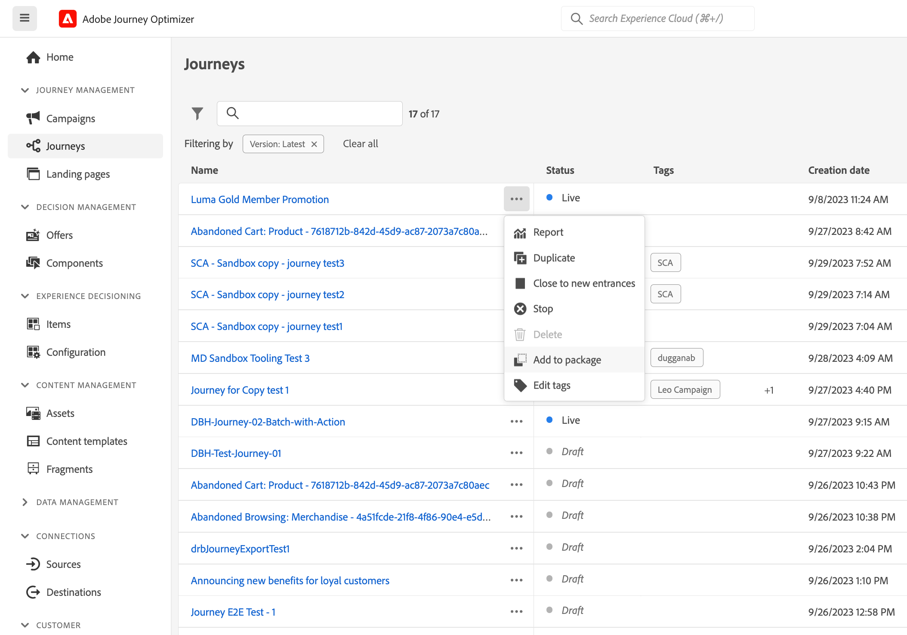
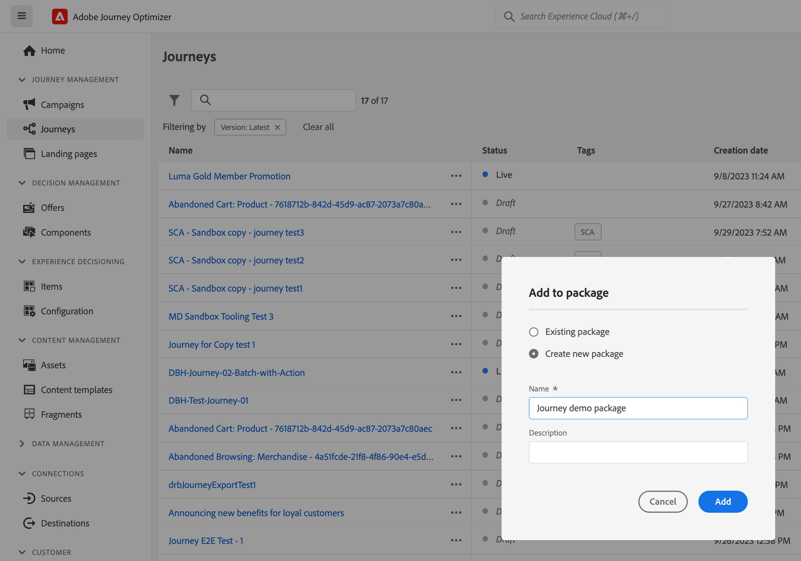

# Copiar uma jornada para outra sandbox {#copy-to-sandbox}

<!--
>[!CONTEXTUALHELP]
>id="ajo_journey_copy_main"
>title="Copy a journey to another sandbox"
>abstract="Journey Optimizer allows you to copy an entire journey from one sandbox to another. For example, you can copy a journey from the Stage sandbox environment to your Production sandbox. In addition to the Journey itself, Journey Optimizer also copies most of the objects the journey depends on."

>[!CONTEXTUALHELP]
>id="ajo_journey_copy_sandbox_details"
>title="Sandbox details"
>abstract="Select the destination sandbox you want to copy the journey to. Only sandboxes within your organization are available."

>[!CONTEXTUALHELP]
>id="ajo_journey_copy_object_details"
>title="Object details"
>abstract="This is the journey you are going to copy."

>[!CONTEXTUALHELP]
>id="ajo_journey_copy_dependent_objects"
>title="Dependent objects"
>abstract="This is the list of associated objects used in the journey. This list displays the name, the object type, as well as the internal Journey Optimizer ID."
-->

As ferramentas de sandbox permitem copiar objetos em várias sandboxes aproveitando a exportação e a importação de pacotes. Um pacote pode consistir em um único objeto ou em vários objetos. Todos os objetos incluídos em um pacote devem ser da mesma sandbox.

Esta página descreve o caso de uso de ferramentas de sandbox no contexto do Journey Optimizer. Para obter mais informações sobre o recurso em si, consulte [Documentação do Experience Platform](https://experienceleague.adobe.com/docs/experience-platform/sandbox/ui/sandbox-tooling.html).

>[!NOTE]
>
>Esse recurso exige as seguintes permissões: manage-sandbox (ou view-sandbox) e manage-package.

## Introdução às ferramentas de sandbox{#sandbox-gs}

O Journey Optimizer permite copiar uma jornada inteira de uma sandbox para outra. Por exemplo, você pode copiar uma jornada do ambiente de sandbox do Stage para a sandbox de produção. Além da jornada em si, o Journey Optimizer também copia a maioria dos objetos dos quais a jornada depende: públicos, esquemas, eventos e ações. Para obter mais detalhes sobre objetos copiados, consulte esta [seção](https://experienceleague.adobe.com/docs/experience-platform/sandbox/ui/sandbox-tooling.html#abobe-journey-optimizer-objects).

>[!CAUTION]
>
>Não garantimos que todos os elementos vinculados serão copiados para a sandbox de destino. É altamente recomendável executar uma verificação completa antes de publicar a jornada. Isso permitirá identificar qualquer objeto ausente em potencial.

Os objetos copiados na sandbox de destino são exclusivos e não há risco de substituir elementos existentes. A jornada jornada e qualquer mensagem dentro dela é trazida no modo de rascunho. Isso permite executar uma validação completa antes da publicação na sandbox de destino. O processo de cópia copia apenas os metadados sobre a jornada e os objetos nessa Jornada. Nenhum dado de perfil ou conjunto de dados está sendo copiado como parte desse processo.

O processo de cópia é realizado por meio de uma exportação e importação de pacotes entre as sandboxes de origem e de destino. Estas são as etapas gerais para copiar uma jornada de uma sandbox para outra:

1. Adicione a jornada como um pacote na sandbox de origem.
1. Exporte o pacote para a sandbox de destino.

Além disso, você pode aproveitar o Journey Optimizer **API REST do Serviço de cópia de objeto** para gerenciar objetos de sandboxes. [Saiba como trabalhar com a API REST do Object Copy Service](https://developer.adobe.com/journey-optimizer-apis/references/sandbox/)

## Adicionar a jornada como um pacote{#export}

Para copiar uma jornada para outra sandbox, primeiro adicione a jornada como um pacote na sandbox de origem. Siga estas etapas:

1. Na seção de menu GERENCIAMENTO de JORNADAS, clique em **[!UICONTROL Jornadas]**. A lista de jornadas é exibida.

1. Procure a jornada que deseja copiar, clique no link **Mais ações** (os três pontos ao lado do nome da jornada) e clique em **Adicionar ao pacote**.

   

   A variável **Adicionar ao pacote** é exibida.

   

1. Escolha se deseja adicionar a jornada a um pacote existente ou criar um novo pacote:

   * **Pacote existente**: selecione o pacote no menu suspenso.
   * **Criar um novo pacote**: digite o nome do pacote. Você também pode adicionar uma descrição.

1. Na seção do menu ADMINISTRAÇÃO, clique em **[!UICONTROL Sandboxes]**, selecione o **Pacotes** e clique no pacote que deseja exportar.

   

1. Selecione os objetos que deseja exportar e clique em **Publish**

   

   Se a publicação falhar, você poderá verificar os logs para identificar o motivo da falha. Abra o pacote, clique em **Consulte trabalhos com falha**, selecione o trabalho de importação e clique em **Exibir detalhes da importação**.

   

## Exportar o pacote para a sandbox de destino {#import}

Depois que o pacote for publicado, é necessário exportá-lo para a sandbox de destino.

1. Na sandbox de origem, clique no botão **[!UICONTROL Sandboxes]** selecione o **Pacotes** e clique no ícone +, ao lado do pacote que você deseja exportar.

   

1. Selecione o **Sandbox do Target** no campo suspenso e clique em **Próxima**. Somente as sandboxes da sua organização estão disponíveis.

   

1. Revise os objetos e as dependências do pacote. Essa é a lista de objetos associados usados na jornada. Esta lista exibe o nome e o tipo de objeto. Para cada objeto, você pode optar por criar um novo ou usar um existente na sandbox de destino.

   

1. Clique em **Concluir** no canto superior direito, para começar a copiar o pacote para a sandbox de destino. O processo de cópia varia de acordo com a complexidade da jornada e com quantos objetos precisam ser copiados.

1. Clique no trabalho de importação para revisar o resultado da cópia:

   * Clique em **Exibir objetos importados** para exibir cada objeto individual copiado.
   * Clique em **Exibir detalhes da importação** para verificar os resultados da importação para cada objeto.

   

1. Acesse sua sandbox de destino e execute uma verificação completa de todos os objetos copiados.
