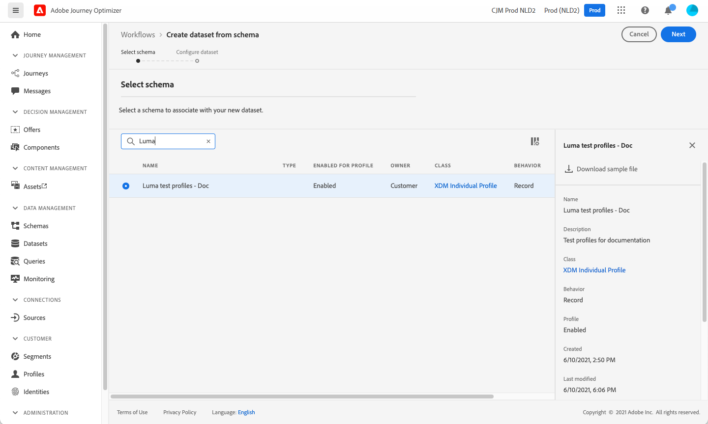
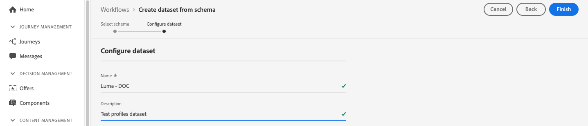

# Criar perfis de teste {#create-test-profiles}

Os perfis de teste são necessários ao usar o [modo de teste](../building-journeys/testing-the-journey.md) em uma jornada, e para [visualizar e testar seu conteúdo](../design/preview.md).

Há várias maneiras de criar perfis de teste. Você pode encontrar nesta página detalhes para:

* Vire uma [perfil existente](#turning-profile-into-test) em um perfil de teste

* Crie perfis de teste carregando um [arquivo csv](#create-test-profiles-csv) ou usando [Chamadas de API](#create-test-profiles-api).

   Além desses dois métodos, o Adobe Journey Optimizer vem com um [caso de uso no produto](#use-case-1) para facilitar a criação do perfil de teste.

Você também pode fazer upload de um arquivo json em um conjunto de dados existente. Para obter mais informações, consulte [Documentação da assimilação de dados](https://experienceleague.adobe.com/docs/experience-platform/ingestion/tutorials/ingest-batch-data.html#add-data-to-dataset){target=&quot;_blank&quot;}.

Observe que criar um perfil de teste é semelhante à criação de perfis regulares no Adobe Experience Platform. Para obter mais informações, consulte [Documentação de Perfil do cliente em tempo real](https://experienceleague.adobe.com/docs/experience-platform/profile/home.html?lang=pt-BR){target=&quot;_blank&quot;}.

➡️ [Saiba como criar perfis de teste neste vídeo](#video)

## Pré-requisitos {#test-profile-prerequisites}

Para criar perfis, primeiro é necessário criar um esquema e um conjunto de dados no Adobe [!DNL Journey Optimizer].

Para **criar um schema** siga estas etapas:

1. Na seção do menu GERENCIAMENTO DE DADOS , clique em **[!UICONTROL Schemas]**.
   
1. Clique em **[!UICONTROL Create schema]**, na parte superior direita e, em seguida, selecione um tipo de schema, por exemplo **Perfil individual XDM**.
   
1. Selecione os grupos de campos apropriados. Certifique-se de adicionar o **Detalhes do teste de perfil** grupo de campos.
   
Depois de concluído, clique em **[!UICONTROL Add field groups]**: a lista de grupos de campos é exibida na tela de visão geral do schema.
   

   >[!NOTE]
   >
   >* Clique no nome do schema para alterá-lo e atualizar suas propriedades.
   >
   >* Clique no botão **[!UICONTROL Add]** na seção Field groups para selecionar outros grupos de campos a serem adicionados no esquema


1. Na lista de campos, clique no campo que deseja definir como a identidade primária.
   
1. No **[!UICONTROL Field properties]** no painel direito, marque a opção **[!UICONTROL Identity]** e **[!UICONTROL Primary Identity]** e selecione um namespace. Se quiser que a identidade primária seja um endereço de email, escolha a variável **[!UICONTROL Email]** namespace. Clique em **[!UICONTROL Apply]**.
   
1. Selecione o esquema e habilite o **[!UICONTROL Profile]** na **[!UICONTROL Schema properties]** painel.
   
1. Clique em **Salvar**.

>[!NOTE]
>
>Para obter mais informações sobre criação de schema, consulte [Documentação XDM](https://experienceleague.adobe.com/docs/experience-platform/xdm/ui/resources/schemas.html#prerequisites){target=&quot;_blank&quot;}.

Então você precisa **criar o conjunto de dados** em que os perfis serão importados. Siga estas etapas:

1. Navegue até **[!UICONTROL Datasets]**, depois clique em **[!UICONTROL Create dataset]**.
   
1. Choose **[!UICONTROL Create dataset from schema]**.
   
1. Selecione o schema criado anteriormente e clique em **[!UICONTROL Next]**.
   
1. Escolha um nome e clique em **[!UICONTROL Finish]**.
   
1. Ative o **[!UICONTROL Profile]** opção.
   

>[!NOTE]
>
> Para obter mais informações sobre a criação de conjuntos de dados, consulte [Documentação do Serviço de catálogo](https://experienceleague.adobe.com/docs/experience-platform/catalog/datasets/user-guide.html#getting-started){target=&quot;_blank&quot;}.

## Caso de uso no produto{#use-case-1}

Na página inicial do Adobe Journey Optimizer, você pode aproveitar os perfis de teste no caso de uso do produto. Esse caso de uso facilita a criação de perfis de teste usados para testar jornadas antes da publicação.


Clique no botão **[!UICONTROL Begin]** para iniciar o caso de uso.

As seguintes informações são obrigatórias:

1. **Namespace de identidade**: O [namespace de identidade](../segment/get-started-identity.md) usado para identificar os perfis de teste de maneira exclusiva. Por exemplo, se o email for usado para identificar os perfis de teste, o namespace de identidade **Email** deve ser selecionada. Se o identificador exclusivo for o número de telefone, então o namespace de identidade **Telefone** deve ser selecionada.

2. **Arquivo CSV**: Um arquivo separado por vírgulas contendo a lista de perfis de teste a serem criados. O caso de uso espera um formato predefinido para o arquivo CSV que contenha a lista de perfis de teste a serem criados. Cada linha no arquivo deve incluir os seguintes campos na ordem correta, da seguinte maneira:

   1. **ID da pessoa**: Identificador exclusivo do perfil de teste. Os valores desse campo devem refletir o namespace de identidade selecionado. (Como exemplo, se **Telefone** for selecionado para o namespace de identidade, os valores desse campo devem ser números de telefone. Da mesma forma, se **Email** for selecionada, os valores desse campo deverão ser emails)
   1. **Endereço de email**: Endereço de email do perfil de teste. (O **ID da pessoa** e o **Endereço de email** o campo poderia conter os mesmos valores se **Email** é selecionado como o namespace de identidade)
   1. **Nome**: Nome do perfil de teste.
   1. **Sobrenome**: Sobrenome do perfil de teste.
   1. **Cidade**: Perfil de teste da cidade de residência
   1. **País**: País de residência do perfil de teste
   1. **Gênero**: Gênero do perfil de teste. Os valores disponíveis são **macho**, **fêmea** e **non_specified**

Depois de selecionar o namespace de identidade e fornecer o arquivo CSV com base no formato acima, clique em **[!UICONTROL Run]** no canto superior direito. O caso de uso pode levar alguns minutos para ser concluído. Quando o caso de uso concluir o processamento e criar os perfis de teste, uma notificação será enviada para notificar o usuário.

>[!NOTE]
>
>Os perfis de teste podem substituir perfis existentes. Antes de executar o caso de uso, verifique se o CSV contém somente perfis de teste e se é executado na sandbox correta.

## Transformar um perfil em um perfil de teste{#turning-profile-into-test}

Você pode transformar um perfil existente em um perfil de teste: é possível atualizar os atributos de perfil da mesma maneira que criar um perfil.

Uma maneira simples de fazer isso é usando um **[!UICONTROL Update Profile]** atividade de ação em uma jornada e altere a **testProfile** campo booleano de false para true.

Sua jornada será composta por um **[!UICONTROL Read Segment]** e um **[!UICONTROL Update Profile]** atividade . Primeiro, é necessário criar um segmento direcionado aos perfis que você deseja transformar em perfis de teste.

>[!NOTE]
>
> Como você atualizará o **testProfile** , os perfis escolhidos devem incluir esse campo. O schema relacionado deve ter a variável **Detalhes do teste de perfil** grupo de campos. Consulte [esta seção](../segment/creating-test-profiles.md#test-profiles-prerequisites).

1. Navegue até **Segmentos**, em seguida **Criar segmento**, no canto superior direito.
   
1. Defina um nome para o segmento e crie o segmento: escolha os campos e os valores para direcionar os perfis desejados.
   
1. Clique em **Salvar** e verifique se os perfis estão direcionados corretamente pelo segmento.
   

   >[!NOTE]
   >
   > O cálculo de segmentos pode levar algum tempo. Saiba mais sobre segmentos em [esta seção](../segment/about-segments.md).

1. Agora crie uma nova jornada e comece com uma **[!UICONTROL Read Segment]** atividade de orquestração.
1. Escolha o segmento criado anteriormente e o namespace que seus perfis usam.
   
1. Adicione um **[!UICONTROL Update Profile]** atividade de ação.
1. Selecione o schema, a variável **testProfiles** , o conjunto de dados e defina o valor como **Verdadeiro**. Para fazer isso, no **[!UICONTROL VALUE]** clique no campo **Caneta** no ícone à direita, selecione **[!UICONTROL Advanced mode]** e insira **true**.
   
1. Clique em **[!UICONTROL Publish]**.
1. No **[!UICONTROL Segments]** verifique se os perfis foram atualizados corretamente.
   

   >[!NOTE]
   >
   > Para obter mais informações sobre o **[!UICONTROL Update Profile]** atividade , consulte [esta seção](../building-journeys/update-profiles.md).

## Criar um perfil de teste usando um arquivo csv{#create-test-profiles-csv}

No Adobe Experience Platform, é possível criar perfis carregando um arquivo csv contendo os diferentes campos de perfil no conjunto de dados. Este é o método mais fácil.

1. Crie um arquivo csv simples usando um software de planilha.
1. Adicione uma coluna para cada campo necessário. Certifique-se de adicionar o campo de identidade primário (&quot;personID&quot; no nosso exemplo acima) e o campo &quot;testProfile&quot; definidos como &quot;true&quot;.
   
1. Adicione uma linha por perfil e preencha os valores de cada campo.
   
1. Salve a planilha como um arquivo csv. Verifique se as vírgulas são usadas como separadores.
1. Navegue até Adobe Experience Platform **Fluxos de trabalho**.
   
1. Choose **Mapear CSV para esquema XDM**, depois clique em **Launch**.
   
1. Selecione o conjunto de dados para o qual deseja importar os perfis. Clique em **Próximo**.
   
1. Clique em **Escolher arquivos** e selecione o arquivo csv. Quando o arquivo for carregado, clique em **Próximo**.
   
1. Mapeie os campos csv de origem para os campos de esquema e clique em **Concluir**.
   
1. A importação de dados é iniciada. O status será movido de **Processamento** para **Sucesso**. Clique em **Visualizar conjunto de dados**, no canto superior direito.
   
1. Verifique se os perfis de teste foram adicionados corretamente.
   

Seus perfis de teste são adicionados e agora podem ser usados ao testar uma jornada. Consulte [esta seção](../building-journeys/testing-the-journey.md).
>[!NOTE]
>
> Para obter mais informações sobre importações de csv, consulte [Documentação da assimilação de dados](https://experienceleague.adobe.com/docs/experience-platform/ingestion/tutorials/map-a-csv-file.html#tutorials){target=&quot;_blank&quot;}.

## Criar perfis de teste usando chamadas de API{#create-test-profiles-api}

Também é possível criar perfis de teste por meio de chamadas de API. Saiba mais em [Documentação do Adobe Experience Platform](https://experienceleague.adobe.com/docs/experience-platform/profile/home.html){target=&quot;_blank&quot;}.

Você deve usar um Esquema de perfil que contenha o grupo de campos &quot;Detalhes do teste de perfil&quot;. O sinalizador testProfile faz parte desse grupo de campos.
Ao criar um perfil, transmita o valor: testProfile = true.

Observe que você também pode atualizar um perfil existente para alterar seu sinalizador testProfile para &quot;true&quot;.

Este é um exemplo de uma chamada de API para criar um perfil de teste:

```
curl -X POST \
'https://dcs.adobedc.net/collection/xxxxxxxxxxxxxx' \
-H 'Cache-Control: no-cache' \
-H 'Content-Type: application/json' \
-H 'Postman-Token: xxxxx' \
-H 'cache-control: no-cache' \
-H 'x-api-key: xxxxx' \
-H 'x-gw-ims-org-id: xxxxx' \
-d '{
"header": {
"msgType": "xdmEntityCreate",
"msgId": "xxxxx",
"msgVersion": "xxxxx",
"xactionid":"xxxxx",
"datasetId": "xxxxx",
"imsOrgId": "xxxxx",
"source": {
"name": "Postman"
},
"schemaRef": {
"id": "https://example.adobe.com/mobile/schemas/xxxxx",
"contentType": "application/vnd.adobe.xed-full+json;version=1"
}
},
"body": {
"xdmMeta": {
"schemaRef": {
"contentType": "application/vnd.adobe.xed-full+json;version=1"
}
},
"xdmEntity": {
"_id": "xxxxx",
"_mobile":{
"ECID": "xxxxx"
},
"testProfile":true
}
}
}'
```
## Vídeo tutorial {#video}

Saiba como criar perfis de teste.

>[!VIDEO](https://video.tv.adobe.com/v/334236?quality=12)
