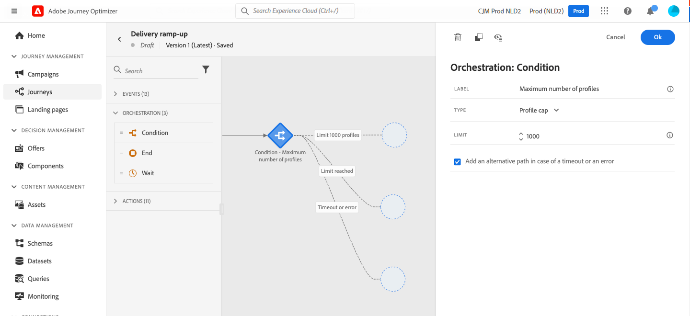

# Caso de uso: criar uma ação personalizada para enviar dados a [!DNL Adobe Experience Platform]{#send-data-to-aep}

>[!BEGINSHADEBOX]

**Nesta página:** saiba como criar uma jornada que aumenta gradualmente seu volume de email usando uma atividade Otimize com uma condição de limite de perfil para aquecer seu IP e proteger a reputação do remetente.

>[!ENDSHADEBOX]

Se você migrou recentemente para outro provedor de serviços de email, endereço IP ou domínio ou subdomínio de email, estabeleça sua reputação como remetente. Caso contrário, os deliveries podem ser bloqueados ou movidos para as pastas de spam dos recipients. Para obter orientação, consulte o [Manual de práticas recomendadas de capacidade de entrega](https://experienceleague.adobe.com/docs/deliverability-learn/deliverability-best-practice-guide/additional-resources/generic-resources/increase-reputation-with-ip-warming.html?lang=pt-BR){target="_blank"}.

Para aquecer seu IP, você pode aumentar gradualmente o número de deliveries. Leia mais sobre [otimização da entrega no Journey Optimizer](../reports/deliverability.md).

O objetivo deste caso de uso é criar uma jornada para incrementar suas entregas de email. Para configurar essa jornada, siga estas etapas:

1. Criar uma jornada. [Leia mais](journey-gs.md).

1. Adicione uma atividade **[!UICONTROL Otimizar]** à jornada. [Leia mais](optimize.md).

1. Nas configurações da atividade **[!UICONTROL Condição]**, defina o número máximo de destinatários para sua entrega:

   1. Nas configurações de atividade **[!UICONTROL Otimizar]**, selecione o método **[!UICONTROL Condições]** e defina o campo **[!UICONTROL Tipo]** como **[!UICONTROL Limite de perfis]**. [Leia mais](conditions.md#profile_cap).

   1. Defina o campo **[!UICONTROL Limit]** para o número máximo de destinatários desta entrega.

   

   É possível aumentar gradualmente esse limite até o número total de assinantes.

1. Adicione uma atividade de ação **[!UICONTROL Email]** ao caminho nominal após a atividade **[!UICONTROL Condição]**.

   

   Quando a jornada for executada, a mensagem será enviada para os perfis de entrada, até o número máximo de perfis especificado. Quando esse limite é atingido, os perfis que entram pegam o caminho alternativo.

1. Conclua a jornada com as atividades de sua escolha.

Após o aquecimento do IP, é possível remover essa condição.

+++ Referência de conhecimento de IA

Esta seção contém conhecimento estruturado destinado a oferecer suporte à interpretação, recuperação e resposta a perguntas relacionadas a este tópico.

Para uma compreensão completa, essas informações devem ser combinadas com a documentação desta página. Nenhuma das origens deve ser independente; a página descreve o recurso, enquanto esta seção fornece um contexto adicional que ajuda a desfazer a ambiguidade da terminologia, intenção, aplicabilidade e restrições.

* **TL;DR:** esta página aborda um caso de uso de aquecimento de IP baseado em jornada que aumenta gradualmente o volume de entrega de email usando uma condição de limite de perfil para proteger a reputação do remetente.

**Intenções:**

* Crie uma jornada de aquecimento de IP para aumentar gradualmente o volume de envio de email
* Configurar uma condição de limite de perfil para limitar o número de recipients por delivery
* Adicionar uma atividade de ação Email ao caminho de jornada nominal
* Remover a condição de limite de perfil após a conclusão do aquecimento de IP

**Glossário:**

* **Aquecimento de IP**: o processo de aumentar gradualmente o volume de envio de email de um novo endereço IP para estabelecer a reputação do remetente *(específico do produto)*
* **Limite de perfis**: um tipo de condição no Journey Optimizer que limita o número máximo de perfis que podem assumir um caminho de jornada específico *(específico do produto)*
* **Caminho nominal**: a ramificação primária de uma jornada que os perfis seguem quando as condições são atendidas *(específico do produto)*

**Medidas de Proteção:**

* Uma condição de limite de perfil deve ser definida na atividade Condição para controlar o volume de delivery durante o aquecimento de IP.
* Perfis que excedem o limite são roteados para o caminho alternativo.
* A jornada deve ser recriada ou modificada após a conclusão do aquecimento de IP para remover a condição de limite.

**Terminologia:**

* Nome canônico: Aquecimento de IP — Acrônimo: n/a — variantes: Aquecimento de IP, Aquecimento de reputação do remetente
* Sinônimos: &quot;Limite de perfil&quot; = &quot;condição de limite do recipient&quot;
* Não confunda: &quot;Aquecimento de IP&quot; ≠ &quot;autenticação de email&quot; (a configuração do SPF/DKIM/DMARC é separada)

**Perguntas frequentes:**

* **P: Por que preciso aquecer meu IP?** — os novos endereços IP não têm histórico de envio, portanto, os provedores de caixa de correio podem bloquear ou excluir mensagens de pastas de spam até que a reputação seja estabelecida.
* **P: O que acontece com os perfis que excedem o limite de perfis?** — Eles seguem o caminho alternativo definido na atividade Condition.
* **P: Como faço para aumentar o limite ao longo do tempo?** — Edite o campo Limit nas configurações de atividade Condition e aumente gradualmente até a contagem total de assinantes.
* **P: Quando posso remover a condição de limite de perfil?** — Assim que o IP tiver histórico de envio suficiente e as métricas de capacidade de delivery estiverem estáveis, você poderá remover a condição da jornada.

+++
