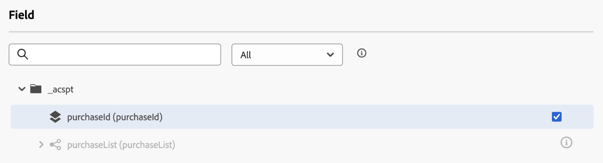

# Usar dados do [!DNL Adobe Experience Platform] no jornada {#datalookup}

>[!CONTEXTUALHELP]
>id="ajo_journey_dataset_lookup"
>title="Atividade de pesquisa do conjunto de dados"
>abstract="A atividade **[!UICONTROL Pesquisa de conjunto de dados]** permite recuperar dados dinamicamente dos conjuntos de dados de registro da Adobe Experience Platform durante o tempo de execução. Esse recurso permite acessar dados que podem não residir no perfil ou no conteúdo do evento, garantindo que as interações do cliente sejam relevantes e oportunas."

A atividade **[!UICONTROL Pesquisa de conjunto de dados]** permite recuperar dados dinamicamente dos conjuntos de dados de registro da Adobe Experience Platform durante o tempo de execução. Esse recurso permite acessar dados que podem não residir no perfil ou no conteúdo do evento, garantindo que as interações do cliente sejam relevantes e oportunas.

Principais benefícios:

* **Personalização em tempo real**: personalize as experiências do cliente usando dados enriquecidos.
* **Tomada de decisão dinâmica**: use dados externos para orientar lógica e ações de jornada.
* **Acesso a dados aprimorado**: recupere metadados do produto, tabelas de preços ou dados relacionais vinculados a chaves específicas.

>[!AVAILABILITY]
>
>Esta atividade está disponível apenas para algumas organizações (disponibilidade limitada). Para obter acesso, entre em contato com um representante da Adobe.

## Leitura obrigatória {#must-read}

### Ativação do conjunto de dados

O conjunto de dados deve ser ativado para pesquisa no Adobe Experience Platform. Informações detalhadas estão disponíveis nesta seção: [Usar dados do Adobe Experience Platform](../data/lookup-aep-data.md).

### Limites e restrições

* Máximo de 10 atividades de Pesquisa de conjunto de dados por jornada.
* Máximo de 20 campos selecionados.
* Máximo de 50 chaves na matriz de chaves de pesquisa.
* O tamanho de dados enriquecido é limitado a 10 KB.

### Considerações adicionais sobre desempenho

As recomendações abaixo são orientações para evitar atrasos no delivery:

| Consideração | Limite recomendado | Descrição |
| ------- | ------- | ------- |
| Atributos por pesquisa | Até 20 | Número de campos de dados recuperados por registro em uma única atividade de pesquisa. |
| Atividades de pesquisa | Até 5 por jornada | Cada jornada pode conter até 5 atividades de pesquisa separadas. Cada pesquisa pode direcionar a um conjunto de dados diferente. |

## Configurar a atividade de pesquisa do conjunto de dados {#configure}

Para configurar a atividade **[!UICONTROL Pesquisa de conjunto de dados]**, siga estas etapas:

1. Expanda a categoria **[!UICONTROL Orquestração]** e solte uma atividade de **[!UICONTROL Pesquisa de conjunto de dados]** na tela.

   

1. Adicione um rótulo e uma descrição.

1. No campo **[!UICONTROL Conjunto de Dados]**, selecione o conjunto de dados com os atributos necessários.

   >[!NOTE]
   >
   >Se o conjunto de dados que você está procurando não for exibido na lista, verifique se você o ativou para pesquisa. Para obter mais detalhes, consulte a seção [Deve ler](#must-read).

1. Selecione os campos específicos que deseja buscar no conjunto de dados.

   * Você só pode selecionar nós de folha (campos no nível mais baixo do esquema). O campo deve ser um valor primitivo (sequência, número, booleano, data etc.).

   * Listas (matrizes) e mapas (objetos de valor-chave) não podem ser selecionados.

   +++Exemplo

   

   +++

1. No campo **[!UICONTROL Chave(s) de pesquisa]**, escolha uma chave de associação que exista nos atributos de item de decisão e no conjunto de dados. Essa chave é usada pelo sistema para pesquisar no conjunto de dados selecionado.

   * As chaves podem ser expressões derivadas do contexto da jornada, como SKUs, IDs de email ou outros identificadores. Exemplo: `@profile.email` ou `list(@event{purchase_event.products.sku})`.

   * Somente **cadeias de caracteres** ou **listas de cadeias de caracteres** têm suporte.

   +++Exemplo

   

   +++

## Usar dados enriquecidos na jornada

Os dados recuperados pela atividade **[!UICONTROL Pesquisa de conjunto de dados]** são armazenados no contexto de Jornada como uma matriz de objetos. Está disponível no editor de expressão de jornada e no editor de personalização, permitindo lógica condicional e mensagens personalizadas com base em dados enriquecidos.

* **Editor de Expressão de Jornada**:

  Acesse o editor do **[!UICONTROL Modo avançado]** e use a sintaxe: `@datasetLookup{MyDatasetLookUpActivity1.entities}`. [Saiba como trabalhar com o editor de expressão avançado](../building-journeys/expression/expressionadvanced.md)

* **Editor Personalization**:

  Use a sintaxe: `{{context.journey.datasetLookup.1482319411.entities}}`.

>[!NOTE]
>
>Os dados enriquecidos são transitórios e estão disponíveis apenas durante o tempo de execução da jornada e na personalização de atividades de saída (email, push, SMS etc.)

## Exemplos de casos de uso

+++Filtragem com base na categoria do produto

**Cenário**:Send um cupom para usuários que gastam mais de US$ 40 em produtos domésticos.

**Fluxo de Jornadas**:

1. **Evento de compra**: capturar SKUs do carrinho do usuário.

1. **Atividade de pesquisa do conjunto de dados**:

   * Conjunto de dados: `products-dataset` (SKU como chave primária).
   * Chaves de Pesquisa: `list(@event{purchase_event.products.sku})`.
   * Campos a Retornar: `["SKU", "category", "price"]`.

1. **Atividade de condição**:

   * Filtrar SKUs em que a categoria é &quot;residência&quot;.

     ```
     @event{purchase_event.products.all( in(currentEventField.sku, @datasetlookup{MyDatasetLookupActivity1.entities.all(currentDatasetLookupField.category == 'household').sku} ) )} 
     ```

   OR

   * Agregar o total gasto em produtos domésticos e compará-lo ao limite de US$ 40.

     ```
     sum(@event{purchase_event.products.all( in(currentEventField.sku, @datasetlookup{MyDatasetLookUpActivity1.entities.all(currentDatasetLookupField.category == 'household').sku} ) )}.price}, ',', true ) > 40
     ```

1. **Editor Personalization**:

   Use os dados enriquecidos para personalizar o conteúdo do email:

   ```
   
   {{#each journey.datasetlookup.3709000.entities as |product|}}
   
   
   {{/each}}
   "Hi, thanks for spending " +  + " on household products. Here is your reward!"
   ```

+++

+++Personalization usando dados de fidelidade externos

**Cenário**: identifique qual conta de email de um perfil tem um Status de Fidelidade Platinum. Nesse cenário, a conta de fidelidade é associada a uma ID de email e os dados de fidelidade não estão disponíveis na loja de pesquisa de perfil padrão.

**Fluxo de Jornadas**:

1. **Acionador do Evento de Perfil**: Capturar IDs de email do perfil ou do contexto do evento.

1. **Atividade de Pesquisa de Conjunto de Dados**:
   * Conjunto de dados: `loyalty-member-dataset` (email como chave primária).
   * Chaves de Pesquisa: `@profile.email`.
   * Campos a Retornar: `["email", "loyaltyTier"]`.

1. **Atividade de condição**:

   Ramifique a jornada com base no nível de fidelidade:

   ```
   @datasetLookup{MyDatasetLookUpActivity1.entity.loyaltyMember.loyaltyTier} == 'Platinum'
   ```

1. **Editor Personalization**:

   Use os dados da camada de fidelidade enriquecida para personalizar a comunicação de saída:

   ```
   {{context.journey.datasetLookup.1482319411.entity.loyaltyMember.loyaltyTier}}
   ```
