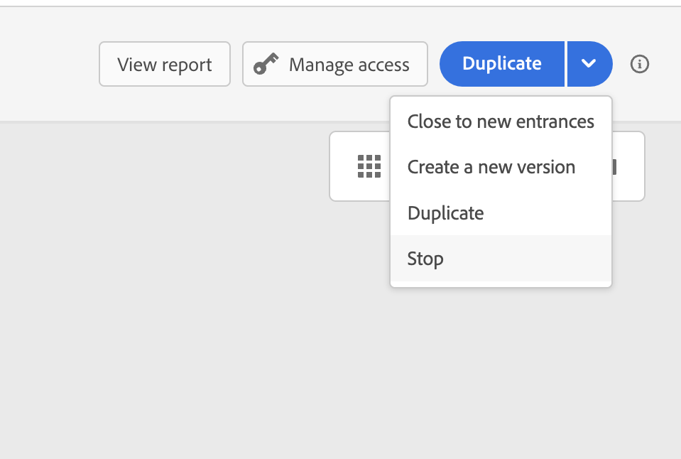

# Encerrar uma jornada {#journey-ending}

>[!BEGINSHADEBOX]

**Nesta página:** saiba como as jornadas terminam para perfis individuais e gerais e como fechar ou parar uma jornada em tempo real quando é necessário parar novas entradas ou todo o processamento.

>[!ENDSHADEBOX]

>[!TIP]
>
>Procurando orientação prática sobre quando e como os perfis devem sair das jornadas? Consulte nosso [guia abrangente para os critérios de entrada e saída do jornada](entry-exit-criteria-guide.md), que inclui cenários de saída reais, práticas recomendadas e orientação de configuração.

## Como uma jornada ativa termina

As jornadas são fechadas quando o tempo limite da jornada global é atingido ou após a última ocorrência de uma jornada recorrente baseada no público-alvo. [Saiba como as jornadas são fechadas](#close-journey).

Se precisar encerrar uma jornada em tempo real, recomendamos que [você a feche](#close-to-new-entrances) manualmente. A chegada de novos clientes à jornada é então bloqueada. Os perfis que já entraram na jornada podem experimentá-la até o fim.

Você também pode [parar uma jornada](#stop-journey), somente em caso de emergência e se todo o processamento da jornada precisar ser finalizado imediatamente. As pessoas que já entraram em uma jornada são todas interrompidas em seu progresso.

>[!IMPORTANT]
>
>* Não é possível reiniciar ou excluir uma jornada [fechada](#close-journey) ou [interrompida](#stop-journey). Você pode [criar uma nova versão](publish-journey.md#journey-versions) ou [duplicá-la](journey-ui.md#duplicate-a-journey).
>
>* Somente as jornadas concluídas podem ser excluídas.

## Como os perfis encerram uma jornada

Uma jornada termina para um indivíduo em dois contextos específicos:

* O indivíduo atinge a última atividade de um caminho e, em seguida, se move para a [Marca de fim](#end-tag).
* O indivíduo atinge uma atividade de **Condição** (ou uma atividade de **Espera** com uma condição) e não corresponde a nenhuma das condições.

O indivíduo pode então entrar novamente na jornada se a reentrada for permitida. [Saiba mais sobre o gerenciamento de entrada/reentrada](../building-journeys/journey-properties.md#entrance)

## Jornada marca de fim {#end-tag}

Ao criar uma jornada, uma tag End é exibida no final de cada caminho. Este nó não pode ser adicionado por um usuário, não pode ser removido e somente seu rótulo pode ser alterado. Ele marca o fim de cada caminho da jornada.

Se a jornada tiver vários caminhos, recomendamos adicionar um rótulo a cada extremidade para facilitar a leitura dos relatórios. Saiba mais sobre [relatórios do jornada](../reports/live-report.md).

## Fechar uma jornada {#close-journey}

Uma jornada pode ser fechada pelos seguintes motivos:

* Uma jornada de Leitura de Público não recorrente **para automaticamente** depois que um buffer de segurança segue sua execução agendada. [Saiba mais](#auto-stop-non-recurring)
* Após a última ocorrência de uma jornada recorrente baseada no público-alvo.
* A jornada é fechada manualmente pelo botão [**[!UICONTROL Fechar para novas entradas]**](#close-to-new-entrances).
* O tempo limite de jornada global de 91 dias foi atingido.

Após o tempo limite global de **jornada de 91 dias**, uma jornada Ler público alterna para o status **Concluído**. Esse comportamento é definido para 91 dias somente, pois todas as informações sobre os perfis que entraram na jornada são removidas 91 dias após terem entrado. As pessoas que ainda estão na jornada são afetadas automaticamente. Eles saem da jornada após o tempo limite de 91 dias.  Saiba mais sobre [o tempo limite global do jornada](../building-journeys/journey-properties.md#global_timeout).

### Interrupção automática de jornada para públicos-alvo não recorrentes {#auto-stop-non-recurring}

Uma **jornada de Leitura de Público não recorrente** faz a transição automática para o status **[!UICONTROL Parado]** após a execução agendada de um buffer de segurança. Isso elimina o comportamento anterior em que as jornadas de Leitura de Público não recorrentes permaneceram no status **Live** até que o tempo limite global de 91 dias expirasse, mesmo que nenhum perfil estivesse fluindo ativamente por meio delas.

**Como funciona:**

1. A jornada é executada e todos os perfis do público-alvo são processados.
1. À medida que cada perfil atinge o final da jornada, ele sai normalmente.
1. Após a execução agendada, a jornada permanece no status **[!UICONTROL Ativa]** durante um período de buffer de segurança.
1. Após o buffer de segurança expirar (aproximadamente 96 horas após o tempo de execução agendado da jornada), a jornada passará automaticamente para o status **[!UICONTROL Parada]** logo depois.

Este comportamento se aplica somente a **jornadas de Leitura de Público não recorrentes**. As jornadas recorrentes não são afetadas.

* **Interrupção automática de tempo:** O buffer de segurança contabiliza duas janelas: uma **janela ociosa de 24 horas** para permitir que qualquer envio em andamento seja concluído e uma **permissão de 72 horas de Período de Silêncio** (o Período de Silêncio pode adiar os envios em até 72 horas). O buffer total é aproximadamente **96 horas (~4 dias)** após o tempo de execução agendado da jornada. A jornada permanece com o status **[!UICONTROL Ativa]** durante esse período. Esse é um comportamento esperado e não indica um problema.

* **As jornadas baseadas em ondas são excluídas:** esse comportamento de interrupção automática não se aplica às jornadas baseadas em ondas e às jornadas que usam a Otimização de Tempo de Envio. Essas jornadas permanecem ativas em todas as ondas agendadas e são interrompidas somente pelo tempo limite global padrão de [91 dias](../building-journeys/journey-properties.md#global_timeout), a menos que sejam fechadas ou interrompidas manualmente.

* Esse comportamento de parada automática **não** se aplica a jornadas não recorrentes que incluem nós que causam períodos de espera, como nós **Wait** (com base no temporizador), nós **Reaction** (aguardando eventos como abertura de email ou clique) ou transições acionadas por eventos. Essas jornadas permanecem sujeitas ao tempo limite global padrão de [91 dias](../building-journeys/journey-properties.md#global_timeout).

* Você ainda pode fechar uma jornada Read Audience não recorrente manualmente a qualquer momento usando a opção [**[!UICONTROL Fechar para novas entradas]**](#close-to-new-entrances). O comportamento de parada automática simplesmente garante que a jornada seja interrompida automaticamente quando não for mais necessária, sem a necessidade de intervenção manual.

### Quando uma jornada é considerada &quot;concluída&quot;? {#journey-finished-definition}

A definição de &quot;concluído&quot; varia dependendo do tipo de jornada:

| Tipo de jornada | Recorrente? | Tem data de término? | Definição de &quot;concluído&quot; |
|--------------|------------|---------------|--------------------------|
| Público-alvo de leitura | Não | n/d | Aproximadamente 96 horas após a execução programada (buffer de parada automática) |
| Público-alvo de leitura | Sim | Não | 91 dias após o início da última ocorrência |
| Público-alvo de leitura | Sim | Sim | Quando a data final é alcançada |
| Jornada acionada por evento | n/d | Sim | Quando a data final é alcançada |
| Jornada acionada por evento | n/d | Não | Quando fechado na interface do usuário ou por meio da API |

### Fechar para novas entradas {#close-to-new-entrances}

Fechar uma jornada manualmente garante que os clientes que já entraram na jornada possam concluir seu caminho, mas os novos usuários não podem entrar na jornada. Quando uma jornada for fechada (por qualquer um dos motivos acima), ela terá o status **[!UICONTROL Fechada]**. A jornada pára de permitir que novos indivíduos entrem na jornada. Os perfis que já estão na jornada podem concluí-la normalmente. Após o tempo limite global padrão de 91 dias, a jornada mudará para o status **Concluído**.

Você pode parar uma jornada do estado **Ativo** ou **Pausado**. Quando a jornada está **Pausada**, não é necessário retomá-la para o **Live** primeiro. [Saiba mais sobre como parar uma jornada pausada](journey-pause.md#stop-close-paused).

Para fechar uma jornada da lista de jornadas, clique no botão **[!UICONTROL Reticências]** localizado à direita do nome da jornada e selecione **[!UICONTROL Fechar para novas entradas]**.

Você também pode:

1. Na lista **[!UICONTROL Jornadas]**, clique na jornada que deseja fechar.
1. No canto superior direito, clique na seta para baixo.

   {width="50%" zoomable="yes"}

1. Clique em **[!UICONTROL Fechar para novas entradas]** e confirme na caixa de diálogo.

## Parar uma jornada {#stop-journey}

Caso precise interromper o progresso de todos os indivíduos na jornada, você pode interrompê-lo. Interromper o tempo limite da jornada para todos os indivíduos na jornada. No entanto, parar uma jornada envolve que as pessoas que já entraram em uma jornada sejam todas interrompidas em seu progresso. A jornada está basicamente desligada. Se você deseja terminar com uma jornada, a prática recomendada é [fechá-la](#close-journey).

Você também pode parar uma jornada **Paused** diretamente, sem retomá-la para o **Live** primeiro. [Saiba mais](journey-pause.md#stop-close-paused).

Você pode interromper uma jornada, por exemplo, se um profissional de marketing perceber que a jornada está direcionada ao público errado ou se uma ação personalizada que deveria entregar mensagens não está funcionando corretamente. Para interromper uma jornada da lista de jornadas, clique no botão **[!UICONTROL Reticências]** localizado à direita do nome da jornada e selecione **[!UICONTROL Parar]**.

Você também pode:

1. Na lista **[!UICONTROL Jornadas]**, clique na jornada que deseja parar.
1. No canto superior direito, clique na seta para baixo.

   {width="50%" zoomable="yes"}

1. Clique em **[!UICONTROL Parar]** e confirme na caixa de diálogo.

Quando parado, o status da jornada é definido como **[!UICONTROL Parado]**.

>[!CAUTION]
>
>Parar uma jornada requer a permissão **[!DNL Manage journeys]**. Se a jornada incluir campanhas integradas ou nós de mensagens, os usuários também precisarão de **Campanhas > Publicar campanhas** permissões. Se a jornada usar ativos (por exemplo, em emails), os usuários deverão ter acesso a essas pastas de ativos. Saiba mais sobre como gerenciar os direitos de acesso de [!DNL Journey Optimizer] usuários em [esta seção](../administration/permissions-overview.md).

## Tópicos relacionados

* [Guia dos critérios de entrada e saída do Jornada](entry-exit-criteria-guide.md) - Guia completo com exemplos reais e práticas recomendadas
* [Gerenciamento de entrada de perfil](entry-management.md) - Configure como os perfis entram nas jornadas
* [Configurar critérios de saída](journey-properties.md#exit-criteria) - Configurar a remoção automática de perfil do jornada
* [Pausar uma jornada](journey-pause.md) - Interromper temporariamente a execução da jornada

+++ Referência de conhecimento de IA

Esta seção contém conhecimento estruturado destinado a oferecer suporte à interpretação, recuperação e resposta a perguntas relacionadas a este tópico.

Para uma compreensão completa, essas informações devem ser combinadas com a documentação desta página. Nenhuma das origens deve ser independente; a página descreve o recurso, enquanto esta seção fornece um contexto adicional que ajuda a desfazer a ambiguidade da terminologia, intenção, aplicabilidade e restrições.

* **TL;DR:** esta página explica as diferentes maneiras pelas quais uma jornada ativa pode terminar — incluindo o tempo limite global de 91 dias, o fechamento manual para novas entradas e a parada de emergência — juntamente com seus efeitos nos perfis em andamento.

**Intenções:**

* Fechar uma jornada em tempo real para novas entradas enquanto permite que os perfis atuais a concluam
* Interromper uma jornada imediatamente para interromper todos os perfis em andamento
* Entenda a diferença entre os status de jornada Fechado, Interrompido e Concluído
* Determine quando uma jornada é considerada &quot;concluída&quot; com base em seu tipo e configuração
* Exclua uma jornada depois de atingir o status Concluído

**Glossário:**

* **Marca de fim**: um nó não removível, gerado automaticamente, exibido no final de cada caminho de jornada durante a criação; seu rótulo pode ser alterado *(específico do produto)*
* **Fechar para novas entradas**: uma ação manual que impede que novos perfis entrem em uma jornada enquanto permitem que perfis existentes concluam seu caminho *(específico do produto)*
* **Tempo limite de jornada global**: a duração máxima de 91 dias após a qual uma jornada alterna automaticamente para o status Concluído e todos os dados de perfil são removidos *(específico do produto)*
* **Status parado**: um estado de jornada em que todos os perfis em andamento são imediatamente interrompidos; usado apenas para emergências *(específico do produto)*

**Medidas de Proteção:**

* As jornadas fechadas e interrompidas não podem ser reiniciadas ou excluídas; somente uma nova versão ou duplicação pode ser criada.
* Somente jornadas com status Concluído podem ser excluídas.
* A interrupção de uma jornada exige a permissão Gerenciar jornadas; jornadas com campanhas em linha ou nós de mensagens também exigem Campanhas > Publicar campanhas com permissão.
* Após o tempo limite global de 91 dias, todos os dados de jornada de perfil são removidos e os perfis restantes são encerrados automaticamente.
* Uma jornada de público-alvo de leitura não recorrente sem nós de espera, de reação ou acionados por eventos de longa duração faz a transição automática para Parado aproximadamente 96 horas (~4 dias) após a execução agendada. A jornada permanece no status Live durante esse buffer. As jornadas baseadas em ondas e as jornadas que usam a Otimização de tempo de envio são excluídas dessa interrupção automática e permanecem sujeitas ao tempo limite global de 91 dias, a menos que sejam fechadas ou interrompidas manualmente.

**Terminologia:**

* Nome canônico: Fechar para novas entradas — Acrônimo: n/a — variantes: fechar jornada, fechar manualmente
* Sinônimos: jornada &quot;Parada&quot; ≠ jornada &quot;Fechada&quot; — parada interrompe todos os perfis imediatamente; fechado apenas bloqueia novas entradas
* Não confunda: &quot;End tag&quot; ≠ &quot;End activity&quot; — a tag End é gerada automaticamente e não pode ser removida; a atividade End é um nó de tela posicionável

**Perguntas frequentes:**

* **P: Qual é a diferença entre fechar e parar uma jornada?** — O fechamento bloqueia novas entradas, mas permite que os perfis existentes sejam concluídos; a interrupção interrompe imediatamente todos os perfis em suas trilhas.
* **P: Por que uma jornada não recorrente permanece com o status Live por vários dias após sua execução?** — Isso é esperado. O AJO aplica um buffer de segurança de ~96 horas (~4 dias): 24 horas para permitir envios em andamento para conclusão, além de 72 horas para adiamentos de Período de silêncio. A jornada passa para Parado logo após o buffer expirar.
* **P: As jornadas baseadas em ondas param automaticamente após ~96 horas?** — Não. As jornadas baseadas em ondas e as jornadas que usam a Otimização de tempo de envio são excluídas dessa interrupção automática para que possam permanecer ativas em todas as ondas programadas. Eles seguem o tempo limite padrão de jornada de 91 dias, a menos que sejam fechados ou interrompidos manualmente.
* **P: Quando uma jornada de leitura de público-alvo atinge o status Concluído?** — Para uma jornada Read Audience não recorrente: ela é interrompida automaticamente até Parar aproximadamente 96 horas (~4 dias) após sua execução agendada (buffer de segurança: janela ociosa de 24 horas + permissão para 72 horas de Período de silêncio). A jornada permanece no status Live durante esse buffer. Se os nós Wait, Reaction ou event mantiverem os perfis ativos, o tempo limite global padrão de 91 dias será aplicado. Concluído é atingido quando uma jornada fechada atinge o tempo limite global de 91 dias ou por regras de jornada recorrente na tabela de definição concluída.
* **P: Posso excluir uma jornada Fechada?** — Não, somente as jornadas concluídas podem ser excluídas.
* **P: O que acontece com os perfis que ainda estão em uma jornada quando o tempo limite de 91 dias chega?** — Eles são automaticamente encerrados da jornada nesse ponto.
* **P: Preciso de permissões especiais para parar uma jornada?** — Sim, a permissão Gerenciar jornadas é necessária, além de Campanhas > Publicar campanhas se a jornada contiver campanhas em linha ou nós de mensagens.

+++
